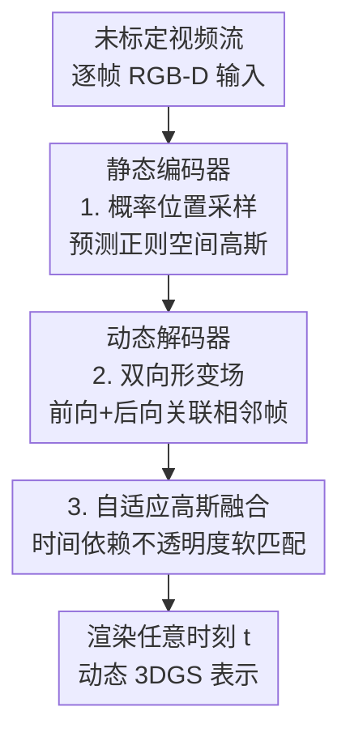

# StreamSplat: Towards Online Dynamic 3D Reconstruction from Uncalibrated Video Streams

**会议**: ICLR 2026  
**arXiv**: [2506.08862](https://arxiv.org/abs/2506.08862)  
**代码**: [https://streamsplat3d.github.io/](https://streamsplat3d.github.io/)  
**领域**: 3D视觉  
**关键词**: 动态3D重建, 3D高斯溅射, 在线重建, 前馈模型, 视频流

## 一句话总结

StreamSplat 提出了一个完全前馈的在线动态3D重建框架，通过概率位置采样、双向形变场和自适应高斯融合三大创新，能从未标定视频流中即时生成动态3DGS表示，速度比优化方法快1200倍。

## 研究背景与动机

实时动态3D重建（4D重建）在机器人、AR/VR和自动驾驶等领域至关重要。然而现有方法存在根本性限制：

**离线依赖**：主流动态3DGS方法（如4DGS、DGMarbles）需要访问完整视频序列，并经历数小时的逐场景迭代优化，包括相机标定→静态高斯优化→形变场学习→时序融合的多步流水线

**实时性差**：即使最新方法仍需30分钟-24小时处理一个场景，无法部署于实时应用

**标定要求**：几乎所有方法都需要预先标定的相机参数

**前馈方法局限**：已有的前馈3DGS方法（pixelSplat、NoPoSplat、StreamGS）仅支持静态场景，动态变体仍需标定和全序列访问

作者提出了核心研究问题：**能否在完全在线的条件下，用未标定视频流达到离线方法的质量和功能？**

## 方法详解

### 整体框架

StreamSplat 把"在线动态重建"做成一条纯前馈流水线：它维持一个正则空间里的高斯集合 $\tilde{\mathcal{G}}(t)$，每来一帧就把当前帧编码成新高斯、预测它与相邻帧之间的双向形变，再用时间依赖的不透明度把新旧高斯自适应融合后直接渲染，全程不需要相机标定、也不回看整段视频。具体地，**静态编码器**先把当前帧（RGB-D + 8×8 分块）经 Transformer 编码成正则空间里的高斯，其中位置由**概率位置采样**给出；**动态解码器**再以相邻两帧的高斯嵌入预测**双向形变场**（前向把上一帧高斯推到当前时刻、后向把当前帧高斯拉回上一时刻）；最后用**自适应高斯融合**把前后向高斯按时间依赖不透明度软融合，得到任意时刻 $t$ 可渲染的动态 3DGS。训练分两阶段：先单独训练静态编码器学好单帧的高斯与深度，再冻结它训练负责跨帧运动的动态解码器，让运动建模和外观重建解耦。

### 关键设计

**1. 概率位置采样：缓解前馈 3DGS 的局部最优**

3DGS 对高斯位置的初始化极其敏感，而前馈模型一次性回归位置很容易卡在局部最优。StreamSplat 因此不直接回归坐标，而是为每个 3D 偏移预测一个截断正态分布并从中采样：$\boldsymbol{o} \sim \mathcal{N}_{[-1,1]}(\boldsymbol{\mu}_p, \boldsymbol{\Sigma}_p)$，再以像素对齐的方式还原出最终位置 $\boldsymbol{\mu}_i = (u_i + o_{i,0},\; v_i + o_{i,1},\; g(o_{i,2}))$，其中深度映射 $g(z) = 2/(1+z)$。采样带来的随机性让模型在训练初期充分探索空间、后期再收敛到稳定的最优位置——消融实验里去掉它会让 PSNR 直接掉 6.36dB，是三个设计中收益最大的一个。

**2. 双向形变场：稳健地关联相邻帧并处理高斯增删**

传统做法是对每一帧都重新实例化高斯再迭代优化，这种逐场景优化天然不适配前馈框架。StreamSplat 改为联合建模前后两个方向的运动：前向场把上一帧高斯 $\mathcal{G}_{t-1}$ 形变到当前时刻 $t$，后向场再把当前帧高斯 $\mathcal{G}_t$ 形变回 $t-1$。这种对称结构提供了稳健的跨帧对应关系，能自然地表达高斯的出现与消失，也让端到端训练里"预测什么、用什么监督"变得对称而清晰，从而省去逐帧迭代。

**3. 自适应高斯融合：用时间依赖不透明度实现软匹配**

要在线维持时序一致性，就得决定每个高斯何时出现、何时淡出，硬性分配或迭代融合都既慢又脆。StreamSplat 让每个高斯的不透明度随时间调制：$\alpha(t) = \alpha \cdot \frac{\sigma(-\gamma_0(|t - t_0| - \gamma_1))}{\sigma(\gamma_0 \cdot \gamma_1)}$，其中 $t_0$ 是该高斯被创建的帧，$\gamma_0$ 控制过渡速率，$\gamma_1$ 控制淡出窗口宽度。这样前后向高斯被隐式融合：重建损失会诱导出软匹配，持久的高斯被自然传播、出现或消失的高斯则随不透明度平滑增减，无需任何硬分配或迭代融合即可保持帧间一致。

### 损失函数 / 训练策略

**阶段1 - 静态编码器**：
$$\mathcal{L}_{\text{static}} = \mathcal{L}_{\text{recon}}(\hat{I}_t, I_t) + \lambda_{\text{depth}} \mathcal{L}_{\text{depth}}(\hat{D}_t, D_t)$$
其中深度损失采用尺度-偏移不变形式，并引入自适应衰减因子 $\hat{\lambda}_{\text{depth}}$ 降低噪声伪深度的影响。

**阶段2 - 动态解码器**（冻结编码器）：
$$\mathcal{L}_{\text{dynamic}} = \mathbb{E}_t[\mathcal{L}_{\text{recon}} + \lambda_{\text{depth}} \mathcal{L}_{\text{depth}} + \lambda_{\text{mask}} \mathcal{L}_{\text{mask}}]$$
新增运动前景区域的辅助重建损失，使用DAVIS/YouTube-VOS的分割掩码监督。

## 实验关键数据

### 主实验

| 数据集 | 指标 | 本文 (StreamSplat) | 之前SOTA | 提升 |
|--------|------|------|----------|------|
| DAVIS Key Frame | PSNR↑ | 37.83 | 42.33 (MonST3R) | 竞争性 |
| DAVIS Key Frame | LPIPS↓ | 0.016 | 0.012 (MonST3R) | 接近 |
| DAVIS Middle-4 | PSNR↑ | **23.66** | 21.33 (DGMarbles) | +2.33 |
| DAVIS Middle-4 | LPIPS↓ | **0.193** | 0.313 (DGMarbles) | -0.12 |
| RE10K Average | PSNR↑ | **29.51** | 23.73 (DGMarbles) | +5.78 |
| 8帧插值 | PSNR↑ | **22.10** | 21.09 (AMT) | +1.01 |

### 消融实验

| 配置 | PSNR (Key)↑ | PSNR (Mid)↑ | 说明 |
|------|---------|---------|------|
| w/o 概率采样 | 31.47 | - | 确定性预测，降6.36dB |
| w/o 深度监督 | 36.68 | - | 空间结构失真 |
| w/o 双向形变 | - | 18.89 | 像素对齐结构丢失 |
| Full (Ours) | **37.83** | **23.66** | 完整模型 |

### 关键发现

- StreamSplat 是唯一支持近实时动态3D重建的方法，每帧0.049秒，比优化方法快1200×
- 在关键帧重建上与MonST3R竞争，但后者需要后优化且仅限关键帧
- 在中间帧重建上超过所有基线，包括2D视频插值方法
- 支持任意长度视频流的在线重建

## 亮点与洞察

1. **在线处理范式突破**：首次在未标定视频流上实现前馈式在线动态3D重建，颠覆了传统离线多阶段流水线
2. **概率位置采样**：简洁有效地解决了前馈3DGS的局部最优问题，提升巨大（+6.36dB）
3. **自适应不透明度融合**：通过时间依赖的不透明度实现软匹配，巧妙避免了传统方法的硬分配和迭代融合
4. **正则空间设计**：采用正交正则空间绕过逐场景相机标定，相机运动被吸收到高斯动力学中

## 局限与展望

- 关键帧重建质量略低于MonST3R（点云表示），但后者不支持在线处理
- 输入分辨率限制在512×288，高分辨率场景可能损失细节
- 仅在短-中等长度视频上评估，超长序列的误差累积需要更多验证
- 正交投影假设可能在强透视效果场景中受限

## 相关工作与启发

- NoPoSplat (Ye et al., 2024) 和 StreamGS (Li et al., 2025) 分别解决无姿态和在线问题，但均限于静态场景
- 双向形变的思路可推广到其他时序建模任务（视频生成、自动驾驶预测）
- 自适应高斯融合的生命周期管理思想来源于 Zhao et al. (2024)

## 评分

- 新颖性: ⭐⭐⭐⭐⭐ 首次实现未标定视频流的在线前馈动态3D重建，三个技术创新协同设计
- 实验充分度: ⭐⭐⭐⭐ 覆盖动态/静态多个基准，消融详尽，但缺少更长视频的评估
- 写作质量: ⭐⭐⭐⭐⭐ 问题动机清晰，方法阐述逻辑性强，图表精美
- 价值: ⭐⭐⭐⭐⭐ 1200×加速具有重要实用价值，开启在线动态重建新范式

<!-- RELATED:START -->

## 相关论文

- [\[CVPR 2026\] V-DPM: 4D Video Reconstruction with Dynamic Point Maps](../../CVPR2026/3d_vision/v-dpm_4d_video_reconstruction_with_dynamic_point_maps.md)
- [\[CVPR 2026\] OnlineHMR: Video-based Online World-Grounded Human Mesh Recovery](../../CVPR2026/3d_vision/onlinehmr_video-based_online_world-grounded_human_mesh_recovery.md)
- [\[CVPR 2026\] OnlinePG: Online Open-Vocabulary Panoptic Mapping with 3D Gaussian Splatting](../../CVPR2026/3d_vision/onlinepg_online_open-vocabulary_panoptic_mapping_with_3d_gaussian_splatting.md)
- [\[CVPR 2026\] GaussFusion: Improving 3D Reconstruction in the Wild with A Geometry-Informed Video Generator](../../CVPR2026/3d_vision/gaussfusion_improving_3d_reconstruction_in_the_wild_with_a_geometry-informed_vid.md)
- [\[CVPR 2025\] ODHSR: Online Dense 3D Reconstruction of Humans and Scenes from Monocular Videos](../../CVPR2025/3d_vision/odhsr_online_dense_3d_reconstruction_of_humans_and_scenes_from_monocular_videos.md)

<!-- RELATED:END -->
