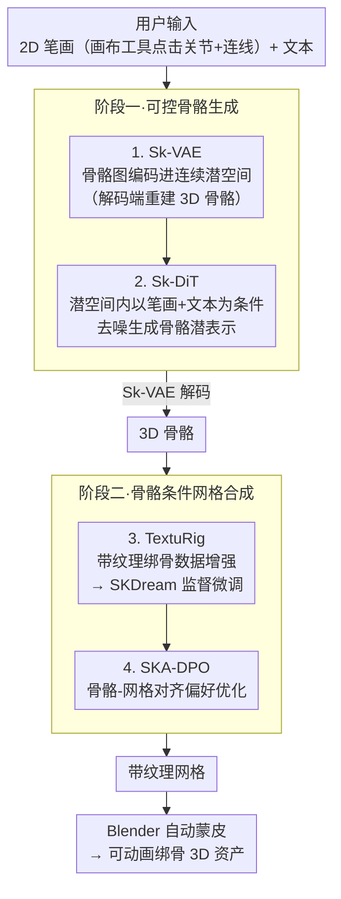

# Stroke3D: Lifting 2D Strokes into Rigged 3D Model via Latent Diffusion Models

**会议**: ICLR 2026  
**arXiv**: [2602.09713](https://arxiv.org/abs/2602.09713)  
**代码**: [https://whalesong-zrs.github.io/Stroke3D_project_page/](https://whalesong-zrs.github.io/Stroke3D_project_page/)  
**领域**: 3D视觉  
**关键词**: 3D生成, 骨骼生成, 图扩散, 绑骨, DPO

## 一句话总结

Stroke3D 首次实现从用户绘制的2D笔画和文本提示直接生成绑骨3D网格模型，采用骨骼优先的两阶段流水线：先用图VAE+图DiT生成可控3D骨骼，再通过TextuRig数据集增强和SKA-DPO优化生成高质量网格。

## 研究背景与动机

绑骨3D资产是3D变形和动画的基础，广泛应用于AR/VR、机器人仿真和影视行业。现有方法面临两大关键限制：

**难以生成可动画几何体**：大量3D生成方法（MVDream、CLAY等）仅产生静态几何，缺少动画所需的骨骼层次结构。SKDream等条件于骨骼的方法受限于高质量配对数据集的稀缺

**骨骼创建缺乏结构控制**：现有骨骼生成方法（MagicArticulate、UniRig）采用端到端的网格到骨骼范式，缺少显式结构约束，导致骨骼在不需要的位置出现而在关键位置缺失

核心创新在于**骨骼驱动工作流**：与先生成网格再绑骨的传统方法不同，Stroke3D 先从2D笔画生成骨骼，再以骨骼为条件生成网格。

## 方法详解

### 整体框架

Stroke3D 把"从一张手绘草图得到能动画的 3D 资产"拆成骨骼先行的两阶段问题。用户先用配套的画布工具点击关节、连线成笔画，得到一张和目标 3D 骨骼拓扑同构的 2D 图。第一阶段用一对图潜扩散模型把这张草图变成 3D 骨架：Sk-VAE 把 3D 骨骼图编码进连续潜空间（解码端负责重建骨骼），Sk-DiT 则在这个潜空间里以 2D 笔画和文本为条件去噪、生成骨骼潜表示，再经 Sk-VAE 解码器还原成完整 3D 骨骼，让草图直接决定骨架拓扑。第二阶段以这副骨骼为条件合成带纹理网格：先用自建的 TextuRig 数据集增强 SKDream 做监督微调补齐纹理质感，再用 SKA-DPO 以"骨骼-网格对齐"为奖励做偏好优化把网格钉到骨骼上；最终网格交给 Blender 自动蒙皮即得可动画的绑骨资产。

### 关键设计

**1. 骨骼图 VAE（Sk-VAE）：把不规则的骨骼拓扑压成可扩散的连续潜变量**

骨骼天然是图而非张量，直接在关节坐标上做扩散既丢拓扑又难收敛，所以先把它压进潜空间。这里把 3D 骨骼写成无向图 $\mathcal{G} = (\mathbf{X}, \mathbf{E})$，其中 $\mathbf{X} \in \mathbb{R}^{N \times 3}$ 是关节坐标、$\mathbf{E}$ 是描述骨骼父子连接的拓扑边。编码器用 GCN 配 TransformerConv，既聚合关节的局部邻域又建模长程连接，把整张图映到一个连续潜空间。训练只用 $L_2$ 重建损失加一项极轻的 KL 正则（$kl\_\beta = 1 \times 10^{-8}$）——KL 系数压到近乎为零，是为了让潜空间足够平滑可采样、又不至于把重建精度牺牲掉，毕竟关节位置差几毫米都会让绑骨结果跑偏。

**2. 骨骼图 DiT（Sk-DiT）：让 2D 笔画和文本一起把骨骼"想"出来**

有了潜空间，生成端要解决的是怎么把用户那几笔草图变成结构合理的 3D 骨架。Sk-DiT 沿用 DiT 框架，但把标准自注意力换成 TransformerConv 以适配图结构数据，再加一路跨注意力把 CLIP 编码的文本嵌入引进来，让"长颈鹿"这类语义能约束骨骼比例。2D 笔画经特征映射后与噪声潜表示拼接，提供逐关节的结构引导。训练的巧思在于不需要真实手绘数据：直接对 3D 骨骼的 2D 投影施加扰动来模拟人手画歪的笔画，去噪目标为 $\mathcal{L}_{\text{Sk-DiT}} = \mathbb{E}_{\mathbf{z}_0, t, \epsilon, \mathbf{J}_{xy}, \mathbf{E}, \mathbf{c}_{\text{text}}} \left[\|\epsilon_\phi(\mathbf{z}_t, t, \mathbf{J}_{xy}, \mathbf{E}, \mathbf{c}_{\text{text}}) - \epsilon\|_2^2\right]$，其中条件里同时带上了投影关节 $\mathbf{J}_{xy}$、拓扑边 $\mathbf{E}$ 和文本 $\mathbf{c}_{\text{text}}$。论文还发现这个结构条件并非锦上添花——去掉它后模型在大规模数据上根本难以收敛。

**3. TextuRig 数据集：补上绑骨模型缺纹理这块短板**

第二阶段要让网格生成器学会"看着骨骼长肉"，但 Objaverse-XL 里的绑骨模型大多没纹理，直接用会让生成的网格质感很差。为此作者搭了一条数据流水线：从中筛出带纹理贴图或顶点颜色的模型，再用 Gemini 给它们重新写描述性标注。最终往 SKDream 原有的 24,000 条训练数据里补进 6,800 个高质量样本，专门喂"骨骼—带纹理网格—文本"这种此前稀缺的三元组。

**4. SKA-DPO（骨骼-网格对齐偏好优化）：用偏好学习把网格牢牢钉在骨骼上**

光靠监督微调，生成的网格仍可能和骨骼对不齐（肢体穿到骨架外、关节处穿模）。作者把图像扩散里的 DPO 搬到 3D：用参考模型为每个骨骼-文本对各生成一对候选多视角图像，用 SKA Score 评估它们与骨骼的对齐质量，对齐好的当优胜、差的当劣势，凑成偏好数据集后用 DiffusionDPO 目标微调，损失为 $\mathcal{L}(\theta) = -\mathbb{E} \log\sigma\big(-\beta(\|\epsilon^{win} - \epsilon_\theta(x_t^{win}, t)\|_2^2 - \|\epsilon^{win} - \epsilon_{\text{ref}}(x_t^{win}, t)\|_2^2 - (\text{lose项}))\big)$。这里以骨骼-网格对齐而非人类标注作为奖励信号，等于让模型自己监督"长出来的网格有没有贴合骨架"，实测把优胜/劣势的 margin 设为 0.1 时平衡最好。

### 损失函数 / 训练策略

Sk-VAE 用 $L_2$ 重建加 $10^{-8}$ 量级的极轻 KL 正则训练 500K 迭代；Sk-DiT 用标准扩散降噪损失配分类器无关引导（CFG），同样训 500K 迭代。网格端则是先用 TextuRig 做 9K 步监督微调把纹理质感补起来，再用 SKA-DPO 跑 1K 步对齐优化收尾。

## 实验关键数据

### 主实验

| 数据集/指标 | 本文 (Stroke3D) | MagicArticulate | UniRig | SKDream |
|--------|------|----------|------|------|
| CD-J2J (All)↓ | **0.048** | 0.052 | 0.063 | 0.111 |
| CD-J2B (All)↓ | **0.039** | 0.041 | 0.051 | 0.092 |
| CD-B2B (All)↓ | **0.034** | 0.034 | 0.041 | 0.083 |
| SKA MeanInst.↑ | **87.83** | - | - | 80.43 |
| SKA MeanClass↑ | **84.36** | - | - | 74.38 |

### 消融实验

| 配置 | MeanInst.↑ | MeanClass↑ | 说明 |
|------|---------|---------|------|
| SKDream baseline | 80.43 | 74.38 | 原始基线 |
| +TextuRig (SFT) | 82.37 | 76.84 | 数据增强+1.9 |
| +SKA-DPO | 85.57 | 81.12 | DPO+5.1 |
| +TextuRig & SKA-DPO | **87.83** | **84.36** | 二者互补+7.4 |

### 关键发现

- 结构条件（2D笔画）对模型收敛速率至关重要，无结构条件训练在大规模数据上难以收敛
- 骨骼生成对输入稀疏性具有鲁棒性，删除少于5个关节时CD评分保持稳定
- SKA-DPO偏好分数的margin为0.1时达到最优平衡
- 生成的骨骼-网格对可直接通过Blender自动蒙皮进行动画，结构完整性良好

## 亮点与洞察

1. **骨骼优先范式**：颠覆了传统先网格后绑骨的工作流，赋予用户直接的结构控制能力
2. **2D到3D的巧妙桥接**：通过画布工具让用户以点击连接的方式创建拓扑同构的2D输入，优雅地解决了2D-3D领域差距
3. **RL引入3D生成**：将DPO从语言/图像模型引入3D网格生成，以骨骼-网格对齐作为奖励信号
4. **模块化设计**：骨骼生成和网格合成解耦，各自可独立改进

## 局限与展望

- 骨骼关节数限制在0-30个，复杂骨骼结构可能受限
- 仅从正交投影的2D视角提供输入，多视角引导可能提升质量
- TextuRig数据集规模（6.8K）仍较小，更大规模数据可能进一步提升
- 自动蒙皮质量依赖Blender工具，端到端蒙皮是未来方向

## 相关工作与启发

- MagicArticulate和UniRig代表自回归骨骼生成趋势，但缺乏显式结构控制
- SKDream的MCF骨骼+条件生成提供了基础，Stroke3D在此上进行了数据和优化层面的显著增强
- DiffusionDPO (Wallace et al., 2024) 的偏好优化思路被巧妙适配到3D领域

## 评分

- 新颖性: ⭐⭐⭐⭐⭐ 首次从2D笔画生成绑骨3D网格，骨骼优先管线具有开创性
- 实验充分度: ⭐⭐⭐⭐ 骨骼和网格分别在标准基准上评估，消融充分，但缺少用户研究
- 写作质量: ⭐⭐⭐⭐ 方法阐述清晰，图表信息量大，但部分章节略冗长
- 价值: ⭐⭐⭐⭐ 降低了3D动画资产创建门槛，但实际艺术家采纳仍需验证

<!-- RELATED:START -->

## 相关论文

- [\[CVPR 2026\] 2D-LFM: Lifting Foundation Model without 3D Supervision](../../CVPR2026/3d_vision/2d-lfm_lifting_foundation_model_without_3d_supervision.md)
- [\[ICLR 2026\] SceneTransporter: Optimal Transport-Guided Compositional Latent Diffusion for Single-Image Structured 3D Scene Generation](scenetransporter_optimal_transport-guided_compositional_latent_diffusion_for_sin.md)
- [\[ICCV 2025\] Repurposing 2D Diffusion Models with Gaussian Atlas for 3D Generation](../../ICCV2025/3d_vision/repurposing_2d_diffusion_models_with_gaussian_atlas_for_3d_generation.md)
- [\[ICCV 2025\] Representing 3D Shapes with 64 Latent Vectors for 3D Diffusion Models](../../ICCV2025/3d_vision/representing_3d_shapes_with_64_latent_vectors_for_3d_diffusion_models.md)
- [\[CVPR 2026\] StableMTL: Repurposing Latent Diffusion Models for Multi-Task Learning from Partially Annotated Synthetic Datasets](../../CVPR2026/3d_vision/stablemtl_repurposing_latent_diffusion_models_for_multi-task_learning_from_parti.md)

<!-- RELATED:END -->
