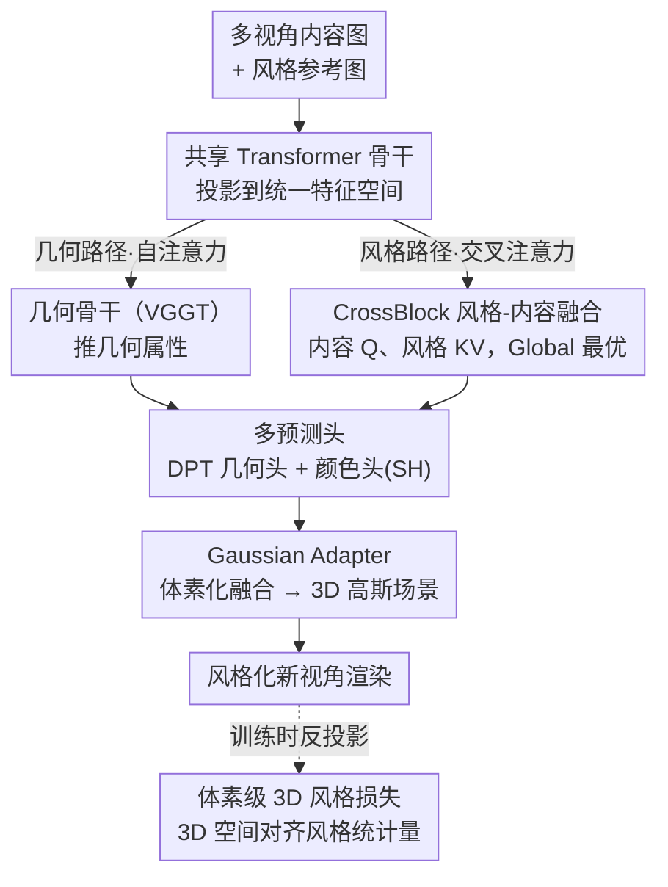

# Stylos: Multi-View 3D Stylization with Single-Forward Gaussian Splatting

**会议**: ICLR 2026  
**arXiv**: [2509.26455](https://arxiv.org/abs/2509.26455)  
**代码**: [https://github.com/HanzhouLiu/Stylos](https://github.com/HanzhouLiu/Stylos)  
**领域**: 3D视觉  
**关键词**: 3D风格迁移, 高斯溅射, 跨视角一致性, 体素风格损失, 前馈模型

## 一句话总结

Stylos 提出了一个单次前馈的3D风格迁移框架，通过共享Transformer骨干的双路径设计（几何自注意力+风格交叉注意力）和体素级3D风格损失，实现从未标定输入的零样本3D风格化，支持单视角到数百视角的扩展。

## 研究背景与动机

3D风格迁移旨在保持场景几何和跨视角一致性的同时迁移参考风格。现有方法存在三层限制：

**NeRF/3DGS方法需逐场景优化**：StyleRF、StyleGaussian等虽比NeRF更高效，但仍需逐场景拟合，无法实现真正的实时3D风格化

**泛化能力弱**：现有方法局限于场景特定训练，无法推广到未见过的类别、场景和风格

**2D风格损失缺乏3D一致性**：经典的Gram矩阵或AdaIN（通道统计量匹配）在图像级别操作，不能显式保证多视角结构一致性

最接近的相关工作Styl3R (Wang et al., 2025b) 虽提出前馈框架，但设计仅针对2-8个输入视角，不特别关注强多视角一致性。

## 方法详解

### 整体框架

Stylos 要解决的是从一组未标定图像出发、单次前馈就同时吐出几何与风格化外观的难题。它的核心是一个**共享 Transformer 骨干 + 双路径**的设计：内容图与风格图先投影到统一特征空间，随后分成两条路——几何路径保留自注意力，靠继承自 VGGT 的几何骨干推导位置、尺度、旋转、不透明度等几何属性；风格路径则用 Style Aggregator 里的 CrossBlock 把风格通过交叉注意力注入内容 token。两条路的输出分别送进各自的预测头（DPT 几何头出几何参数、颜色头出球谐系数），再经 Gaussian Adapter 体素化融合成 3D 高斯场景并渲染。由于几何完全由自注意力骨干负责、风格只经交叉注意力作用于颜色，整套框架天然实现了几何与风格的解耦——同一份几何可以套不同风格，而风格再强也不会扰动结构。训练阶段额外引入一项体素级 3D 风格损失，把多视角渲染特征反投影进体素网格、在 3D 空间里对齐风格统计量，从而把「跨视角一致」直接写进优化目标。

### 关键设计

**1. CrossBlock 风格-内容融合模块：在不破坏几何的前提下把风格注入 Transformer**

风格迁移最怕的就是为了染色而把结构搞乱，Stylos 的做法是只在标准 Transformer Block 的自注意力和 MLP 之间插入一层交叉注意力：内容 token 作 Query、风格 token 作 Key/Value，让内容主动去「取用」风格而不是被风格覆盖。具体怎么布这层交叉注意力，作者给了三种拓扑——Frame CrossBlock 让每个视角各自独立地与风格交互，结构上保守但视角间缺乏协调；Global CrossBlock 把所有视角拼成一条全局序列，用自注意力保证多视角几何一致、再用交叉注意力把风格统一广播出去；Hybrid 则先 Frame 后 Global。三者对比下来 Global CrossBlock 最优（Pizza 场景 PSNR 提升 0.79dB），原因正是全局自注意力锁住了跨视角一致性，同时交叉注意力把同一份风格均匀铺到所有视角，避免了逐帧染色带来的不一致。

**2. 多预测头设计：让几何、风格、相机各司其职**

为了维持几何与风格的解耦，Stylos 把双路径的输出接到几组互不干扰的预测头上。几何头是一个 DPT 回归头，从几何骨干特征直接输出高斯点的位置、尺度、旋转和不透明度；颜色头则单独承接 Style Aggregator 的输出，只预测球谐系数 $c_m$ 来决定外观；此外还有 VGGT 自带的相机头估计内外参、深度 DPT 头预测场景几何作为辅助监督，最后由 Gaussian Adapter 把几何头与颜色头的预测向量拼装成完整的 3D 高斯参数。这样划分后，结构预测只来自骨干特征、不受风格条件直接影响，风格分支的梯度也不会回流去污染几何，几何骨干还能复用 VGGT 的预训练权重保持高质量结构。

**3. 体素级 3D 风格损失：把风格统计量的匹配从 2D 搬到 3D 空间**

经典的 Gram/AdaIN 风格损失在图像级逐帧匹配通道统计量，无法显式约束多视角一致——同一处表面在不同视角下可能被染成不同风格。Stylos 把多视角渲染特征通过可微反投影融合进体素网格 $\mathcal{G}_b^l$，直接在 3D 空间里对齐风格统计量：

$$\mathcal{L}_{\text{sty}}^{3D} = \frac{1}{B} \sum_{b=1}^B \sum_{l=1}^5 \alpha_l \left(\|\mu(\mathcal{G}_b^l) - \mu(\mathcal{S}_b^l)\|_2^2 + \|\sigma(\mathcal{G}_b^l) - \sigma(\mathcal{S}_b^l)\|_2^2\right)$$

这里对 5 个特征层级、按权重 $\alpha_l$ 分别匹配体素内特征均值 $\mu$ 与标准差 $\sigma$ 和参考风格 $\mathcal{S}_b^l$ 的对应统计量。相比图像级损失（每帧独立、不保证一致）和场景级损失（虽拼接多视角 2D 特征但仍停留在 2D 空间），体素级损失因为统计量本身就定义在 3D 网格上，同一表面无论从哪个视角看都对应同一个体素，跨视角风格一致性是被结构性地保证的——消融里它把 ArtScore 从图像级的 4.78 抬到 9.15 正是这个道理。

### 损失函数 / 训练策略

训练分两阶段，对应几何与风格的解耦。阶段 1 是几何预训练，用 VGGT 权重初始化后端到端学几何，为了让网络提前接触风格通路又不退化成恒等映射，作者随机挑一个输入视角做颜色抖动当临时风格参考，损失为重建项加蒸馏项 $\mathcal{L}_{\text{stage1}} = \mathcal{L}_{\text{rec}} + \lambda_{\text{distill}} \mathcal{L}_{\text{distill}}$。阶段 2 是风格化微调，此时冻结整个几何模块、只更新 Style Aggregator 和颜色头，确保染色不会反过来动几何，损失把重建、体素级 3D 风格、内容、CLIP 与全变分正则叠在一起：

$$\mathcal{L}_{\text{stage2}} = \mathcal{L}_{\text{rec}} + \lambda_{\text{style}} \mathcal{L}_{\text{style}}^{3D} + \lambda_{\text{cnt}} \mathcal{L}_{\text{content}} + \lambda_{\text{clip}} \mathcal{L}_{\text{clip}} + \lambda_{\text{tv}} \mathcal{L}_{\text{TV}}$$

## 实验关键数据

### 主实验

| 数据集/场景 | 指标 | Stylos | StyleGaussian | Styl3R | 说明 |
|--------|------|------|----------|------|------|
| T&T Short LPIPS↓ | 一致性 | **0.033-0.047** | 0.031-0.038 | - | 竞争性 |
| T&T Long LPIPS↓ | 一致性 | **0.153** | 0.157 | - | 长程一致性更好 |
| CO3D ArtScore↑ | 艺术质量 | **9.15** | - | - | 体素损失最高 |
| CO3D 重建PSNR↑ | 重建 | 21.68 | - | - | Global CrossBlock |

### 消融实验

| 配置 | Short RMSE↓ | ArtScore↑ | 说明 |
|------|---------|---------|------|
| Image-level 风格损失 | 0.038 | 4.78 | 基线 |
| Scene-level 风格损失 | 0.036 | 9.12 | +4.34 ArtScore |
| 3D Voxel-level 损失 | **0.034** | **9.15** | 三维最优 |

### 关键发现

- Global CrossBlock 在所有测试类别上优于 Frame 和 Hybrid 变体
- 体素级3D风格损失在一致性和艺术质量上均优于2D风格损失
- 每批视角数在32以内时质量稳定，超过64时出现边缘伪影（训练设置最多24视角）
- Image-level损失有时完全无法迁移风格（如donut场景）

## 亮点与洞察

1. **几何-风格解耦**：骨干特征仅驱动几何，CrossBlock仅影响颜色，概念清晰且模块化
2. **2D→3D风格损失演进**：系统性地从图像级→场景级→体素级推进，提供了清晰的消融路径
3. **可扩展性强**：框架天然支持1到数百视角，仅调整批大小即可
4. **基于VGGT的强几何基础**：利用预训练3D基础模型确保高质量几何

## 局限与展望

- 超过32视角时质量下降，可能需要更大训练批次覆盖
- 仅评估了静态场景，动态场景风格化是未来方向
- 风格参考仅支持单张图像，多风格参考可能提供更丰富的控制
- 体素化步骤的分辨率对风格质量的影响需要更多分析

## 相关工作与启发

- VGGT (Wang et al., 2025a) 和 AnySplat (Jiang et al., 2025) 提供了强大的无姿态3D重建基础
- ArtFlow (An et al., 2021) 的特征级风格/内容损失被有效扩展到3D体素空间
- 体素级统计量匹配的思路可能适用于其他需要3D一致性的任务

## 评分

- 新颖性: ⭐⭐⭐⭐ 体素级3D风格损失和CrossBlock设计有创新，但整体框架是成熟组件的组合
- 实验充分度: ⭐⭐⭐⭐ 多数据集评估，消融系统性强，但基线对比可以更丰富
- 写作质量: ⭐⭐⭐⭐ 结构清晰，公式推导完整，但部分描述可以更简洁
- 价值: ⭐⭐⭐⭐ 首个真正可扩展的单次3D风格化方法，实用价值明确

<!-- RELATED:START -->

## 相关论文

- [\[CVPR 2026\] EcoSplat: Efficiency-controllable Feed-forward 3D Gaussian Splatting from Multi-view Images](../../CVPR2026/3d_vision/ecosplat_efficiency-controllable_feed-forward_3d_gaussian_splatting_from_multi-v.md)
- [\[CVPR 2026\] InstantHDR: Single-forward Gaussian Splatting for High Dynamic Range 3D Reconstruction](../../CVPR2026/3d_vision/instanthdr_singleforward_gaussian_splatting_for_hi.md)
- [\[ICLR 2026\] Station2Radar: Query-Conditioned Gaussian Splatting for Precipitation Field](station2radar_query_conditioned_gaussian_splatting_for_precipitation_field.md)
- [\[CVPR 2026\] Reliev3R: Relieving Feed-forward 3D Reconstruction from Multi-View Geometric Annotations](../../CVPR2026/3d_vision/reliev3r_relieving_feed-forward_3d_reconstruction_from_multi-view_geometric_annot.md)
- [\[CVPR 2026\] BRepGaussian: CAD Reconstruction from Multi-View Images with Gaussian Splatting](../../CVPR2026/3d_vision/brepgaussian_cad_reconstruction_from_multi-view_images_with_gaussian_splatting.md)

<!-- RELATED:END -->
