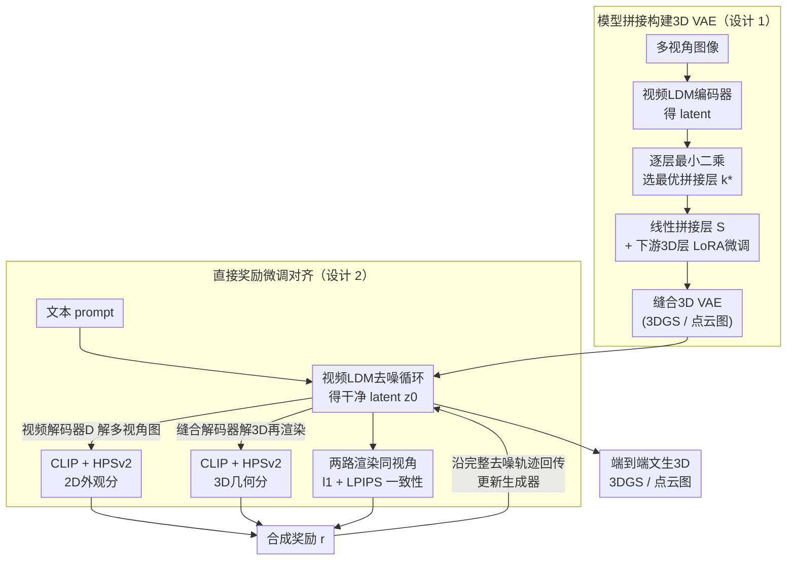

# Text-to-3D by Stitching a Multi-view Reconstruction Network to a Video Generator

**会议**: ICLR 2026 Oral  
**arXiv**: [2510.13454](https://arxiv.org/abs/2510.13454)  
**代码**: [项目页面](https://gohyojun15.github.io/VIST3A/)  
**领域**: 3D视觉/生成  
**关键词**: 文生3D, 模型拼接, 视频生成器, 3D重建, 3DGS, 直接奖励微调, 点云图

## 一句话总结
提出VIST3A框架——通过模型拼接(model stitching)将预训练视频生成器的latent空间与前馈3D重建模型(如AnySplat/MVDUSt3R/VGGT)无缝对接，再用直接奖励微调(direct reward finetuning)对齐生成模型与拼接后的3D解码器，实现高质量端到端text-to-3DGS和text-to-pointmap生成，在T3Bench/SceneBench/DPG-Bench上全面超越现有方法。

## 研究背景与动机

**领域现状**：文本到3D生成已成为新研究前沿。早期SDS方法(DreamFusion等)需逐场景慢速优化；多阶段流水线(先生图再lift到3D)存在误差累积和工程复杂性；最新趋势是端到端潜在扩散模型(LDM)直接生成3D表示。

**LDM路线的做法**：复用预训练2D图像/视频模型的先验知识，微调为多视角latent生成器，然后训VAE-style解码器将latent解码为3DGS等3D表示。

**现有痛点——解码器弱**：现有方法简单地将2D VAE改造为3D输出解码器，本质上要从头学习3D重建能力，需要大量训练数据且效果远落后于专门的3D基础模型(DUSt3R/VGGT/AnySplat等)。随着3D基础模型越来越强，这种"自训解码器"的性能差距只会越来越大。

**现有痛点——对齐弱**：生成模型和VAE解码器分开训练，生成损失(扩散loss/flow matching)只间接促进3D一致性，导致生成的latent可能偏离解码器的输入分布，解码质量差。即使加渲染loss也只基于单步采样，未充分考虑完整去噪轨迹。

**核心 idea**：与其从头训3D解码器，不如通过模型拼接直接复用现有最强3D基础模型作为解码器，并用奖励微调确保生成器产出的latent落在解码器的有效输入域内。

## 方法详解

### 整体框架
VIST3A要解决的是端到端文生3D里"解码器从头学、与生成器又对不齐"的双重困境。它不再自训3D解码器，而是分两步走：第一步把预训练视频LDM的前半段编码器，与一个现成的前馈3D重建模型(MVDUSt3R/VGGT/AnySplat)的后半段，在某个最优中间层 $k^\star$ 用一个线性拼接层"缝"成一个新的3D VAE；第二步再用直接奖励微调，把视频生成器从噪声去噪出来的latent校准到这个缝合解码器的有效输入域内。两步都不碰任何3D标注：拼接阶段拿原3D模型自身输出当伪标签自监督，对齐阶段只靠可微评分器与渲染算奖励，最终就能从纯文本端到端生成3DGS或点云图。

### 关键设计

**1. 模型拼接构建3D VAE：用线性映射把两个独立训练的网络缝在一起**

核心问题是如何把视频LDM的latent空间接到一个本来不接受它的3D重建网络上。方法先在两个网络之间找最优拼接层：把 $N$ 个样本送进视频编码器得到latent $\mathbf{B} \in \mathbb{R}^{N \times D_\mathcal{E}}$，再扫描3D模型每一层 $k$ 取其激活 $\mathbf{A}_k \in \mathbb{R}^{N \times D_F^k}$，对每层用最小二乘闭式解拟合一个线性拼接层 $\mathbf{S}^*_k = (\mathbf{B}^\top \mathbf{B})^{-1} \mathbf{B}^\top \mathbf{A}_k$，取拟合MSE最小的层 $k^\star$ 作为缝合点。这一步揭示了一个并不显然的事实：尽管两个模型在不同数据上独立训练，仍存在某一层使得 latent 经一次线性变换后与3D模型激活高度吻合，正是这种线性可对齐性让拼接成为可能。找到 $k^\star$ 后即组装出缝合VAE $\mathcal{M}_{\text{stitched}} = F_{k^\star+1:l} \circ \mathbf{S} \circ \mathcal{E}(\mathbf{x})$，其中拼接层落地为3D卷积、$k^\star$ 之后的层用LoRA微调；训练时直接拿原始3D模型自身的输出 $\mathbf{y}$ 当伪标签、用 $\ell_1$ 损失自监督拟合，整个过程不碰任何3D标注数据，因而几乎完整继承了原3D基础模型的重建能力。

**2. 直接奖励微调对齐：让生成的latent落进解码器的输入域**

拼接解码器虽强，但它见过的输入来自编码器 $\mathcal{E}$，而推理时latent是从噪声经去噪循环生成的——两者分布一旦偏离，解码质量就崩。为此方法在生成损失外再减去一个奖励项，总目标为 $L_{\text{total}} = L_{\text{gen}} - r(z_0(\theta, c, z_T), c)$，其中 $z_0$ 是从噪声 $z_T$ 在条件 $c$ 下去噪得到的干净latent。奖励 $r$ 由三个分量合成，恰好覆盖2D外观、3D几何与跨模态一致性三个层面：先用原始视频解码器 $\mathcal{D}$ 把latent解成多视角图像、用CLIP与HPSv2评其文本对齐与视觉质量；再用缝合解码器 $\mathcal{D}_{\text{stitched}}$ 把同一latent解成3D场景、渲染回2D后同样用CLIP+HPSv2打分；最后把视频解码器的2D图像与3D场景渲染到相同视角的图像作 $\ell_1$ + LPIPS对比，惩罚两条解码路径的几何不一致。优化上沿完整去噪路径回传梯度、借鉴DRTune稳定反传，并通过随机采样去噪时间步与随机挑选梯度传播步来压低计算开销；由于奖励全部由可微评分器与渲染给出，整个对齐只需文本prompt、无需任何ground-truth图像。

## 实验

### 实验设置
- **3D模型**：MVDUSt3R(点云图+3DGS)、VGGT(点云图+深度+位姿)、AnySplat(3DGS+位姿)
- **视频生成器**：主要用Wan 2.1 T2V large，另测试CogVideoX、SVD、HunyuanVideo
- **训练数据**：DL3DV-10K + ScanNet (无3D标签)，HPSv2训练集的prompts

### Text-to-3DGS 主结果 (Table 1)

| 方法 | T3Bench Imaging↑ | T3Bench CLIP↑ | SceneBench Imaging↑ | SceneBench CLIP↑ |
|------|:---:|:---:|:---:|:---:|
| Matrix3D-omni | 43.05 | 25.06 | 46.65 | 24.04 |
| Director3D | 54.32 | 30.94 | 47.79 | 29.31 |
| SplatFlow | 46.09 | 29.48 | 48.85 | 29.43 |
| VideoRFSplat | 46.52 | 30.13 | 58.19 | 29.76 |
| **VIST3A: Wan+MVDUSt3R** | **58.83** | **32.75** | **62.08** | **30.26** |
| **VIST3A: Wan+AnySplat** | 57.03 | 31.38 | **64.87** | 30.18 |

VIST3A在物体级(T3Bench)和场景级(SceneBench)合成上全面超越所有baseline。在DPG-Bench上差距更大：VIST3A Global得分81.82 vs. baseline最高69.70。

### DPG-Bench 详细文本对齐评估 (Table 2)

| 方法 | Global↑ | Entity↑ | Attribute↑ | Relation↑ | Other↑ |
|------|:---:|:---:|:---:|:---:|:---:|
| SplatFlow | 69.70 | 68.43 | 65.55 | 50.49 | 40.91 |
| VideoRFSplat | 36.36 | 56.93 | 66.89 | 48.53 | 31.82 |
| **VIST3A: Wan+MVDUSt3R** | **81.82** | **84.31** | **86.13** | 68.93 | **54.55** |
| **VIST3A: Wan+AnySplat** | 78.79 | **85.58** | 84.12 | **76.70** | 45.45 |

在长文本prompt的理解和遵循上，VIST3A展现出压倒性优势，多数维度>80%。

### 模型拼接的NVS评估 (Table 3)

| 方法 | PSNR↑ | SSIM↑ | LPIPS↓ |
|------|:---:|:---:|:---:|
| SplatFlow | 19.10 | 0.671 | 0.278 |
| VideoRFSplat | 19.05 | 0.674 | 0.281 |
| AnySplat (原始) | 20.85 | 0.695 | 0.238 |
| **Wan+AnySplat (拼接)** | 21.29 | 0.718 | 0.232 |

拼接后AnySplat的NVS能力不降反升，video VAE latent提供了更丰富的外观表示。

### 用户研究 (Table 4)
28名参与者对14个样本排名(越低越好)：VIST3A在文本对齐(1.54)和视觉质量(1.45)均排名第一，>68%和>87%的情况下被评为最佳。

## 亮点与创新

1. **模型拼接的创新性应用**：首次将model stitching从"网络表示分析工具"提升为"构建3D VAE的实用技术"，证明独立训练的视频VAE和3D重建模型存在线性可对齐的中间表示，拼接后几乎保留原始3D模型的全部能力。

2. **即插即用的框架**：VIST3A可灵活组合不同视频生成器(Wan/CogVideoX/SVD/Hunyuan)和不同3D模型(AnySplat/MVDUSt3R/VGGT)，均获显著提升，适配性极强。

3. **直接奖励微调的精巧设计**：三个奖励分量分别对应2D视觉质量、3D几何质量和跨模态一致性，整体无需ground-truth标注。

4. **新能力解锁**：不仅做text-to-3DGS，还实现了text-to-pointmap这一新任务，且即使不训练长序列也能生成连贯的大规模场景。

## 局限性

1. **依赖base模型质量**：生成质量的上限受限于所选视频模型和3D模型各自的能力——如果base模型有严重缺陷，拼接无法弥补。
2. **拼接层的线性假设**：寻找拼接点时假设两个表示间的最优映射为线性，如果两个模型的表示差异非线性(如架构差异极大的模型)，拼接效果可能退化。
3. **奖励对齐的计算成本**：直接奖励微调需要展开完整去噪路径并渲染3D场景来计算奖励，内存和计算开销较大。
4. **动态场景**：框架基于静态场景生成，未涉及动态3D内容如4D生成。

## 相关工作

- **SDS优化路线**：DreamFusion, Magic3D, ProlificDreamer — 逐场景优化，速度慢
- **多阶段流水线**：Zero-1-to-3, MVDream → SV3D/DreamView → 3D lifting — 误差累积
- **端到端LDM路线**：SplatFlow, Director3D, Prometheus3D, VideoRFSplat — 自训解码器弱，对齐差
- **前馈3D重建**：DUSt3R → MASt3R → MVDUSt3R → VGGT → AnySplat → Pi3 — 3D基础模型日益强大
- **模型拼接**：Lenc & Vedaldi (2015), Bansal et al. (2021), DeRy, SN-Net — 本文首次应用于3D VAE构建

## 评分

⭐⭐⭐⭐ (4/5)

- **创新性** ⭐⭐⭐⭐⭐：模型拼接应用于3D VAE构建的idea非常巧妙，既避免从头训解码器又能复用最强3D模型
- **实验充分度** ⭐⭐⭐⭐⭐：三个benchmark + 用户研究 + 跨模型组合实验 + 详细消融，非常全面
- **写作质量** ⭐⭐⭐⭐：问题动机清晰，方法叙述完整，图表精美，论文结构规范
- **实用性** ⭐⭐⭐⭐：即插即用框架，可直接受益于未来更强的视频模型和3D模型的发展
- **可复现性** ⭐⭐⭐：提供了项目页面但代码开放程度有待确认，LoRA + reward微调的细节在附录中

<!-- RELATED:START -->

## 相关论文

- [\[CVPR 2025\] MUSt3R: Multi-view Network for Stereo 3D Reconstruction](../../CVPR2025/3d_vision/must3r_multi-view_network_for_stereo_3d_reconstruction.md)
- [\[CVPR 2026\] GaussFusion: Improving 3D Reconstruction in the Wild with A Geometry-Informed Video Generator](../../CVPR2026/3d_vision/gaussfusion_improving_3d_reconstruction_in_the_wild_with_a_geometry-informed_vid.md)
- [\[CVPR 2026\] Coherent Human-Scene Reconstruction from Multi-Person Multi-View Video in a Single Pass](../../CVPR2026/3d_vision/coherent_humanscene_reconstruction_from_multiperso.md)
- [\[ICLR 2026\] Peering into the Unknown: Active View Selection with Neural Uncertainty Maps for 3D Reconstruction](peering_into_the_unknown_active_view_selection_with_neural_uncertainty_maps_for_.md)
- [\[CVPR 2026\] ForgeDreamer: Industrial Text-to-3D Generation with Multi-Expert LoRA and Cross-View Hypergraph](../../CVPR2026/3d_vision/forgedreamer_industrial_text-to-3d_generation_with_multi-expert_lora_and_cross-v.md)

<!-- RELATED:END -->
