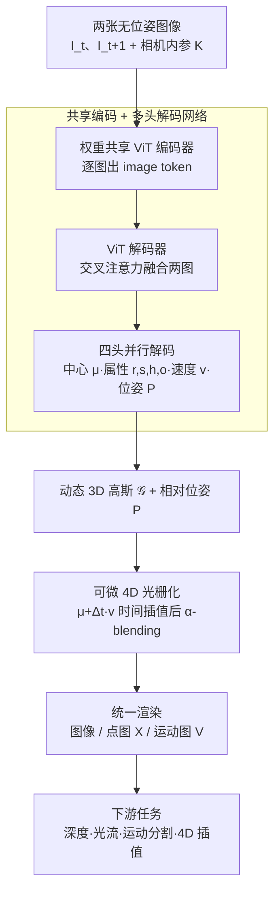

# UFO-4D: Unposed Feedforward 4D Reconstruction from Two Images

- **会议**: ICLR 2026
- **arXiv**: [2602.24290](https://arxiv.org/abs/2602.24290)
- **代码**: [项目页面](https://ufo-4d.github.io/)
- **领域**: 3D 视觉 / 4D 重建
- **关键词**: 4D Reconstruction, Dynamic 3D Gaussians, Feedforward, Scene Flow, Unposed, Self-Supervised

## 一句话总结

提出 UFO-4D，一个统一的前馈框架，仅从两张无位姿图像直接预测动态 3D 高斯表示，实现 3D 几何、3D 运动和相机位姿的联合一致估计，在几何和运动基准上比现有方法提升达 3 倍。

## 研究背景与动机

从随意拍摄的图像进行相机位姿、3D 几何和 3D 运动的联合估计（4D 场景重建）是计算机视觉的基础挑战。现有方法存在以下问题：

**测试时优化方法**速度慢（数小时），依赖预计算的深度和光流

**前馈模型**（DUST3R, MonST3R, DynaDUSt3R）在单独任务上效果好，但缺乏统一架构

**4D 训练数据稀缺**：合成数据有域差距，真实数据标注稀疏且噪声大

**核心 insight**：从单一动态 3D 高斯表示进行可微渲染多种信号（外观、深度、运动）可以提供自监督训练信号，并通过几何耦合使各监督信号相互正则化。

## 方法详解

### 整体框架

UFO-4D 把"位姿 + 几何 + 运动"的联合估计塞进同一个前馈函数：给定两张无位姿图像 $\mathbf{I}_t, \mathbf{I}_{t+1}$ 和相机内参，网络 $f_\theta(\mathbf{I}_t, \mathbf{I}_{t+1}) \mapsto (\mathcal{G}, \mathbf{P})$ 一次性吐出一组动态 3D 高斯 $\mathcal{G}$ 和相对相机位姿 $\mathbf{P}$。每个高斯既携带静态几何（中心 $\boldsymbol{\mu} \in \mathbb{R}^3$、四元数旋转 $\mathbf{r}$、尺度 $\mathbf{s}$、球谐颜色 $\mathbf{h}$、不透明度 $o$），又额外带一个 3D 运动向量 $\mathbf{v} \in \mathbb{R}^3$——正是这一份"同时编码了形状和运动"的统一表示，让深度、光流、场景流、新视角等所有下游信号都能从它经可微渲染导出，从而相互正则化。整条 pipeline 分两块：先用一个**共享编码 + 多头解码的网络**把两张图回归成上面这套动态高斯与相对位姿，再用一个**可微 4D 光栅化器**把这套高斯在任意时刻、任意视角统一渲染成图像、点图和运动图，下游任务和训练监督都从这些渲染结果派生。

### 关键设计

**1. 共享编码 + 多头解码的网络：把两图证据融成一套动态高斯**

要从两张无位姿图同时回归几何和运动，关键是让网络在跨帧对应中读出运动。UFO-4D 用权重共享的 ViT 编码器分别处理两张图像，再由带交叉注意力层的 ViT 解码器融合两图信息，使每个像素的预测都能参考另一帧的线索。解码后接四个并行头：中心头（DPT）输出 3D 位置、属性头（DPT）输出旋转/尺度/颜色/不透明度、速度头（DPT）输出 3D 运动向量、位姿头（3 层 MLP）回归相对位姿的平移与四元数。训练初始化上，高斯头沿用 NoPoSplat 的权重、其余部分用 MASt3R 初始化，直接继承静态重建的强几何先验，再在动态数据上学出运动分量。

**2. 可微 4D 光栅化：用同一套 α-blending 把高斯渲染成图像、点图和运动图**

这是把统一表示真正变成自监督信号的核心。标准 3DGS 只渲染外观，UFO-4D 扩展光栅化器，让同一组高斯在任意目标时刻 $t'$ 下统一渲染出图像、点图和场景流。先在线性运动假设下对高斯做时间插值，把每个中心平移 $\Delta t \cdot \mathbf{v}$：$$\mathcal{G}(t') = \{(\boldsymbol{\mu} + \Delta t \cdot \mathbf{v}, \mathbf{v}, \mathbf{r}, \mathbf{s}, \mathbf{h}, \mathbf{c}, o)_\mathbf{p}\}$$ 再用与颜色完全相同的 $\alpha$-blending 权重去合成几何通道——点图累加各高斯中心、运动图累加各高斯速度：$$\mathbf{X}_{t'}(\mathbf{p}) = \sum_{i \in \mathcal{N}_\mathbf{p}^{t'}} \boldsymbol{\mu}_i o_i \prod_{j=1}^{i-1}(1-o_j)$$ $$\mathbf{V}_{t'}(\mathbf{p}) = \sum_{i \in \mathcal{N}_\mathbf{p}^{t'}} \mathbf{v}_i o_i \prod_{j=1}^{i-1}(1-o_j)$$ 因为点图、运动图和颜色图共享同一批高斯与同一套混合权重，任何一路监督都会反传到所有高斯参数上，几何与运动天然耦合、互为约束。也正是有了可微渲染的几何通道，下游任务才能零成本派生：深度取点图最后一个通道、光流是 3D 场景流的 2D 投影、运动分割对场景流幅值阈值化、4D 插值则直接把 $t'$ 和视角设成任意值再渲染。

### 损失函数 / 训练策略

总损失把有标注的监督项和无标注的自监督项相加：$L_{total} = L_{sup} + L_{self}$。监督损失覆盖场景流、点图和位姿三类标注，$$L_{sup} = L_{motion} + w_{point} L_{point} + w_{pose} L_{pose}$$ 其中 $L_{motion}$ 同时约束高斯中心运动 $\mathbf{v}$ 和渲染运动图 $\mathbf{V}$、$L_{point}$ 同时约束高斯位置 $\boldsymbol{\mu}$ 和渲染点图 $\mathbf{X}$、$L_{pose}$ 分别约束平移和四元数——即"显式高斯参数"和"渲染结果"两端都受监督，避免表示和渲染脱节。自监督损失则用来对抗 4D 标注稀缺：$$L_{self} = L_{photo} + w_{smooth} L_{smooth}$$ 光度项 $L_{photo} = \text{MSE} + w_{lpips} \text{LPIPS}$ 直接拿渲染图像和真实图像比对、不需任何标注，平滑项 $L_{smooth}$ 是边缘感知的正则化。靠光度自监督，模型能在真实视频上学习而无需稠密 4D 真值。

## 实验

### 训练数据

混合使用：Stereo4D (60%) + PointOdyssey (20%) + Virtual KITTI 2 (20%)

### 主要结果

**几何估计**（点图 EPE, 深度指标）：

| 方法 | Stereo4D EPE | KITTI EPE | Sintel EPE |
|------|-------------|-----------|-----------|
| DynaDUSt3R | ~0.15 | ~0.80 | - |
| ZeroMSF | ~0.12 | ~0.65 | - |
| **UFO-4D** | **~0.05** | **~0.25** | **最优** |

UFO-4D 在 Stereo4D 和 KITTI 上比竞争方法提升 **3×以上**。

**运动估计**（场景流 EPE）：同样大幅领先。

### 关键发现

1. **自监督损失**极大改善了几何和运动估计质量
2. 直接位姿估计优于后处理回归（DUSt3R 方式）
3. 合成+真实混合训练有效缓解域差距
4. 4D 插值在新视角和时间步均表现良好

### 4D 插值应用

首次实现从前馈输出的时空插值：在任意中间时间点和视角渲染图像、深度和运动。

## 亮点

1. **统一表示**：单一动态 3D 高斯表示同时解决几何、运动、位姿估计
2. **自监督训练**：光度重建损失无需标注，有效克服数据稀缺
3. **耦合正则化**：几何和运动共享高斯基元，各监督信号互相正则化
4. **新应用**：前馈 4D 插值（图像+几何+运动的时空插值）
5. **性能跃升**：EPE 指标提升 3 倍以上

## 局限性

1. 线性运动假设限制了复杂非刚体运动的建模
2. 仅处理两帧输入，无法建模长期时序依赖
3. 依赖相机内参作为输入（虽通常可获取）
4. 训练数据混合策略的最优比例需手动调整
5. 大面积遮挡区域的重建可能不够准确

## 相关工作

- **静态 3D 重建**：DUSt3R (Wang et al., 2024b), MASt3R (Leroy et al., 2024) 学习强先验实现端到端重建
- **动态 3D 重建**：MonST3R (Zhang et al., 2025a) 微调静态模型处理动态场景，但缺乏时间对应
- **密集 4D 重建**：测试时优化方法质量高但慢；现有前馈方法需位姿输入或分离的任务头

## 评分

- **创新性**: ⭐⭐⭐⭐⭐ — 统一 4D 表示 + 自监督框架是重要贡献
- **实用性**: ⭐⭐⭐⭐ — 前馈推理、实时应用潜力大
- **清晰度**: ⭐⭐⭐⭐⭐ — 方法描述系统清晰，公式推导完整
- **意义**: ⭐⭐⭐⭐⭐ — 将密集 4D 重建从优化推向前馈时代

<!-- RELATED:START -->

## 相关论文

- [\[CVPR 2025\] Dyn-HaMR: Recovering 4D Interacting Hand Motion from a Dynamic Camera](../../CVPR2025/3d_vision/dyn-hamr_recovering_4d_interacting_hand_motion_from_a_dynamic_camera.md)
- [\[ICCV 2025\] LongSplat: Robust Unposed 3D Gaussian Splatting for Casual Long Videos](../../ICCV2025/3d_vision/longsplat_robust_unposed_3d_gaussian_splatting_for_casual_long_videos.md)
- [\[ICLR 2026\] UrbanGS: A Scalable and Efficient Architecture for Geometrically Accurate Large-Scene Reconstruction](urbangs_a_scalable_and_efficient_architecture_for_geometrically_accurate_large-s.md)
- [\[CVPR 2026\] TeHOR: Text-Guided 3D Human and Object Reconstruction with Textures](../../CVPR2026/3d_vision/tehor_text-guided_3d_human_and_object_reconstruction_with_textures.md)
- [\[ICLR 2026\] Reducing Class-Wise Performance Disparity via Margin Regularization](reducing_class-wise_performance_disparity_via_margin_regularization.md)

<!-- RELATED:END -->
