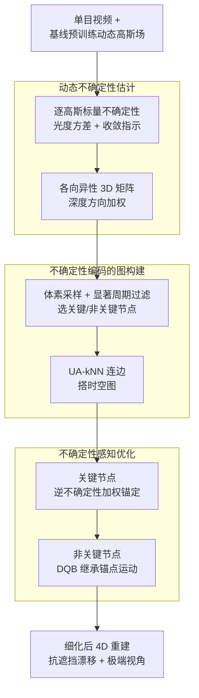

# Uncertainty Matters in Dynamic Gaussian Splatting for Monocular 4D Reconstruction

**会议**: ICLR2026  
**arXiv**: [2510.12768](https://arxiv.org/abs/2510.12768)  
**代码**: [tamu-visual-ai/usplat4d](https://tamu-visual-ai.github.io/usplat4d/)  
**领域**: 3D视觉  
**关键词**: Dynamic Gaussian Splatting, uncertainty estimation, 4D Reconstruction, Monocular, novel view synthesis

## 一句话总结

提出 USplat4D，一种不确定性感知的动态高斯泼溅框架，通过估计每个高斯的时变不确定性并构建不确定性引导的时空图来传播可靠运动线索，显著提升了遮挡区域和极端新视角下的单目 4D 重建质量。

## 背景与动机

从单目视频重建动态 3D 场景是 AR、机器人和人体运动分析等任务的基础问题，但由于遮挡和极端视角变化，该问题极具挑战性。

- **现有动态高斯泼溅方法的共性缺陷**：无论使用规范场（canonical field）、变形基（deformation bases）还是直接 4D 建模，现有方法都对所有高斯基元进行**均匀优化**，依赖深度、光流和光度一致性等 2D 监督信号。这种均匀处理忽略了一个关键事实：有些高斯被反复观测、约束充分，而另一些仅被少量观测、约束薄弱。
- **后果**：在遮挡情况下运动估计会漂移（motion drift），在极端新视角下合成质量严重退化。例如，旋转的背包在不同时刻总有一部分表面被自身遮挡，但人类仍能通过记忆和时间连续性推断出遮挡区域的外观和运动。
- **核心洞察**：当观测不完整时，重建应当以**高置信度的线索为锚点**，并通过结构化方式传播到不确定区域。置信度高的高斯应当被优先处理，并用于引导不可靠高斯的优化。

## 方法详解

### 整体框架

USplat4D 是一个与底层模型无关（model-agnostic）的不确定性感知细化框架，可挂接到任何估计逐高斯运动的动态高斯泼溅方法上。它先为每个高斯在每帧估计一个时变不确定性分数，据此把整个场景拆成少量"约束充分"的关键节点和大量"约束薄弱"的非关键节点并连成时空图，再在优化中让可靠的关键节点充当锚点、把运动线索沿图传播到不确定区域，从而抑制遮挡处的运动漂移和极端新视角下的退化。整条流水线由三个阶段串起：动态不确定性估计 → 不确定性编码的图构建 → 不确定性感知优化。

### 关键设计

**1. 动态不确定性估计：把"哪些高斯可信"量化为时变分数**

要让框架知道该信任谁，第一步是给每个高斯算出可靠性。作者从光度重建损失 $\mathcal{L}_{2,t} = \sum_{h \in \Omega} \|\bar{C}_t^h - C_t^h\|_2^2$ 出发，对颜色参数 $c_i$ 求导并在局部最小值假设下推得闭合形式的方差估计 $\sigma_{i,t}^2 = \left(\sum_{h \in \Omega_{i,t}} (T_{i,t}^h \alpha_i)^2 \right)^{-1}$，其中 $T_{i,t}^h$ 是高斯 $i$ 在像素 $h$ 处的透射率、$\alpha_i$ 为不透明度——被越多像素以越高权重观测到的高斯，方差越小、越可靠。由于上式只在像素已收敛时才成立，作者引入逐像素收敛指示函数 $\mathbb{1}_t(h)$（颜色误差低于阈值 $\eta_c$ 时为 1），把未收敛的情形回退到固定大不确定性 $\phi$，得到最终标量不确定性 $u_{i,t} = \mathbb{1}_{i,t} \cdot \sigma_{i,t}^2 + (1 - \mathbb{1}_{i,t}) \cdot \phi$：充分观测的高斯拿到低 $u_{i,t}$，欠观测的拿到高值。

但标量不确定性隐含各向同性假设，而单目场景里深度方向的歧义远大于图像平面，直接用标量会让模型沿相机光轴过度自信、产生几何畸变。为此作者把图像空间的误差传播到 3D，用各向异性矩阵 $\mathbf{U}_{i,t} = \mathbf{R}_{wc} \cdot \text{diag}(r_x u_{i,t}, r_y u_{i,t}, r_z u_{i,t}) \cdot \mathbf{R}_{wc}^\mathsf{T}$ 来刻画不确定性，其中 $\mathbf{R}_{wc}$ 是相机到世界的旋转、$r_x, r_y, r_z$ 为轴对齐缩放因子且深度方向 $r_z$ 通常更大。这样不确定性既随相机姿态旋转，又显式区分了深度敏感方向，为后续按方向加权的优化打好基础。

**2. 不确定性编码的图构建：用最可信的高斯搭出运动传播骨架**

有了逐高斯不确定性，作者据此把高斯分成提供运动锚点的关键节点 $\mathcal{V}_k$（低不确定性）和从邻近锚点继承运动的非关键节点 $\mathcal{V}_n$。关键节点不能只挑当前最可信的，否则会扎堆且不稳定，所以采用两阶段筛选：先做 3D 体素网格采样，每帧把场景切成体素，丢掉只含高不确定性高斯的体素，在剩余每个体素里随机选一个低不确定性高斯以保证空间覆盖均匀；再做显著周期阈值过滤，统计每个候选高斯"不确定性低于阈值"的帧数（显著周期），只保留显著周期 ≥5 帧者以确保时间上的持续可信。最终关键/非关键比例约 1:49（取最置信的 top 2%），消融显示在 0.5%~4% 区间性能都稳定。

连边同样让不确定性介入。关键节点之间用 Uncertainty-Aware kNN（UA-kNN）：在每个节点最可靠的那一帧 $\hat{t} = \arg\min_t \{u_{i,t}\}$ 上、以 Mahalanobis 距离选邻居，使连接的对象既空间接近又方向可信；非关键节点则关联到整段序列中距离最近的关键节点，并直接继承该锚点的邻居结构，从而搭出一张"可靠锚点连成骨架、薄弱节点挂靠骨架"的时空图。

**3. 不确定性感知优化：让运动校正沿可信方向流动**

优化阶段的目标是既校正运动又不让薄弱高斯把误差扩散出去，关键是用不确定性矩阵的逆做加权。关键节点被鼓励留在预训练位置附近，损失 $\mathcal{L}^{\text{key}} = \sum_t \sum_{i \in \mathcal{V}_k} \|\mathbf{p}_{i,t} - \mathbf{p}_{i,t}^o\|_{\mathbf{U}_{w,t,i}^{-1}} + \mathcal{L}^{\text{motion,key}}$ 用 $\mathbf{U}_{w,t,i}^{-1}$ 加权位置偏差，使校正主要沿可靠方向发生（深度等高不确定方向被压低权重）。非关键节点则通过双四元数混合（Dual Quaternion Blending, DQB）从邻近关键节点插值出运动 $\mathbf{p}_{i,t}^{\text{DQB}}$，损失 $\mathcal{L}^{\text{non-key}} = \sum_t \sum_{i \in \mathcal{V}_n} \|\mathbf{p}_{i,t} - \mathbf{p}_{i,t}^o\|_{\mathbf{U}_{w,i}^{-1}} + \sum_t \sum_{i \in \mathcal{V}_n} \|\mathbf{p}_{i,t} - \mathbf{p}_{i,t}^{\text{DQB}}\|_{\mathbf{U}_{w,i}^{-1}} + \mathcal{L}^{\text{motion,non-key}}$ 同时把它拉向预训练状态和插值轨迹，于是不可靠区域的运动由可靠锚点"代言"，遮挡处不再各自漂移。

### 损失函数 / 训练策略

整体目标为 $\mathcal{L}^{\text{total}} = \mathcal{L}^{\text{rgb}} + \mathcal{L}^{\text{key}} + \mathcal{L}^{\text{non-key}}$，其中运动项 $\mathcal{L}^{\text{motion}}$ 汇集等距、刚性、相对旋转、速度与加速度等正则约束。训练分两阶段：先用基线模型（如 SoM 或 MoSca）预训练动态高斯场，再用上述不确定性感知优化做细化；由于框架 model-agnostic，这套细化可直接套在任意逐高斯运动基线之上。

## 实验关键数据

### DyCheck 数据集上的定量结果

| 设置 | 方法 | mPSNR↑ | mSSIM↑ | mLPIPS↓ |
|------|------|--------|--------|---------|
| 5 scenes, 1× | SC-GS | 14.13 | 0.477 | 0.49 |
| 5 scenes, 1× | Deformable 3DGS | 11.92 | 0.490 | 0.66 |
| 5 scenes, 1× | 4DGS | 13.42 | 0.490 | 0.56 |
| 5 scenes, 1× | MoDec-GS | 15.01 | 0.493 | 0.44 |
| 5 scenes, 1× | MoBlender | 16.79 | 0.650 | 0.37 |
| 5 scenes, 1× | SoM | 16.72 | 0.630 | 0.45 |
| 5 scenes, 1× | **USplat4D** | **16.85** | **0.650** | **0.38** |
| 7 scenes, 2× | Dynamic Gaussians | 7.29 | – | 0.69 |
| 7 scenes, 2× | 4DGS | 13.64 | – | 0.43 |
| 7 scenes, 2× | Gaussian Marbles | 16.72 | – | 0.41 |
| 7 scenes, 2× | MoSca | 19.32 | 0.706 | 0.26 |
| 7 scenes, 2× | **USplat4D** | **19.63** | **0.716** | **0.25** |

### Objaverse 数据集极端新视角合成结果

| 方法 | 视角范围 | PSNR↑ | SSIM↑ | LPIPS↓ |
|------|----------|-------|-------|--------|
| SoM | (0°, 60°] | 16.09 | 0.860 | 0.31 |
| USplat4D (SoM) | (0°, 60°] | **16.63** | **0.866** | **0.27** |
| SoM | (60°, 120°] | 15.58 | 0.854 | 0.32 |
| USplat4D (SoM) | (60°, 120°] | **16.57** | **0.868** | **0.27** |
| SoM | (120°, 180°] | 16.45 | 0.858 | 0.31 |
| USplat4D (SoM) | (120°, 180°] | **17.03** | **0.872** | **0.26** |
| MoSca | (0°, 60°] | 16.18 | 0.881 | 0.24 |
| USplat4D (MoSca) | (0°, 60°] | **16.22** | **0.885** | **0.22** |
| MoSca | (120°, 180°] | 15.89 | 0.876 | 0.25 |
| USplat4D (MoSca) | (120°, 180°] | **16.31** | **0.886** | **0.21** |

极端视角（120°–180°）下增益最为显著，SoM 基线上 PSNR 提升 +0.58 dB，LPIPS 改善 0.05。

### 消融实验

| 消融设置 | PSNR↑ | SSIM↑ | LPIPS↓ |
|----------|-------|-------|--------|
| USplat4D (完整模型) | **19.63** | **0.716** | **0.25** |
| (a) 去掉关键节点不确定性 | 18.86 | 0.688 | 0.28 |
| (b) 去掉 UA-kNN | 19.50 | 0.711 | 0.26 |
| (c) 去掉损失加权 | 19.08 | 0.681 | 0.25 |
| (d) 去掉 3D 网格化 | 19.50 | 0.712 | 0.25 |

- **(a) 去掉不确定性引导的关键节点选择**影响最大：PSNR 下降 0.77 dB，说明不确定性是锚点选择的关键
- **(c) 去掉损失中的不确定性加权**：SSIM 下降 0.035，不可靠高斯被与可靠高斯同等强度更新导致漂移

## 亮点与洞察

1. **核心思想简洁有力**：将不确定性从辅助信号提升为框架中心，通过"高置信锚定 + 结构化传播"的范式处理遮挡和极端视角问题，具有强直觉解释力
2. **模型无关的即插即用设计**：USplat4D 可无缝集成到 SoM、MoSca 等不同基线上并稳定带来增益，体现了良好的通用性
3. **深度感知各向异性不确定性**：从标量不确定性扩展到考虑相机姿态的 3D 各向异性矩阵，有效缓解了单目重建中深度方向过度自信的问题
4. **图的自然分割能力**：关键节点图的权重矩阵经重排序后近似块对角矩阵，天然支持多物体运动分割，无需额外监督
5. **不确定性的三重角色**：在关键节点偏差加权、非关键节点插值引导、总损失平衡三个层面统一发挥作用

## 局限性

1. **依赖预训练基线质量**：USplat4D 在预训练模型基础上做细化，若基线模型初始化质量差（如严重的初始运动错误），细化效果受限
2. **视觉基础模型的计算开销和误差**：框架仍受底层视觉基础模型（深度估计、光流等）的计算开销和固有误差影响
3. **近视角增益有限**：在接近输入视角的验证视图上，USplat4D 相比强基线（如 MoBlender、SoM）提升较小（PSNR 仅 +0.13 dB），优势主要体现在极端视角
4. **超参数敏感性**：关键节点比例（2%）、显著周期阈值（5 帧）、颜色收敛阈值 $\eta_c$ 等超参需针对场景调优
5. **缺乏无纹理/快速运动场景的深入分析**：对于纹理稀疏区域和极快运动场景，不确定性估计本身可能失效

## 相关工作

| 方向 | 代表方法 | 与 USplat4D 的差异 |
|------|----------|-------------------|
| 动态高斯泼溅 (运动基) | SoM, MoSca, Marbles, 4D-Rotor | 使用低秩运动基正则化变形，但不区分高斯可靠性，遮挡下运动漂移 |
| 动态高斯泼溅 (规范场) | Deformable 3DGS, SC-GS | 通过规范空间建模运动，同样缺乏不确定性感知 |
| 场景重建中的不确定性 | SE-GS, Kim et al. (2024) | SE-GS 用于静态场景的自集成不确定性；Kim et al. 将不确定性作为辅助信号平滑运动或重加权梯度，但未整合进图结构化传播 |
| 图基运动建模 | MoSca (lifting graph), SC-GS (局部 kNN) | 使用固定距离度量构图，不考虑节点可靠性 |

## 评分

| 维度 | 分数 (1-5) | 说明 |
|------|-----------|------|
| 新颖性 | 4 | 将不确定性从辅助信号提升为统一的图构建-优化框架核心，思路新颖 |
| 技术深度 | 4 | 从标量到各向异性不确定性的推导严谨，图构建和优化设计完整 |
| 实验充分性 | 4 | 覆盖 DyCheck、DAVIS、Objaverse 三个数据集，消融全面，但定量分析主要集中在验证视图 |
| 写作质量 | 4 | 动机清晰，公式推导清楚，图示丰富 |
| 实用价值 | 4 | 模型无关的即插即用设计，实用性强，可直接增强现有方法 |
| 综合 | 4.0 | 高质量的方法论贡献，在单目 4D 重建中引入结构化不确定性建模，极端视角增益显著 |

<!-- RELATED:START -->

## 相关论文

- [\[ICLR 2026\] Mono4DGS-HDR: High Dynamic Range 4D Gaussian Splatting from Alternating-exposure Monocular Videos](mono4dgs-hdr_high_dynamic_range_4d_gaussian_splatting_from_alternating-exposure_.md)
- [\[AAAI 2026\] Sparse4DGS: 4D Gaussian Splatting for Sparse-Frame Dynamic Scene Reconstruction](../../AAAI2026/3d_vision/sparse4dgs_4d_gaussian_splatting_for_sparse-frame_dynamic_scene_reconstruction.md)
- [\[ICLR 2026\] MoE-GS: Mixture of Experts for Dynamic Gaussian Splatting](moe-gs_mixture_of_experts_for_dynamic_gaussian_splatting.md)
- [\[CVPR 2026\] AeroDGS: Physically Consistent Dynamic Gaussian Splatting for Single-Sequence Aerial 4D Reconstruction](../../CVPR2026/3d_vision/aerodgs_physically_consistent_dynamic_gaussian_splatting_for_single-sequence_aer.md)
- [\[CVPR 2026\] 4D Reconstruction from Sparse Dynamic Cameras](../../CVPR2026/3d_vision/4d_reconstruction_from_sparse_dynamic_cameras.md)

<!-- RELATED:END -->
