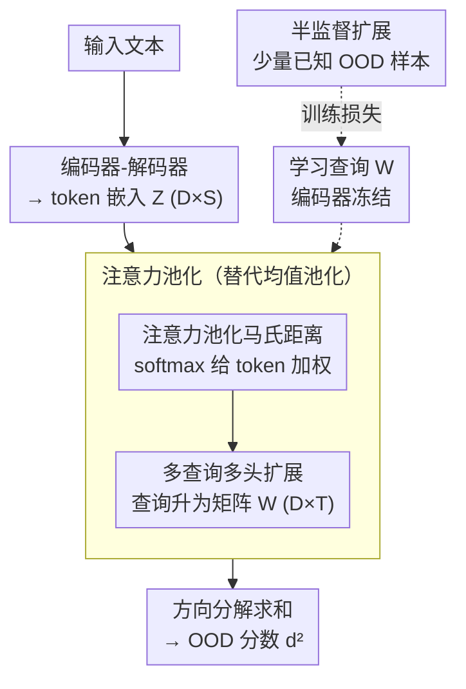

# AP-OOD: Attention Pooling for Out-of-Distribution Detection

**会议**: ICLR 2026  
**arXiv**: [2602.06031](https://arxiv.org/abs/2602.06031)  
**代码**: [https://github.com/ml-jku/ap-ood](https://github.com/ml-jku/ap-ood)  
**领域**: 文本生成  
**关键词**: 分布外检测, 注意力池化, Mahalanobis距离, token级信息, 语言模型  

## 一句话总结
提出AP-OOD，将Mahalanobis距离的均值池化替换为可学习的注意力池化，解决了均值池化丢失token级异常信息的问题，在文本OOD检测中将XSUM摘要的FPR95从27.84%降至4.67%，支持无监督到半监督的平滑过渡。

## 研究背景与动机

**领域现状**：语言模型部署时可能遇到OOD输入（如训练摘要BBC文章但收到CNN文章），会导致幻觉等不可靠输出。基于token嵌入的马氏距离是主流检测方法。

**现有痛点**：现有方法（如Ren et al. 2023）对序列的token嵌入做**均值池化**再计算马氏距离——但均值操作会隐藏异常信息。当ID和OOD序列的均值相近（但token分布不同）时，完全无法检测。Figure 1展示了这种失败模式。

**核心矛盾**：需要将变长表示（token序列）压缩为标量OOD分数，但简单聚合会丢失区分ID/OOD的关键token级模式。

**本文目标**：设计一种超越均值池化的聚合方式，保留token级信息用于OOD检测。

**切入角度**：将马氏距离分解为方向分量→将每个方向的投影从均值改为注意力加权→让模型学习关注哪些token对OOD检测最有信息量。

**核心 idea**：用可学习的注意力池化替代均值池化来计算马氏距离，使OOD检测能利用token级信息。

## 方法详解

### 整体框架
AP-OOD要解决的是文本OOD检测里"变长序列怎么压成一个标量分数"这件事。输入一段文本，预训练的编码器-解码器模型先吐出一组token嵌入 $Z \in \mathbb{R}^{D \times S}$（$S$ 个token、每个 $D$ 维）；过去的做法是把这 $S$ 个嵌入做均值池化、再算它到语料原型的马氏距离。AP-OOD保留马氏距离这条主干，但把"均值"这一步换成由 $M$ 个可学习查询向量驱动的注意力池化——让模型自己学会该盯住序列里哪些token，再把注意力加权后的距离当作OOD分数输出。整个改动只动聚合方式，编码器和马氏距离的框架不变；当手头有少量已知OOD样本时，还能在训练损失里把它们用起来。

### 关键设计

**1. 注意力池化马氏距离：让聚合步骤自己选token，而不是一视同仁取平均**

旧方法的瓶颈在均值：当一条ID序列和一条OOD序列的token均值嵌入恰好相近（但token分布完全不同）时，均值把差异抹平了，马氏距离就再也分不开两者（论文Figure 1-2正是这个失败模式）。AP-OOD先把标准马氏距离按方向展开成 $d^2 = \sum_j (w_j^T \bar{z} - w_j^T \mu)^2$，其中每个 $w_j$ 是一个测量方向；关键一步是把方向上的池化 $\bar{z} = \frac{1}{S}\sum_s z_s$ 换成注意力池化：

$$\bar{z} = Z \cdot \text{softmax}(\beta Z^T w)$$

这样同一个 $w_j$ 身兼两职——既定义"沿哪个方向量距离"，又通过 $\text{softmax}(\beta Z^T w)$ 定义"在这个方向上该把权重压给哪些token"。温度 $\beta$ 控制注意力的尖锐程度，于是异常token得到的权重被放大、不再被平均稀释，token级的分布差异得以保留进最终距离。

**2. 多查询多头扩展：用一组查询而非单个向量，捕获更丰富的异常模式**

单个 $w_j$ 只能刻画一种token模式，表达力有限。这里把向量 $w_j$ 升级成矩阵 $W_j \in \mathbb{R}^{D \times T}$，即每个head配 $T$ 个查询：

$$\bar{Z} = Z \cdot \text{softmax}(\beta Z^T W)$$

softmax在整张 $S \times T$ 的注意力矩阵上归一化，对应方向的距离改用Frobenius内积 $\text{Tr}(W_j^T \bar{Z})$ 计算。多个查询让模型能同时关注序列里不同位置、不同类型的可疑token，把它们的信号一起汇入距离，从而比单查询更敏感。

**3. 半监督扩展：有少量OOD样本时把它们平滑地用起来**

实际部署中往往对会遇到的OOD类型有点了解（哪怕只有几个样本），完全无监督就浪费了这点先验。AP-OOD在损失里加一项"最大化已知OOD样本距离"的目标，并用一个系数控制无监督到有监督之间的过渡——系数为0时退回纯无监督，逐渐增大就逐步把OOD信息纳入训练。这让方法不是非黑即白，而是随手头OOD数据的多少平滑切换。

### 训练策略
训练时编码器整体冻结，只学查询矩阵 $W_j$，可训练参数极少，因此本质上仍是post-hoc方法。损失函数为

$$\mathcal{L} = \frac{1}{N}\sum_i d^2(Z_i, \tilde{Z}) - \sum_j \log(\|W_j\|^2)$$

前项把ID样本拉近语料原型 $\tilde{Z}$，后项 $-\sum_j \log(\|W_j\|^2)$ 防止查询塌缩为零。注意力池化按mini-batch计算以压低显存。一个有用的理论性质是：当 $\beta=0$ 时注意力退化为均匀权重，整个方法精确回到标准马氏距离，相当于把经典方法作为AP-OOD的一个特例兜底。

## 实验关键数据

### 主实验

| 任务 | 指标 | 之前SOTA | AP-OOD |
|------|------|---------|--------|
| XSUM摘要 | FPR95↓ | 27.84% | **4.67%** |
| WMT15 En→Fr | FPR95↓ | 77.08% | **70.37%** |

FPR95改善幅度巨大（XSUM降低23+个百分点）。

### 消融
- β=0（退化为马氏距离）效果显著变差→注意力池化的贡献实质性的
- 增加head数M和查询数T均带来提升
- 半监督设置下少量OOD样本可进一步提升性能

### 关键发现
- 均值池化在摘要和翻译任务中都是主要瓶颈——OOD和ID的均值嵌入高度重叠
- 注意力池化学到的$w$趋向于关注序列中的"异常"token——这些token携带了最多的OOD信号
- 从无监督到半监督的过渡是平滑的——方法可以灵活适应可用OOD数据的多少

## 亮点与洞察
- **"均值隐藏异常"**这个问题的形式化（Figure 1-2）极其直观——一图胜千言
- 将注意力池化与马氏距离统一的理论框架很优雅——β=0退化为经典方法，β>0泛化到token级
- 参数量极少（仅学习查询向量），计算代价可忽略——真正的post-hoc方法

## 局限与展望
- 仅在摘要和翻译两个任务上验证——更多NLP任务（QA、对话等）待测
- 依赖预训练encoder-decoder架构——对decoder-only LLM的适用性需探索
- 仅处理输入端OOD——对生成端的分布偏移问题未涉及
- 注意力温度β的选择可能需要调参

## 相关工作与启发
- **vs Ren et al. (2023)**: 均值池化+马氏距离的基线；AP-OOD用注意力池化直接替代均值
- **vs 分类器OOD方法（MSP/Energy等）**: 这些假设分类头存在，AP-OOD适用于生成模型
- **vs Mahalanobis距离（Lee et al. 2018）**: 经典图像OOD方法；AP-OOD将其扩展到序列数据

## 评分
- 新颖性: ⭐⭐⭐⭐ 注意力池化+马氏距离的结合自然但此前未被探索
- 实验充分度: ⭐⭐⭐ XSUM结果极强但实验范围较窄（2个任务）
- 写作质量: ⭐⭐⭐⭐⭐ Figure 1-2的说明性例子极好，理论推导清晰
- 价值: ⭐⭐⭐⭐ 为NLP-OOD检测提供了简单有效的改进思路

<!-- RELATED:START -->

## 相关论文

- [\[CVPR 2026\] RankOOD: Class Ranking-based Out-of-Distribution Detection](../../CVPR2026/ai_safety/rankood_-_class_ranking-based_out-of-distribution_detection.md)
- [\[CVPR 2026\] Enhancing Out-of-Distribution Detection with Extended Logit Normalization](../../CVPR2026/ai_safety/enhancing_out-of-distribution_detection_with_extended_logit_normalization.md)
- [\[CVPR 2025\] Leveraging Perturbation Robustness to Enhance Out-of-Distribution Detection](../../CVPR2025/ai_safety/leveraging_perturbation_robustness_to_enhance_out-of-distribution_detection.md)
- [\[ICLR 2026\] Optimal Transport-Induced Samples against Out-of-Distribution Overconfidence](optimal_transport-induced_samples_against_out-of-distribution_overconfidence.md)
- [\[CVPR 2025\] OODD: Test-time Out-of-Distribution Detection with Dynamic Dictionary](../../CVPR2025/ai_safety/oodd_test-time_out-of-distribution_detection_with_dynamic_dictionary.md)

<!-- RELATED:END -->
