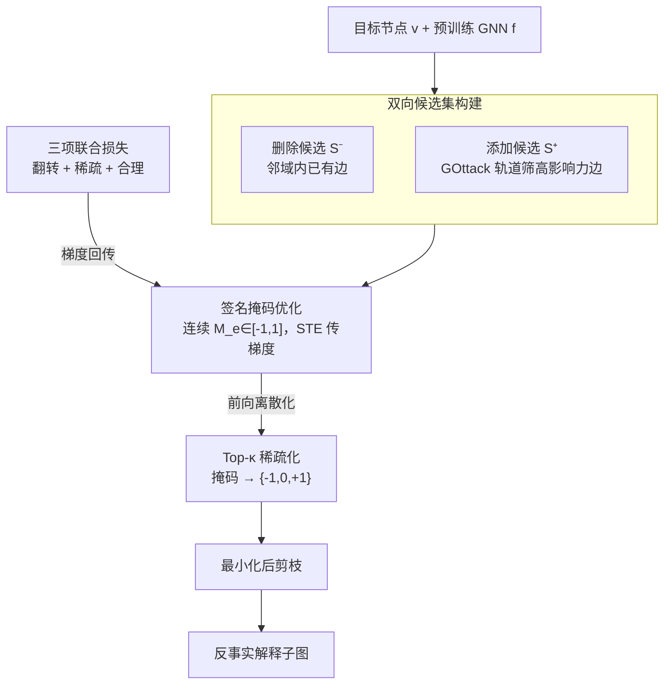

# ATEX-CF: Attack-Informed Counterfactual Explanations for Graph Neural Networks

**会议**: ICLR 2026  
**arXiv**: [2602.06240](https://arxiv.org/abs/2602.06240)  
**代码**: [https://github.com/zhangyuo/ATEX_CF](https://github.com/zhangyuo/ATEX_CF)  
**领域**: AI Safety / GNN Explainability  
**关键词**: 图神经网络, 反事实解释, 对抗攻击, 可解释性, 图结构扰动  

## 一句话总结

提出 ATEX-CF 框架，首次将对抗攻击的边添加策略与反事实解释的边删除策略统一起来，通过联合优化预测翻转、稀疏性和合理性，为 GNN 生成更忠实、更简洁、更合理的实例级反事实解释。

## 研究背景与动机

**GNN 可解释性需求迫切**：GNN 在医疗、金融等关键领域广泛应用，但其黑箱推理损害了信任，推动了反事实解释研究的发展。

**传统反事实方法局限于边删除**：CF2、GCFExplainer 等经典方法主要依赖边删除来识别支撑预测的关键子结构，忽略了"添加缺失关系"也能大幅改变预测的可能性。

**对抗攻击揭示边添加的力量**：图对抗学习研究已证明，添加少量（如 2 条）精心选择的边即可有效翻转目标节点的预测，这些边往往对应语义合理的结构关系。

**两大方向长期割裂**：反事实解释和对抗攻击虽然共享"翻转预测"的目标，但扰动策略截然不同——前者偏删除，后者偏添加——现有方法未将二者统一。

**边添加带来互补解释覆盖**：边删除解释揭示"哪些已有关系是关键的"，而边添加解释揭示"哪些缺失关系可能改变结果"，二者互补才能完整理解模型决策。

**搜索空间爆炸问题**：将边添加纳入反事实搜索时，候选空间组合爆炸，需要利用对抗攻击的高效策略来约束搜索范围。

## 方法详解

### 整体框架

ATEX-CF 把"为某个目标节点 $v$ 生成反事实解释"重新表述为一个约束优化问题：在一组候选边上学一层连续掩码，让被扰动后的图既能翻转预训练 GNN $f$ 的预测，又尽量少改、改得合理。它最关键的转变是打破"反事实只能删边"的惯例——候选集同时来自两个方向：删除候选 $\mathcal{S}^-$ 取自目标节点 $(l+1)$-hop 邻域内的已有边，添加候选 $\mathcal{S}^+$ 则借对抗攻击 GOttack 挑出的高影响力边。两路候选汇成统一候选集后，用同一个带符号的连续掩码、同一组联合损失把"删哪条""加哪条"一起优化；优化收敛后再前向离散化、Top-$\kappa$ 稀疏化得到具体扰动，最后做一步最小化剪枝去掉冗余边，输出简洁可信的反事实解释子图。

### 关键设计

**1. 双向候选集构建：用攻击-解释统一假设把"加边"借给反事实**

只许删边的方法只能回答"哪些已有关系是关键的"，却答不了"补哪条缺失关系能改变结果"；可一旦放开加边，候选空间立刻组合爆炸，盲目搜索不可行。ATEX-CF 的破局点是一个被实验验证的观察（Hypothesis 1）：一次成功逃逸攻击所添加的边，与目标节点真正的反事实解释子图高度重叠——攻击为翻转预测而选中的"关键缺失关系"，恰恰就是解释要找的边。基于此，删除候选 $\mathcal{S}^- = \{e \mid e \in E,\, e \in \mathcal{N}^{l+1}(v)\}$ 限定在邻域内已有边（保证可操作、就近修改），添加候选 $\mathcal{S}^+$ 则直接采用 GOttack 依图轨道（orbit，节点在局部子结构中的角色）筛出的高影响力边。这样一来，"加边"能力被给到了，候选规模又从源头被压到很小，既高效又结构合理。

**2. 签名掩码 + 直通估计器：用一个连续变量同时学"加"和"删"**

加边和删边本是两种离散决策，分别搜索既笨重又难联合优化。ATEX-CF 为每条候选边引入一个连续参数 $M_e \in [-1,1]$，约定 $M_e > 0$ 表示添加、$M_e < 0$ 表示删除、$M_e \approx 0$ 表示不动，符号编码操作类型、幅值编码扰动强度，于是加删被统一进同一个可微对象、靠梯度下降一起学。前向阶段把掩码离散化为 $\widehat{M}_e \in \{-1,0,+1\}$，并只保留绝对值最大的至多 $\kappa$ 条边（Top-$\kappa$），用预算 $\kappa$ 把解释规模卡在可解释范围内。问题是阈值化和 Top-$\kappa$ 都不可微、会切断反向传播——ATEX-CF 用直通估计器（STE）化解：前向照常离散化，反向时令 $\frac{\partial \widehat{M}_e}{\partial M_e} \approx 1$ 把这步近似成恒等函数，梯度绕过离散操作直接流回 $M_e$。正因如此，"连续优化 + 离散输出"才能端到端训练，不必退回昂贵的离散搜索。

**3. 三项联合损失 + 非对称代价：把翻转、稀疏、合理拧成一个可调目标**

掩码学什么，全由损失 $\mathcal{L} = \lambda_1 \mathcal{L}_{pred} + \lambda_2 \mathcal{L}_{dist} + \lambda_3 \mathcal{L}_{plau}$ 决定，三项各管一件事。预测项 $\mathcal{L}_{pred}$ 由指示函数加负对数似然构成，仅在预测尚未翻转时激活、持续把扰动图推离原始类别，一旦翻转成功就归零、转而让另外两项收紧解释。稀疏项 $\mathcal{L}_{dist}$ 用 $\ell_0$ 范数约束扰动边数，逼解释保持简洁。合理性项则是 $\mathcal{L}_{plau} = \alpha_{deg}\cdot\mathrm{DegAnom}(\Delta\mathbf{A}) + \alpha_{motif}\cdot\mathrm{MotifViol}(\Delta\mathbf{A})$：DegAnom 惩罚扰动造成的节点度数突变（避免凭空接上一大堆边），MotifViol 用聚类系数变化约束局部 motif 稳定（保持邻域拓扑模式），两者共同把翻转锁在结构自然、语义可信的范围内。此外，考虑到很多领域"加一条边"和"删一条边"代价并不对等（如贷款审批中"补一条合理关联"与"抹掉一条已有记录"含义迥异），框架再引入标量权重 $C$ 单独缩放添加边的代价。表 2 印证了它的作用：当 $C$ 调到很高（≥20）时方法退化为纯删除、性能明显下滑，说明可控的"加边"能力正是有效性的关键来源。

### 损失函数 / 训练策略

掩码优化收敛后，ATEX-CF 还做一步最小化后剪枝（Alg. 2）：在已翻转的扰动集合上贪心逐条移除冗余边，只要去掉后预测仍翻转就保留这次删除。这一步保证输出解释的最小性——实测把运行时间从 6.12s 压到 3.00s、平均边数从 1.71 降到 1.62，且不损失预测翻转成功率。训练用 SGD、学习率 0.001、200 epoch，默认 $\lambda_1{=}1.5,\lambda_2{=}0.5,\lambda_3{=}0.5,\alpha_{deg}{=}1.5,\alpha_{motif}{=}1.0$，扰动预算 $\kappa{=}5$。

## 实验关键数据

### 表1：Meta Results — 六个数据集上的平均排名（越低越好）

| 方法 | Misclass. | Fidelity | ΔE | Plausibility | Time | Overall Avg. | Wins |
|------|-----------|----------|-----|-------------|------|-------------|------|
| CF-GNNExplainer | 4.7 | 4.8 | 2.0 | 2.3 | 9.5 | 4.67 | 1 |
| PGExplainer | 8.2 | 7.7 | 4.2 | 5.8 | 1.0 | 5.37 | 6 |
| Nettack | 3.3 | 2.5 | 8.8 | 8.0 | 4.5 | 5.43 | 2 |
| GOttack | 4.8 | 4.3 | 8.8 | 8.0 | 3.0 | 5.80 | 0 |
| **ATEX-CF (ours)** | **1.2** | **1.3** | **1.0** | **1.2** | 7.3 | **2.40** | **20** |

> ATEX-CF 在 30 个 metric-dataset 组合中赢得 20 次第一，远超第二名 PGExplainer 的 6 次。

### 表2：非对称添加代价实验（Cora, GCN, κ=20）

| Addition Cost $C$ | Misclass. | Fidelity | ΔE (E+, E-) | Plausibility | Time |
|-------------------|-----------|----------|-------------|-------------|------|
| 0.5 | 0.70 | 0.23 | 1.78 (0.78, 1.00) | 0.72 | 6.1s |
| 1.0 (对称) | 0.70 | 0.23 | 1.78 (0.77, 1.01) | 0.71 | 10.3s |
| 5.0 | 0.70 | 0.23 | 1.82 (0.65, 1.17) | 0.69 | 10.9s |
| 20.0 | 0.54 | 0.15 | 1.42 (0.49, 0.93) | 0.68 | 11.5s |
| 21.0 (删除-only) | 0.42 | 0.10 | 1.78 (0.00, 1.78) | 0.62 | 11.7s |

> 当添加代价 $C$ 过高（≥20）时退化为纯删除，性能显著下降，验证了边添加策略的重要性。

## 亮点与洞察

- **首次建立理论桥梁**：通过 Hypothesis 1 将对抗攻击子图与反事实解释子图的高相似性形式化，为两大方向的统一提供了原则性基础。
- **互补解释范式**：边删除回答"什么已有关系是关键的"，边添加回答"什么缺失关系能改变结果"，二者结合提供更完整的模型理解。
- **实用案例驱动**：贷款审批场景中删除边无法翻转预测，而合理的边添加可以成功，直观展示了方法的实际价值。
- **搜索空间高效约束**：利用 GOttack 的图轨道理论缩小边添加候选范围，解决了组合爆炸问题。
- **后剪枝策略有效**：运行时间从 6.12s 降至 3.00s，边数从 1.71 降至 1.62，且预测准确性不损失。

## 局限性

1. **仅针对结构扰动**：当前框架仅处理边的添加/删除，未考虑节点特征扰动，无法捕获特征层面的反事实。
2. **时间开销偏高**：虽然排名整体最优，但 Time 指标排名 7.3（倒数），在大规模图上的效率仍需改善。
3. **依赖 GOttack 作为攻击源**：候选边添加完全依赖 GOttack 的质量，缺乏对其他攻击方法的探索和比较。
4. **仅支持静态图**：未扩展到动态图、时序图等更复杂的图结构场景。
5. **合理性度量有限**：仅使用度数异常和聚类系数作为合理性指标，可能不足以捕获领域特定的语义约束。

## 相关工作与启发

- **CF-GNNExplainer (Lucic et al., 2022)**：经典反事实 GNN 解释器，仅通过边删除，是本文的直接改进对象。
- **GOttack (Alom et al., 2025, ICLR)**：基于图轨道学习的通用对抗攻击，被 ATEX-CF 用作边添加候选生成器。
- **C2Explainer (Ma et al., 2025)**：可定制的掩码反事实解释器，支持边和特征扰动，但联合优化效果不如 ATEX-CF。
- **启发**：对抗攻击和模型解释两个看似对立的方向可以互相借力——攻击策略提供高效的搜索机制，解释需求提供合理性约束，这种统一视角可推广到其他领域（如 NLP 对抗样本解释）。

## 评分

| 维度 | 分数 (1-5) | 说明 |
|------|-----------|------|
| 新颖性 | 4 | 首次统一对抗攻击与反事实解释，理论贡献清晰 |
| 技术深度 | 4 | 联合优化框架设计完整，理论假设有实验支撑 |
| 实验充分性 | 4 | 6 数据集 + 3 GNN 架构 + 10 baseline，消融和敏感性分析全面 |
| 写作质量 | 4 | 动机清晰，案例生动，框架图直观 |
| 实用价值 | 3 | 代码开源，但时间开销偏高，领域适用性需验证 |
| **总分** | **3.8** | 扎实的 ICLR 工作，统一视角是核心贡献 |

<!-- RELATED:START -->

## 相关论文

- [\[NeurIPS 2025\] Influence Functions for Edge Edits in Non-Convex Graph Neural Networks](../../NeurIPS2025/ai_safety/influence_functions_for_edge_edits_in_non-convex_graph_neural_networks.md)
- [\[ICLR 2026\] Time Is All It Takes: Spike-Retiming Attacks on Event-Driven Spiking Neural Networks](time_is_all_it_takes_spike-retiming_attacks_on_event-driven_spiking_neural_netwo.md)
- [\[ICLR 2026\] Hide and Find: A Distributed Adversarial Attack on Federated Graph Learning](hide_and_find_a_distributed_adversarial_attack_on_federated_graph_learning.md)
- [\[ICLR 2026\] Bridging Fairness and Explainability: Can Input-Based Explanations Promote Fairness in Hate Speech Detection?](bridging_fairness_and_explainability_can_input-based_explanations_promote_fairne.md)
- [\[ICML 2026\] Singular Bayesian Neural Networks](../../ICML2026/ai_safety/singular_bayesian_neural_networks.md)

<!-- RELATED:END -->
