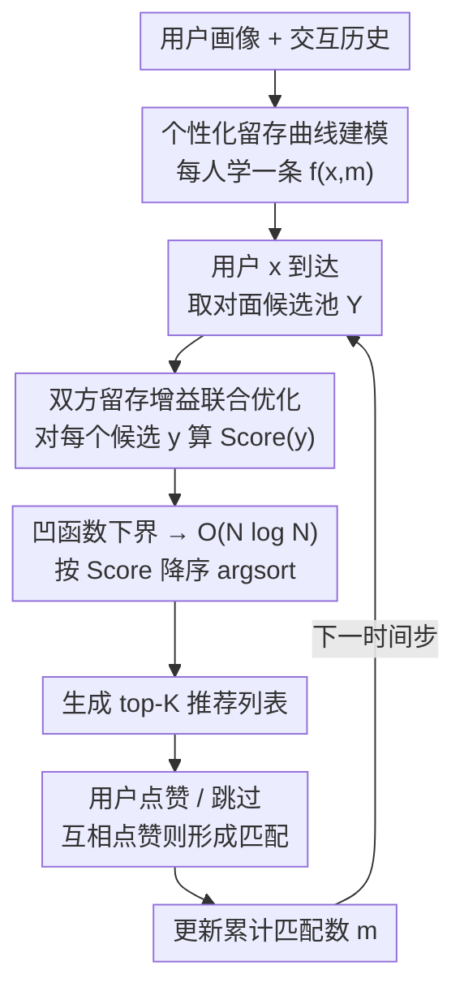

# Beyond Match Maximization and Fairness: Retention-Optimized Two-Sided Matching

**会议**: ICLR 2026  
**arXiv**: [2602.15752](https://arxiv.org/abs/2602.15752)  
**代码**: [GitHub](https://github.com/kishi6/ICLR2026_MRet)  
**领域**: 推荐系统 / AI安全  
**关键词**: 双边匹配, 用户留存, 动态学习排序, 在线约会平台, 留存优化

## 一句话总结

提出Matching for Retention（MRet）算法，首次将双边匹配平台的优化目标从"最大化匹配数"或"满足公平性"转向"直接最大化用户留存率"，通过学习个性化留存曲线并利用凹函数性质将NP-hard的双方留存增益联合优化降为O(N log N)的排序问题，在合成数据和日本大型约会平台真实数据上均显著提升留存。

## 研究背景与动机

**领域现状**：双边匹配平台（在线约会、招聘等）的推荐算法核心目标是最大化匹配总数。系统为每个到达的用户从对面用户池中生成排序推荐列表，用户查看后点赞或跳过，互相点赞形成匹配。大量文献围绕Reciprocal Recommender Systems展开，专注提高匹配效率。

**现有痛点**：最大化匹配数导致严重的"马太效应"——热门用户被反复推荐、积累大量匹配，冷门用户很少出现在推荐列表中，几乎得不到匹配。真实数据（来自日本大型约会平台）清晰显示匹配数少的用户下月离开平台的概率显著更高，且前几次匹配对留存的边际增益远大于后续匹配。对依赖订阅模式的平台而言，用户流失直接等于收入损失。

**核心矛盾**：公平性方法（如FairCo的曝光公平）被视为解决匹配不均的手段，但公平性本身不是平台的终极目标。公平性只在一个特定条件下有效——热门用户需要高曝光才能留存而冷门用户需要少量曝光即可满意。然而实际留存行为因人而异，这个条件不一定成立。用户不会因为"曝光被公平分配"就决定留下，把留存寄望于公平性相当于"碰运气"。

**本文目标**：形式化定义一个新问题——直接最大化双边匹配平台中所有用户的留存率，而非匹配数或公平性。

**切入角度**：将留存率建模为匹配数的个性化凹函数 $f(x, m)$，将推荐排序转化为最大化双方留存增益之和的优化问题，利用凹函数性质获得可高效求解的下界。

**核心 idea**：不要优化匹配数或公平性这些代理目标，直接优化你真正关心的——用户留存。

## 方法详解

### 整体框架

MRet是一个动态学习排序（LTR）框架，运行流程如下：（1）离线阶段，从用户画像和交互历史学习个性化留存曲线 $f(x, m)$，表示用户 $x$ 在累计获得 $m$ 次匹配后的留存概率；（2）在线阶段，每当用户 $x$ 到达时，为对面每个候选用户 $y$ 计算一个联合分数 $\text{Score}(y)$，该分数同时考虑推荐 $y$ 给 $x$ 带来的 $x$ 的留存增益和 $y$ 自身的留存增益；（3）按分数降序排列生成 top-$K$ 推荐列表，用户点赞或跳过、互相点赞则形成匹配。每个时间步结束后更新双方的累计匹配数 $m_{1:\tau}$，下一个用户到达时凭最新的 $m$ 重新打分，使推荐随平台状态动态适应。借助下面三个关键设计，原本 NP-hard 的联合优化最终被压成一次 $O(N \log N)$ 排序。

### 关键设计

**1. 个性化留存曲线建模：把"匹配数→留存"的关系一人一条曲线学出来**

公平性方法的根本缺陷是假设所有人共享同一套曝光-留存关系，但真实数据里每个用户的"吃饱点"差别很大。MRet 因此为每个用户学一条映射函数 $f(x, m)$，表示用户 $x$ 累计获得 $m$ 次匹配后的留存概率。它用 XGBoost 在 $\{x, m, u\}_{i=1}^{n}$ 数据集上训练回归模型（$x$=用户特征，$m$=匹配数，$u$=留存标签）。

这里有一个关键的结构性假设（Assumption 1）：留存函数是凹的，即匹配数越多，再多一次匹配带来的留存增益越小。这个假设直接来自真实数据——留存曲线前几次匹配急剧上升、随后趋于饱和。合成实验用一条分段函数刻画这个形状：$m \leq b_x$ 时抛物线上升，$m > b_x$ 时指数趋缓，其中 $b_x$ 是用户 $x$ 的"满意匹配数"。真实实验则对 60K 条记录做 k-means 聚类（5 簇），组内按匹配数取均值拟合。凹性不仅符合现实，更是后面把 NP-hard 问题降复杂度的数学钥匙。

**2. 双方留存增益联合优化：推荐谁，要同时算接收方和被推荐方两边的留存账**

只优化接收方会漏掉一个风险——被推荐方如果已经匹配饱和，把它再推出去对它自己的留存毫无增益，等于浪费了一个稀缺的曝光位。MRet 因此把最优排序 $\sigma_\tau^*$ 定义为"双方留存增益之和最大"：接收方 $x$ 的增益是 $f(x, m_{1:\tau}(x) + m_\tau(x)) - f(x, m_{1:\tau}(x))$，被推荐方每个候选 $y$ 的增益是 $f(y, m_{1:\tau}(y) + \alpha_k r(y,x)) - f(y, m_{1:\tau}(y))$。

论文用一个 toy example（图 2）说明为什么必须联合算：Candidate A 对被推荐方最优、Candidate B 对接收方最优，但总增益最高的其实是 Candidate C（60%），它不等于任何单边的最优解。直接对这个联合目标求最优排序是 NP-hard 的（要枚举所有 K-排列），但借助凹函数的 Jensen 不等式（Lemma 1 管接收方、Lemma 2 管被推荐方），可以把耦合的排序目标拆成逐候选独立的评分：

$$\text{Score}(y) = \frac{1}{A} f(x, m_{1:\tau}(x) + A \cdot r(x,y)) + \frac{1}{\alpha_{\max}}\left[f(y, m_{1:\tau}(y) + \alpha_{\max} r(x,y)) - f(y, m_{1:\tau}(y))\right]$$

由重排不等式，只要把 Score 高的候选放到可见度高的位置，就能最大化这个下界。

**3. 基于凹函数性质的 NP-hard → $O(N \log N)$ 高效求解：把组合爆炸压成一次排序**

实际平台的用户池能到百万级，枚举所有 K-排列的指数复杂度根本跑不动，这是前一个联合目标能否落地的关键瓶颈。两个引理在凹性假设下各自给出一个下界：Lemma 1 提供接收方的 Jensen-type 下界，把 $f(x, m + \sum_k \alpha_k r(x, \sigma_k))$ 拆成各候选的独立项之和；Lemma 2 提供被推荐方的线性下界，用 $\alpha_{\max}$ 位置的增益来下界候选 $y$ 在位置 $k$ 的贡献。

两个下界组合起来，原本耦合的优化就变成了 $\max_\sigma \sum_k \alpha_k \text{Score}(\sigma_k)$——只需对所有候选算一遍 Score、再降序排列即可，整体复杂度 $O(N \log N)$。论文在附录里还把 MRet 和 NP-hard 最优解直接对比，验证这个下界近似确实够好，不是为了快而牺牲质量。

### 损失函数 / 训练策略

留存函数 $f$ 通过XGBoost回归学习，训练数据来自平台历史记录（合成实验n=5000样本，匹配数从均值2.0的指数分布采样；真实实验用60K条含用户特征、累计匹配数和留存标签的记录）。在线推荐阶段无需梯度优化——每个时间步直接前向计算Score并排序。排序位置权重 $\alpha_k = 1/k$（默认设置）。

## 实验关键数据

### 主实验

合成数据实验（|X|=|Y|=1000用户，K=5推荐，T=2000时间步，κ=0.5人气偏差，10次均值）：

| 方法 | 累计匹配数/人 | 用户留存率 | 核心观察 |
|------|-------------|-----------|---------|
| Uniform | 最低 (1.0×基准) | ~0.78 | 随机推荐基线 |
| Max Match | 最高 (~1.4×基准) | ~0.78 | 匹配最多但留存≈Uniform |
| FairCo (λ=100) | 中等 | ~0.80 | 公平性带来有限提升 |
| **MRet** | **~0.7× MaxMatch** | **~0.85** | **用70%匹配达最高留存** |
| MRet (oracle) | 中等 | ~0.88 | 使用ground-truth f的上界 |

真实数据实验（日本大型约会平台，1000男×1000女，ALS补全匹配矩阵，留存=次月登录）：

| 方法 | 留存率表现 | 核心观察 |
|------|-----------|---------|
| Uniform | 最低 | 匹配极稀疏时随机推荐近乎无效 |
| FairCo | 低 | 稀疏匹配下公平分配导致几乎无有效匹配 |
| Max Match | 中等偏高 | 稀疏数据下集中推荐反而相对有效 |
| **MRet** | **最高** | **真实数据留存函数不满足凹函数假设下仍最优** |

### 消融实验

| 消融维度 | 变量范围 | 关键结论 |
|---------|---------|---------|
| 人气偏差κ | 0→1 | MRet在所有κ下留存最高，κ越大优势越明显 |
| FairCo超参λ | 1~1000 | 任何λ设置下FairCo均弱于MRet |
| 匹配概率噪声 | 不同噪声水平 | MRet对r(x,y)估计误差鲁棒 |
| 人气时间漂移 | 动态popularity | MRet因实时更新m而自然适应 |
| 等曝光公平准则 | 替换FairCo公平定义 | 换公平定义不改变结论 |
| 用户规模 | 不同|X|, |Y| | MRet在各规模下均优 |

### 关键发现

- MaxMatch获得最多匹配但留存与随机推荐几乎相同——"匹配数多≠用户留存好"是本文最核心的实证发现
- 图5b是论文最关键的evidence：FairCo的 $(m_{1:T} - b)$ 分布呈正态（大量用户偏离满意匹配数），MRet的分布几乎全部≥0（绝大部分用户达到或超过满意匹配数）。这直接解释了公平性为何不能替代留存优化
- MRet只用约70%的匹配数就达到显著更高留存——稀缺匹配被精准分配到边际留存增益最大处
- 真实数据的留存函数不满足凹函数假设（Assumption 1），但MRet仍表现最优，说明算法鲁棒性超越理论假设

## 亮点与洞察

- 问题定义本身是最大贡献——从代理目标（匹配数/公平性）到终极目标（留存率）的范式转换，这个思维可推广到所有推荐系统
- NP-hard→O(N log N)的理论转化优雅：两个引理利用凹函数性质获得可分解下界，有严格的数学基础而非启发式
- 图5b的可视化极具说服力——以直方图形式直观解释"公平分配≠满足个性化留存需求"
- 实验设计包含Oracle上界MRet(best)，为方法性能提供了清晰的天花板参照

## 局限与展望

- 留存函数f的学习受限于历史数据量，冷启动用户缺乏交互历史来估计个性化曲线
- 假设匹配概率r(x,y)已知或已由上游模型估计好，r的误差会传播到留存优化中
- 留存定义为"下月是否登录"较粗粒度，更精细的LTV/subscription续订率可能更有商业价值
- 每个时间步独立贪心优化，未考虑多步前瞻——强化学习视角下的长期规划可能进一步提升

## 相关工作与启发

- "代理目标→终极目标"的思维可推广到电商推荐（CTR→购买→复购→LTV）、内容平台（点击→观看时长→日活→留存）等场景
- FairCo是主要对比对象，MRet可视为其"目标函数升级版"——框架结构类似（动态LTR+逐步调整），但优化目标从公平性换为留存
- 与RL-based长期参与优化的区别：MRet使用贪心逐步优化+理论下界保证，更简洁实用，避免了RL的训练不稳定性和样本效率问题

## 评分

- 新颖性: ⭐⭐⭐⭐ 问题定义新颖，从代理目标到终极目标的转变有启发性，NP-hard→O(N log N)的理论贡献扎实
- 实验充分度: ⭐⭐⭐⭐ 合成+真实数据，6种消融维度，有Oracle上界参照，但真实数据仅1000×1000规模
- 写作质量: ⭐⭐⭐⭐ 动机论证充分，toy example（图2）和分布对比（图5b）直观有力，理论推导清晰
- 价值: ⭐⭐⭐⭐ 对订阅制双边平台有直接应用价值，"优化终极目标"思路可广泛推广

<!-- RELATED:START -->

## 相关论文

- [\[AAAI 2026\] Breaking the Dyadic Barrier: Rethinking Fairness in Link Prediction Beyond Demographic Parity](../../AAAI2026/ai_safety/breaking_the_dyadic_barrier_rethinking_fairness_in_link_prediction_beyond_demogr.md)
- [\[ICML 2026\] Position: Beyond Sensitive Attributes, ML Fairness Should Quantify Structural Injustice via Social Determinants](../../ICML2026/ai_safety/position_beyond_sensitive_attributes_ml_fairness_should_quantify_structural_inju.md)
- [\[AAAI 2026\] Matrix-Free Two-to-Infinity and One-to-Two Norms Estimation](../../AAAI2026/ai_safety/matrix-free_two-to-infinity_and_one-to-two_norms_estimation.md)
- [\[ICLR 2026\] Bridging Fairness and Explainability: Can Input-Based Explanations Promote Fairness in Hate Speech Detection?](bridging_fairness_and_explainability_can_input-based_explanations_promote_fairne.md)
- [\[ICML 2026\] FedHPro: Federated Hyper-Prototype Learning via Gradient Matching](../../ICML2026/ai_safety/fedhpro_federated_hyper-prototype_learning_via_gradient_matching.md)

<!-- RELATED:END -->
