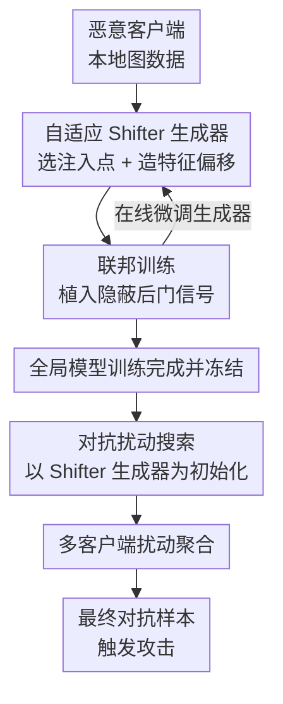

# Hide and Find: A Distributed Adversarial Attack on Federated Graph Learning

**会议**: ICLR2026  
**arXiv**: [2603.07743](https://arxiv.org/abs/2603.07743)  
**代码**: 待公开  
**领域**: AI安全  
**关键词**: Federated Graph Learning, adversarial attack, Backdoor Attack, Graph Neural Networks, Data Poisoning

## 一句话总结
提出 FedShift，一种两阶段"隐藏-发现"分布式对抗攻击框架：第一阶段通过温和的分布偏移（distributional shift）向训练图中植入隐蔽的 shifter，第二阶段以 shifter 生成器为起点高效搜索对抗扰动，多恶意客户端聚合扰动形成最终对抗样本，在六个大规模数据集上实现最高攻击成功率，同时逃逸三种主流防御算法且收敛速度提升 90% 以上。

## 背景与动机
联邦图学习（Federated Graph Learning, FedGL）允许多客户端在不共享图数据的前提下协作训练 GNN，广泛应用于疾病预测、推荐系统等场景。然而 FedGL 面临严重安全威胁：恶意客户端可通过后门攻击或对抗攻击使全局模型产生错误预测。

现有攻击方法存在三个核心困境：

1. **后门信号被平滑**：恶意客户端产生的后门信号在联邦聚合过程中被正常客户端的信号稀释，攻击效果大幅下降
2. **隐蔽性与有效性矛盾**：增大攻击预算可抵抗信号平滑，但大规模数据投毒容易被防御算法检测
3. **对抗攻击收敛困难**：图结构的离散性和优化目标的非凸性导致对抗扰动搜索收敛缓慢、计算开销大

## 核心问题
如何设计一种分布式攻击方法，同时解决后门攻击的信号平滑问题和对抗攻击的收敛效率问题，在保持高隐蔽性的同时实现高攻击成功率？

## 方法详解

### 整体框架

FedShift 把"后门式的隐蔽植入"和"对抗式的有效搜索"拆成前后衔接的两阶段：第一阶段（Hide）在联邦训练开局前为每个恶意客户端训练一个自适应 shifter 生成器，往训练图里注入几乎察觉不到的温和偏移；第二阶段（Find）等全局模型训练完成后冻结它，以第一阶段学到的生成器作为起点继续优化出真正的对抗扰动，最后聚合多个恶意客户端的扰动形成最终攻击样本。两阶段共享同一个生成器，使隐蔽的植入同时成为高效搜索的初始化。值得注意的是，第一阶段的生成器还能在整个联邦训练过程中随全局模型在线微调，让植入的偏移始终贴合最新的决策边界。

### 关键设计

**1. 自适应 Shifter 生成器：先选位置再造形状，且只动特征不动边**

后门信号之所以在联邦聚合里被稀释，是因为它往往粗暴又集中，容易被正常客户端的更新平摊掉。FedShift 让每个恶意客户端先用本地数据预训练一个 GAT 模型 $\theta_i^*$ 提取高质量图嵌入，再据此训练 shifter 生成器，分两步落子：位置上根据图拓扑计算节点聚类系数，挑出影响力最高的节点子集 $\mathcal{V}_p$ 作为注入点，让有限预算用在最能扩散的位置；形状上由生成器 $G_{\text{gen}}$ 为这些节点产生特征扰动 $\Delta\mathbf{X}_p$，且只改节点特征、不改变任何边连接。把改动限制在连续的特征空间而不触碰离散的图结构，既回避了结构扰动易被察觉的问题，也让后续梯度优化更平滑。

**2. 对抗扰动搜索：用第一阶段的生成器做高质量初始化**

图结构的离散性和攻击目标的非凸性让对抗扰动从零搜索既慢又贵。FedShift 的做法是等联邦训练结束、全局模型 $\theta^*$ 冻结后，不另起炉灶，而是直接拿第一阶段已经把表示推到决策边界附近的 shifter 生成器接着优化，目标从"靠近边界但不越界"切换为"跨越边界"，由 $L_{\text{attack}} = \text{CrossEntropy}(f(G_p; \theta^*), y_t)$ 驱动扰动图被分类到目标类 $y_t$。因为起点已经贴着边界，搜索只需走完最后一小段，所需 epoch 相比从零优化的 NI-GDBA 减少 90.3%，叠加联邦过程中的在线微调后更减少 98.3%。

**3. 多客户端扰动聚合：互补扰动叠出 "1+1>2"**

单个恶意客户端的扰动受限于其本地视角，威力有限。FedShift 让各恶意客户端各自搜索出不同的对抗扰动，再聚合成最终对抗样本。由于不同客户端覆盖了不同的脆弱方向，聚合后的样本攻击面更广，效果显著超过任何单一扰动。

### 损失函数 / 训练策略

第一阶段的核心是让偏移"温和到与良性客户端难以区分"，因此用三项损失共同约束。分布接近损失 $L_{\text{dist}}$ 先对目标类嵌入做 K-means 聚类得到质心，再最小化投毒图嵌入到最近质心的余弦距离，把表示温和地推向目标类决策边界**但不越过**——全程不修改标签、不构建强制触发器到目标的映射，这正是恶意客户端行为几乎与正常客户端不可区分的关键。同质性损失 $L_{\text{homo}}$ 基于图同质性假设，惩罚相连节点特征差异过大，保证扰动后图在结构上依然自然。边界平衡交叉熵损失 $L_{\text{ce}}$ 则要求投毒图仍被本地模型判回原始标签，作为不越界的硬约束。三者加权得第一阶段总损失：

$$L_{\text{stage1}} = \lambda_{\text{dist}} L_{\text{dist}} + \lambda_{\text{homo}} L_{\text{homo}} + \lambda_{\text{ce}} L_{\text{ce}}$$

进入第二阶段后，由于已无需保持隐蔽，去掉了 $L_{\text{ce}}$ 约束，只保留攻击项与维持结构自然的同质性项：

$$L_{\text{stage2}} = L_{\text{attack}} + \lambda_{\text{homo}} L_{\text{homo}}$$

此外，整个联邦训练过程中恶意客户端还可利用从服务器收到的全局模型，对 shifter 生成器做在线微调，使植入的偏移随全局模型同步更新，这也是完整 FedShift 收敛最快的原因。

## 实验关键数据

在 6 个大规模图数据集（DD、NCI109、Mutagenicity、FRANKENSTEIN、Eth-Phish&Hack、Gossipcop）上与 4 种 SOTA 方法对比。

### Q1：抵抗联邦信号平滑
- 恶意客户端比例从 0.2 降到 0.05 时，传统方法 ASR 平均下降 25.6%–53.3%
- FedShift 的 ASR 下降不到 5%，始终保持最优攻击效果
- 在 |C_M|/N=0.2 设定下，FedShift 在 6 个数据集上均取得最高 AAS

### Q2：逃逸防御算法
- 面对 FoolsGold、FedKrum、FedBulyan 三种主流鲁棒联邦学习防御
- FedShift 在所有场景下保持最高 AAS，平均领先最强 baseline 4.9%

### Q3：收敛效率
- 相比从零优化的 NI-GDBA，FedShift（无联邦微调）所需 epoch 减少 **90.3%**
- 完整 FedShift（含联邦微调）所需 epoch 减少 **98.3%**

### 消融实验
- 仅 Stage 1 → +FL-Tune：平均 AAS 提升 17.0%
- 仅 Stage 1 → +Stage 2：平均 AAS 提升 32.2%
- Stage 1 + Stage 2 的效果已接近完整模型，说明 Stage 2 是提升攻击有效性的关键

## 亮点
1. **新颖的两阶段攻击范式**：首次在统一框架中结合后门攻击（植入）和对抗攻击（搜索），利用整个联邦学习过程的信息
2. **温和分布偏移策略**：不修改标签、仅推向决策边界而不越过，从根本上解决隐蔽性问题
3. **优化初始化优势**：Stage 1 的 shifter 生成器为 Stage 2 提供高质量起点，收敛效率提升一个数量级
4. **多客户端扰动聚合**：不同恶意客户端产生的互补扰动聚合后效果远超单一扰动
5. **实验全面扎实**：6 个跨领域大规模数据集、3 种防御算法、详尽的消融和超参分析

## 局限与展望
1. **威胁模型假设较强**：攻击者需在联邦训练全程参与，实际场景中恶意客户端可能被动态踢出
2. **仅针对图分类任务**：未验证在节点分类、链接预测等其他图任务上的表现
3. **防御方法有限**：仅测试了 3 种防御算法，未包含更新的防御方法如 FLTrust、FLAME 等
4. **GNN 架构单一**：所有实验仅用 GAT 作为骨干网络，未验证对 GIN、GraphSAGE 等其他架构的泛化性
5. **缺少投毒检测分析**：未评估数据层面的异常检测方法是否能发现 shifter 注入的异常

## 与相关工作的对比

| 方法 | 类型 | 隐蔽性 | 抗平滑 | 收敛速度 | 综合效果 |
|------|------|--------|--------|----------|----------|
| Rand-GDBA | 后门（静态触发器） | 低 | 差 | - | 低 |
| GTA | 后门（自适应触发器） | 中 | 中 | - | 中 |
| Opt-GDBA | 后门（优化触发器） | 中 | 中 | - | 中 |
| NI-GDBA | 对抗（从零优化） | 高 | 不适用 | 慢 | 中高 |
| **FedShift** | **后门+对抗** | **高** | **强** | **快** | **最高** |

FedShift 的核心创新在于打破了后门攻击和对抗攻击的范式壁垒：后门攻击的植入阶段提供隐蔽性和优化起点，对抗攻击的搜索阶段提供最终攻击有效性。

## 启发与关联
- **防御视角**：该工作揭示了在特征空间中进行温和分布偏移的攻击方式极难检测，未来防御应关注训练过程中嵌入分布的微小异常漂移
- **联邦学习安全**：说明仅依赖聚合层面的鲁棒防御（如 Krum、Bulyan）不足以抵御此类攻击，需结合数据层面的检测手段
- **攻击方法融合**：两阶段"植入-搜索"范式可推广到其他联邦学习任务（文本、图像），是一种通用的攻击设计模板

## 评分
- 新颖性: ⭐⭐⭐⭐ — 两阶段"Hide and Find"范式是首创，将后门与对抗自然统一
- 实验充分度: ⭐⭐⭐⭐ — 6 个大规模数据集、3 种防御、丰富消融，但 GNN 架构和防御方法可更丰富
- 写作质量: ⭐⭐⭐⭐ — 动机清晰、三个挑战-三个解决对应明确，逻辑性强
- 价值: ⭐⭐⭐⭐ — 对联邦图学习安全研究有重要参考价值，新范式可启发后续工作

<!-- RELATED:START -->

## 相关论文

- [\[ICCV 2025\] Find a Scapegoat: Poisoning Membership Inference Attack and Defense to Federated Learning](../../ICCV2025/ai_safety/find_a_scapegoat_poisoning_membership_inference_attack_and_defense_to_federated_.md)
- [\[ICLR 2026\] ATEX-CF: Attack-Informed Counterfactual Explanations for Graph Neural Networks](atex-cf_attack-informed_counterfactual_explanations_for_graph_neural_networks.md)
- [\[ICLR 2026\] Less is More: Towards Simple Graph Contrastive Learning](less_is_more_towards_simple_graph_contrastive_learning.md)
- [\[AAAI 2026\] Towards Effective, Stealthy, and Persistent Backdoor Attacks Targeting Graph Foundation Models](../../AAAI2026/ai_safety/towards_effective_stealthy_and_persistent_backdoor_attacks_targeting_graph_found.md)
- [\[CVPR 2026\] FedAFD: Multimodal Federated Learning via Adversarial Fusion and Distillation](../../CVPR2026/ai_safety/fedafd_multimodal_federated_learning_via_adversarial_fusion_and_distillation.md)

<!-- RELATED:END -->
