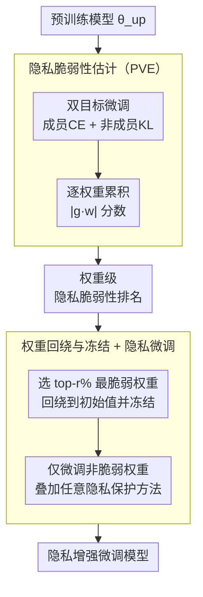

# Learnability and Privacy Vulnerability are Entangled in a Few Critical Weights

**会议**: ICLR 2026  
**arXiv**: [2603.13186](https://arxiv.org/abs/2603.13186)  
**代码**: 无  
**领域**: AI安全 / 隐私保护  
**关键词**: Membership Inference Attack, Weight Importance, Privacy Vulnerability, Weight Rewinding, Fine-grained Privacy Defense

## 一句话总结

揭示隐私脆弱性集中在极少量关键权重中（可低至0.1%），且与学习能力高度纠缠（Pearson r>0.9），提出CWRF方法通过回绕并冻结隐私脆弱权重、仅微调其余权重来实现优越的隐私-效用权衡。

## 研究背景与动机

**领域现状**：成员推断攻击（MIA）通过利用模型对训练数据和非训练数据的行为差异来推断数据成员身份。现有的隐私保护方法（如 DP-SGD、RelaxLoss、HAMP 等）通常更新或重新训练所有权重，这不仅计算成本高，还可能导致不必要的效用损失。**现有痛点**：已有工作（如彩票假设）表明只有少数权重对模型性能至关重要，但对隐私脆弱性的权重级分析完全空白。标准剪枝技术（如 TFO）移除"不重要"权重后，隐私风险不降反升——在 90% 稀疏度下模型测试 loss 反而增加，MIA 成功率不变甚至更高。**核心矛盾**：直觉上应该移除"隐私脆弱"的权重，但这些权重恰恰也是"学习能力关键"的权重——两个属性在极少数权重中高度纠缠（Pearson r>0.9），无法简单剪除。**本文目标** 在不破坏模型性能的前提下，精确定位并处理隐私脆弱权重以降低 MIA 风险。**切入角度**：既然位置比数值更重要（保留关键权重的位置即可恢复性能），就将隐私脆弱权重回绕到初始值——消除隐私风险但保留连接拓扑——然后冻结这些权重、仅微调其余权重。**核心 idea**：不删除隐私脆弱权重，而是回绕到初始化值并冻结，利用"位置 > 数值"的洞察让模型在微调中恢复性能的同时保护隐私。

## 方法详解

### 整体框架

CWRF（Critical Weights Rewinding and Finetuning）从一个预训练好的模型出发，输出一个隐私增强的微调模型，中间走两步：先用一次"学习成员 + 遗忘非成员"的双目标微调给每个权重打一个隐私脆弱性分数（PVE），排出哪些权重最容易泄露隐私；再按分数选出 top-r% 最脆弱的权重、把它们回绕到初始化值并冻结，只微调剩下的非脆弱权重——这一步可以无缝叠加任意隐私保护训练方法（DP-SGD、RelaxLoss 等）。核心直觉是"位置 > 数值"：脆弱权重同时也是学习能力关键权重，删不得，但把它的数值退回初始、保留连接拓扑，就能既抹掉它吸收的隐私信息、又靠微调恢复性能。

### 关键设计

**1. 隐私脆弱性估计（PVE）：用"学习+遗忘"双信号量出每个权重泄了多少隐私**

要精准处理隐私脆弱权重，先得有一把尺子衡量每个权重对隐私泄露贡献多大，而传统重要性指标（如 TFO）只盯准确率，量不出隐私这一维。PVE 的做法是在预训练模型上做一次双目标微调：对训练集（成员数据）最小化交叉熵损失，让模型"学习"成员信息；同时对参考集（非成员数据）最小化与初始模型的 KL 散度，让模型"遗忘"非成员信息。损失函数为

$$\mathcal{L}_{\text{pve}} = (1-\lambda)\mathcal{L}_{\text{ce}}(f(x_{tr};\theta_{up}), y_{tr}) + \lambda\mathcal{L}_{\text{kl}}(f(x_{re};\theta_{up}), f(x_{re};\theta_{vn}))$$

迭代过程中对每个权重累积 $|g_i \cdot w_i|$ 分数（梯度 × 权重幅值），最终得到一份权重级的隐私脆弱性排名。关键在于这个双重信号：高分权重恰恰是那些既加剧训练数据行为、又拉开训练/非训练数据差异的权重——而这种差异正是 MIA 所利用的信号，所以 PVE 排出来的高分权重就是隐私的"漏点"，而非单纯的"性能要件"。

**2. 权重回绕与冻结 + 隐私微调：不删脆弱权重，而是把它退回初始值再锁住**

知道哪些权重脆弱后，直觉是把它们剪掉，但实验恰恰相反——它们同时也是学习能力关键权重，剪掉会让准确率崩。CWRF 的解法是回绕而非移除：按 PVE 分数选出 top-r% 最脆弱的权重，用掩码把它们重置回初始化值，$\theta_{rw} = \mathcal{B}_f \odot \theta_{up} + \mathcal{B}_r \odot \theta_{vn}$，这样既抹掉了它们在训练中吸收的隐私信息，又保留了它们的"位置"（连接拓扑）。随后冻结这批权重——通过梯度掩码 $\mathcal{G}_p \leftarrow \mathcal{B}_f \odot \mathcal{G}_p$ 阻止它们再被更新——只微调剩余的非脆弱权重，学习率也回绕到初始值并用 cosine annealing 调度。之所以保位置不保数值就够，是因为消融给出了直接对照：直接移除权重（A1）导致准确率不可恢复地崩溃，而回绕+微调（A2、A3/CWRF）都能恢复性能；其中微调非脆弱权重（A3）的隐私-效用权衡又显著优于微调脆弱权重（A2）。由于微调阶段本身不挑剔损失形式，CWRF 可以直接叠加在任意隐私保护方法（DP-SGD、RelaxLoss、HAMP、CCL 等）之上。

### 损失函数 / 训练策略

PVE 阶段使用 $\mathcal{L}_{\text{pve}}$（CE + KL 双目标），迭代 $T$ 步累积分数。微调阶段插入用户选择的隐私保护方法（标准 CE 或其变体），通过梯度掩码仅更新非冻结权重。学习率从初始值开始使用 cosine annealing，训练 $E$ 个 epoch。总计算开销远低于从头重新训练。

## 实验关键数据

### 主实验

**纠缠量化**（Table 1，Pearson 相关系数）：

| 架构 | 权重类型 | Pearson r | 参数占比 |
|------|---------|-----------|---------|
| ResNet18 | Conv | **0.9410** | 99.50% |
| ResNet18 | Linear | 0.8096 | 0.45% |
| ResNet18 | Norm | 0.6776 | 0.05% |
| ViT | Att+MLP | **0.9068** | 99.39% |
| ViT | Linear | 0.8642 | 0.54% |
| ViT | Norm | 0.7336 | 0.07% |

**CIFAR-10 防御效果**（Table 3，ResNet18，LiRA 攻击 AUC ↓越低越好）：

| 防御方法 | 测试准确率(%) | LiRA AUC(%) | LiRA TPR@0.1%FPR(%) |
|---------|-------------|-------------|---------------------|
| No Defense | 79.44 | 85.00 | 2.18 |
| RelaxLoss | 77.10 | 70.51 | 1.38 |
| RelaxLoss+CWRF | 76.86 | **68.31** | **0.03** |
| CCL | 79.56 | 83.95 | 1.50 |
| CCL+CWRF | 77.77 | **64.82** | **0.22** |

### 消融实验

| 配置 | 回绕率 | 训练Loss | 测试Loss | 说明 |
|------|--------|----------|----------|------|
| A1 (移除+微调非脆弱) | 0.1-5% | — | — | 准确率崩溃，不可恢复 |
| A2 (回绕+微调脆弱) | 3.0% | 0.4326 | 0.9288 | Loss差距较大 |
| A3/CWRF (回绕+微调非脆弱) | 3.0% | 0.4473 | **0.8044** | Loss差距最小 |
| From scratch (RelaxLoss) | — | 0.8087 | 1.5398 | 全局训练效果差 |

CWRF 在 3% 回绕率下测试 Loss 仅 0.8044，远优于从头训练的 1.5398。

### 关键发现

- 标准剪枝（TFO 90%稀疏度）不降低甚至增加 MIA 成功率——冗余减少后脆弱权重影响被集中放大
- 权重"位置"比"值"更关键：回绕到初始化后重训可完全恢复准确率，但移除则不可恢复
- Transformer 的注意力层比 CNN 的卷积层表现出更高隐私脆弱性
- CWRF 可叠加到已有的隐私保护训练方法之上，在 DP-SGD、RelaxLoss、HAMP、CCL 四种方法上均带来提升
- 在 ViT 上 DP-SGD+CWRF 的 LiRA AUC 从 54.97% 进一步降至 55.68%（接近随机的50%），TPR@0.1‱FPR 从 0.17% 降至 0.00%

## 亮点与洞察

- 首次在权重粒度上分析隐私脆弱性，揭示了与学习能力的深度纠缠——这从根本上解释了为何传统剪枝无法改善隐私
- "位置 > 数值"的发现与彩票假设呼应，但从隐私保护角度提供了新的佐证和应用
- CWRF 计算代价远低于 DP-SGD 等全局方法——只需微调少量权重，可能成为实用的轻量级隐私增强方案
- 归一化层虽仅占 0.05-0.07% 参数，但包含高度隐私脆弱的权重且与学习能力相关性较低，暗示其在隐私保护中可能有独特作用

## 局限与展望

- 仅在分类模型（ResNet18、ViT）和小规模数据集（CIFAR-10/100、CINIC-10）上验证，对 LLM 的适用性未知
- 回绕率 r 需要交叉验证选择，缺乏自动化策略
- PVE 需要非成员参考集——在某些场景下该假设可能不满足
- 与差分隐私的正式理论联系未建立，无法提供形式化隐私保证

## 相关工作与启发

- **vs DP-SGD**：DP-SGD 全局加噪，CWRF 精准定位脆弱权重。CWRF 可作为 DP-SGD 的补充（实验中叠加使用效果更好）
- **vs 彩票假设/模型剪枝**：剪枝关注效率，CWRF 关注隐私。两者共享"少量权重决定模型行为"的洞察，但 CWRF 发现隐私维度与效用维度高度耦合

## 评分
- 新颖性: ⭐⭐⭐⭐ 权重级隐私分析是全新角度，三个核心洞察层层递进
- 实验充分度: ⭐⭐⭐⭐ ResNet/ViT 两架构 + LiRA/RMIA 两攻击 + 4种防御方法叠加验证
- 写作质量: ⭐⭐⭐⭐ 可视化出色，从观察到假设到验证的论证链清晰
- 价值: ⭐⭐⭐⭐ 为轻量级隐私保护微调提供新思路，实际部署门槛低

<!-- RELATED:START -->

## 相关论文

- [\[NeurIPS 2025\] Impact of Dataset Properties on Membership Inference Vulnerability of Deep Transfer Learning](../../NeurIPS2025/ai_safety/impact_of_dataset_properties_on_membership_inference_vulnerability_of_deep_trans.md)
- [\[CVPR 2025\] FedAWA: Adaptive Optimization of Aggregation Weights in Federated Learning Using Client Vectors](../../CVPR2025/ai_safety/fedawa_adaptive_optimization_of_aggregation_weights_in_federated_learning_using_.md)
- [\[ICLR 2026\] Membership Privacy Risks of Sharpness Aware Minimization](sam_membership_privacy_risks.md)
- [\[ICLR 2026\] Unified Privacy Guarantees for Decentralized Learning via Matrix Factorization](unified_privacy_guarantees_for_decentralized_learning_via_matrix_factorization.md)
- [\[ICCV 2025\] Vulnerability-Aware Spatio-Temporal Learning for Generalizable Deepfake Video Detection](../../ICCV2025/ai_safety/vulnerability-aware_spatio-temporal_learning_for_generalizable_deepfake_video_de.md)

<!-- RELATED:END -->
