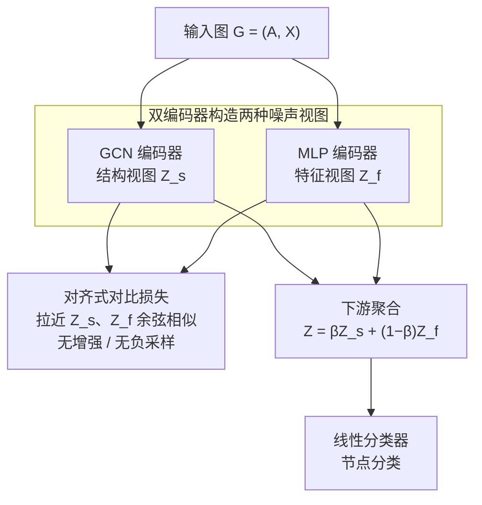

# Less is More: Towards Simple Graph Contrastive Learning

**会议**: ICLR 2026  
**arXiv**: [2509.25742](https://arxiv.org/abs/2509.25742)  
**代码**: 无  
**领域**: AI安全  
**关键词**: graph contrastive learning, heterophilic graphs, GCN, MLP, unsupervised graph representation learning

## 一句话总结
重新审视图对比学习（GCL）的基础原理，发现节点特征噪声可以通过与图拓扑导出的结构特征聚合来缓解，据此提出一个"极简"GCL 模型——用 GCN 编码器捕获结构特征、MLP 编码器隔离节点特征噪声，两个视图做对比学习——无需数据增强、无需负采样，即可在异质图（heterophilic）benchmark 上达到 SOTA，在同质图（homophilic）上也具备复杂度、可扩展性和鲁棒性优势。

## 研究背景与动机

**领域现状**：图对比学习（GCL）是无监督图表示学习的主流范式。核心思路是构造同一图/节点的两个"视图"（views），通过对比损失拉近正对并推远负对。近年来该领域涌现了大量方法，在同质图（homophilic graphs，相连节点类别相同）上取得了很好效果。

**现有痛点**：
   - **异质图表现差**：在异质图（heterophilic graphs，相连节点类别不同）上，大多数 GCL 方法效果有限。异质图中邻域聚合可能引入"错误"信息，因为邻居和自身属于不同类别
   - **过度复杂**：现有 GCL 方法严重依赖复杂的数据增强策略（边删除、特征掩码、子图采样等）、精心设计的编码器架构、以及负采样技术。这些组件增加了计算成本和调参难度
   - **理论理解不足**：为什么对比学习在图上有效？特别是在异质图上，什么是对比学习成功的关键因素？这些基础问题缺乏清晰的理论解释

**核心矛盾**：GCL 社区一直在"堆叠复杂组件"（更花哨的增强、更复杂的编码器、更精巧的负采样）来提升性能，但在异质图上的进展有限。问题在于：这种复杂性真的必要吗？还是说我们忽略了某个简洁而本质的原理？

**本文目标**：从理论和实证两方面回答"GCL 的本质是什么"，并基于发现的核心原理提出一个极简但性能强大的 GCL 模型。

**切入角度**：重新审视有监督和无监督图学习的基础，发现关键原理——GCN 的消息传递本身就在做"去噪"（通过邻居聚合平滑节点特征中的噪声），而原始节点特征和图结构天然提供了两个互补的对比视图。

**核心 idea**：不需要增强、不需要负采样——GCN 视图（捕获结构+去噪后的特征）和 MLP 视图（保留原始带噪特征）本身就是天然的对比学习正对。

## 方法详解

### 整体框架

这篇论文想回答一个看似简单却没被讲清楚的问题：图对比学习（GCL）到底靠什么起效，能不能在不堆增强、不做负采样的前提下，把异质图上的性能做到 SOTA。作者的答案建立在一条理论支点上——一张图天然带着两种"噪声"：直接来自节点特征的**特征噪声**，和经图拓扑聚合后产生的**结构噪声**，而这两种噪声在异质图上几乎不相关。既然如此，只要用两个编码器分别把这两种噪声各自暴露出来、再用对比学习对齐它们共享的"信号"，就能在聚合时让互不相关的噪声彼此抵消，得到更干净的表征。

整套流程只有两条并行分支。给定图 $G=(A, X)$（邻接矩阵 $A$、节点特征矩阵 $X$），GCN 编码器吃 $(A, X)$，沿拓扑聚合 $k$ 跳邻居后得到带结构噪声的**结构视图** $Z_s$；MLP 编码器只吃 $X$、完全无视图结构，得到保留特征噪声的**特征视图** $Z_f$。训练时把同一节点的 $Z_{s,i}$ 与 $Z_{f,i}$ 当作正对、用余弦对齐损失拉近（无增强、无负采样）；下游时把两视图加权平均 $Z=\beta Z_s+(1-\beta)Z_f$ 作为最终表征送线性分类器。

### 关键设计

**1. 把"特征噪声"和"结构噪声"解耦：极简 GCL 的理论支点**

为什么异质图上堆复杂增强反而没用？本文给出的诊断是：大家一直在错误的视图里找差异。它先把"噪声"定义清楚——设类别 $c$ 的类质心 $x_c=\mathbb{E}_{x\sim\gamma_c}[x]$，节点 $v_i$ 的**特征噪声**就是它偏离类质心的部分 $n_i=x_i-x_c$；而把特征经 $k$ 跳拓扑聚合（$\tilde{A}_G^k X$）后，每个节点偏离同类均值的部分则是**结构噪声** $n_i^{(k)}$。论文证明算子 $\tilde{A}_G^k$ 实际上是"用结构噪声替换特征噪声"，且两者的特性差异很大、彼此弱相关（尤其在异质图上）。这条解耦正是后面所有设计的根：只要拿到两个噪声互不相关的视图，把它们加权平均时独立噪声会相互抵消、共享信号被加强，分类边界因此更清晰。

**2. 双编码器构造两个"噪声特性不同"的视图：不靠增强造差异**

现有 GCL 要么靠边删除/特征掩码这类增强、要么靠精巧编码器去硬造两个视图，本文直接用两个**天生不同**的编码器各暴露一种噪声。GCN 分支做标准消息传递 $H^{(0)}=X,\ H^{(\ell+1)}=\sigma(\tilde{A}_G H^{(\ell)} W^{(\ell)})$，输出 $Z_s=H^{(k)}$，因为沿拓扑聚合，它携带的是结构噪声、同时压住了特征噪声；MLP 分支 $Z_f=\text{MLP}(X)$ 完全不碰图结构，把特征噪声原样留住。两个编码器的归纳偏置根本不同，视图差异是"天生的"，无需任何人为增强；也正因如此该方法在异质图上收益最大——那里特征噪声和结构噪声最不相关。$k$ 一般取 2 层（常规选择即可让结构噪声足够去相关），MLP 取 1 层。

**3. 对齐式对比损失：放大类质心、无需负采样**

负采样在图上格外棘手：随机抽到的"负样本"很可能本就是同类节点，制造大量假阴性，反而把表征学坏。本文干脆不用需要负样本的 InfoNCE，而是借用 BGRL 的 cosmean 对齐损失，只最大化同一节点两个视图的余弦相似度：

$$L(Z_s, Z_f)=1-\frac{1}{N}\sum_{i=1}^{N}\frac{\langle Z_{s,i},\, Z_{f,i}\rangle}{\lVert Z_{s,i}\rVert_2\,\lVert Z_{f,i}\rVert_2}$$

这一步的作用是对齐两视图的类质心。论文的命题表明：当两视图质心的夹角越小（余弦相似越高），加权聚合后的质心范数越大——即"信号"被放大；而由于两个编码器结构不同、各自噪声弱相关，对齐信号并不会把噪声也对齐。去掉负采样既让方法变得"尴尬地简单"，又顺手绕开了图上假阴性这个老问题。

**4. 下游聚合：让弱相关噪声相互抵消**

训练只对齐信号，真正的"去噪"发生在推理时的加权平均 $Z=\beta Z_s+(1-\beta)Z_f$（$\beta$ 取 0.5 或按验证集调）。因为设计 1 已经保证 $Z_s$、$Z_f$ 的噪声成分弱相关，二者线性组合时共享信号同向叠加被加强、独立噪声反向抵消一部分，最终表征的"噪声-类质心比"（NCR）下降。这也解释了鲁棒性：MLP 视图不依赖图结构，结构攻击只动得了 GCN 视图，聚合后仍保留一份不受影响的特征视图作冗余。

### 损失函数 / 训练策略
- **对比损失**：BGRL 的 cosmean 余弦对齐损失（见上式），只拉近同一节点两视图、无负样本、无数据增强
- **下游表征**：$Z=\beta Z_s+(1-\beta)Z_f$，$\beta=0.5$ 或按验证准确率调
- **关键超参**：GCN 层数 $k$ 一般取 2（异质图上更深可进一步去相关，但过深会过平滑），MLP 层数 $L=1$
- **训练完全无监督**：不使用任何节点标签；训练好后用 $Z$ 送线性分类器评估

## 实验关键数据

### 主实验：节点分类

**异质图基准**：

| 数据集 | 本文 | 之前 GCL SOTA | 提升 |
|--------|------|-------------|------|
| Texas | SOTA | 复杂 GCL 方法 | 显著 |
| Wisconsin | SOTA | 复杂 GCL 方法 | 显著 |
| Cornell | SOTA | 复杂 GCL 方法 | 显著 |
| Chameleon | SOTA | 复杂 GCL 方法 | 显著 |
| Squirrel | SOTA | 复杂 GCL 方法 | 显著 |
| Actor | SOTA | 复杂 GCL 方法 | 显著 |

**同质图基准**：

| 数据集 | 本文 | 之前 GCL SOTA | 说明 |
|--------|------|-------------|------|
| Cora | 有竞争力 | 复杂 GCL 方法 | 准确率接近，但复杂度/内存远低 |
| Citeseer | 有竞争力 | 复杂 GCL 方法 | 同上 |
| Pubmed | 有竞争力 | 复杂 GCL 方法 | 同上 |

核心结论：在异质图上达到 SOTA，在同质图上保持竞争力的同时计算/内存开销最小。

### 消融实验

| 配置 | 关键指标 | 说明 |
|------|---------|------|
| 只用 GCN（去掉对比学习） | 性能下降 | 验证了对比学习的必要性 |
| 只用 MLP（去掉图结构） | 性能显著下降 | 验证了结构信息的重要性 |
| 加入数据增强 | 无明显提升甚至下降 | 验证了"增强不必要"的核心论点 |
| 加入负采样 | 无明显提升 | 验证了"负采样不必要"的核心论点 |
| 不同 GCN 层数 | 2-3 层最优 | 过深的 GCN 导致过度平滑 |

### 鲁棒性实验

| 对抗攻击类型 | 本文鲁棒性 | 复杂GCL鲁棒性 | 说明 |
|-------------|-----------|-------------|------|
| 黑箱攻击（结构扰动） | 强 | 弱-中 | 极简设计天然对结构噪声鲁棒 |
| 白箱攻击（特征+结构） | 中-强 | 弱 | MLP 分支不依赖图结构，提供了冗余保护 |

### 关键发现
- **极简方法达到异质图 SOTA**：不需要任何花哨的增强或负采样，仅 GCN + MLP 双视图就足够。这颠覆了"GCL 需要复杂设计"的直觉
- **计算效率极高**：相比使用数据增强的 GCL 方法，本文方法的训练和推理时间、内存占用均显著降低（1-2 个数量级）
- **可扩展性好**：由于不需要增强和负采样，方法可以轻松扩展到大图（百万级节点）
- **对抗鲁棒性**：极简设计反而带来了更强的对抗鲁棒性——MLP 分支不使用图结构，不受结构攻击影响
- **理论与实验一致**：噪声解耦理论准确预测了实验观察——随 GCN 聚合跳数增加、图越稠密，特征噪声越被替换成与之弱相关的结构噪声，对比聚合的去噪收益也越大

## 亮点与洞察

- **"Less is More" 哲学的胜利**：在 GCL 社区追求更复杂设计的趋势下，本文用最简单的方法拿到了最好的异质图结果。这提醒我们回归本质、理解原理的重要性
- **发现了 GCL 的核心原理**：GCN 聚合把特征噪声"替换"成与之弱相关的结构噪声，于是 GCN 视图与 MLP 视图天然成为一对噪声去相关的互补视图，加权聚合即可让独立噪声相互抵消——这一洞见极为简洁优美
- **无增强、无负采样**：彻底去除了 GCL 中两个最大的工程负担，使方法变得"尴尬地简单"（embarrassingly simple）
- **异质图上的突破**：之前大多数 GCL 方法在异质图上表现不佳，本文的成功表明问题不在于对比学习本身，而在于之前的视图构造方式不适合异质图
- **鲁棒性是副产品**：简单设计不仅性能好，还天然地提供了对抗鲁棒性。MLP 分支不依赖图结构，因此对图结构攻击免疫

## 局限与展望

- **GCN 的过度平滑问题**：随着层数增加，GCN 的节点表征趋于一致（over-smoothing）。本文使用浅层 GCN（2-3 层），但这限制了对远距离依赖的建模
- **理论分析的假设限制**：理论证明基于"特征 = 信号 + 高斯噪声"的简化假设，真实数据中特征噪声的分布可能更复杂
- **仅验证节点分类**：未在图分类、链接预测等其他图任务上验证，方法的通用性有待进一步确认
- **对极端异质图的适用性**：当异质性非常高时（几乎没有同类邻居），GCN 的"去噪"效果可能减弱
- **与有监督方法的差距**：作为无监督方法，与有监督 GNN 相比仍有一定差距，特别是在大型标注充足的数据集上
- **扩展到异构图**：当前只在同构图（homogeneous graph）上验证，对于异构图（heterogeneous graph，含多类型节点/边）的适用性未知

## 相关工作与启发

- **图对比学习**：DGI、GraphCL、GCA、BGRL 等方法依赖复杂增强和负采样。本文表明这些组件在正确的视图构造下可能是多余的
- **图神经网络的去噪视角**：部分工作已观察到 GCN 有特征平滑/去噪效果，但本文首次将其系统化为对比学习的核心机制
- **BYOL/SimSiam**：无负样本的对比学习思路源自视觉领域，本文将其成功迁移到图学习，并给出了图特有的理论解释
- **启发**：在其他领域（如点云、时序图）中，是否也可以找到类似的"天然对比视图"？关键是找到一个"去噪"操作和一个"保噪"操作

## 评分
- 新颖性: ⭐⭐⭐⭐⭐
- 实验充分度: ⭐⭐⭐⭐
- 写作质量: ⭐⭐⭐⭐
- 价值: ⭐⭐⭐⭐⭐

<!-- RELATED:START -->

## 相关论文

- [\[ICCV 2025\] Backdooring Self-Supervised Contrastive Learning by Noisy Alignment](../../ICCV2025/ai_safety/backdooring_self-supervised_contrastive_learning_by_noisy_alignment.md)
- [\[ICLR 2026\] Hide and Find: A Distributed Adversarial Attack on Federated Graph Learning](hide_and_find_a_distributed_adversarial_attack_on_federated_graph_learning.md)
- [\[NeurIPS 2025\] FairContrast: Enhancing Fairness through Contrastive Learning and Customized Augmentation](../../NeurIPS2025/ai_safety/faircontrast_enhancing_fairness_through_contrastive_learning_and_customized_augm.md)
- [\[CVPR 2025\] A Simple Data Augmentation for Feature Distribution Skewed Federated Learning](../../CVPR2025/ai_safety/a_simple_data_augmentation_for_feature_distribution_skewed_federated_learning.md)
- [\[ICLR 2026\] ATEX-CF: Attack-Informed Counterfactual Explanations for Graph Neural Networks](atex-cf_attack-informed_counterfactual_explanations_for_graph_neural_networks.md)

<!-- RELATED:END -->
