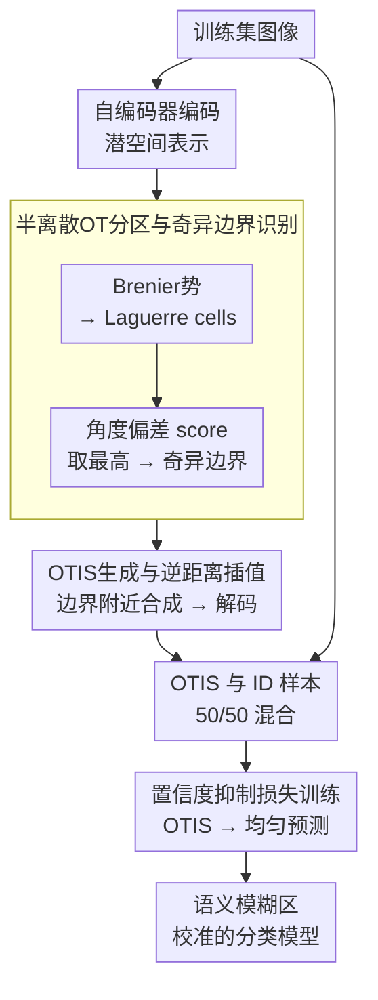

# Optimal Transport-Induced Samples against Out-of-Distribution Overconfidence

**会议**: ICLR 2026  
**arXiv**: [2601.21320](https://arxiv.org/abs/2601.21320)  
**代码**: 无  
**领域**: LLM评测  
**关键词**: optimal transport, OOD overconfidence, singularity boundaries, confidence calibration, OTIS

## 一句话总结

利用半离散最优传输（OT）的几何奇异边界定位语义模糊区域，在其附近生成代理OOD样本（OTIS），训练时通过置信度抑制损失迫使模型在结构性不确定区域给出均匀预测，从而系统性地缓解DNN的OOD过度自信问题。

## 研究背景与动机

**领域现状**：深度神经网络在闭集分类任务上取得了巨大成功，但在开放世界部署时，面对分布外（OOD）输入往往会产生高置信度的错误预测。现有缓解策略主要分两类：一是测试时OOD检测（如基于MSP、ODIN等置信度分数过滤），二是训练时暴露代理OOD样本以抑制过度自信。

**现有痛点**：测试时检测方法只是"治标"——过滤掉高置信度错误，但并未改变模型本身产生过度自信预测的倾向。训练时方法虽更主动，但代理OOD样本的构造通常依赖启发式规则（如外部数据集、输入腐蚀、类别混合、潜空间异常值合成），缺乏理论基础，难以精准覆盖语义模糊区域——恰恰是过度自信最容易发生的地方。

**核心矛盾**：现有代理OOD样本的生成与模型真正容易犯错的决策边界区域之间存在脱节。启发式方法生成的样本可能散落在特征空间的各处，而非聚焦于分类器行为最不可靠的结构性不稳定区域。

**本文目标** (1) 如何在理论上识别那些分类器最容易过度自信的区域？(2) 如何基于理论指导生成真正位于语义边界附近的代理OOD样本？(3) 如何有效利用这些样本进行训练正则化？

**切入角度**：作者从半离散最优传输（OT）的几何理论出发，发现OT映射的奇异边界——即传输方向发生突变的非光滑点——天然对应于语义模糊区域。在这些区域附近，分类器的决策行为最不稳定，过度自信最容易发生。

**核心 idea**：通过求解半离散OT问题获得潜空间的Laguerre分区，在传输方向变化最剧烈的奇异边界附近插值生成语义模糊样本（OTIS），用于训练时的置信度抑制。

## 方法详解

### 整体框架

这篇论文想解决的是：分类器在语义模糊的输入上往往给出高置信度的错误预测，而以往的代理OOD样本生成靠启发式规则，散落在特征空间各处，恰恰盖不准最容易出错的边界区域。作者的思路是把"哪里最容易过度自信"这个问题，转化成半离散最优传输（OT）里的几何奇异点定位问题。

整条pipeline分三步走：先用自编码器把训练样本压到一个紧凑的潜空间；再在潜空间里求解半离散OT，找出传输方向突变最剧烈的奇异边界，并在那附近插值生成代理OOD样本（OTIS）；最后把OTIS和正常训练数据按比例混合，用一个置信度抑制损失训练分类器。输入是训练集图像，输出是一个在语义模糊区域校准得更好的分类模型。

### 关键设计

**1. 潜空间表示：把OT计算搬到低维做**

直接在原始高维输入空间上求解OT既不现实也不规整，所以第一步先用一个自编码器把问题降维。编码器 $y = Enc(x)$ 把每个训练样本映射成潜向量，解码器 $x' = Dec(y)$ 负责把潜空间的点还原回输入空间。所有训练样本的潜向量集合 $\{y_i\}$ 就构成了后面OT问题里离散目标测度的支撑点。潜空间结构紧凑、规整，既让OT计算变得可行，也为后续在边界附近做插值提供了平滑的几何基础。

**2. 半离散OT分区与奇异边界识别：用角度偏差找出传输方向突变的地方**

这一步是全文理论核心。给定一个连续的源分布 $\mu$（如高斯）和离散目标 $\{y_i\}$，求解Brenier势函数

$$u_{\mathbf{h}}(z) = \max_i \{\langle y_i, z \rangle + h_i\}$$

它的梯度就是最优传输映射，把源分布"搬运"到各个目标点上。这个势函数会把潜空间切成一组凸区域，即Laguerre cells，每个cell对应一个目标点 $y_i$。具体求解时，用Monte Carlo采样估计每个cell的体积，再用梯度下降优化偏移量 $\mathbf{h}$，让各cell的体积匹配目标权重。

关键在于怎么挑出"奇异"的边界。对每对相邻cell之间的边界 $\mathcal{S}_{ij}$，计算两侧目标向量的角度偏差分数

$$\text{score}(\mathcal{S}_{ij}) = \arccos\left(\frac{\langle y_i, y_j \rangle}{\|y_i\| \|y_j\|}\right)$$

只保留分数最高的那批边界，构成奇异边界集合 $\mathcal{S}'$。角度偏差大，意味着传输方向在这里发生了剧烈转折，对应OT映射的不连续点（奇异性）。而这些几何上最不稳定的地方，在分类语义上恰好是最模糊的——落在这里的输入往往同时带有多个类别的特征，正是模型最容易过度自信的区域。这就把"哪里容易犯错"从启发式猜测变成了一个有理论依据的几何判据。

**3. OTIS生成与逆距离插值：在奇异边界附近平滑地造样本**

锁定奇异边界后，就在它附近合成代理OOD样本。对每个选定的边界 $\mathcal{S}_{ij}$，先用Monte Carlo估计相邻两个Laguerre cell的质心 $\hat{c}_i, \hat{c}_j$，然后从源分布采样一个潜空间点 $z \sim \mu$，按到两个质心的距离做逆距离插值，权重为

$$\lambda_i = \frac{1/\|z - \hat{c}_i\|}{1/\|z - \hat{c}_i\| + 1/\|z - \hat{c}_j\|}$$

得到插值后的潜向量 $\hat{y} = \lambda_i T(\hat{c}_i) + \lambda_j T(\hat{c}_j)$，最后解码成输入空间样本 $\hat{x} = Dec(\hat{y})$。之所以用逆距离插值而不是直接取边界上的离散点，是因为它给OT映射在奇异边界附近提供了一个平滑的扩展，避开了离散跳变带来的伪影，生成的样本既语义连贯，又天然落在两个类别的过渡地带——正是想要的"模糊但合理"的OOD。

### 损失函数 / 训练策略

训练时每个batch由50% ID样本和50% OTIS组成。ID样本走标准交叉熵损失；OTIS则用置信度抑制损失

$$\mathcal{L}_{\text{sup}}(\hat{x}) = \sum_{i=1}^{K} \frac{1}{K} \log V_i(\hat{x})$$

其中 $V_i(\hat{x})$ 是类别 $i$ 的softmax概率。这个损失鼓励模型在OTIS上输出接近均匀分布的预测，也就是给出"我不确定"的响应，从而在结构性模糊的区域主动压住过度自信，而不是靠测试时再去过滤。

## 实验关键数据

### 主实验

在CIFAR-10/100、SVHN、MNIST、FMNIST作为ID数据集，多种自然/对抗/噪声数据作为OOD输入的设置下，对比了8种方法。核心指标为OOD最大最大置信度（OOD MMC↓，越低越好）和ID最大最大置信度（ID MMC↑，越高越好）。

| ID数据集 | OOD数据集 | 本文(Ours) | CEDA | ACET | CCUs | CODES | VOS |
|----------|----------|-----------|------|------|------|-------|-----|
| CIFAR-10 | SVHN | **13.18%** | 71.62% | 82.16% | 72.48% | 72.35% | 73.16% |
| CIFAR-10 | CIFAR-100 | **64.79%** | 80.18% | 82.36% | 75.95% | 74.69% | 81.04% |
| CIFAR-10 | Uniform | **10.00%** | 10.04% | 10.00% | 10.00% | 11.13% | 80.65% |
| CIFAR-10 | Adv. Noise | **26.42%** | 43.04% | 10.00% | 10.00% | 37.66% | 95.56% |
| CIFAR-100 | SVHN | **9.30%** | 63.03% | 62.85% | 65.49% | 66.11% | 58.76% |
| SVHN | CIFAR-10 | **61.37%** | 73.70% | 62.54% | 46.92% | 61.09% | 71.39% |

本文方法在绝大多数ID/OOD组合上显著降低了OOD MMC，同时保持了与基线相当的ID精度和ID MMC。

### 消融实验

| 配置 | CIFAR-10 TE | CIFAR-10 OOD MMC (SVHN) | 说明 |
|------|-------------|-------------------------|------|
| 无正则化（Baseline） | 5.79% | 84.22% | 无任何OOD暴露 |
| OE（外部数据辅助） | 6.80% | 55.82% | 需要额外OOD数据 |
| CCUd（外部数据辅助） | 5.55% | 76.52% | 需要额外OOD数据 |
| **Ours（无外部数据）** | **7.52%** | **13.18%** | 不需任何外部数据 |

### 关键发现

- **OTIS在不需要外部数据的方法中遥遥领先**：在SVHN→CIFAR-10等经典设置上，OOD MMC从84%直接降至13%，降幅超过70个百分点
- **对对抗性样本也有效**：在Adversarial Noise和Adversarial Samples上，本文方法的OOD MMC也显著低于大多数竞品
- **ID精度损失可控**：测试错误率仅小幅增加（如CIFAR-10从5.79%到7.52%），说明OT引导的正则化没有过度干扰ID学习
- **跨数据集泛化良好**：在MNIST、FMNIST等截然不同的数据集上也展现一致优势

## 亮点与洞察

- **OT奇异性与语义模糊的理论对应关系**：这是全文最核心的洞察——首次建立了半离散OT的几何奇异点与分类器过度自信区域之间的理论联系，为启发式OOD样本生成提供了有原则的替代方案
- **无需外部数据即可生成高质量代理OOD**：与OE等需要额外数据集的方法不同，OTIS完全从训练数据自身的几何结构导出，更适合数据受限场景
- **逆距离插值的平滑传输扩展**：优雅地解决了OT映射在奇异边界处的不连续性问题，同时保持了生成样本的语义连贯性

## 局限与展望

- **计算开销**：需要先训练自编码器，再求解OT问题，再生成OTIS，整个pipeline较复杂；对于大规模数据集的可扩展性有待验证
- **潜空间维度的影响**：自编码器的潜空间维度和质量直接影响OT分区的有效性，但文中对此敏感性分析不够充分
- **仅限分类任务**：当前框架针对多分类问题设计，如何扩展到回归、分割等其他任务类型尚不清楚
- **奇异边界筛选的比例超参**：保留多大比例的高分边界是一个需要调优的超参数，选择不当可能影响生成样本的质量

## 相关工作与启发

- **vs OE (Outlier Exposure)**：OE依赖外部OOD数据集，样本选择缺乏原则性指导；本文从训练数据自身的OT几何中导出代理OOD，无需外部数据且理论依据更强
- **vs VOS (Virtual Outlier Synthesis)**：VOS在潜空间中采样异常值作为代理OOD，但不考虑其与分类边界的关系；OTIS精确定位在语义模糊的传输奇异边界附近，针对性更强
- **vs CEDA/ACET**：这些方法通过输入腐蚀构造代理OOD，生成的样本可能远离实际的语义边界；OTIS利用OT的几何结构直接在类别过渡区域生成样本

## 评分

- 新颖性: ⭐⭐⭐⭐⭐ 将最优传输理论中的奇异边界概念引入OOD过度自信缓解，视角独特且有严格理论支撑
- 实验充分度: ⭐⭐⭐⭐ 覆盖了6个ID数据集和多种OOD类型，但缺少大规模数据集（如ImageNet）的验证
- 写作质量: ⭐⭐⭐⭐ 数学推导清晰严谨，但pipeline描述较复杂，读者需要较强的OT背景知识
- 价值: ⭐⭐⭐⭐ 为OOD过度自信问题提供了有原则的解决思路，但计算复杂度可能限制实际应用

<!-- RELATED:START -->

## 相关论文

- [\[CVPR 2026\] Bypassing the Transport Plan: Dynamic Reweighting for Out-of-Distribution Detection with Optimal Transport](../../CVPR2026/ai_safety/bypassing_the_transport_plan_dynamic_reweighting_for_out-of-distribution_detecti.md)
- [\[ICLR 2026\] AP-OOD: Attention Pooling for Out-of-Distribution Detection](ap-ood_attention_pooling_for_out-of-distribution_detection.md)
- [\[ICML 2026\] Optimal Transport under Group Fairness Constraints](../../ICML2026/ai_safety/optimal_transport_under_group_fairness_constraints.md)
- [\[CVPR 2026\] SubFLOT: Submodel Extraction for Efficient and Personalized Federated Learning via Optimal Transport](../../CVPR2026/ai_safety/subflot_submodel_extraction_for_efficient_and_personalized_federated_learning_vi.md)
- [\[ICLR 2026\] Dataless Weight Disentanglement in Task Arithmetic via Kronecker-Factored Approximate Curvature](dataless_weight_disentanglement_in_task_arithmetic_via_kronecker-factored_approx.md)

<!-- RELATED:END -->
