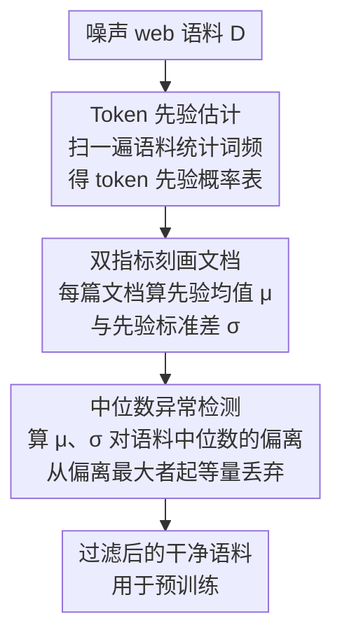

# Prior-based Noisy Text Data Filtering: Fast and Strong Alternative for Perplexity

**会议**: ICLR 2026  
**arXiv**: [2509.18577](https://arxiv.org/abs/2509.18577)  
**代码**: [GitHub](https://github.com/ybseo-ac/prior_filter)  
**领域**: 多语言翻译  
**关键词**: 数据过滤, 预训练, 困惑度, 词频先验, 数据质量

## 一句话总结

提出基于 token 先验（词频统计）的文本数据过滤方法，利用文档内 token 先验的均值和标准差作为 PPL 的近似替代，在 20 个下游基准上取得最高平均性能，同时比 PPL 过滤快 1000 倍以上。

## 研究背景与动机

### 预训练数据质量的重要性

大语言模型依赖海量 web 数据预训练，但 web 数据噪声极多。两大挑战：(1) 数据量巨大需要高效筛选以节省计算资源；(2) 噪声数据会损害模型性能。

### PPL 过滤的局限

基于困惑度 (PPL) 的过滤目前是 SOTA 方法，但有两个固有缺陷：

- **时间成本**：需先训练参考模型（137M），再对整个语料推理 PPL。对 6B token 语料需要 216 GPU 小时
- **可靠性问题**：模型对 OOD 样本（如噪声数据）的 PPL 估计不准，小模型尤其容易对重复或模式化噪声给出低 PPL（误认为高质量）

### 语言学启发

论文灵感来自 8 世纪语言学家 Al-Kindi 的密码分析方法：**分析词频可以揭示语言结构**。

两个关键语言学洞察：
1. **词频是词角色的一维表示**：高频词 = 功能词（"the", "is"），低频词 = 内容词（"president", "algorithm"）
2. **规范句子具有稳定的词汇密度**：功能词和内容词的比例在不同文档中保持相对稳定

## 方法详解

### 整体框架

整个方法把 PPL 过滤里"训练参考模型 + 全量推理"的重活全部砍掉，只保留一张词频表。核心观察是 PPL 可经贝叶斯分解为 likelihood 与 prior 两项，而 prior 项完全由 token 词频决定、无需任何模型推理；于是论文用文档内 token 先验的均值和标准差直接逼近 PPL，再以"偏离语料中位数最远"为准则丢弃异常文档，把过滤成本从数百 GPU 小时压到不到一小时。落到流程上只有三步：先扫一遍语料把 token 先验估计成一张词频表，再用先验均值、标准差两个指标刻画每篇文档，最后做中位数异常检测、丢掉偏离语料典型值最远的文档；而把 μ、σ 两个统计量和 PPL 对应起来的，是贯穿全程的 PPL 近似理论联系。

### 关键设计

**1. Token 先验估计：用词频把 prior 项变成一次性查表**

PPL 过滤慢的根源在于它要为每个 token 算条件概率，必须跑模型前向。论文先把语料层面的 token 先验一次性统计出来：给定语料 $D$ 和词表 $V$，token $x$ 的先验概率取其归一化词频 $p_{\text{prior}}(x) = f_D(x) / \sum_{x' \in V} f_D(x')$，其中 $f_D(x)$ 是 $x$ 在语料中的出现次数。这张表只需扫一遍语料即可得到，之后所有文档打分都退化为查表求和，彻底避开了模型推理。语言学上它也有据可依——词频本身就是 token 角色的一维表示，高频对应 "the/is" 这类功能词，低频对应 "president/algorithm" 这类内容词。

**2. 双指标刻画文档：均值看组成，标准差看结构**

单看词频无法判断一篇文档是否规范，论文为每个文档 $\texttt{d}$ 同时算两个统计量。先验均值 $\mu_{\texttt{d}} = \mathbb{E}_{x_i \in \texttt{d}}[\log p_{\text{prior}}(x_i)]$ 反映文档里高/低先验 token 的平衡程度，捕捉 token 的整体组成；先验标准差 $\sigma_{\texttt{d}} = \text{std}_{x_i \in \texttt{d}}[p_{\text{prior}}(x_i)]$ 反映先验在文档内的分布结构，即用词的多样性与均匀性。两者互补：$\mu_{\texttt{d}}$ 异常的多是极端高/低先验堆积的文档（如换行符灌水、非英语文本），$\sigma_{\texttt{d}}$ 异常的多是"有内容词却没句法"的名词罗列，单一指标都漏掉一类噪声。

**3. 中位数异常检测：把"远离规范"量化成可丢弃的距离**

规范句子的词汇密度在不同文档间相对稳定，因此偏离语料典型值越远越可疑。论文取语料级中位数作参考中心 $M_\mu = \text{median}(\mu_{\texttt{d}})$、$M_\sigma = \text{median}(\sigma_{\texttt{d}})$，用绝对偏离 $\delta_\mu(\texttt{d}) = |\mu_{\texttt{d}} - M_\mu|$、$\delta_\sigma(\texttt{d}) = |\sigma_{\texttt{d}} - M_\sigma|$ 度量异常程度，从 $\delta$ 最大的样本开始丢弃，并约束两个指标各自剔除等量 $|F_\mu| = |F_\sigma|$，直到剩余子集达到目标规模。用中位数而非均值作中心，是为了让参考点本身不被极端噪声拉偏。

**4. PPL 近似的理论联系：解释为何两个统计量就够**

把 PPL 按贝叶斯展开，$\log \text{PPL}(\texttt{d}) \propto \underbrace{\sum_i \log p_\theta(x_{<i}\mid x_i)}_{\pi_{\text{likelihood}}} + \underbrace{\sum_i \log p_\theta(x_i)}_{\pi_{\text{prior}}}$，其中 $\mu_{\texttt{d}}$ 恰好精确等价于 $\pi_{\text{prior}}$ 项，而 $\sigma_{\texttt{d}}$ 近似捕捉 $\pi_{\text{likelihood}}$ 所反映的 token 间关系规律性，两者合起来就是 PPL 的合理代理。更关键的是先验在几处甚至比 PPL 更可靠：小模型难以学准 likelihood、对 OOD 噪声的 likelihood 估计也不靠谱，常把重复/模式化噪声误判成高质量文本，而词频统计简单稳定、不受这些失真影响——这正是先验过滤平均性能反超 PPL 的原因。

## 实验关键数据

### 主实验：Dolma 语料上的下游任务性能

GPT-2 架构，1.5B 和 137M 模型，训练 40K 步（约 6B tokens），20 个下游基准。

| 方法 | 类型 | 时间 | 平均 | 世界知识 | 常识推理 | 语言理解 | 符号推理 | 阅读理解 |
|------|------|------|------|----------|----------|----------|----------|----------|
| No-filter | 规则 | - | 5.78 | 5.52 | 0.44 | 6.14 | 13.22 | 3.59 |
| FastText | 分类器 | 3.6h | 7.09 | 6.71 | 6.11 | 6.89 | 11.93 | 3.82 |
| DSIR | n-gram | 4h | 7.56 | 7.03 | 6.84 | 7.31 | 12.67 | 3.97 |
| PPL-based | 模型 | **216 GPU h** | 8.22 | 9.98 | 11.91 | 7.34 | 7.91 | 3.96 |
| **Prior-based** | 统计 | **0.25h** | **9.20** | 9.53 | 11.27 | **10.31** | 11.13 | 3.79 |

**关键结论**：先验过滤以 PPL 的 0.1% 时间成本取得了比 PPL 更高的平均性能（9.20 vs 8.22）。

### 符号语言实验：Pile-github

| 方法 | 时间 | 平均 | CS | Dyck | 运算 | 初等数学 | GSM | SVAMP |
|------|------|------|-----|------|------|----------|-----|-------|
| No-filter | - | 9.51 | 35.75 | 12.30 | 5.71 | 1.15 | 0.15 | 2.00 |
| PPL-based | 224 GPU h | 11.21 | 37.42 | 20.60 | 7.14 | 2.09 | 0.00 | 0.00 |
| **Prior-based** | 0.26h | **12.03** | 38.86 | 21.30 | **9.04** | 1.17 | 0.15 | 1.67 |

先验方法在代码/数学等符号语言上同样优于 PPL 过滤。

### 消融实验

**大规模一致性验证**（3B Qwen2.5-3B 和 1.5B 模型，12B tokens 训练）：先验过滤持续优于 PPL 过滤。

**子采样效率**：仅用语料 1% 的子集计算 token 先验，过滤结果与全量几乎一致（耗时从 30 分钟降至约 70 秒）。

**PPL 重叠分析**：当过滤比例 $e=0.10$ 时，$F_\mu$ 与 $F_{\text{ppl}}$ 的重叠率接近 50%，证实先验过滤确实近似 PPL 过滤。

### 关键发现

1. **PPL 在符号推理上最差**：PPL 会过滤掉小但有意义的代码/数学片段
2. **$\mu_{\texttt{d}}$ 异常值**多为极端高/低先验 token 的文档（换行符堆积、非英语文本）
3. **$\sigma_{\texttt{d}}$ 异常值**多为无结构的名词列表——有内容词但缺乏句法
4. **多语言自适应**：当中文数据占英文语料 <1% 时被自动过滤为噪声，>20% 时被识别为可学习语言

## 亮点与洞察

1. **极简思想的胜利**：仅用词频统计就超越了需要模型训练和推理的 PPL 方法
2. **语言学基础扎实**：从 Al-Kindi 的密码分析到词汇密度理论，每一步都有语言学支撑
3. **速度优势悬殊**：0.25 小时 vs 216 GPU 小时（提速 ~1000×），且持续增长的 web 数据加剧差距
4. **自适应多语言处理**：无需人工指定参考数据集，自动根据语言占比判断过滤/保留
5. **双指标互补**：$\mu_{\texttt{d}}$ 捕捉 token 组成，$\sigma_{\texttt{d}}$ 捕捉分布结构，覆盖不同类型噪声

## 局限性

1. 方法基于语言学特性，不适用于非文本模态（图像、音频等）
2. 先验过滤是 PPL 的近似，在捕捉"表面规范但语义无意义"的噪声方面弱于 PPL
3. 实验主体使用 GPT-2 架构，更现代架构（Llama 等）的验证有限
4. 对于极度偏重某种特定数据类型的训练目标（如纯数学），可能需要手动调整

## 相关工作与启发

- **Ankner et al. 2024 (PPL 过滤)**：本文直接对标的主要基线，证明先验比 PPL 更好更快
- **DSIR (Xie et al. 2023)**：需要手动指定参考数据集，先验过滤自动完成
- **FastText 分类器**：需要人工标注的参考数据，先验过滤完全无监督
- **启发**：数据过滤不需要复杂的模型推理，回归统计学基础可能是更好的选择

## 评分

- **新颖性**: ⭐⭐⭐⭐☆ — 思路极其简洁优雅，从语言学基础出发
- **理论深度**: ⭐⭐⭐⭐ — PPL 近似的贝叶斯分解分析透彻
- **实验充分度**: ⭐⭐⭐⭐ — 20 个基准 + 符号语言 + 大规模验证 + 多语言分析
- **实用价值**: ⭐⭐⭐⭐⭐ — 1000× 加速且性能更好，直接可用于工业数据管线
- **总评**: ⭐⭐⭐⭐☆ — 简单有效的方法论贡献，对预训练数据筛选有重大实用价值

<!-- RELATED:START -->

## 相关论文

- [\[CVPR 2025\] Data-free Universal Adversarial Perturbation with Pseudo-Semantic Prior](../../CVPR2025/ai_safety/data-free_universal_adversarial_perturbation_with_pseudo-semantic_prior.md)
- [\[CVPR 2025\] Joint Out-of-Distribution Filtering and Data Discovery Active Learning](../../CVPR2025/ai_safety/joint_out-of-distribution_filtering_and_data_discovery_active_learning.md)
- [\[AAAI 2026\] Alternative Fairness and Accuracy Optimization in Criminal Justice](../../AAAI2026/ai_safety/alternative_fairness_and_accuracy_optimization_in_criminal_j.md)
- [\[AAAI 2026\] An Information Theoretic Evaluation Metric for Strong Unlearning](../../AAAI2026/ai_safety/an_information_theoretic_evaluation_metric_for_strong_unlearning.md)
- [\[CVPR 2026\] Mitigating Error Amplification in Fast Adversarial Training](../../CVPR2026/ai_safety/mitigating_error_amplification_in_fast_adversarial_training.md)

<!-- RELATED:END -->
