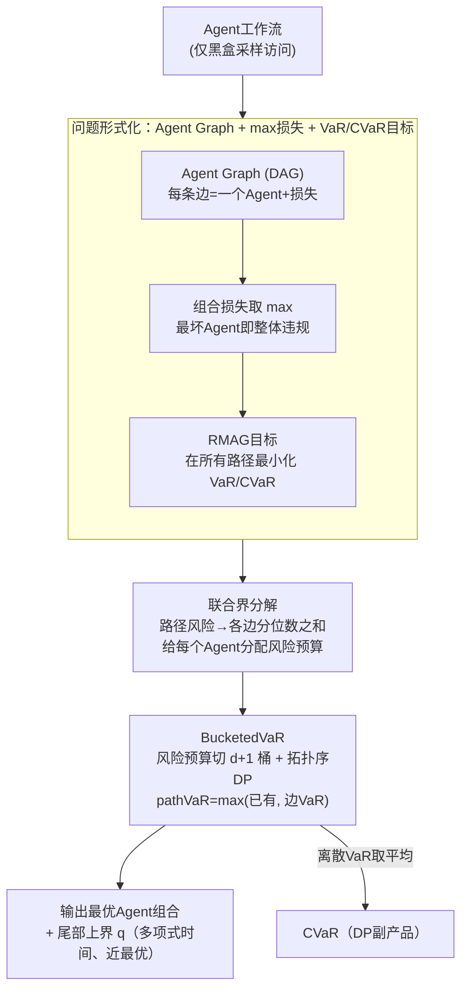

# Risk-Sensitive Agent Compositions

**会议**: ICLR 2026  
**arXiv**: [2506.04632](https://arxiv.org/abs/2506.04632)  
**代码**: 无  
**领域**: AI安全/Agent系统  
**关键词**: 风险敏感, Agent组合, VaR, CVaR, 动态规划

## 一句话总结

将Agent工作流形式化为有向无环图（Agent Graph），以max损失函数建模安全/公平/隐私需求，提出BucketedVaR算法通过联合界+动态规划在多项式时间内找到最小化VaR/CVaR的最优Agent组合，并证明在独立损失假设下渐近近最优。

## 研究背景与动机

**Agent组合的普及**：现代Agent系统将复杂任务分解为子任务序列，选择专门的AI Agent（LLM、VLM、RL策略）依次执行。典型应用包括软件开发自动化、信息检索、机器人长时域控制等。

**风险最小化的必要性**：实际部署不仅要最大化任务成功率，更需要最小化安全、公平、隐私等需求的违规。这些违规的关键特征是**尾部行为**——低概率但高后果事件。

**max损失 vs 累积损失**：当损失衡量的是需求违规（而非成本），组合Agent的总损失应是各Agent损失的**最大值**（一个Agent严重违规就意味着整体违规），而非传统MDP中的**累积和**。这与已有风险敏感规划文献形成根本区别。

**组合爆炸问题**：Agent图中的可行路径数可能随Agent数指数增长，对每条路径逐一估计VaR的朴素方法在计算上不可行。

**风险度量选择**：VaR（Value-at-Risk）可控制尾部分位数，CVaR（Conditional Value-at-Risk）可衡量尾部期望损失。两者都比期望损失更能捕捉极端事件。

**黑盒Agent假设**：仅假设对Agent有采样访问权（不需要知道内部结构），通过蒙特卡洛采样估计风险度量——适用于任意类型的Agent（RL策略、LLM等）。

## 方法详解

### 整体框架

整个方法把Agent工作流抽象成一张有向无环图，每条可行路径对应一种Agent组合，目标是在所有路径里挑出尾部风险（VaR/CVaR）最小的那一条。核心障碍是路径数量随Agent数指数爆炸、无法逐条估计风险：作者先把"需求违规"形式化为对各Agent损失取 max、再以VaR/CVaR盯住尾部分布，然后用一个联合界把"整条路径的风险"拆成"各边分位数之和"，从而能给每个Agent分配风险预算；接着把预算做桶离散化、按拓扑序跑动态规划，在多项式时间里选出最优组合，并给出渐近近最优的理论保证。

### 关键设计

**1. 问题形式化：用 Agent Graph + max 损失盯住"最坏Agent"的尾部风险**

传统组合MDP把各步成本累加，但安全/公平/隐私这类需求违规的逻辑是"一个Agent严重越界，整体就算违规"，累加会稀释掉这种尾部信号。为此作者把工作流建模成DAG $G = (V, E, X, T, F, L, s, t, \mathcal{D}_s)$：每条边 $e \in E$ 绑定一个Agent $f_e$、轨迹集 $T_e$ 和损失函数 $L_e: T_e \to \mathbb{R}$，源点 $s$ 带初始输入分布 $\mathcal{D}_s$，终点 $t$ 是目标，一条路径 $p = v_1 \xrightarrow{e_1} \cdots \xrightarrow{e_m} v_{m+1}$ 就是一种Agent组合。组合损失取各步的最大值而非求和：

$$L_p(t_1, \ldots, t_m) = \max_i \{L_{e_i}(t_i)\}$$

由于只有采样访问权、Agent当黑盒看待，目标便是在给定风险水平 $\alpha \in (0,1)$ 下、用蒙特卡洛在所有路径上最小化尾部风险（RMAG 问题）：

$$\arg\min_{p \in \mathcal{P}} \rho[L_p(Z_p)], \quad \rho \in \{\text{VaR}_\alpha, \text{CVaR}_\alpha\}$$

其中 $\text{VaR}_\alpha$ 取 $(1-\alpha)$-分位数，控制"以 $1-\alpha$ 概率不超过的损失上界"，$\text{CVaR}_\alpha$ 取尾部条件期望、衡量"一旦进入最坏 $\alpha$ 区间平均会有多糟"：

$$\text{VaR}_\alpha[L(Z)] = \inf\{q \in \mathbb{R}: \Pr[L(Z) \leq q] \geq 1-\alpha\}$$

$$\text{CVaR}_\alpha[L(Z)] = \frac{1}{\alpha}\int_0^\alpha \text{VaR}_\gamma[L(Z)]\,d\gamma$$

这条max定义把问题从累积成本优化彻底改写成最坏情形优化，而VaR/CVaR相比期望损失都能捕捉低概率高后果的极端事件，正对应安全关键场景的真实诉求——也正是后面所有理论工具需要重做的根源。

**2. 联合界分解：把指数级的路径风险拆成可独立估计的逐边分位数**

直接对每条路径估计VaR需要遍历指数条路径，不可行。作者注意到对max损失有联合界 $\Pr[\max(R_1,\dots,R_m) > q] \leq \sum_i \Pr[R_i > q]$，于是只要给每个Agent分配一份"风险预算"、让各边各自超界的概率之和不超过 $\alpha$，就能保证整条路径越界概率受控。这把"联合估计一条路径"降维成"分别估计每条边的分位数"，是整个算法能做动态规划的前提。

**3. BucketedVaR：风险预算桶离散化 + 拓扑序动态规划**

要在图上做DP，连续的风险预算必须离散。作者把总预算 $\alpha$ 切成 $d+1$ 个桶 $B = \{0, \alpha/d, 2\alpha/d, \ldots, \alpha\}$，然后按拓扑序遍历，对每个"顶点–桶"对 $(v, \bar{\alpha})$ 维护到达 $v$ 且累计预算为 $\bar{\alpha}$ 时的最优部分路径。扩展一条边时，把增量预算 $\bar{\alpha} - \alpha'$ 分给这条边，用该边样本的经验 $(1-(\bar{\alpha}-\alpha'))$-分位数作为边VaR估计，再因为组合损失取max而把路径VaR更新为 $\text{pathVaR} = \max(\text{VaR}[v', \alpha'], \text{edgeVaR})$。CVaR几乎免费：它等于对一串离散VaR取平均 $\text{CVaR}_\alpha \approx \frac{1}{d}\sum_{k=1}^d \text{VaR}_{k\alpha/d}$，直接复用DP里已经算好的VaR值即可，无需额外采样。

**4. 理论保证：多项式复杂度下的近最优性**

Theorem 1 给出时间复杂度 $O(n(d+1)^2|V|^2)$，且以概率 $\geq 1-\delta$ 输出的 $q$ 是一个有效的尾部上界：

$$q \geq \text{quantile}(L_p(Z_p), 1-\alpha-\gamma), \quad \gamma = |V|\sqrt{\frac{1}{2n}\ln\frac{2(d+1)^2|V|^2}{\delta}}$$

更关键的是 Theorem 2 的近最优性：在各Agent损失独立的假设下，当样本数 $n$ 和桶数 $d \to \infty$，结果不会比真正最优路径 $p^*$ 差太多——

$$q \leq \text{quantile}\left(L_{p^*}(Z_{p^*}), 1-\alpha+\frac{\alpha^2}{2}\right)$$

即看似粗糙的联合界带来的次优性至多只有 $\alpha^2/2$（当 $\alpha=0.1$ 时仅 $0.005$），这正是该方法"简单却够用"的理论底气。

## 实验关键数据

### 表1: BucketedVaR vs 最优基线的近似精度

| 基准环境 | 风险水平 $\alpha$ | VaR分位数误差(%) | CVaR误差(%) | 最优路径一致 |
|---------|-----------------|----------------|------------|------------|
| DroneNav | 0.1 | < 2 | < 2 | ✓ |
| 16-Rooms | 0.1 | < 3 | < 2 | ✓ |
| Fetch | 0.05 | < 2 | < 2 | ✓ |
| BoxRelay | 0.1 | < 2 | < 3 | ✓ |

### 表2: 鲁棒性——损失相关性对近似质量的影响

| 相关系数 $\rho$ | 路径长度=4 覆盖率 | 路径长度=8 覆盖率 | 路径长度=16 覆盖率 |
|----------------|-----------------|-----------------|------------------|
| 0.0 (独立) | ~0.90 | ~0.90 | ~0.90 |
| 0.25 | ~0.91 | ~0.92 | ~0.93 |
| 0.5 | ~0.92 | ~0.94 | ~0.95 |
| 0.75 | ~0.95 | ~0.97 | ~0.98 |
| 1.0 (完全相关) | ~0.99 | ~0.99 | ~0.99 |

## 关键发现

1. **联合界在实践中紧致**：BucketedVaR对VaR和CVaR的估计与穷举最优基线的差异不超过几个百分点，证实了联合界方法在实际中的有效性。

2. **非平凡风险预算分配**：算法学到的最优分配不均匀——16-Rooms中8个Agent的VaR₀.₁预算分配为 $16\bar\alpha, 0\bar\alpha, 10\bar\alpha, 23\bar\alpha, 19\bar\alpha, 11\bar\alpha, 7\bar\alpha, 14\bar\alpha$，反映了不同子任务风险水平的差异。

3. **对合理相关性鲁棒**：即使损失之间存在中等相关性（$\rho \leq 0.5$），算法仍能产生合理的风险估计，仅在完全相关（$\rho=1$）时显著恶化。

4. **多Agent可扩展**：从8个Agent扩展到40个Agent（$8 \times 5$），VaR近似精度始终保持在目标分位数附近，验证了理论的可扩展性。

5. **采样和桶数的收敛**：样本量从500增至10⁴、桶数从5增至100，经验分位数均稳定收敛至 $\sim 0.91$（目标 $0.90$），收敛速度快。

## 亮点与洞察

- **max损失的创新建模**：安全/公平/隐私违规以"最坏Agent"为准，用max而非sum建模损失。这是对传统累积损失MDP风险优化的根本革新，需要完全不同的理论工具。
- **联合界的精巧利用**：看似粗糙的union bound在分位数估计上渐近精确（次优性仅 $\alpha^2/2$），体现了"简单方法的意外力量"。
- **Agent Graph形式化的通用性**：统一涵盖RL策略组合、LLM信息检索管道等多种Agent工作流，将Agent组合优化从"试错"升级为有理论保证的图搜索。
- **CVaR作为VaR副产品**：通过对已计算的离散VaR取平均即可恢复CVaR，无需额外采样。

## 局限性

- **独立损失假设**：理论保证依赖各Agent损失独立。当Agent共享环境状态时（如前一Agent的输出影响后一Agent的安全性），独立性可能被破坏。虽然实验表明对中等相关性仍鲁棒，但缺乏非独立情况的理论保证。
- **损失函数设计**：对RL控制环境可自然定义损失（如距障碍物距离），但对LLM Agent的幻觉/偏见等属性，损失函数的定义依赖LLM-as-Judge等代理方法，可能昂贵且有噪声。
- **实验规模**：仅在RL控制基准上验证（最多40个Agent），未在大规模LLM Agent系统上实测。
- **静态组合**：当前只选择固定路径，未考虑根据运行时观测动态切换Agent的可能性。

## 相关工作对比

| 维度 | 本文 (BucketedVaR) | 传统风险敏感MDP (Ahmadi 2021等) | 层次化RL (Jothimurugan 2021) |
|------|-------------------|-----------------------------|---------------------------|
| 损失类型 | max（需求违规） | 累积和（成本） | 期望奖励 |
| 风险度量 | VaR / CVaR | CVaR / EVaR | 无（期望优化） |
| Agent模型 | 黑盒采样 | MDP内部结构 | 可训练策略 |
| 优化目标 | 路径选择 | 策略优化 | 策略学习 |
| 可扩展性 | 多项式（对Agent数） | 单Agent | 单Agent分层 |

与 **AFlow (Zhang 2025a)** 等自动化Agent工作流生成方法相比，本文关注的不是工作流结构设计，而是在给定工作流结构下如何选择最优Agent组合以最小化风险——两者互补。

## 评分

- **新颖性**: ⭐⭐⭐⭐ max损失+Agent Graph的风险最小化形式化填补理论空白
- **实验充分度**: ⭐⭐⭐ 理论严谨但实验规模偏小，缺少LLM Agent实验
- **写作质量**: ⭐⭐⭐⭐ 形式化定义清晰，示例（DroneNav/信息检索）直观
- **实用价值**: ⭐⭐⭐⭐ 对安全关键Agent部署有坚实的理论指导意义

<!-- RELATED:START -->

## 相关论文

- [\[ICLR 2026\] Sample-Efficient Distributionally Robust Multi-Agent Reinforcement Learning via Online Interaction](sample-efficient_distributionally_robust_multi-agent_reinforcement_learning_via_.md)
- [\[CVPR 2026\] Reinforcement-Guided Synthetic Data Generation for Privacy-Sensitive Identity Recognition](../../CVPR2026/ai_safety/reinforcement-guided_synthetic_data_generation_for_privacy-sensitive_identity_re.md)
- [\[ICML 2026\] Position: Beyond Sensitive Attributes, ML Fairness Should Quantify Structural Injustice via Social Determinants](../../ICML2026/ai_safety/position_beyond_sensitive_attributes_ml_fairness_should_quantify_structural_inju.md)
- [\[CVPR 2026\] Roots Beneath the Cut: Uncovering the Risk of Concept Revival in Pruning-Based Unlearning for Diffusion Models](../../CVPR2026/ai_safety/roots_beneath_the_cut_uncovering_the_risk_of_concept_revival_in_pruning-based_un.md)
- [\[ICML 2025\] Convex Markov Games: A New Frontier for Multi-Agent Reinforcement Learning](../../ICML2025/ai_safety/convex_markov_games_a_new_frontier_for_multi-agent_reinforcement_learning.md)

<!-- RELATED:END -->
