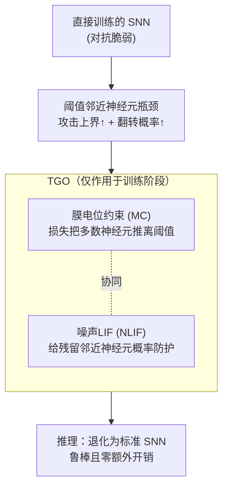

# Robust Spiking Neural Networks Against Adversarial Attacks

**会议**: ICLR2026  
**arXiv**: [2602.20548](https://arxiv.org/abs/2602.20548)  
**代码**: 待确认  
**领域**: AI安全  
**关键词**: 脉冲神经网络, 对抗鲁棒性, 膜电位优化, 阈值邻近神经元, 噪声LIF模型

## 一句话总结
从理论上证明阈值邻近脉冲神经元是直接训练SNN对抗鲁棒性的关键瓶颈（它们既设定了对抗攻击强度的理论上界，又最容易发生状态翻转），并提出Threshold Guarding Optimization (TGO) 方法——通过膜电位约束+噪声LIF神经元双管齐下，在多种对抗攻击场景下取得SOTA鲁棒性，且推理阶段零额外开销。

## 研究背景与动机

**领域现状**：脉冲神经网络 (SNN) 凭借事件驱动机制和生物可信的脉冲传递，成为节能型神经形态计算的重要范式。基于代理梯度的直接训练方法（如STBP/BPTT）已使SNN在分类任务上逼近ANN性能。

**现有痛点**：直接训练的SNN继承了ANN的对抗脆弱性——精心设计的微小扰动即可导致分类错误。现有防御方法如对抗训练 (AT)、正则化对抗训练 (RAT) 带来额外训练开销且可移植性有限。

**核心矛盾**：已有针对SNN的鲁棒性优化（如梯度稀疏正则化SR、进化泄漏因子FEEL-SNN等）仅在与AT/RAT结合时才有显著效果，且缺乏对SNN鲁棒性瓶颈的统一理论分析。

**本文目标** 找到直接训练SNN对抗脆弱性的根本原因，并设计无需额外推理开销的防御方法。

**切入角度**：从脉冲神经元的膜电位动态出发，发现阈值邻近神经元同时放大了梯度攻击路径上界和状态翻转概率。

**核心 idea**：将膜电位推离阈值 + 引入噪声脉冲机制 → 降低对抗攻击理论上界 + 减小状态翻转概率。

## 方法详解

### 整体框架

本文先做一层理论拆解：把直接训练SNN的对抗脆弱性归因到"阈值邻近神经元"这一小撮膜电位刚好停在发放阈值附近的神经元，证明它们同时撑大了攻击强度上界、又最容易被扰动翻转。顺着这个结论，作者提出Threshold Guarding Optimization (TGO)，从训练损失和神经元模型两个层面同时下手——用膜电位约束 (MC) 把大部分神经元推离阈值，用噪声LIF (NLIF) 给仍停在阈值附近的神经元加一层概率防护，二者协同作用、且都只作用于训练阶段，推理时退化为标准SNN，不带来任何额外开销。

### 关键设计

**1. 阈值邻近神经元的双重脆弱性：定位SNN鲁棒性瓶颈**

为什么直接训练的SNN这么脆，作者把矛头指向膜电位落在阈值附近的神经元，并从两个角度证明它们是瓶颈。其一是攻击强度上界：对抗攻击的最大潜在强度 $\mathcal{R}_{\text{adv}}(f,x,\epsilon)$ 与模型Jacobian的 $\ell_2$ 范数正相关，而代理梯度恰好在阈值附近取峰值，所以阈值邻近神经元越多，$\|J_f(x)\|_2^2$ 越大，对抗扰动强度的理论上界就被抬得越高。其二是状态翻转：定理1证明当高斯噪声 $\eta[t]\sim\mathcal{N}(0,\sigma^2)$ 作用于膜电位时，翻转概率 $P_{\text{flip}}$ 随膜电位靠近阈值而单调递增；定理2进一步说明阈值邻近神经元越多，扰动球 $B_\epsilon(x)$ 内可触达的激活区域数 $K$ 越大，鲁棒性上界越松。两条结论指向同一个干预点——只要把膜电位推离阈值，就能同时压低攻击上界和翻转概率，这正是后面两个组件的设计依据。

**2. 膜电位约束 (MC)：用损失把膜电位推离阈值**

针对"阈值邻近神经元太多"这个直接病根，MC在每层脉冲神经元的损失里加一项铰链式惩罚，凡是膜电位落进阈值 $V_{\text{th}}$ 的 $\delta$ 邻域就要付出代价：

$$\mathcal{C}(V(t)_l) = \frac{1}{TN}\sum_{i=1}^{n}\max\bigl(0,\ \delta - |V(t)_i - V_{\text{th}}|\bigr)$$

它不动网络结构，只在训练时把神经元的膜电位分布往两侧"挤"，从分布层面减少阈值邻近神经元的数量，从而直接削弱脆弱性1和2的成因。实测TGO优化后阈值邻近神经元减少约40%，与理论假设吻合。

**3. 噪声LIF神经元 (NLIF)：给残留的阈值邻近神经元加概率防护**

MC不可能把所有神经元都推走——训练中总有一批关键神经元仍需停在阈值附近，对这部分，NLIF在膜电位里注入高斯白噪声 $\xi[t]$，把确定性发放改成概率性发放。这看似是给系统加噪、反而更不稳，但理论推导给出反直觉的结论：当膜电位接近阈值（$z^2<1$）时，翻转概率关于噪声标准差 $\sigma$ 单调递减，也就是适当加大噪声反而能降低这些神经元的翻转敏感度。于是MC负责"清场"、NLIF负责"补防"，二者互补而非各自为政，共同把翻转概率压下来。

### 损失函数 / 训练策略

总损失把分类损失和逐层膜电位约束以拉格朗日形式合并：$\mathcal{L}(\mathbf{x},\lambda) = \mathcal{L}_{\text{oss}}(\mathbf{x}) + \lambda \sum_l \mathcal{C}(V(t)_l)$。权重 $\lambda$ 不取固定值，而是按余弦退火从小到大调整——前期小值放开探索、避免一上来就把膜电位锁死导致难收敛，后期大值强化约束、把神经元稳稳推离阈值。其上限 $\lambda_{\max}$ 是鲁棒性-准确率权衡的主旋钮（WRN-16 取 0.4，VGG-11 取 0.6，越大越鲁棒但 Clean 准确率越低）；邻域宽度 $\delta$ 控制惩罚触发范围；NLIF 的噪声标准差 $\sigma$ 需在鲁棒性提升与训练稳定性间平衡。所有SNN统一用 $T=4$ 个时间步仿真。

## 实验关键数据

### 主实验：CIFAR-10 WRN-16 多攻击对比

| 训练策略 | 方法 | Clean | FGSM | RFGSM | PGD10 | PGD20 | PGD40 |
|---------|------|-------|------|-------|-------|-------|-------|
| BPTT | Vanilla | 93.32 | 14.05 | 31.21 | 0.00 | 0.00 | 0.00 |
| BPTT | **TGO** | 88.79 | **51.40** | **71.38** | **6.14** | 1.52 | 0.45 |
| AT | AT | 91.32 | 39.14 | 74.31 | 17.45 | 14.41 | 12.93 |
| AT | **TGO** | 88.16 | **63.03** | **79.69** | **35.01** | **24.76** | **20.11** |
| RAT | RAT | 91.44 | 42.02 | 75.89 | 19.81 | 16.24 | 14.18 |
| RAT | **TGO** | 87.33 | **69.16** | **79.28** | **47.69** | **38.07** | **33.13** |

### 消融实验：CIFAR-100 VGG-11 各组件贡献

| MC | NLIF | Clean (BPTT) | FGSM (BPTT) | Clean (RAT) | FGSM (RAT) | PGD40 (RAT) |
|----|------|-------------|-------------|-------------|-------------|-------------|
| ✗ | ✗ | 71.4 | 5.9 | 67.8 | 20.9 | 6.9 |
| ✓ | ✗ | 64.3 | 17.1 (+11.2) | 61.4 | 26.2 (+5.3) | 6.2 |
| ✗ | ✓ | 70.6 | 8.1 (+2.1) | 68.1 | 25.2 (+4.3) | 9.1 (+2.2) |
| ✓ | ✓ | 66.9 | **21.5 (+15.5)** | 63.3 | **33.8 (+13.0)** | **9.3 (+2.4)** |

### 高级攻击：MTPGD & APGD (CIFAR-100 WRN-16)

| 方法 | MTPGD-7 | MTPGD-40 | APGD-7 | APGD-40 |
|------|---------|----------|--------|---------|
| AT | 10.01 | 3.92 | 9.34 | 3.62 |
| SR+AT | 16.88 | 7.33 | 14.48 | 7.20 |
| **TGO+AT(EoT)** | **21.23** | **7.40** | **18.93** | **7.53** |

- TGO将阈值邻近神经元数量减少约40%，验证了理论假设
- 损失景观分析显示TGO优化后的SNN梯度轨迹更平滑，有效规避局部最优陷阱

## 亮点与洞察
- **理论驱动设计**：不是盲目套用ANN防御方法，而是从SNN的脉冲机制出发识别鲁棒性瓶颈，再有针对性地设计防御组件
- **推理零开销**：MC仅影响训练损失，NLIF噪声可在推理时移除（训练时的概率化已使权重分布更鲁棒），推理阶段与标准SNN相同
- **高兼容性**：TGO可与BPTT/AT/RAT任意组合，在所有组合下均带来显著提升
- **阈值邻近神经元减少40%**：可视化直观验证了理论分析的正确性

## 局限与展望
- **Clean准确率下降3-5%**：推离阈值的约束不可避免地牺牲了部分正常分类性能，存在鲁棒性-准确率权衡
- **仅验证图像分类**：未在目标检测、语义分割等下游任务上验证通用性
- **噪声标准差 $\sigma$ 的选取**：文中未充分讨论如何为不同架构和数据集自动确定最优 $\sigma$
- **自适应攻击评估有限**：虽然测试了APGD和EoT，但未采用AutoAttack等更完整的自适应攻击套件
- **改进方向**：可探索逐层自适应 $\delta$ 和 $\sigma$，或结合知识蒸馏缓解Clean准确率损失

## 相关工作与启发
- **vs SR (梯度稀疏正则化)**：SR直接约束梯度稀疏性，TGO从根源（膜电位分布）出发，间接实现更强的梯度稀疏效果。实验中TGO在所有攻击场景下均优于SR
- **vs FEEL-SNN (进化泄漏因子)**：FEEL-SNN通过随机膜电位衰减增强鲁棒性，但仅在AT协同下有效；TGO即使在BPTT策略下也能大幅提升FGSM鲁棒性（+37%）
- **vs ANN对抗训练**：AT/RAT从ANN迁移而来，未考虑SNN的脉冲特性；TGO利用脉冲机制的特殊性设计防御，与AT/RAT形成补充关系

## 评分
- 新颖性: ⭐⭐⭐⭐ 从阈值邻近神经元角度建立SNN鲁棒性瓶颈理论，视角独到
- 实验充分度: ⭐⭐⭐⭐ 多架构×多攻击×多训练策略，消融完整，但缺少AutoAttack评估
- 写作质量: ⭐⭐⭐⭐ 理论推导严谨，方法动机清晰，图示直观
- 价值: ⭐⭐⭐⭐ 为SNN安全部署提供了理论基础和实用工具，推理零开销是重要优势

<!-- RELATED:START -->

## 相关论文

- [\[CVPR 2026\] Towards Reliable Evaluation of Adversarial Robustness for Spiking Neural Networks](../../CVPR2026/ai_safety/towards_reliable_evaluation_of_adversarial_robustness_for_spiking_neural_network.md)
- [\[AAAI 2026\] MPD-SGR: Robust Spiking Neural Networks with Membrane Potential Distribution-Driven Surrogate Gradient Regularization](../../AAAI2026/ai_safety/mpd-sgr_robust_spiking_neural_networks_with_membrane_potential_distribution-driv.md)
- [\[ICLR 2026\] Time Is All It Takes: Spike-Retiming Attacks on Event-Driven Spiking Neural Networks](time_is_all_it_takes_spike-retiming_attacks_on_event-driven_spiking_neural_netwo.md)
- [\[ICML 2026\] Frequency Matching in Spiking Neural Networks for mmWave Sensing](../../ICML2026/ai_safety/frequency_matching_in_spiking_neural_networks_for_mmwave_sensing.md)
- [\[AAAI 2026\] Yours or Mine? Overwriting Attacks Against Neural Audio Watermarking](../../AAAI2026/ai_safety/yours_or_mine_overwriting_attacks_against_neural_audio_watermarking.md)

<!-- RELATED:END -->
