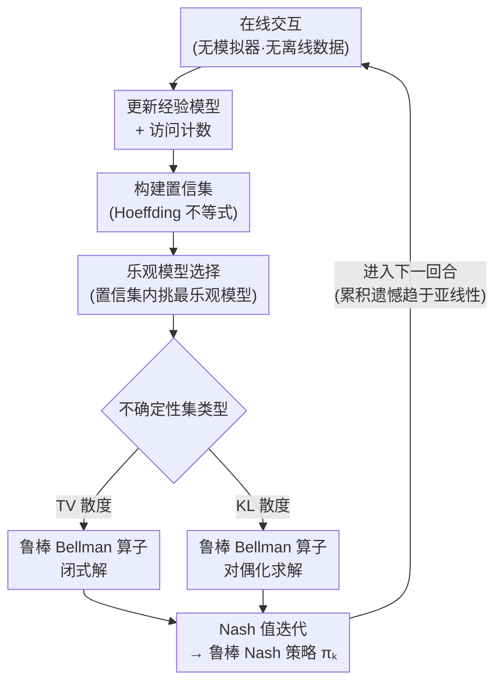

# Sample-Efficient Distributionally Robust Multi-Agent Reinforcement Learning via Online Interaction

**会议**: ICLR 2026  
**arXiv**: [2508.02948](https://arxiv.org/abs/2508.02948)  
**代码**: 无  
**领域**: AI安全 / 多智能体强化学习  
**关键词**: Distributionally Robust, Multi-Agent RL, Markov Games, online learning, Regret Bounds

## 一句话总结

本文首次研究了分布鲁棒马尔可夫博弈（DRMGs）的在线学习问题，提出 MORNAVI 算法，在无需模拟器或离线数据的情况下，通过在线交互高效学习最优鲁棒策略，并提供了 TV 散度和 KL 散度不确定性集下的首个可证明遗憾界。

## 研究背景与动机

多智能体系统在实际部署中面临一个根本性挑战：**训练环境与部署环境之间的模型失配（model mismatch）**。这种失配可能来自环境噪声、状态转移不确定性、甚至对抗性攻击。在训练中表现优异的多智能体策略，面对这些不确定性时可能灾难性地失败。

分布鲁棒马尔可夫博弈（Distributionally Robust Markov Games, DRMGs）通过优化**最坏情况性能**来增强系统鲁棒性——即在一组定义好的环境不确定性集合上，寻找使所有智能体都能获得最优鲁棒博弈均衡（robust Nash equilibrium）的策略。

然而，现有 DRMGs 的研究方法存在严重局限：

**依赖模拟器**: 大量方法假设能反复查询环境模型（即拥有生成式模拟器），这在真实系统中往往不可得

**依赖离线数据集**: 另一些方法需要预先收集的大规模离线经验数据，但在新环境中这些数据不存在

**缺乏在线学习保证**: 没有方法对"智能体直接与环境交互并实时学习鲁棒策略"的场景提供理论保证

总结来说，DRMGs 的在线学习（online learning）——即智能体在没有任何先验数据的情况下，通过直接与环境交互来学习鲁棒策略——是一个完全未被探索的问题。

## 方法详解

### 整体框架

MORNAVI（Multiplayer Optimistic Robust Nash Value Iteration）面向在线 DRMGs，让智能体在没有模拟器、没有离线数据的情况下边交互边学鲁棒策略。它的骨架是 Nash 值迭代，但在每一步叠加了两件事：用置信集做"乐观探索"去补足信息不足的状态-动作对，再在不确定性集里做"鲁棒评估"取最坏情况值，从而同时压低遗憾和守住最坏情况下限。整个算法按回合循环运行——每回合先与真实环境交互收集转移和奖励，更新经验模型与访问计数，据此构建置信集；接着在置信集里挑最乐观的模型推动探索，对该模型在不确定性集（TV 或 KL 散度球）内算最坏情况鲁棒 Bellman 值，最后做 Nash 值迭代得到本回合的鲁棒策略，再进入下一回合，把累积遗憾逐步压成亚线性。

### 关键设计

**1. 在线 DRMGs 形式化：把"边做边学鲁棒策略"变成一个可优化的遗憾目标**

以往 DRMGs 要么假设有生成式模拟器可反复查询，要么依赖预收集的离线数据，这两者在一个全新环境里都不存在，智能体只能"边做边学"。本文据此把问题摆成在线交互框架：智能体在每个回合直接与真实环境交互，观察状态转移、收集奖励，优化目标是最小化累积遗憾 $\text{Regret}(K) = \sum_{k=1}^{K} [V^* - V^{\pi_k}]$，其中 $V^*$ 是最优鲁棒 Nash 均衡值、$V^{\pi_k}$ 是第 $k$ 回合策略的值。遗憾这个度量把"在线策略离最优鲁棒策略有多远"量化成一条可以求亚线性界的曲线，也正是这套形式化让后面的乐观-鲁棒分析有了可证明的落点。

**2. 乐观鲁棒值迭代：用乐观补探索、用最坏情况补鲁棒，两个维度互不打架**

在线学习的核心矛盾是探索-利用平衡，而鲁棒优化又天然偏悲观，直接把两者拼在一起容易互相抵消。MORNAVI 的做法是让它们各管一个维度。它先维护对环境转移概率的经验估计，并基于经验访问次数和 Hoeffding 型不等式构建置信集，量化估计本身的不确定性；探索维度上，它在置信集里挑**最乐观**的模型来优化策略，从而把智能体往信息不足的状态-动作对上推；鲁棒维度上，对每个候选模型再在不确定性集（TV 或 KL 散度球）内算**最坏情况**值函数。关键在于乐观作用于"模型估计误差"、鲁棒作用于"部署时的模型偏移"，是两个正交的不确定性来源，所以既拿到低遗憾的高效探索，又保住最坏情况保护，不会自相矛盾。

**3. TV 与 KL 不确定性集的统一处理：同一框架两套内层优化，兼顾易解与灵活**

不同应用适合不同的不确定性度量：TV 散度衡量两分布间的最大概率差异、适合建模有界的模型偏移，更易优化但可能偏保守；KL 散度衡量信息论意义上的分布距离、适合建模乘性噪声，更灵活但需要更精细的分析。两者的鲁棒 Bellman 算子计算结构不同，MORNAVI 为此分别设计内层优化——TV 不确定性集下内层有闭式解，KL 不确定性集下则用对偶化方法把约束最优问题转成可高效求解的对偶形式。提供两种选择，让框架能在"好解"和"建模更一般"之间按需取舍，也使遗憾界能在两类常用度量下都成立。

## 实验关键数据

### 理论结果

本文的核心贡献是理论保证而非实验。

| 不确定性集 | 遗憾界 | 说明 |
|-----------|--------|------|
| TV 散度 | $\tilde{O}(\text{poly}(S,A,H) \cdot \sqrt{K})$ | 首个多智能体鲁棒在线学习遗憾界 |
| KL 散度 | $\tilde{O}(\text{poly}(S,A,H) \cdot \sqrt{K})$ | KL 不确定性集下的首个结果 |

其中 $S$ 是状态空间大小，$A$ 是动作空间大小，$H$ 是回合长度，$K$ 是总回合数。$\sqrt{K}$ 的遗憾增长率意味着平均遗憾趋近于零，即算法最终会收敛到最优鲁棒策略。

### 核心理论贡献

| 结果 | 意义 |
|------|------|
| 首个在线 DRMGs 的可证明遗憾界 | 开辟了新的研究方向 |
| TV 散度下的高效算法 | TV 的鲁棒 Bellman 算子有闭式解 |
| KL 散度下的高效算法 | 通过对偶化处理更一般的不确定性集 |
| 多人博弈的鲁棒均衡 | 不限于两人零和，适用于一般和博弈 |

### 关键发现

1. **在线鲁棒学习是可行的**: 不需要模拟器或离线数据，仅通过在线交互就能以亚线性遗憾率学习最优鲁棒策略
2. **乐观主义原则对鲁棒优化有效**: 看似矛盾（乐观 vs. 鲁棒/悲观），但乐观主义作用于探索维度，鲁棒性作用于模型不确定性维度，两者互不冲突
3. **TV 和 KL 不确定性集的不同特性**: TV 散度下的问题结构更好（闭式解），KL 散度下需要更精细的分析但提供更灵活的建模

## 亮点与洞察

- **开创性问题定义**: 首次将 DRMGs 的在线学习问题正式化并提供解决方案，填补了理论空白
- **理论严谨性**: 提供了完整的遗憾界证明，包括上界分析和关键引理
- **实际意义**: 真实世界的多智能体部署（无人机编队、自动驾驶车队、机器人协作等）本质上就是在线学习场景，本方法提供了理论基础
- **统一框架**: 同时处理 TV 和 KL 两种主流不确定性度量，增强了通用性

## 局限与展望

1. **表格式方法**: MORNAVI 基于表格式 MDP（有限状态-动作空间），对连续或高维空间的扩展（函数逼近）是重要的未来方向
2. **计算复杂度**: 每步需要在不确定性集上求解内层鲁棒优化，对大规模问题的计算效率需优化
3. **遗憾界的紧致性**: 当前的 $\tilde{O}(\sqrt{K})$ 遗憾界在多项式因子上可能未达到最优（minimax optimal），lower bound 的建立是开放问题
4. **有限玩家假设**: 理论分析假设有限数量的对称或不对称玩家，超大规模多智能体场景（如群体博弈）需要额外考量
5. **不确定性集的选择**: TV 和 KL 散度球的半径（即不确定性程度）是预先指定的超参数，自适应选择缺乏理论指导
6. **缺乏实验验证**: 作为理论工作，缺少实验评估。即使是在表格式环境中的数值验证也会增强说服力

## 相关工作与启发

- **与单智能体鲁棒 RL 的关系**: Robust MDP 的在线学习已有初步研究（如 robust UCRL），MORNAVI 将其推广到多智能体博弈设置，复杂度大幅增加——需同时处理多个智能体的策略耦合和鲁棒性
- **与非鲁棒 MARL 在线学习的关系**: 标准 Markov Games 的在线学习（如 Nash-VI）已有丰富理论，本文在此基础上引入分布鲁棒层，形成"双层优化"结构
- **与 distributionally robust optimization (DRO) 的关系**: DRO 在监督学习中广泛研究，本文将其与多智能体在线学习结合，是一个自然但新颖的交叉
- **对自动驾驶等安全关键应用的启发**: 在安全关键的多智能体系统中（如自动驾驶车辆间的博弈），鲁棒性是刚需。本文的理论框架为设计可部署的安全 MARL 算法提供了基础

## 评分
- 新颖性: ⭐⭐⭐⭐⭐
- 实验充分度: ⭐⭐⭐
- 写作质量: ⭐⭐⭐⭐
- 价值: ⭐⭐⭐⭐

<!-- RELATED:START -->

## 相关论文

- [\[CVPR 2026\] SEBA: Sample-Efficient Black-Box Attacks on Visual Reinforcement Learning](../../CVPR2026/ai_safety/seba_sample-efficient_black-box_attacks_on_visual_reinforcement_learning.md)
- [\[ICML 2025\] Convex Markov Games: A New Frontier for Multi-Agent Reinforcement Learning](../../ICML2025/ai_safety/convex_markov_games_a_new_frontier_for_multi-agent_reinforcement_learning.md)
- [\[ICLR 2026\] Risk-Sensitive Agent Compositions](risk-sensitive_agent_compositions.md)
- [\[ICLR 2026\] Beware Untrusted Simulators -- Reward-Free Backdoor Attacks in Reinforcement Learning](beware_untrusted_simulators_--_reward-free_backdoor_attacks_in_reinforcement_lea.md)
- [\[ICLR 2026\] Toward Enhancing Representation Learning in Federated Multi-Task Settings](toward_enhancing_representation_learning_in_federated_multi-task_settings.md)

<!-- RELATED:END -->
