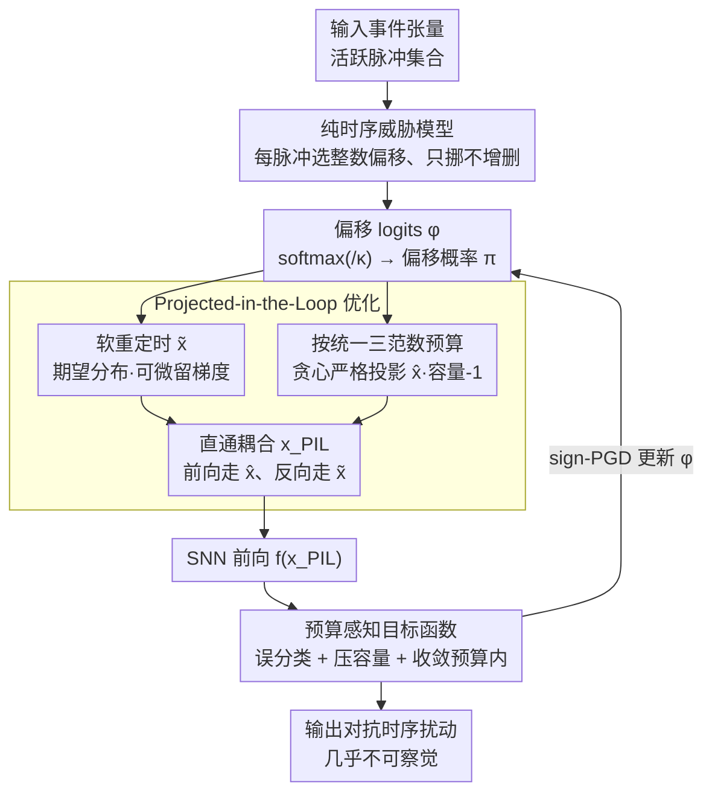

# Time Is All It Takes: Spike-Retiming Attacks on Event-Driven Spiking Neural Networks

**会议**: ICLR 2026  
**arXiv**: [2602.03284](https://arxiv.org/abs/2602.03284)  
**代码**: [github.com/yuyi-sd/Spike-Retiming-Attacks](https://github.com/yuyi-sd/Spike-Retiming-Attacks)  
**领域**: 脉冲神经网络对抗安全  
**关键词**: 脉冲神经网络, 对抗攻击, 时序重定时, 事件驱动, 时间鲁棒性, LIF神经元

## 一句话总结
提出Spike-Retiming Attack——一种仅改变脉冲时间戳而不增删脉冲的时序攻击方法，形式化了容量-1约束下的统一三范数预算（$\mathcal{B}_\infty$局部抖动/$\mathcal{B}_1$总延迟/$\mathcal{B}_0$篡改数），通过Projected-in-the-Loop (PIL)优化在前向严格投影、反向软微分间解耦，在CIFAR10-DVS/DVS-Gesture/N-MNIST上以<2%脉冲扰动达到>90% ASR，揭示事件驱动SNN存在严重的时序脆弱性。

## 研究背景与动机

**SNN的时序计算特性**：脉冲神经网络(SNN)依赖离散脉冲和时序编码进行计算，在神经形态处理器上具有低能耗和低延迟优势。直接训练的SNN通过时空反向传播(STBP)+代理梯度已接近ANN水平精度，时序信息在其计算中至关重要。

**现有攻击的视角盲区**：已有SNN对抗攻击(PGD、RGA、HART、SpikeFool、PDSG-SDA等)主要继承图像域策略——修改强度值或增删事件数量。这些攻击改变了能量/发放率统计特征，容易被基于强度或速率的检测手段识别。

**时序攻击的现实性**：事件相机天然存在时间戳噪声（抖动）和读出延迟，SNN流水线通常将事件量化到离散时间bin中。仅改变时间戳而保持脉冲计数和幅值不变的攻击，完全处于传感器时序不确定性范围内，不改变任何帧级强度或速率统计，极难被现有防御检测。

**防御的时序空白**：现有防御（认证鲁棒性、对抗训练、生物启发机制等）主要针对强度、速率或膜电位扰动进行正则化，几乎没有针对输入时序扰动的防御方案，存在明显的时序鲁棒性评估缺口。

**从增删到重分配的范式转变**：传统攻击在"添加/删除脉冲"的0-范数空间搜索，本文将攻击转化为时间轴上的"分配"问题——在保持各事件线容量-1约束的同时重分配脉冲时间戳，适用于二值和整数事件网格。

## 方法详解

### 整体框架

本文不再问"该往哪里增删脉冲"，而是问"已有的脉冲该挪到什么时间"——把对抗攻击重铸成时间轴上的重分配问题。整套流程是：先在纯时序威胁模型下，为每个活跃脉冲引入一组偏移 logits 并软化成偏移概率 $\pi$；据此分出两条路——前向按概率把脉冲严格投影回满足容量约束与范数预算的离散事件网格（真实可行的攻击），反向则换用期望意义下的软重定时结果回传梯度；两条路经直通耦合后送进 SNN 算分类损失，再由预算感知目标函数驱动 sign-PGD 迭代更新 logits。如此在离散可行性与梯度优化之间解耦，最终在三种范数预算下都能搜出几乎不被察觉的时序扰动。

### 关键设计

**1. 纯时序威胁模型：只挪时间、不增删脉冲，让扰动落进传感器噪声里**

攻击对象是输入事件张量 $\bm{x} \in \mathbb{Z}_{\geq 0}^{T \times C \times H \times W}$，攻击者对每个活跃脉冲 $(s, j) \in \mathcal{A}(\bm{x})$ 只能选一个整数偏移 $\delta_{s,j}$，把它从时间 $s$ 搬到 $t = s + \delta_{s,j}$，放置函数 $P(\bm{x}; \delta)$ 在新时间原样重播这个脉冲。之所以这么设计，是因为传统攻击改强度或增删事件会动到帧级能量与发放率统计，容易被基于强度/速率的检测识破；而纯时序重定时保持每个脉冲的计数和幅值完全不变，落在事件相机本就存在的时间戳抖动与读出延迟范围内，几乎没有可供防御抓取的统计痕迹。约束上要求 $0 \leq t < T$ 不越出时间线，并强制**容量-1非重叠**——每条事件线的每个时间 bin 至多容纳一个脉冲，这一约束既适用于二值网格，也通过把整数计数拆成一个个单位"数据包"(packet) 适配整数网格。

**2. 统一三范数预算：用一个框架同时表达三类隐蔽性偏好**

为了让攻击预算可调且语义清晰，本文把扰动强度统一刻画为三种范数预算。$\mathcal{B}_\infty(\varepsilon)$ 限制每个脉冲的最大抖动 $|\delta_{s,j}| \leq \varepsilon$，直接对应传感器时间戳的不确定性，偏好局部小幅重定时；$\mathcal{B}_1(\varepsilon)$ 限制总时序偏移量 $\sum |\delta_{s,j}| \leq \varepsilon$，给出一个会随事件密度自然缩放的全局旋钮；$\mathcal{B}_0(\varepsilon)$ 限制被篡改脉冲数 $\sum \mathbb{I}\{\delta_{s,j} \neq 0\} \leq \varepsilon$，刻画"只动极少数脉冲"的最小足迹攻击。三者覆盖了从局部抖动、全局平移到稀疏篡改的不同隐蔽性诉求，后续优化对它们采用统一的求解框架而只替换预算惩罚项。

**3. Projected-in-the-Loop (PIL) 优化：前向严投影保可行、反向软微分留梯度**

核心矛盾在于：可行解空间是离散的整数偏移、还带容量约束，但梯度搜索需要连续可微。PIL 用直通式估计同时拿到两边的好处。它先为每个活跃脉冲在可行偏移集 $\mathcal{U}_p$ 上引入一组偏移 logits，经温度 $\kappa$ 软化成概率 $\pi[s,j,u] = \text{softmax}(\phi[s,j,u]/\kappa)$；据此可算出一个完全可微的**软重定时结果** $\tilde{\bm{x}} = S_\pi(\bm{x})$（期望意义下的脉冲分布，负责回传时序对齐的梯度），以及一个**严格投影结果** $\hat{\bm{x}} = P^*(\bm{x}; \pi, \mathcal{B}_p(\varepsilon))$（前向按概率从高到低贪心放置脉冲，严格满足容量-1与预算约束）。两者通过 $\bm{x}_{\text{PIL}} = \hat{\bm{x}} + (\tilde{\bm{x}} - \text{stopgrad}(\tilde{\bm{x}}))$ 耦合：前向 stopgrad 抵消掉软项，网络实际看到的是严格可行的 $\hat{\bm{x}}$，反向梯度却只从 $\tilde{\bm{x}}$ 流过，于是评估用的是真实离散攻击、优化用的是平滑梯度，消融中去掉 PIL 会让二值 $\mathcal{B}_1$ 的 ASR 从 98.5% 跌到 84.3%，是贡献最大的组件。

**4. 预算感知目标函数：一个损失同时驱动误分类、压容量、收敛到预算内**

logits 的训练目标写成

$$\mathcal{J} = \mathcal{L}(f(\bm{x}_{\text{PIL}}), y) - \lambda_{\text{cap}} \cdot \text{Cap}(\pi; \bm{x}) - \lambda_{\text{budget}} \cdot \mathcal{R}_p(\pi; \varepsilon)$$

其中任务损失 $\mathcal{L}$ 取交叉熵并最大化它来实现非目标误分类；容量正则化 $\text{Cap} = \frac{1}{|\mathcal{A}|} \sum_{j,t} [\text{occ}[t,j] - 1]_+^2$ 惩罚期望占用超过 1 的时间 bin，把软分布提前推向容量可行区，减少前向贪心投影时的冲突；预算惩罚 $\mathcal{R}_p$ 是归一化铰链损失，引导 logits 收敛到对应范数预算内——$\mathcal{B}_\infty$ 因为支持集本身已编码上界而无需额外惩罚，$\mathcal{B}_1$ 与 $\mathcal{B}_0$ 则分别用软总偏移、软移动计数来约束，消融显示 $\mathcal{R}_p$ 对 $\mathcal{B}_1$ 影响最大。logits 本身用裁剪 sign-PGD 更新：$\phi \leftarrow \text{clip}_{[-\phi_{\max}, \phi_{\max}]}(\phi + \alpha \cdot \text{sign}(\nabla_\phi \mathcal{J}))$，默认超参为 $\kappa=1,\ \alpha=1,\ \phi_{\max}=10,\ \lambda_{\text{cap}}=20,\ \lambda_{\text{budget}}=10$。

## 实验结果

### 实验设置
- **数据集**：CIFAR10-DVS(10类)、DVS-Gesture(11类手势)、N-MNIST(手写数字)
- **模型**：ConvNet、Spiking ResNet18、VGGSNN、SpikingResformer，均为直接训练的SNN
- **时间bin**：$T=10$；评估指标为攻击成功率(ASR)

### 二值网格结果

| 数据集 | 模型 | 干净精度 | $\mathcal{B}_\infty(1)$ | $\mathcal{B}_\infty(3)$ | $\mathcal{B}_0$ 最大 |
|--------|------|---------|------------------------|------------------------|---------------------|
| N-MNIST | ConvNet | 99.06% | **100%** | 100% | 98.5% (400) |
| N-MNIST | ResNet18 | 99.62% | **100%** | 100% | 100% (300) |
| DVS-Gesture | VGGSNN | 95.14% | 96.4% | 100% | 98.9% (4k) |
| DVS-Gesture | SpResF | 91.67% | 92.1% | 100% | 99.2% (4k) |
| CIFAR10-DVS | SpResF | 81.30% | **100%** | 100% | 100% (4k) |

关键发现：$\mathcal{B}_\infty$ 下仅1-bin抖动即可使ASR接近饱和；$\mathcal{B}_0(4\text{k})$在DVS-Gesture仅触及2.45%的脉冲就达到>98% ASR。

### 整数网格结果

| 数据集 | 模型 | 干净精度 | $\mathcal{B}_\infty(1)$ | $\mathcal{B}_\infty(3)$ | $\mathcal{B}_0$ 最大 |
|--------|------|---------|------------------------|------------------------|---------------------|
| N-MNIST | VGGSNN | 99.71% | 46.3% | 100% | 49.8% (600) |
| DVS-Gesture | ResNet18 | 94.40% | 71.0% | 93.3% | 98.1% (8k) |
| DVS-Gesture | SpResF | 92.71% | 70.7% | 84.0% | 80.6% (8k) |
| CIFAR10-DVS | SpResF | 82.90% | **100%** | 100% | 100% (8k) |

关键发现：整数网格在 $\mathcal{B}_1$ 和 $\mathcal{B}_0$ 下一致性更鲁棒，需要更大预算才能达到相同ASR。原因包括：(1) 整数多重性使预激活分布更平滑；(2) 时序卷积和归一化对累积计数的积分更稳定；(3) 代理梯度和归一化统计在整数输入下波动更小。

### 消融实验（DVS-Gesture + VGGSNN）

| 变体 | 二值 $\mathcal{B}_\infty(1)$ | 二值 $\mathcal{B}_1(8k)$ | 二值 $\mathcal{B}_0(4k)$ | 整数 $\mathcal{B}_\infty(3)$ | 整数 $\mathcal{B}_0(8k)$ |
|------|------------|------------|------------|------------|------------|
| 完整方法 | 96.4% | 98.5% | 98.9% | 85.0% | 95.9% |
| 去掉PIL | 92.7% | 84.3% | 88.6% | 63.0% | 83.1% |
| 去掉Cap | 95.6% | 98.5% | 98.5% | 77.6% | 89.6% |
| 去掉$\mathcal{R}_p$ | — | 76.6% | 93.0% | — | 84.9% |

PIL贡献最大（二值$\mathcal{B}_1$: 98.5%→84.3%），预算惩罚$\mathcal{R}_p$对$\mathcal{B}_1$影响最显著。

## 亮点与创新

1. **首个纯时序威胁模型**：形式化了保持脉冲计数和幅值不变的时序攻击，统一支持三种范数预算($\mathcal{B}_\infty/\mathcal{B}_1/\mathcal{B}_0$)和二值/整数两种事件网格，填补了SNN时序鲁棒性评估空白。

2. **PIL优化框架的巧妙设计**：通过前向严格投影保证可行性+反向软微分保留梯度信息，配合容量正则化和预算感知惩罚，在离散约束优化中实现高效梯度引导搜索。

3. **隐蔽性极强**：攻击不改变帧级强度或速率统计，完全处于传感器时序不确定性范围内，DVS-Gesture上仅篡改<2.5%的脉冲即可攻破模型，现有防御（滤波、对抗训练）难以有效应对。

4. **发现时序偏移的极性模式**：正极性通道倾向延迟(red-shift)、负极性通道倾向提前(blue-shift)，揭示了SNN对正/负事件时序的不对称依赖。

## 局限性

1. **白盒假设**：当前攻击需要完整模型访问权限（参数和梯度），黑盒场景下的攻击能力受限，跨架构迁移性仍有提升空间。

2. **目标攻击成功率较低**：相比非目标攻击的>90% ASR，目标攻击ASR显著下降（$\mathcal{B}_\infty(1)$下仅约25%），需要更强的目标优化策略。

3. **对抗训练代价过高**：用时序重定时进行对抗训练会严重损害干净精度（二值网格降至22-48%），鲁棒性提升有限，说明当前防御框架不适应纯时序威胁。

4. **时间bin数增大时攻击力下降**：$T$从10增至40时，固定$\mathcal{B}_0$预算下二值网格ASR从98.9%降至13.3%，攻击效率与时间分辨率呈负相关。

5. **计算开销**：严格投影步骤需要排序和贪心扫描，在大规模事件流上的可扩展性未充分讨论。

## 相关工作

- **SNN训练**：STBP时空反向传播(Wu et al., 2018)、tdBN归一化(Zheng et al., 2021)、TET时序高效训练(Deng et al., 2022)、代理梯度改进(Li et al., 2021)
- **SNN对抗攻击**：RGA速率梯度近似(Bu et al., 2023)、HART混合速率时序攻击(Hao et al., 2024)、SpikeFool稀疏取整(Büchel et al., 2022)、GSAttack Gumbel-Softmax(Yao et al., 2024)、PDSG-SDA膜电位相关代理梯度+稀疏动态攻击(Lun et al., 2025)
- **SNN防御**：认证鲁棒性IBP/随机平滑(Mukhoty et al., 2024)、梯度稀疏性正则(Liu et al., 2024d)、膜电位扰动最小化(Ding et al., 2024a)、DVS噪声滤波(Marchisio et al., 2021b)

## 评分与推荐

| 维度 | 评分 |
|------|------|
| 新颖性 | ⭐⭐⭐⭐⭐ |
| 理论深度 | ⭐⭐⭐⭐ |
| 实验充分性 | ⭐⭐⭐⭐⭐ |
| 实用价值 | ⭐⭐⭐⭐ |
| 写作质量 | ⭐⭐⭐⭐ |

**总体推荐**: ⭐⭐⭐⭐⭐ — 开创性工作，首次系统化SNN时序鲁棒性评估，威胁模型形式化严格、实验全面（3数据集×4模型×3范数×2网格），PIL优化框架兼顾离散可行性和梯度优化，揭示了事件驱动SNN的根本性时序脆弱性。

<!-- RELATED:START -->

## 相关论文

- [\[ICLR 2026\] Robust Spiking Neural Networks Against Adversarial Attacks](robust_spiking_neural_networks_against_adversarial_attacks.md)
- [\[AAAI 2026\] MPD-SGR: Robust Spiking Neural Networks with Membrane Potential Distribution-Driven Surrogate Gradient Regularization](../../AAAI2026/ai_safety/mpd-sgr_robust_spiking_neural_networks_with_membrane_potential_distribution-driv.md)
- [\[CVPR 2026\] Towards Reliable Evaluation of Adversarial Robustness for Spiking Neural Networks](../../CVPR2026/ai_safety/towards_reliable_evaluation_of_adversarial_robustness_for_spiking_neural_network.md)
- [\[ICLR 2026\] ATEX-CF: Attack-Informed Counterfactual Explanations for Graph Neural Networks](atex-cf_attack-informed_counterfactual_explanations_for_graph_neural_networks.md)
- [\[ICML 2026\] Frequency Matching in Spiking Neural Networks for mmWave Sensing](../../ICML2026/ai_safety/frequency_matching_in_spiking_neural_networks_for_mmwave_sensing.md)

<!-- RELATED:END -->
