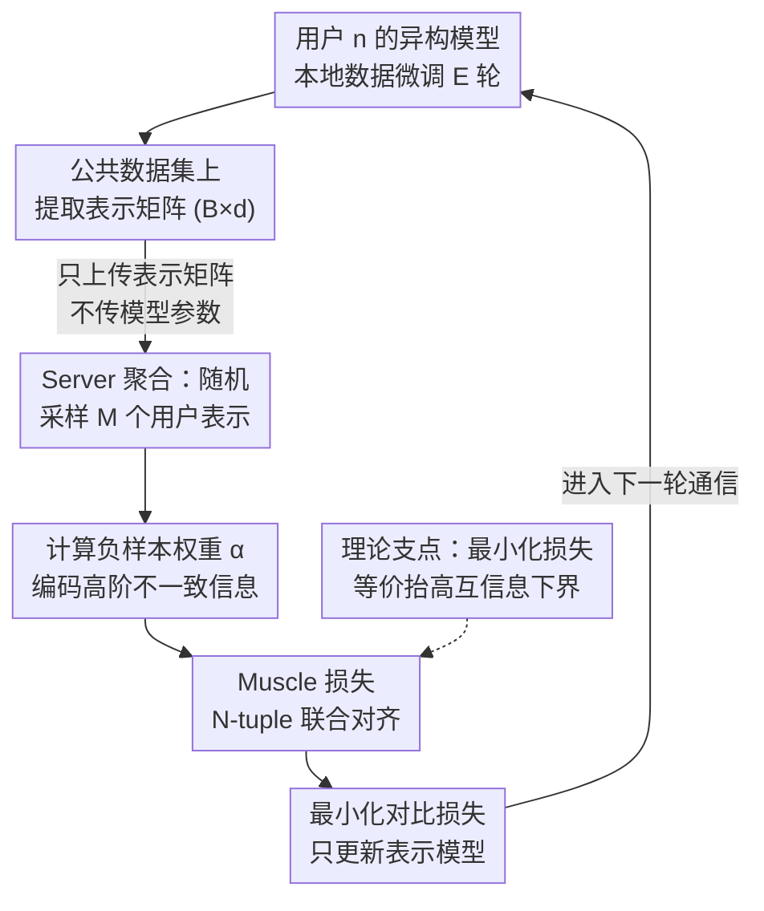

# Toward Enhancing Representation Learning in Federated Multi-Task Settings

**会议**: ICLR 2026  
**arXiv**: [2602.01626](https://arxiv.org/abs/2602.01626)  
**代码**: 有（补充材料提供）  
**机构**: Huawei Noah's Ark Lab, Montreal
**领域**: AI安全  
**关键词**: 联邦多任务学习, 对比学习, Muscle损失, 模型异构, 互信息最大化

## 一句话总结

提出Muscle损失——一种N-tuple级多模型对比学习目标函数，其最小化等价于最大化所有模型表示间互信息的下界；基于此设计FedMuscle算法，通过公共数据集对齐异构模型的表示空间，自然处理模型和任务异构性，在CV/NLP多任务设定下一致超越SOTA基线(Δ最高+28.65%)。

## 研究背景与动机

**领域现状**：联邦多任务学习(FMTL)让不同任务/模型的用户在不共享数据的前提下协作训练。随着基础模型(FM)的普及，用户可根据资源限制选择不同的预训练模型进行微调，模型和任务异构性成为常态。

**模型同构假设的局限**：现有FMTL方法(FeSTA, FedBone, FedHCA2, FedLPS等)假设用户使用完全或部分同构的模型架构(如共享编码器)，限制了用户自由选择模型的灵活性。

**Pairwise对齐的不足**：当超过两个模型时，现有方法将InfoNCE逐对应用于每对模型→$\mathcal{L}^n_{Pairwise} = \sum_{m \neq n} \mathcal{L}^{n,m}_{InfoNCE}$。这种分解只能捕捉二元依赖，无法有效建模N个模型表示间的联合依赖关系。

**知识蒸馏方法的限制**：FedDF、FCCL等基于KD的方法要求模型具有相同的logit维度，即模型必须关联相同的任务——无法处理跨任务异构。

**Gramian对比损失缺乏理论依据**：Cicchetti et al. (2025)提出的Gramian对比损失虽能同时对齐多个模型，但缺乏理论justification，且计算代价高(需要Gramian矩阵行列式，$(M+1)^3$倍更高计算量)。

**核心洞察**：共享模型参数的本质目的是建立共享表示空间→应直接学习共享表示空间，而非强制共享参数。通过N-tuple级对比学习+互信息最大化理论→可以系统性地实现这一目标。

## 方法详解

### 整体框架

FedMuscle 放弃了传统联邦学习"同步参数"的思路，转而让每个用户保留各自异构的模型，只在一个所有人都能访问的公共数据集上对齐彼此的表示空间。每轮通信中，用户先在本地数据上微调整个模型，再把公共数据上提取的表示矩阵发给 server；server 把来自其他用户的表示聚合后返回，用户据此最小化 Muscle 对比损失、只更新自己的表示模型。整套设计的理论支点是：最小化 Muscle 损失等价于最大化所有模型表示间互信息的下界，因而对齐表示空间就直接等价于跨模型的知识迁移。

### 关键设计

**1. Muscle 损失：把 pairwise 对齐升级为 N-tuple 联合对齐**

现有方法在超过两个模型时只能把 InfoNCE 逐对相加，即 $\mathcal{L}^n_{Pairwise} = \sum_{m \neq n} \mathcal{L}^{n,m}_{InfoNCE}$，这种分解只能捕捉二元依赖，无法刻画 $N$ 个模型表示间的联合依赖。Muscle 损失改为以单个模型表示 $\bm{z}_i^n$ 为 anchor，把所有模型对同一数据点 $i$ 的表示作为正样本，把"至少有一个模型对应到不同数据点"的所有组合作为负样本，从而在一个目标里直接建模高阶联合依赖：

$$\mathcal{L}^n_{\text{Muscle}}(\bm{z}_i^n) = -\log \frac{\alpha_{(i,...,i)} \exp\left(\bm{z}_i^n \cdot \sum_{m \neq n} \bm{z}_i^m / \tau^{(N)}_{n,m}\right)}{\sum_{\bm{j} \in \mathcal{J}^n} \alpha_{\bm{j}} \exp\left(\bm{z}_i^n \cdot \sum_{m \neq n} \bm{z}^m_{j_m} / \tau^{(N)}_{n,m}\right)}$$

由于正负样本都基于公共数据点定义，对模型架构和任务类型都没有任何要求，这正是它能天然兼容模型与任务异构的根源。

**2. 权重系数 $\alpha_{\bm{j}}$：让负样本本身的相似度也参与计算**

Muscle 损失与 pairwise 方法的关键差别在于每个负样本组合带一个权重 $\alpha_{\bm{j}} = \exp\left(-\frac{1}{2} \sum_{m \neq n} \sum_{m' \neq n,m} \gamma^{(N)}_{m,m'} \bm{z}^m_{j_m} \cdot \bm{z}^{m'}_{j_{m'}}\right)$，其中 $\gamma^{(N)}_{m,m'} = 1/\tau^{(N-1)}_{m,m'} - 1/\tau^{(N)}_{m,m'}$ 恒为正。这意味着负样本里那些非 anchor 模型表示彼此越不相似，$\alpha_{\bm{j}}$ 就越大，损失也越强调这些"自身就高度不一致"的组合——而这恰恰是 pairwise 方法完全丢弃的高阶信息。重要的是，这个权重不是启发式凑出来的，而是从最优密度比推导出来的理论产物。

**3. 互信息下界保证：把对比损失和知识迁移挂钩**

论文的 Theorem 1 给出 $I(\bm{z}_i^n; \{\bm{z}_i^m\}_{m \neq n}) \geq (N-1)\log(B) - \mathbb{E}\mathcal{L}^n_{\text{Muscle}}(\bm{z}_i^n)$，即最小化 Muscle 损失等价于抬高所有模型表示间互信息的下界。这条不等式把"对齐表示空间"这个直觉变成了可证明的目标：损失降得越低，跨模型共享的信息越多，知识迁移就越充分；而且下界随 batch size $B$ 增大而更紧，解释了实验中 $B$ 越大效果越好的现象。

**4. 通信效率设计：只传表示、且只采样部分用户**

每个用户上行只发送一个 $B \times d$ 的表示矩阵（实验中如 $32 \times 256$），完全不传模型参数，这对预训练基础模型既省带宽又多一层隐私保护。下行方向的瓶颈在于负样本组合数会随用户数指数膨胀，论文的做法是对每个用户只从其余 $N-1$ 个用户里随机采样 $M$ 个表示参与计算，把组合规模从 $B^{N-1}$ 压到 $B^M$；实验显示 $M=3$ 在性能（Δ=+26.70%）和通信（0.956GB/轮）之间取得最佳平衡。

### 一个完整示例

以 FedMuscle 的一轮通信为例：用户 $n$ 先在本地数据 $\mathcal{D}^n$ 上训练 $E$ 个 epoch，更新整个模型 $\bm{\theta}^n$；随后进入对比学习阶段（共 $T$ 轮），它在公共数据集 $\mathcal{D}$ 上提取表示矩阵 $\bm{Z}^n \in \mathbb{R}^{B \times d}$ 并发往 server。server 针对每个用户 $n$，从其他 $N-1$ 个用户中随机挑 $M$ 个表示矩阵，算出聚合矩阵 $\bm{S}^n$ 和权重向量 $\bm{\alpha}^n$ 后回传。用户拿到这些信息后最小化对比损失 $\mathcal{L}^n_{CL}$，但只更新自己的表示模型 $\bm{w}^n$，本地的任务头不受影响——这样一轮下来，所有人的表示空间被悄悄拉近，模型却始终保持各自异构。

## 实验关键数据

### 表1: Setup1 uni-modal基准对比(Pascal VOC公共数据集)

| 方法 | User1 MLC | User4 IC100 | User6 IC10 | Δ(%) |
|------|-----------|-------------|------------|------|
| Local Training | 42.17 | 24.77 | 43.77 | 0.00 |
| CoFED | 47.47 | 24.67 | 43.40 | +5.83 |
| SimCLR | 40.80 | 27.43 | 49.03 | +3.57 |
| SAGE | 41.97 | 24.50 | 43.33 | +0.96 |
| FedHeNN | 41.27 | 24.10 | 41.63 | -0.41 |
| **FedMuscle** | **46.33** | **36.67** | **66.57** | **+26.70** |

### 表2: Setup2 多模态+多任务(CV+NLP, 10用户)

| 方法 | MLC(User1-3) | IC100(User4-5) | IC10(User6) | SS(User7-8) | TC(User9-10) | Δ(%) |
|------|--------------|----------------|-------------|-------------|--------------|------|
| Local Training | 42-44 | 24-25 | 43.77 | 32-34 | 41-56 | 0.00 |
| **FedMuscle** | **47-51** | **29-36** | **61.60** | **33-34** | **46-54** | **+14.39** |

### 表3: CreamFL集成实验(35用户, 5K测试图像)

| 方法 | i2t_R@1 | t2i_R@1 | Δ(%) |
|------|---------|---------|------|
| Local Training | 24.78 | 17.72 | 0.00 |
| CreamFL | 24.48 | 17.96 | +0.88 |
| **CreamFL+Muscle** | **25.50** | **18.20** | **+1.94** |

## 关键发现

1. **Muscle损失一致超越所有基线**：在三种不同公共数据集(Pascal VOC/COCO/CIFAR-100)上，FedMuscle的Δ分别达到+26.70%/+28.65%/+16.88%，远超第二名CoFED的+5.83%/+9.85%/+5.99%。

2. **公共数据集质量影响性能**：含详细图像的数据集(COCO/Pascal VOC)效果最佳→CIFAR-100因图像细节不足性能稍低→但FedMuscle在任何公共数据集上都有效。

3. **Muscle vs Gramian vs Pairwise**：Muscle在Pascal VOC/COCO/CIFAR-100上分别比Gramian损失提升11.2%/28.4%/11.1%→权重系数和理论推导的优势显著。

4. **Non-IID设定下仍有效**：12用户×4任务×Dirichlet(α=0.1)非IID划分→FedMuscle的Δ=+17.40%→鲁棒性强。

5. **M=3是最优性价比**：M从1到5，Δ从+17.90%升至+27.74%，但通信开销从0.004GB指数增长到381.565GB/轮→M=3(Δ=+26.70%, 0.956GB)是最优平衡点。

6. **Muscle可即插即用**：将Muscle替换CreamFL的LCR/GCA→多模态检索性能提升→通用性强。

## 亮点与洞察

- **范式转变**：从"共享参数"到"共享表示空间"——FL的核心目标不是参数同步，而是表示对齐。这一视角更本质，且天然兼容模型异构。
- **N-tuple的理论必要性**：类比多体问题——N个模型的联合依赖不可分解为$\binom{N}{2}$个pairwise依赖。权重系数$\alpha_{\bm{j}}$正好编码了这些高阶相互作用。
- **互信息下界的tight保证**：MI下界随batch size B增大而更紧→理论与实验一致(B越大性能越好)。
- **LoRA微调的实用性**：对预训练FM用LoRA(rank=16)→参数高效微调+异构支持→贴近实际部署场景。

## 局限性

1. **通信开销随M指数增长**：下行通信代价为$B^M \times d$，M=5时达381GB/轮→大规模用户场景受限。
2. **公共数据集依赖**：需要所有用户可访问的公共数据集(5000样本)→在某些隐私严格场景下可能不可用。
3. **跨模态表示对齐效果有限**：Setup2中SS和TC任务的提升幅度较小(SS用户仅+0.6-3% mIoU)→跨模态知识迁移仍有改进空间。
4. **温度参数需手工设定**：$\tau^{(N)}_{n,m}$和$\tau^{(N-1)}_{n,m}$设为0.2和0.15→缺少自适应温度调节机制。

## 相关工作对比

| 维度 | FedMuscle (本文) | FedHeNN (Makhija 2022) | CreamFL (Yu 2023) |
|------|-----------------|----------------------|-------------------|
| 对齐方式 | N-tuple Muscle损失 | CKA近端项 | LCR+GCA(pairwise) |
| 理论保证 | MI下界 | 无(CKA可靠性存疑) | 无 |
| 模型异构 | 完全支持 | 支持 | 支持(但需全局模型) |
| 任务异构 | 完全支持 | 部分支持 | 不支持(同任务) |
| 通信内容 | 表示矩阵 | 模型参数 | 表示+梯度 |
| 目标 | 各用户本地模型 | 各用户本地模型 | 全局模型 |

## 评分

- **新颖性**: ⭐⭐⭐⭐⭐ N-tuple级多模型对比学习+MI理论保证+理论驱动的权重系数→原创性极强
- **实验充分度**: ⭐⭐⭐⭐ CV+NLP多模态+多种异构设定+丰富消融实验；缺少更大规模(>12用户)验证
- **写作质量**: ⭐⭐⭐⭐⭐ 理论推导严谨清晰，符号统一，从motivation到方法到实验逻辑连贯
- **实用价值**: ⭐⭐⭐⭐ 对异构FL有原理性贡献；通信开销指数增长是实际部署的瓶颈

<!-- RELATED:START -->

## 相关论文

- [\[CVPR 2026\] FedRE: A Representation Entanglement Framework for Model-Heterogeneous Federated Learning](../../CVPR2026/ai_safety/fedre_a_representation_entanglement_framework_for_model-heterogeneous_federated_.md)
- [\[ICCV 2025\] Active Membership Inference Test (aMINT): Enhancing Model Auditability with Multi-Task Learning](../../ICCV2025/ai_safety/active_membership_inference_test_amint_enhancing_model_auditability_with_multi-t.md)
- [\[ICLR 2026\] Dataless Weight Disentanglement in Task Arithmetic via Kronecker-Factored Approximate Curvature](dataless_weight_disentanglement_in_task_arithmetic_via_kronecker-factored_approx.md)
- [\[ICLR 2026\] Adaptive Methods Are Preferable in High Privacy Settings: An SDE Perspective](adaptive_methods_are_preferable_in_high_privacy_settings_an_sde_perspective.md)
- [\[ICLR 2026\] Traceable Black-box Watermarks for Federated Learning](traceable_black-box_watermarks_for_federated_learning.md)

<!-- RELATED:END -->
