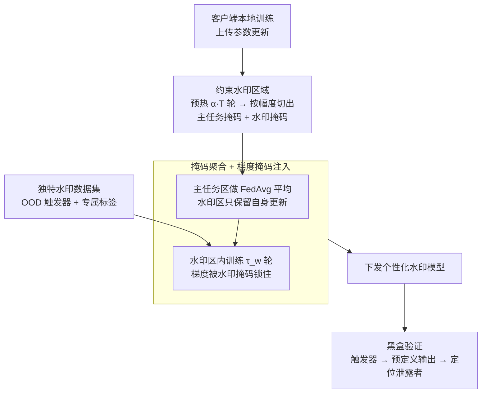

# Traceable Black-box Watermarks for Federated Learning

**会议**: ICLR 2026  
**arXiv**: [2505.13651](https://arxiv.org/abs/2505.13651)  
**代码**: [GitHub](https://github.com/JiiahaoXU/TraMark)  
**领域**: AI安全  
**关键词**: 联邦学习, 黑盒水印, 可追踪性, 模型泄露检测, 掩码聚合  

## 一句话总结

提出 TraMark，通过将模型参数空间划分为主任务区域和水印区域、采用掩码聚合防止水印碰撞，首次在联邦学习中实现服务器端可追踪黑盒水印注入，验证率达 99.58% 且主任务精度仅下降 0.54%。

## 背景与动机

1. **联邦学习面临模型泄露风险**：FL 系统中每个客户端都能访问全局模型，恶意客户端可能复制并非法分发模型，威胁所有参与者的集体利益。保护 FL 训练模型的知识产权已成为关键挑战。

2. **现有水印方法存在局限**：参数级水印（如 FedTracker）需要白盒访问模型参数进行验证，在实际部署中（如 API 访问）不可行；后门级水印虽支持黑盒验证，但现有方法要么不支持追踪，要么需要修改本地训练协议并访问客户端数据。

3. **可追踪性与水印碰撞的矛盾**：要实现追踪需要为每个客户端注入不同的水印，但 FedAvg 聚合时会融合所有客户端的参数，导致水印混淆（watermark collision），破坏可追踪性。这是追踪性与联邦聚合之间的核心矛盾。

4. **缺乏形式化定义**：尽管已有经验性进展，文献中仍缺少对 FL 中可追踪黑盒水印问题的形式化定义和数学建模，阻碍了系统性解决方案的发展。

## 方法详解

### 整体框架

TraMark 把整个水印生命周期收拢到服务器端：在常规 FedAvg 之上，服务器先经过一段预热让模型收敛，再把每个客户端的参数空间切成「主任务区域」和「水印区域」，聚合时只对主任务区域做平均、让水印区域各自为政，并用一份专属的触发器数据集在水印区域里给每个客户端模型烙上独一无二的后门，最后把个性化水印模型下发回客户端。这样恶意客户端既无从干预水印流程，不同客户端的水印也不会在聚合时互相覆盖，验证者只需黑盒查询即可判断模型是否泄露以及泄露自谁。

### 关键设计

**1. 约束水印区域：把扰动关进参数空间的「小黑屋」，避免拖累主任务**

现有方法在整个参数空间上注水印，扰动既稀释了主任务性能，又会在聚合时让各客户端水印混成一团。TraMark 改用一对互补的二值掩码把参数 $d$ 维严格切开：水印掩码 $\mathbf{M}_w \in \{0,1\}^d$ 标记占比 $k$（默认 1%）的水印参数，主任务掩码 $\mathbf{M}_m \in \{0,1\}^d$ 标记其余 $1-k$，两者满足 $\mathbf{M}_w + \mathbf{M}_m = \mathbf{1}^d$。哪些参数划给水印不是随机指定，而是先跑 $\alpha \times T$ 轮预热让模型收敛出有意义的权重，再挑绝对值最小的 $k \times d$ 个参数——这些「最不重要」的权重承载水印时对主任务伤害最小，这也是消融里 $\alpha=0$ 会让主任务精度掉约 5% 的原因。

**2. 掩码聚合 + 梯度掩码注入：让水印各自独立又不外溢**

水印能追踪的前提是每个客户端水印不同，但 FedAvg 的统一平均会把它们融成碰撞。TraMark 给每个客户端 $i$ 维护一份个性化全局模型，聚合时分区处理：

$$\tilde{\theta}_i = \theta_i + \mathbf{M}_m \odot \frac{1}{n}\sum_{i=1}^{n}\Delta_i + \mathbf{M}_w \odot \Delta_i$$

主任务区域走标准 FedAvg 平均以共享知识，水印区域只吃自己的更新 $\Delta_i$ 从而保住独特性。注入水印时同样用掩码把梯度锁在水印区域内，对 $\tilde{\theta}_i$ 在专属水印数据集上训练 $\tau_w$（默认 5）轮：

$$\tilde{\theta}_i^{s+1} = \tilde{\theta}_i^s - \eta_w g_i^s \odot \mathbf{M}_w$$

梯度被 $\mathbf{M}_w$ 掩掉后，水印知识无法渗进主任务参数，主任务区域始终只受聚合更新影响。这套「分区聚合 + 分区注入」让水印注入开销极低（每客户端 0.67 秒），也解释了剪枝、微调攻击下 VR 仍稳的现象——水印与主任务参数互不交叠却又深度耦合。

**3. 独特水印数据集：从触发器和标签两头杜绝碰撞**

要让每个水印可区分，分配给客户端的数据集必须在输入和输出上都互斥。TraMark 选用与主任务分布无关的 OOD 样本（如 MNIST 各类别）当触发器，保证触发器互不重叠 $\mathcal{X}_i^w \cap \mathcal{X}_j^w = \emptyset$；同时让预定义输出也各不相同 $\phi_i(x) \neq \phi_j(x)$，每个客户端映射到不同标签。验证时，泄露模型只会对自己那套触发器吐出预定义输出，对别家的触发器只输出随机猜测，验证者据此既确认泄露、又定位到具体客户端。

## 实验

### 实验设置

- **数据集**：FMNIST（CNN）、CIFAR-10（AlexNet）、CIFAR-100（VGG-16）、Tiny-ImageNet（ViT）
- **FL 配置**：10 个客户端，本地训练 5 轮，学习率 0.01；IID 和 non-IID（Dirichlet γ=0.5）两种设置
- **水印配置**：MNIST 作为水印源，每类 100 样本，水印学习率 1e-4，$\tau_w=5$，$k=1\%$，$\alpha=0.5$
- **基线**：FedAvg（无水印）、WAFFLE（黑盒不可追踪）、FedTracker（白盒可追踪）
- **指标**：主任务精度（MA）和验证率（VR）

### 主实验结果

| 数据集 | FedAvg MA | WAFFLE MA | FedTracker MA/VR | TraMark MA/VR |
|---|---|---|---|---|
| FMNIST | 92.60 | 92.21 | 89.95 / 100.0 | 91.20 / 96.67 |
| FMNIST (N) | 91.52 | 91.41 | 67.50 / 100.0 | 91.31 / 100.0 |
| CIFAR-10 | 89.15 | 89.16 | 87.56 / 60.0 | 88.58 / 100.0 |
| CIFAR-10 (N) | 87.01 | 86.75 | 83.42 / 50.0 | 86.26 / 100.0 |
| CIFAR-100 | 61.91 | 61.68 | 61.05 / 100.0 | 61.13 / 100.0 |
| Tiny-ImageNet | 21.05 | 21.24 | 20.40 / 100.0 | 20.91 / 100.0 |
| **平均** | **65.44** | **65.31** | **61.25 / 87.50** | **64.90 / 99.58** |

### 消融实验：关键超参数分析

| 超参数 | 配置 | MA (%) | VR (%) |
|---|---|---|---|
| 分区比例 k=0.5% | 低水印容量 | 65.70 | 84.17 |
| **分区比例 k=1.0%（默认）** | **平衡** | **65.66** | **99.17** |
| 分区比例 k=5.0% | 高水印容量 | 65.16 | 100.0 |
| 水印数据集 50 样本 | 数据不足 | 65.85 | 54.17 |
| **水印数据集 100 样本（默认）** | **平衡** | **65.51** | **99.17** |
| 水印数据集 200 样本 | 数据充足 | 65.57 | 100.0 |
| 预热比例 α=0 | 无预热 | 59.50 | 100.0 |
| **预热比例 α=0.5（默认）** | **有预热** | **64.15** | **100.0** |
| 预热比例 α=0.7 | 过度预热 | 65.20 | 降低 |

### 关键发现

1. **TraMark 实现高追踪率低精度损失**：平均 VR 99.58%（FedTracker 仅 87.50%），MA 仅下降 0.54%（FedTracker 下降 4.19%），验证了参数空间划分策略的有效性。
2. **对攻击具有鲁棒性**：在 30%-70% 剪枝率下 VR 保持稳定，30 轮微调攻击后 VR 无明显下降，说明水印区域参数与主任务参数高度耦合。
3. **预热训练至关重要**：无预热时 MA 降低约 5%，因为初始随机参数无法准确判断重要性，导致划分不当。
4. **水印数据集选择灵活**：MNIST、SVHN、WafflePattern 三种水印数据集均能达到 100% VR，差异无统计显著性（p≥0.05）。

## 亮点

- 首次形式化定义联邦学习中可追踪黑盒水印问题，提出水印碰撞概念和可追踪性约束。
- 参数空间划分 + 掩码聚合的设计简洁优雅，既避免了水印碰撞又保持了主任务性能。
- 完全服务器端操作，无需客户端配合，对恶意客户端有天然抵抗力。
- 水印注入开销极低（每客户端 0.67 秒），可无缝集成到现有 FedAvg 框架。

## 局限

- 水印数据集需要为每个客户端分配不同的 OOD 触发器类别，在标签数较少的任务中可扩展性受限（10 类主任务 + 10 客户端已经需要 20 类别）。
- 仅验证了分类任务，对生成、检测等其他任务类型的适用性未探讨。
- 虽然 k=1% 已足够，但参数空间划分策略基于简单的幅度排序，更精细的重要性度量可能进一步改善主任务性能。

## 评分

| 维度 | 评分 |
|---|---|
| 新颖性 | ⭐⭐⭐⭐ |
| 有效性 | ⭐⭐⭐⭐ |
| 可复现性 | ⭐⭐⭐⭐⭐ |
| 实用性 | ⭐⭐⭐⭐ |

<!-- RELATED:START -->

## 相关论文

- [\[CVPR 2026\] SEBA: Sample-Efficient Black-Box Attacks on Visual Reinforcement Learning](../../CVPR2026/ai_safety/seba_sample-efficient_black-box_attacks_on_visual_reinforcement_learning.md)
- [\[ICLR 2026\] Toward Enhancing Representation Learning in Federated Multi-Task Settings](toward_enhancing_representation_learning_in_federated_multi-task_settings.md)
- [\[CVPR 2026\] PROMPTMINER: Black-Box Prompt Stealing against Text-to-Image Generative Models via Reinforcement Learning and VLM-Guided Optimization](../../CVPR2026/ai_safety/promptminer_black-box_prompt_stealing_against_text-to-image_generative_models_vi.md)
- [\[CVPR 2026\] Shedding Light on VLN Robustness: A Black-box Framework for Indoor Lighting-based Adversarial Attack](../../CVPR2026/ai_safety/shedding_light_on_vln_robustness_a_black-box_framework_for_indoor_lighting-based.md)
- [\[CVPR 2026\] PureProof: Diffusion-Resistant Black-box Targeted Attack on Large Vision-Language Models](../../CVPR2026/ai_safety/pureproof_diffusion-resistant_black-box_targeted_attack_on_large_vision-language.md)

<!-- RELATED:END -->
