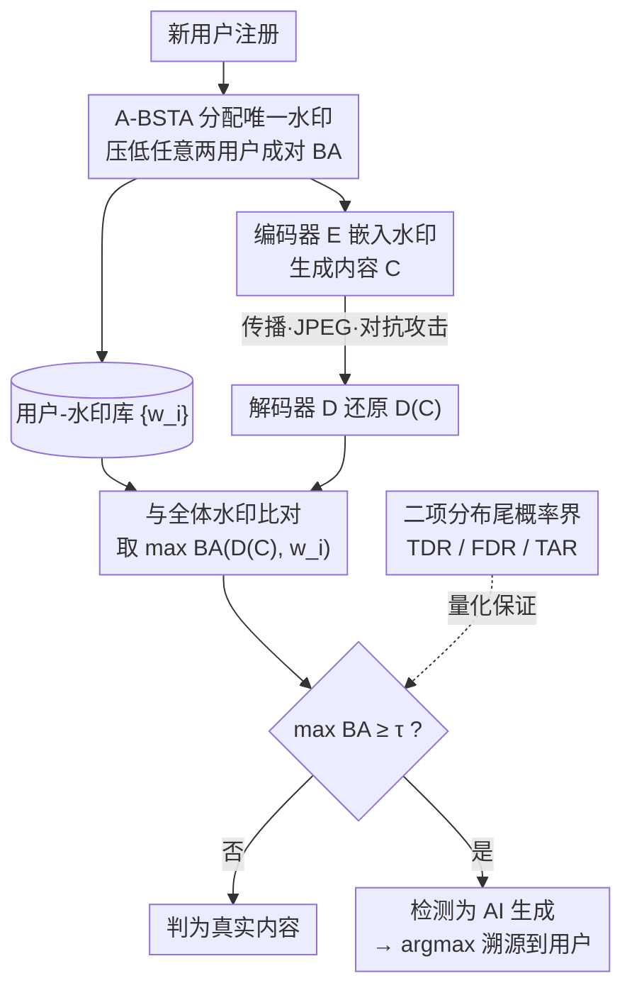

# Watermark-based Detection and Attribution of AI-Generated Content

**会议**: ICLR 2026  
**arXiv**: [2404.04254](https://arxiv.org/abs/2404.04254)  
**代码**: 无  
**领域**: AI Safety  
**关键词**: watermark, attribution, AI-generated content, detection, digital forensics

## 一句话总结

首次系统性研究基于水印的AI生成内容用户级检测与溯源，提供了理论分析（TDR/FDR/TAR界）、高效水印选择算法（A-BSTA）和跨模态（图像+文本）实验验证，证明检测和溯源继承了水印方法本身的准确性与（非）鲁棒性。

## 研究背景与动机

生成式AI（如DALL-E、Midjourney、ChatGPT）能生成高度逼真的内容，带来虚假信息、版权争议等伦理问题。Google、OpenAI、Microsoft等公司已部署水印技术用于AI生成内容的**检测**（detection），但现有文献主要关注"用户无关"的检测——即所有内容嵌入相同水印，只判断是否为AI生成。

本文指出了更进一步的需求：**溯源**（attribution）。即在检测到内容为AI生成后，还需追溯到具体是哪个注册用户生成了该内容。这对于执法机关调查网络犯罪（如虚假信息传播）至关重要。尽管溯源的重要性日益增长，但相关研究几乎空白，本文旨在填补这一空白。

核心挑战在于：当用户数量极大（如100,000甚至1,000,000）时，如何确保每个用户的水印足够独特，使得溯源准确率保持高水平，同时不显著增加误检率。

## 方法详解

### 整体框架

本文把"用户级溯源"拆成注册、生成、检测与溯源三段：用户注册时服务商用 A-BSTA 从数据库里为他分配一串唯一的水印比特，生成内容时这串水印被编码器嵌进图像或文本，事后再从可疑内容中把水印解码出来，把解码结果与全体用户水印逐一比对——比对的最大吻合度过阈值就判为 AI 生成，再取最像的那个用户完成溯源。整个流程不改动底层水印方法本身，只在"如何分配水印"（A-BSTA）和"如何根据解码结果做判定"（同一阈值办检测+溯源）两层做文章，并用一套二项分布界为这套判定提供可计算的准确率保证。

### 关键设计

**1. A-BSTA：把水印分配转成最远字符串问题再近似求解**

要让溯源稳，核心是注册阶段就压低任意两用户水印的最大成对 BA，本文将其写成 $\min_{w_s} \max_{i} BA(w_i, w_s)$，并证明它等价于理论计算机科学里 NP-hard 的最远字符串问题。直接精确求解不现实，于是提出 A-BSTA（近似有界搜索树算法）做三处工程化改造：初始化不用补码 $\neg w_1$ 而用随机水印（实测溯源更好），把搜索树递归深度限制为常数 $d=8$ 把时间复杂度压到 $O(snm^d)$，再从较小的水印数 $m$ 起步逐步加大直到找到满足分离条件的水印集合。最终 A-BSTA 能把最大成对 BA 控到 $<0.74$，代价仅约 24ms/水印——水印之间越"远"，下游两个用户在解码噪声下越不会被混淆。

**2. 用一个阈值同时撑起检测和溯源：先判真假，再认主人**

待检内容 $C$ 经解码器 $D$ 还原出水印后，先看它与全体用户水印的最大比特准确率（Bitwise Accuracy, BA）是否过线——当且仅当 $\max_i BA(D(C), w_i) \geq \tau$（$\tau > 0.5$）时判定为AI生成。一旦检测通过，溯源就顺势取最像的那个用户：$i^* = \arg\max_i BA(D(C), w_i)$。这样检测和溯源共用同一个相似度排序，省去为溯源单独训练分类器，代价是要求用户之间的水印彼此足够"远"——这正是设计1的 A-BSTA 要保证的，否则两个用户的水印会在解码噪声下混淆。

**3. 三个指标加二项分布界：给"检测即溯源"一个可计算的理由**

为脱离具体水印方法做分析，本文定义真检测率 TDR$_i$（用户 $i$ 的内容被正确判为AI生成的概率）、误检率 FDR（真实内容被误判的概率）、真溯源率 TAR$_i$（被正确归属的概率），并基于 $\beta$-accurate 和 $\gamma$-random 两个可从实验估计的水印属性，把它们都写成二项分布尾概率的界。其中 TDR 下界为 $Pr(n_i \geq \tau n) + Pr(n_i \leq n - \tau n - \bar{\alpha_i} n)$（$n_i \sim B(n, \beta_i)$），FDR 上界为 $1 - Pr(n' < \tau n)^s$（$n' \sim B(n, 0.5+\gamma)$），TAR 下界为 $Pr(n_i \geq \max\{\lfloor\frac{1+\bar{\alpha_i}}{2}n\rfloor+1, \tau n\})$。这套界的关键推论是：当 $\tau > \frac{1+\bar{\alpha_i}}{2}$ 时 TDR 与 TAR 下界近似相等，意味着只要内容被检测出来就几乎一定能正确溯源，即"检测即溯源"，这也解释了为何设计2可以用同一阈值办两件事。

## 实验关键数据

### 主实验

实验在Stable Diffusion、Midjourney、DALL-E 2三个模型上进行，使用HiDDeN（学习型水印方法），默认设置：s=100,000用户、n=64位水印、τ=0.9。

| 场景 | 平均TDR | 平均TAR | FDR | 最差1%TAR |
|------|---------|---------|-----|-----------|
| 无后处理 | ≈1.0 | ≈1.0 | ≈0 | >0.94 |
| JPEG(Q=90) | 高 | 高 | ≈0 | 略降 |
| 对抗攻击(黑盒) | 0 | 0 | - | 图像质量严重下降 |

### 水印选择算法对比

| 方法 | 平均生成时间 | 最大成对BA | 最差用户TAR |
|------|------------|-----------|------------|
| Random | 0.01ms | 最大 | 最低 |
| NRG | 2.11ms | 中等 | 中等 |
| A-BSTA | 24ms | <0.74 | 最高 |

### 消融实验

| 配置 | 关键指标 | 说明 |
|------|---------|------|
| 用户数s: 10→1M | TDR/TAR略降，FDR略升 | s控制TDR-FDR权衡 |
| 水印长度n: 32→80 | n=48/64最优 | 过长水印影响编解码准确性 |
| 阈值τ: 0.7→0.95 | TDR/TAR和FDR同向变化 | 需权衡取舍 |

### 关键发现

- 检测和溯源在无后处理时准确率极高，85%用户TAR=1.0
- 对抗训练的HiDDeN对常规后处理（JPEG、高斯模糊等）鲁棒
- 理论下界与实验TDR/TAR吻合良好，但FDR上界较松
- A-BSTA以24ms/水印的可接受代价，显著提升最差用户性能
- 方法同样适用于AI生成文本（使用AWT水印方法）

## 亮点与洞察

- **理论与实践统一**：推导了适用于任意水印方法的TDR/FDR/TAR界，且需要的$\beta$-accurate和$\gamma$-random参数可从实验中估计
- **"检测即溯源"洞察**：当τ足够大时，一旦检测通过则自动完成溯源，简化了系统设计
- **NP-hard问题的实用解法**：将水印选择与最远字符串问题关联，借鉴理论计算机科学的算法
- **跨模态通用性**：同一框架适用于图像和文本的检测与溯源

## 局限与展望

- 白盒对抗攻击下水印方法仍不鲁棒（TDR/TAR可降为0），这是水印方法本身的固有限制
- 理论分析假设水印比特独立，实际可能不完全成立
- FDR的理论上界较松，尤其在bitwise相关性较强时
- 实验图像分辨率较低（128×128），更高分辨率的效果有待验证
- 水印选择算法在用户数极大时仍有优化空间

## 相关工作与启发

本文将数字水印领域（非学习型如Tree-Ring、学习型如HiDDeN）与AI安全领域结合。与用户无关的检测不同，用户感知的溯源为每个用户分配唯一水印，实现了从"是否AI生成"到"谁生成的"的跨越。A-BSTA算法源自理论计算机科学中最远字符串问题的研究，体现了跨领域方法迁移的价值。

## 评分

- 新颖性: ⭐⭐⭐⭐ （首次系统性研究水印溯源，但检测本身不新）
- 实验充分度: ⭐⭐⭐⭐ （三个GenAI模型+文本+多种后处理场景）
- 写作质量: ⭐⭐⭐⭐⭐ （理论清晰，实验详实，框架完整）
- 价值: ⭐⭐⭐⭐ （实用性强，对GenAI服务商有直接参考价值）

<!-- RELATED:START -->

## 相关论文

- [\[CVPR 2026\] Skyra: AI-Generated Video Detection via Grounded Artifact Reasoning](../../CVPR2026/ai_safety/skyra_ai-generated_video_detection_via_grounded_artifact_reasoning.md)
- [\[CVPR 2026\] Zero-shot Detection of AI-Generated Image via RAW-RGB Alignment](../../CVPR2026/ai_safety/zero-shot_detection_of_ai-generated_image_via_raw-rgb_alignment.md)
- [\[CVPR 2026\] Scaling Up AI-Generated Image Detection with Generator-Aware Prototypes](../../CVPR2026/ai_safety/scaling_up_ai-generated_image_detection_with_generator-aware_prototypes.md)
- [\[CVPR 2026\] SAGA: Source Attribution of Generative AI Videos](../../CVPR2026/ai_safety/saga_source_attribution_of_generative_ai_videos.md)
- [\[CVPR 2026\] Enabling Supervised Learning of Generative Signatures for Generalized AI-Generated Images Detection](../../CVPR2026/ai_safety/enabling_supervised_learning_of_generative_signatures_for_generalized_ai-generat.md)

<!-- RELATED:END -->
