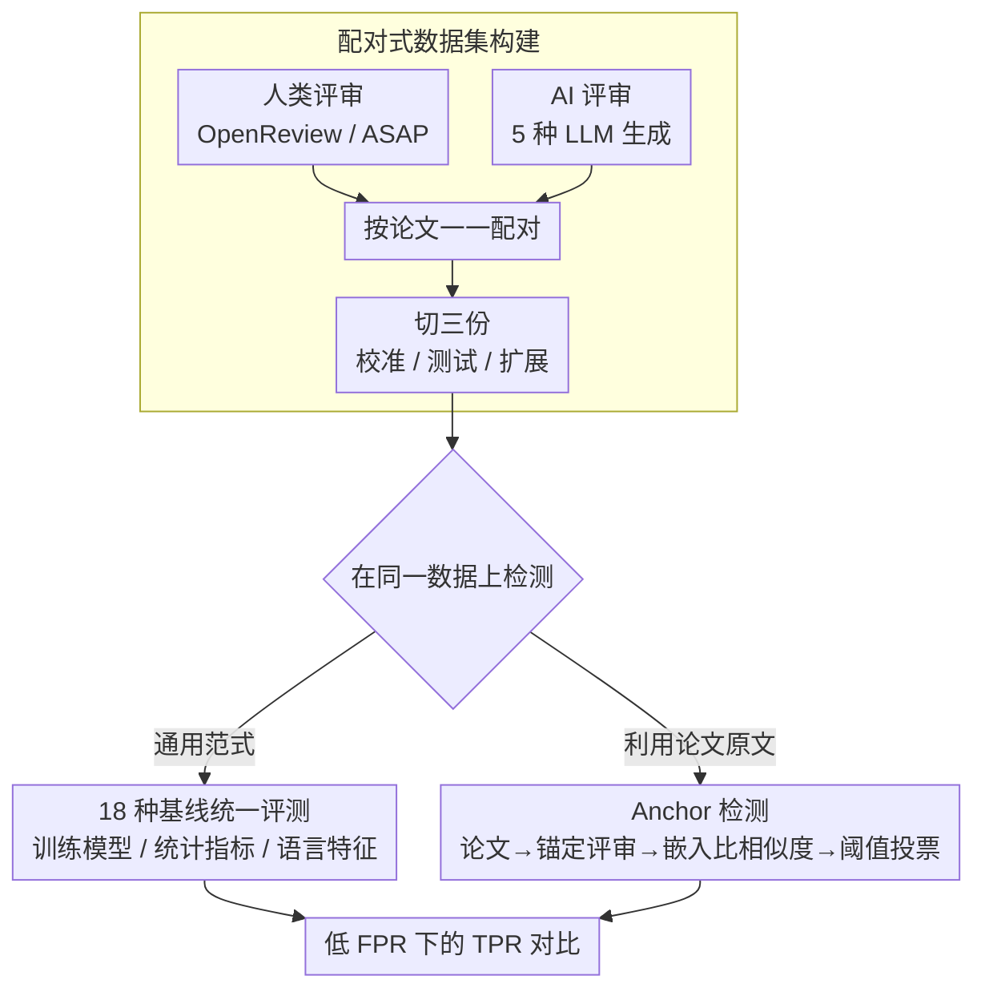

# Is Your Paper Being Reviewed by an LLM? Benchmarking AI Text Detection in Peer Review

**会议**: ICLR2026  
**arXiv**: [2502.19614](https://arxiv.org/abs/2502.19614)  
**代码**: [IntelLabs/AI-Peer-Review-Detection-Benchmark](https://huggingface.co/datasets/IntelLabs/AI-Peer-Review-Detection-Benchmark)  
**领域**: AIGC检测  
**关键词**: AI text detection, peer review, LLM-generated text, benchmark, scientific integrity

## 一句话总结

构建了迄今最大的 AI 生成同行评审数据集（788,984 篇评审），系统评估了 18 种 AI 文本检测方法在同行评审场景下的表现，并提出了利用论文原文作为上下文的 Anchor 检测方法，在低误报率下大幅超越所有基线。

## 背景与动机

- 随着 LLM 能力的快速进步，AI 会议的投稿量激增，审稿人工作负担显著增加，这使得部分审稿人可能将审稿工作"外包"给 LLM
- 已有研究发现近年 AI 会议（ICLR、NeurIPS）的评审中 AI 生成文本比例呈上升趋势
- LLM 生成的评审与人类评审在评价方向上并不一致，且缺乏鲁棒性，未公开使用 LLM 审稿会严重损害同行评审的公信力
- **关键空白**：目前缺乏用于在同行评审领域系统评估 AI 文本检测方法的大规模基准数据集
- 现有 AI 文本检测基准（如 RAID-TD、M4、HC3）聚焦于通用领域，不覆盖同行评审场景

## 核心问题

1. 现有通用 AI 文本检测方法能否可靠识别同行评审中的 LLM 生成文本？
2. 在同行评审的特殊场景下（可获取论文原文），能否设计更有效的检测方法？
3. 不同程度的 LLM 辅助编辑对检测性能有何影响？

## 方法详解

### 整体框架

这是一篇 benchmark 论文，要解决的是"同行评审里有没有人偷偷让 LLM 代写"这个检测问题，整体由两块拼成。第一块是**造数据**：把人类真实评审和 AI 生成评审针对同一批论文一一配对，建起迄今最大的同行评审检测数据集（788,984 篇，两类各半），再切成校准、测试、扩展三份。第二块是**做检测并对比**：在这套数据上既跑通 18 种现成的通用检测法当参照系，又提出一个专为评审场景设计的 Anchor 检测法。整篇的核心赌注是——同行评审不同于一般文本检测，评审者手里有一份共同的"原文"（被评审的论文）可供锚定，把这份原文用起来就能在低误报率下把检测拉到可用区间。

### 关键设计

**1. 配对式数据集构建：让人类与 AI 评审针对同一批论文一一对应**

通用 AI 文本检测基准（RAID-TD、M4、HC3）都不覆盖同行评审，于是论文从头造数据。人类侧从 OpenReview API 与 ASAP 数据集抓取 ICLR 2017–2024、NeurIPS 2016–2024 的真实评审；AI 侧用 5 种主流模型（GPT-4o、Claude Sonnet 3.5、Gemini 1.5 Pro、Qwen 2.5 72B、Llama 3.1 70B）对**同一批论文**各生成一份评审，prompt 里塞入会议专属的审稿指南与评审模板，并对齐论文的最终决策（accept/reject），让 AI 评审在倾向上不偏离真实情形。最终 788,984 篇切成校准集（75,824，用来给各方法定阈值）、测试集（287,052）和扩展集（426,108）三份。一个容易被忽略却关键的处理是：主实验只取 ChatGPT 发布前（2022 年底之前）的人类评审——之后的人类评审本身可能已被 LLM 污染，混进来会让"人类"标签失真。

**2. Anchor 检测：用论文原文锚出一份参考评审，再比语义相似度**

这是方法侧的核心贡献，吃的是评审场景独有的红利——待测评审 TR 对应的论文原文是已知的，而通用方法只盯着 TR 本身的 token 概率、困惑度，拿不到这层原文锚定。流程是：先用任一 LLM 配一个通用 prompt 对该论文现场生成一份锚定评审 AR（这个 prompt 与造测试数据时用的不同，刻意不依赖待测来源），再用嵌入模型 text-embedding-003-small 把 AR 与 TR 各自编码成向量，算两者的余弦相似度

$$\text{Score} = \text{Cosine\_similarity}(\text{Emb}_{\text{AR}}, \text{Emb}_{\text{TR}})$$

若 $\text{Score}$ 超过从校准集学到的阈值 $\theta$ 就判为 AI 生成。它之所以管用，在于一个语义直觉：不同 LLM 读同一篇论文写出的评审，因为都被同一份原文牵引，在语义空间里彼此更靠近；而人类评审的个体差异天然更大，离 AR 更远——于是 TR 与 AR 的距离本身就成了"像不像机器写的"信号。由于实际检测时并不知道对方用了哪个模型，单一 AR 可能锚不准，Anchor 进一步用多个 LLM 各生成一份 AR，对 TR 分别比相似度，**任一份触发阈值即判为 AI 生成**。这把"猜中生成模型"的难题，转成了"只要命中其中之一"的宽松条件，代价只是多调几次 API。

**3. 18 种基线的统一评测：覆盖三大类通用检测范式**

为给 Anchor 一个公平的参照系，论文借助 IMGTB 框架把 18 种开源通用检测法在同一数据集、同一套校准阈值下跑通，分三类：基于训练模型的方法（如 MAGE-D）、基于统计指标的方法（Log-Likelihood、Rank、Entropy、DetectGPT、FastDetectGPT、Binoculars 等）、以及基于语言特征的方法（如 GLTR）。评测刻意用极低的目标 FPR（0.1%/0.5%/1%）来定阈值，因为评审里误报一个人类作者的代价很高；还特意做跨域设定（只用 ICLR 评审校准、再测全部）。这套对照的意义不只是排名，更在于揭示这些方法在同行评审这种特定分布、且要求极低 FPR 的设定下普遍失灵，从而衬出"利用原文"这一思路的必要性。

## 实验关键数据

### 主实验结果（完全 AI 生成评审检测，跨域校准）

在目标 FPR = 1% 时的 TPR（真阳性率）：

| 方法 | GPT-4o | Gemini | Claude |
|------|--------|--------|--------|
| **Anchor** | **88.8%** | **86.5%** | **81.8%** |
| Binoculars | 45.2% | 85.5% | 77.0% |
| 其他最佳基线 | ≤17.5% | ≤19.4% | ≤17.5% |

在最严格的 FPR = 0.1% 时：

| 方法 | GPT-4o | Gemini | Claude |
|------|--------|--------|--------|
| **Anchor** | **63.5%** | **59.7%** | **59.6%** |
| Binoculars | 17.1% | 61.5% | 43.5% |

- Anchor 在 GPT-4o 检测上相对 Binoculars 的绝对提升达 **46.4 个百分点**（FPR=0.1%）
- 大多数基线方法在低 FPR 下表现极差（TPR < 5%），几乎无法实际使用

### Prompt 鲁棒性

- 使用不同 reviewer archetype（balanced、conservative、innovative、nitpicky）的 prompt 进行交叉测试，检测性能基本一致
- 对 AI Scientist、AgentReview、DeepReview 等复杂 agent 生成的评审，Binoculars 仍能达到 AUROC > 0.99

### AI 辅助编辑检测

| 编辑程度 | Anchor (FPR=0.1%) | Binoculars (FPR=0.1%) |
|---------|-------------------|----------------------|
| Minimum | 0.4% | 0.6% |
| Moderate | 0.7% | 1.4% |
| Extensive | 1.9% | 2.5% |
| Maximum | **60.8%** | 9.2% |

- 排序能力（NDCG）：Anchor 0.90，Binoculars 0.86
- 从 bullet points 生成的评审更难检测（TPR 仅 5.8%@FPR=0.1%），但这类使用场景更接近合法辅助写作

## 亮点

- **数据集规模与质量**：788,984 篇评审，覆盖 5 种 LLM × 8 年 × 2 大会议，是同行评审 AI 检测领域迄今最大的基准
- **Anchor 方法简洁而有效**：核心思想巧妙——利用论文原文作为上下文来"锚定"参考评审，简单的余弦相似度即可大幅超越复杂基线
- **低 FPR 下的严格评估**：正确指出同行评审中误报的高代价，聚焦于 0.1%-1% FPR 的实际应用区间，比泛用 AUC 更有实际意义
- **全面的分析维度**：涵盖 prompt 鲁棒性、编辑程度敏感性、bullet-point 生成场景等多角度分析
- **数据集公开可用**：发布在 HuggingFace，支持后续研究

## 局限与展望

- **领域局限**：仅涵盖 AI 领域会议（ICLR/NeurIPS），其他学科的评审风格和 LLM 表现可能不同
- **Anchor 方法依赖 API**：需要调用 LLM 生成锚定评审和调用嵌入模型，有成本和时延开销
- **标签噪声**：2023 年后的人类评审可能已被 LLM 污染，虽然论文回避了这些数据但限制了时效性
- **轻度编辑检测困难**：对 Minimum/Moderate 级别的 AI 辅助编辑检测率极低，这在实际中可能是最常见的使用场景
- **未探索反向场景**：论文承认未研究"人类修改 AI 草稿"的场景
- **嵌入模型依赖**：Anchor 性能可能受嵌入模型选择影响，论文仅测试了 OpenAI 的 text-embedding-003-small

## 与相关工作的对比

| 对比维度 | 本文 | DetectLLM | DNA-GPT | 通用检测基准 |
|---------|------|-----------|---------|------------|
| 检测场景 | 黑盒（不知来源LLM） | 白盒（需访问源LLM） | 黑盒 | 通用 |
| 是否利用上下文 | ✓（论文原文） | ✗ | ✗（截断重生成） | ✗ |
| 领域 | 同行评审 | 通用 | 通用 | 通用 |
| 数据规模 | 788K | - | - | 多数 < 100K |
| 低FPR表现 | 强 | - | 弱 | 中 |

Anchor 方法与 DetectLLM 和 DNA-GPT 的核心区别在于：（1）不需要访问生成模型；（2）利用论文原文作为"接地"信息生成参考评审，比 DNA-GPT 的截断重生成策略更能代表真实 AI 评审的语义分布。

## 启发与关联

- **方法可迁移性**：Anchor 的核心思想（利用源文档生成参考输出后比较语义相似度）可推广到其他有源文档的场景，如 AI 生成的新闻摘要检测、AI 翻译检测等
- **对审稿实践的启示**：会议组织方可将 Anchor 集成到 OpenReview 等平台中，作为评审质量的辅助筛查工具
- **与 AI 审稿系统的互补**：本文站在"检测"角度，与 AI Scientist、AgentReview 等"生成"方向的工作形成有趣的攻防关系
- **混合写作的边界问题**：论文揭示了一个关键伦理灰区——使用 LLM 从人类 bullet points 生成完整评审是否算"不当使用"？检测率低（TPR ~6%）是否反而证明这种使用方式本质上保留了人类判断的核心？

## 评分
- 新颖性: ⭐⭐⭐⭐ — Anchor 方法简洁有效，数据集填补了重要空白
- 实验充分度: ⭐⭐⭐⭐⭐ — 18种基线、5种LLM、多维度分析，非常全面
- 写作质量: ⭐⭐⭐⭐ — 结构清晰，动机充分，图表信息量大
- 价值: ⭐⭐⭐⭐ — 对学术界审稿诚信问题有实际意义，数据集公开价值高

<!-- RELATED:START -->

## 相关论文

- [\[ICML 2026\] AutoBaxBuilder: Bootstrapping Code Security Benchmarking](../../ICML2026/aigc_detection/autobaxbuilder_bootstrapping_code_security_benchmarking.md)
- [\[ICML 2026\] Feature-Augmented Transformers for Robust AI-Text Detection Across Domains and Generators](../../ICML2026/aigc_detection/feature-augmented_transformers_for_robust_ai-text_detection_across_domains_and_g.md)
- [\[ACL 2026\] DetectRL-X: Towards Reliable Multilingual and Real-World LLM-Generated Text Detection](../../ACL2026/aigc_detection/detectrl-x_towards_reliable_multilingual_and_real-world_llm-generated_text_detec.md)
- [\[ICML 2026\] On the Salience of Low-Probability Tokens for AI-Generated Text Detection: A Multiscale Uncertainty Perspective](../../ICML2026/aigc_detection/on_the_salience_of_low-probability_tokens_for_ai-generated_text_detection_a_mult.md)
- [\[ICML 2026\] Black-Box Detection of LLM-Generated Text Using Generalized Jensen-Shannon Divergence](../../ICML2026/aigc_detection/black-box_detection_of_llm-generated_text_using_generalized_jensen-shannon_diver.md)

<!-- RELATED:END -->
