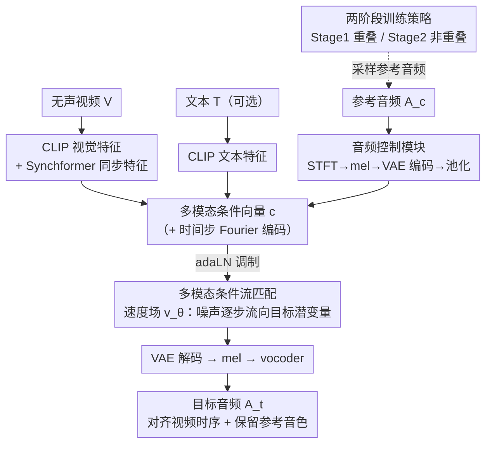

# AC-Foley: Reference-Audio-Guided Video-to-Audio Synthesis with Acoustic Transfer

**会议**: ICLR 2026  
**arXiv**: [2603.15597](https://arxiv.org/abs/2603.15597)  
**代码**: 无  
**领域**: 音频生成  
**关键词**: 视频到音频, Foley合成, 参考音频控制, 音色迁移, 流匹配  

## 一句话总结
提出 AC-Foley，一种参考音频引导的视频到音频合成框架，通过两阶段训练（声学特征学习+时序适应）和多模态条件流匹配实现了细粒度音色控制、音色迁移和零样本音效生成，在音频质量和声学保真度上显著优于现有方法。

## 研究背景与动机

**领域现状**：现有 V2A 方法主要通过文本提示+视觉信息合成音频，在语义层面实现音视频同步。

**现有痛点**：(a) 数据集粒度差距——训练标注将声学上不同的声音（如不同犬种的叫声）归为粗标签；(b) 文本描述局限——语言无法编码微声学特征（如"金属撞击声"无法区分锤击铁砧vs钢链坠落的时频特性）。这使得文本控制无法实现细粒度音效合成。

**核心矛盾**：Foley 创作者需要对同一视觉动作合成多种声学变体（如不同材质表面的脚步声），但文本无法精确描述音色差异，且训练数据缺乏这种细粒度标注。

**本文目标** 用参考音频直接控制声学特性，绕过文本的语义歧义。

**切入角度**：用 VAE 编码参考音频保留完整声学签名（而非使用 CLAP 等仅提取语义信息的编码器），通过两阶段训练学习将参考音色适应到视频时序结构。

**核心 idea**：直接以音频信号作为控制条件替代文本，通过 VAE 保留音色特征并通过两阶段训练实现参考音频到视频时序的自适应迁移。

## 方法详解

### 整体框架
AC-Foley 要解决的是：给一段无声视频配音时，文本说不清"想要哪一种声音"，于是改用一段参考音频直接指定音色。整条流程把无声视频、参考音频、可选文本三路输入喂进一个多模态 Transformer，在条件流匹配（conditional flow matching）框架下从噪声逐步生成目标音频，要求生成结果既和视频画面在时间上对齐、又保留参考音频的声学签名。三个模态不是简单拼接，而是先各自编码、再汇成一个共享的多模态条件向量 $\mathbf{c}$，通过 adaLN 调制 Transformer——视频管"什么时候响、和动作怎么对齐"，参考音频（经**音频控制模块**用 VAE 编码）管"响成什么音色"，文本管"语义兜底"。而模型之所以能"迁移"而非"复制"参考音色，靠的是**两阶段训练策略**在采样参考音频时做的文章。

### 关键设计

**1. 多模态条件流匹配：把三路控制信号统一注入一个速度场**

要让视频、音频、文本同时引导生成，AC-Foley 把它们整合成一个条件向量 $\mathbf{c}$ 再喂给流匹配模型。速度场写成 $v_\theta(t, \mathcal{C}, x_t)$，以多模态条件 $\mathcal{C} = \{V, A, T\}$ 为引导预测当前时刻 $x_t$ 应该往哪个方向流动。条件向量 $\mathbf{c}$ 把 CLIP 提取的视觉/文本特征、Synchformer 提取的同步特征、VAE 提取的音频特征以及时间步编码拼到一起，通过 adaLN 调制 Transformer 的输入。选流匹配而不是扩散，一是推理更快（求解 ODE 比逐步去噪省步数），二是多模态联合训练天然让几路信号互补——某一路信息缺失时其他模态还能托底。

**2. 音频控制模块：用 VAE 而非 CLAP 编码参考音频，保住波形级音色**

文本控制失效的根因是语义粒度太粗，所以这里干脆让"声音来描述声音"。参考音频先过一个预训练 VAE 编码器压到潜空间，再经平均池化得到声学特征向量并入条件。关键在于编码器的选择：现有方法默认用 CLAP，但 CLAP 是为语义检索训练的，只保留"这是狗叫"这一级的标签信息，频谱细节和音色被抹掉了；VAE 保留的是更底层的波形级特征，能区分吉娃娃和大型犬叫声这种同标签、不同音色的差异。换句话说，CLAP 留语义、VAE 留声学，而细粒度 Foley 要的恰恰是后者。

**3. 两阶段训练策略：用视频内音频的自相似性，逼模型学"迁移"而非"复制"**

直接把参考音频喂进去训练，模型容易偷懒——把参考波形原样覆盖到输出上，结果时序对不上、音视频不协调。AC-Foley 用两阶段训练绕开这个捷径。Stage 1（声学特征学习）用**重叠**的音视频片段训练，先让模型学会从参考音频里提取声学特征。Stage 2（时序适应）改用同一视频里**不重叠**位置的音频段作为条件，利用一个事实：同一段视频内的声音往往共享声学特性（比如同一场景的脚步声音色一致），但出现的时间点不同。由于条件音频和目标音频不再时间对齐，模型无法靠复制波形蒙混过关，只能真正学会"把参考的音色迁移到视频指示的时序结构上"。这个非重叠设计是整套策略的关键所在。

### 损失函数 / 训练策略
训练目标是标准的条件流匹配损失（对速度场做回归）。三路模态条件在训练时以一定概率随机 dropout，使得推理阶段可以灵活组合——给不给参考音频、给不给文本都能正常工作，也正是这一点让模型在没有参考音频时仍退化为一个有竞争力的标准 V2A 模型。

## 实验关键数据

### 主实验

| 方法 | FD↓ | KL↓ | MCD↓ | 音色保真度 |
|------|-----|-----|------|---------|
| MMAudio (仅文本) | 基线 | 基线 | 基线 | 无控制 |
| CondFoley | 中等 | 中等 | 中等 | 有限 |
| **AC-Foley (音频条件)** | **-20%** | **-28%** | **-22%** | **精确** |
| AC-Foley (无音频条件) | 竞争性 | 竞争性 | 竞争性 | — |

### 消融实验

| 配置 | 音频质量 | 音色保真度 | 说明 |
|------|---------|---------|------|
| 完整模型 | 最佳 | 最佳 | 两阶段训练+VAE编码 |
| 仅 Stage 1 | 中等 | 时序错位 | 缺乏时序适应能力 |
| CLAP 替代 VAE | 较差 | 丢失音色细节 | CLAP 仅捕获语义 |
| 无音频条件 | 竞争性 | — | 退化为标准 V2A |

### 关键发现
- 同一犬种视频配不同参考音频（吉娃娃叫声 vs 大型犬叫声）可生成完全不同的声音，验证了细粒度控制能力
- 音色迁移实验成功（如将驴叫迁移到狮子视频），展示了跨类别的声学特征迁移
- 零样本生成能力：用消音器枪声参考音频+枪击视频生成消音器效果，而文本提示完全无法描述
- 即使不提供参考音频，AC-Foley 仍与 SOTA V2A 方法竞争，说明多模态联合训练本身也提升了基础能力

## 亮点与洞察
- **绕过文本的精明选择**：不是改进文本描述，而是直接用音频作为控制信号——"让声音描述声音"比"让文字描述声音"根本性地更有效
- **两阶段训练的巧妙设计**：利用同一视频内音频的自相似性强迫模型学习"迁移"而非"复制"，是训练策略上的精巧设计
- **VAE vs CLAP 的选择**：现有方法默认用 CLAP 编码音频，但 CLAP 是为语义检索设计的——保留音色需要更底层的波形特征，VAE 是正确选择

## 局限与展望
- 参考音频的获取本身需要创作者提供，增加了使用门槛
- 当参考音频与视频内容语义完全不匹配时，生成质量可能下降
- 两阶段训练增加了训练复杂性
- 对参考音频长度的灵活性可能受限于 VAE 的处理能力

## 相关工作与启发
- **vs MMAudio**: MMAudio 联合训练视频+文本模态但不支持音频条件控制；AC-Foley 扩展到三模态并支持精确音色控制
- **vs CondFoley**: CondFoley 需要等长参考音频-视频对，限制灵活性；AC-Foley 支持可变长度参考
- **vs MultiFoley**: MultiFoley 做音频延续/扩展，受限于输入音频的多样性；AC-Foley 做音色迁移，可应用到不同语义类别

## 评分
- 新颖性: ⭐⭐⭐⭐ 参考音频控制替代文本的思路直观但效果显著，两阶段训练设计巧妙
- 实验充分度: ⭐⭐⭐⭐ 细粒度控制、音色迁移、零样本生成三种应用全覆盖
- 写作质量: ⭐⭐⭐⭐ 动机阐述清晰，应用案例生动直观
- 价值: ⭐⭐⭐⭐⭐ 为 Foley 创作实践提供了急需的细粒度控制工具

<!-- RELATED:START -->

## 相关论文

- [\[CVPR 2025\] MultiFoley: Video-Guided Foley Sound Generation with Multimodal Controls](../../CVPR2025/audio_speech/video-guided_foley_sound_generation_with_multimodal_controls.md)
- [\[CVPR 2026\] MMAudioReverbs: Video-Guided Acoustic Modeling for Dereverberation and Room Impulse Response Estimation](../../CVPR2026/audio_speech/mmaudioreverbs_video-guided_acoustic_modeling_for_dereverberation_and_room_impul.md)
- [\[CVPR 2026\] PAVAS: Physics-Aware Video-to-Audio Synthesis](../../CVPR2026/audio_speech/pavas_physics-aware_video-to-audio_synthesis.md)
- [\[NeurIPS 2025\] MGAudio: Model-Guided Dual-Role Alignment for High-Fidelity Open-Domain Video-to-Audio Generation](../../NeurIPS2025/audio_speech/model-guided_dual-role_alignment_for_high-fidelity_open-domain_video-to-audio_ge.md)
- [\[ICLR 2026\] Query-Guided Spatial-Temporal-Frequency Interaction for Music Audio-Visual Question Answering](query-guided_spatial-temporal-frequency_interaction_for_music_audio-visual_quest.md)

<!-- RELATED:END -->
