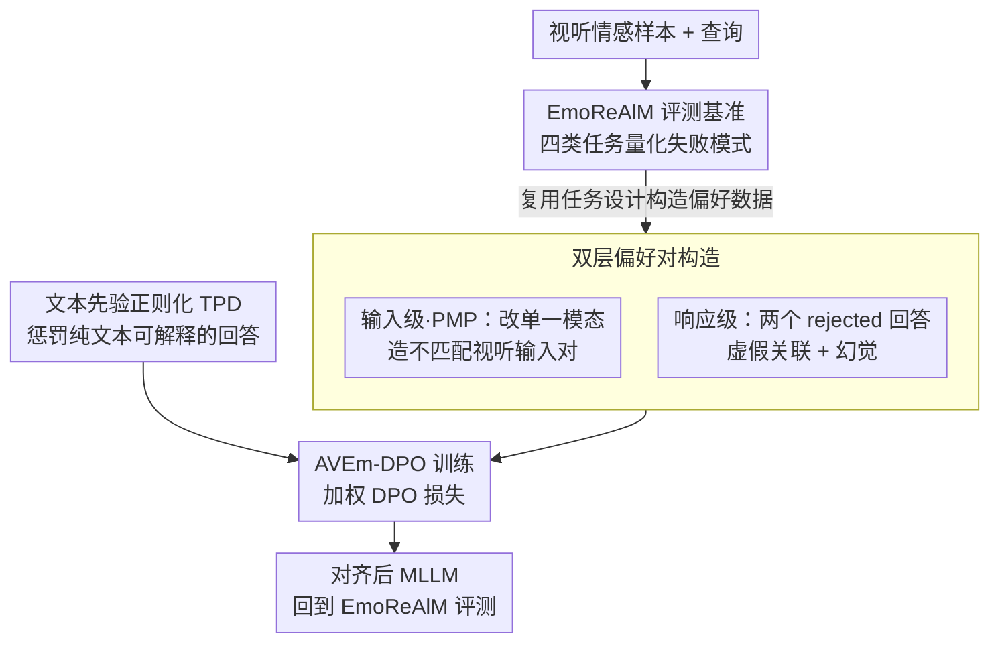

# AVERE: Improving Audiovisual Emotion Reasoning with Preference Optimization

**会议**: ICLR 2026  
**arXiv**: [2602.07054](https://arxiv.org/abs/2602.07054)  
**代码**: [https://github.com/ihp-lab/AVERE](https://github.com/ihp-lab/AVERE)  
**领域**: 对齐RLHF  
**关键词**: 多模态情感理解, 偏好优化, DPO, 幻觉缓解, 视听推理

## 一句话总结
针对多模态大语言模型在情感推理中的虚假关联和幻觉问题，提出 EmoReAlM 评测基准和 AVEm-DPO 偏好优化方法，通过构建针对性偏好对和文本先验正则化，在 DFEW/RAVDESS/EMER 上实现 6-19% 的零样本相对性能提升。

## 研究背景与动机
情感理解是构建社会智能体的核心能力之一。近年来多模态大语言模型（MLLM）在情感识别任务上取得了显著进展，但仍存在两大关键挑战：

**挑战一：虚假关联（Spurious Associations）**。模型常将情感与无关的视听线索错误地关联，例如将画面中的黄色高领衫与"快乐"情绪挂钩，而非关注面部表情。这属于推理层面的错误。

**挑战二：幻觉（Hallucinations）**。语言模型骨干的文本先验驱动模型"编造"视听线索，比如声称视频中有"紧握拳头"来支撑"愤怒"判断，但实际画面中并不存在该动作。这属于感知层面的错误。

现有的多模态偏好优化方法（如 Vista-DPO）主要面向视频理解的通用场景，并未针对情感理解中的特殊问题进行设计。同时，缺少专门的评测工具来系统性地量化 MLLM 在情感场景下的虚假关联和幻觉现象。

**核心idea**：同时构建评测基准（EmoReAlM）和对齐方法（AVEm-DPO），引入针对虚假关联和幻觉的偏好对构造策略，并加入文本先验正则化，从根源上对齐模型的视听感知与情感推理能力。

## 方法详解

### 整体框架
这篇论文要解决的是多模态大模型在情感推理里"答对了但理由错了"的隐患——它可能靠无关线索（虚假关联）或编造证据（幻觉）蒙对答案。作者两条腿走路：先造一个只用于测试的 EmoReAlM 基准，把这两种失败模式量化出来；再提出 AVEm-DPO，在偏好优化框架上做情感专属的对齐。AVEm-DPO 的胜负手不在 DPO 算法本身，而在于**怎么造偏好数据**——它从输入和响应两个层面构造 chosen/rejected，让模型同时学会"看哪条模态"和"怎么说对理由"；再叠加一个文本先验正则项，掐断语言骨干凭常识编造视听线索的源头。训练后的模型回到 EmoReAlM 上评测。

### 关键设计

**1. EmoReAlM 评测基准：区分"答对了但理由错了"**

传统情感识别只看最终标签对不对，无法暴露模型其实是靠无关线索或编造证据蒙对的。EmoReAlM 用 4000 条人工核验的多选题（MCQA），把情感推理拆成四类任务逐项体检：基础推理（Reasoning Basic）查模型是否真的依据正确的视听线索做判断；压力测试（Stress Test）专门探模型会不会幻觉出画面里根本不存在的线索；模态一致性（Modality Agreement）检验它能否分辨视觉与听觉线索是否真正吻合；剩余维度反向确认模型对真实存在的线索没有漏判。四类任务合起来，才能把"虚假关联"（推理错）和"幻觉"（感知错）这两种隐性失败分别钉死。注意它只作测试集，不参与训练。

**2. 双层偏好对构造：让 chosen/rejected 直击情感专属错误**

AVEm-DPO 比通用 DPO 有效的核心就在偏好对怎么造，作者从输入和响应两个层面同时下手。输入级是提示驱动的模态偏好（Prompt-based Modality Preference, PMP）：当查询只针对某一模态时（如"角色的肢体动作如何支撑他的愤怒？"只问视觉），就**只改 rejected 里对应的那条模态**，逼模型把回答锚定在该模态上，专治"问视觉却被音频带偏"的跨模态幻觉，对应目标 $L^{avprompt}_{DPO}$。响应级是情感响应偏好：对同一输入构造两个 rejected 回答——$y^{vr}_l$ 用了与视频相关、但与情感无关的线索（虚假关联），$y^{er}_l$ 引入与情感相关、却根本不在画面里的线索（幻觉），并按权重 $\beta_{vr}+\beta_{er}=1$ 把它们一起塞进 DPO 损失，在"对的理由"和两种"错的理由"间拉开强对比。输入级管"看哪条模态"，响应级管"怎么说对理由"，两层叠加才把对齐做细。

**3. 文本先验正则化：从根上掐断幻觉**

幻觉的病根在语言骨干自带的文本偏见——它会在没有任何视听证据时，仅凭"哭泣常伴随哭声"这类文本常识就编造出对应的视听描述。文本先验去偏（Text Prior Debiasing, TPD）直接在奖励上动刀：把仅凭文本输入就能生成该回答的概率作为惩罚项从奖励里扣掉，即 $r(a,v,x,y)=\log\frac{\pi_\theta(y\mid a,v,x)}{\pi_{ref}(y\mid a,v,x)}-\lambda_{TPD}\log\pi_{text}(y\mid x)$，于是纯靠文本先验就能解释的回答被打折、有真实音视频支撑的回答获得相对加分。训练时对 $\pi_{text}$ 停止梯度（它只用来识别骨干的文本偏见），并给骨干挂 LoRA 以保住其纯文本能力。

### 损失函数 / 训练策略
最终目标把上述两块合在一起：$L_{AVEm\text{-}DPO}=L^{y}_{DPO\text{-}TPD}+\lambda_{av}L^{avprompt}_{DPO}$，即"带 TPD 正则的加权响应级 DPO"加上"输入级模态偏好 DPO"。偏好数据用 MAFW 和 MER2025 的子集，借 Gemini-2.5 生成回答变体（构造管线与 EmoReAlM 创建管线类似，但两套数据严格分离）。整套流程在零样本设置下评估，不在目标数据集上微调；为验证泛化性，分别在 Our base（基于 VITA-1.5 架构）和情感专用微调的 EmotionLLaMA 两个骨干上训练，最终在 DFEW、RAVDESS、EMER 等数据集上测试。

## 实验关键数据

### 主实验

| 数据集 | 指标 | AVEm-DPO (Our base) | Naive-DPO | Vista-DPO | Base | 提升(vs Base) |
|--------|------|---------------------|-----------|-----------|------|---------------|
| DFEW   | WAR  | 58.54               | 55.67     | 56.42     | 56.78| +3.1%         |
| DFEW   | UAR  | 64.24               | 59.90     | 62.33     | 60.14| +6.8%         |
| RAVDESS| WAR  | 58.66               | 53.63     | 56.94     | 53.59| +9.5%         |
| EmoReAlM|Avg  | 83.3                | 68.1      | 76.9      | 65.1 | +28.0%        |

### 消融实验

| 配置 | EmoReAlM Avg | 说明 |
|------|-------------|------|
| Our base | 65.1 | 无偏好优化 |
| + Naive-DPO | 68.1 | 普通DPO,改善有限 |
| + Vista-DPO | 76.9 | 视频通用DPO |
| + AVEm-DPO | 83.3 | 情感专属设计,效果最佳 |

### 关键发现
- AVEm-DPO 在 EmoReAlM 上甚至超过了闭源 Gemini 2.5 Pro（70.3→83.3），说明针对性对齐极为有效
- 对 EmotionLLaMA 骨干同样有效，说明方法具有通用性
- 在 Stress Test（幻觉检测）子任务上提升最为显著（51.4→68.9），验证了文本先验正则化的作用
- 模态一致性任务上从 66.4 提升到 94.6，说明模型学会了真正利用跨模态信息

## 亮点与洞察
- 首个专门面向多模态情感推理的偏好优化方法，切入角度非常精准
- EmoReAlM 基准设计巧妙，四类任务全面剖析MLLM的情感推理弱点
- 双层偏好对构造（响应级+输入级）是一个值得借鉴的通用范式，可推广到其他需要细粒度对齐的多模态任务
- 文本先验正则化是缓解MLLM幻觉的一个轻量级但有效的方案
- Leaderboard 显示 AVEm-DPO 甚至能让开源模型在情感理解上胜过闭源Gemini 2.5 Pro
- 定性示例清楚展示了 AVEm-DPO 如何帮助模型聚焦真实的面部表情和语音语调，而非编造不存在的视觉线索

## 局限与展望
- 代码/模型虽已承诺公开但尚在准备中（HuggingFace checkpoint已发布：chaubeyG/AVERE-7B）
- 评测集规模和情感类别覆盖度可进一步扩展，当前主要关注基础情绪
- 仅在零样本设置下评估，少样本和微调设置值得探索
- 文本先验正则化的强度需要手动调节，自适应策略可改进
- 基准的音频线索评估依赖模型的音频理解能力，这本身就是一个挑战
- 偏好对构造的自动化程度可以进一步提升，当前仍需一定人工设计

## 相关工作与启发
- **vs Vista-DPO**: Vista-DPO是通用视频DPO，不针对情感场景设计，AVEm-DPO专门针对虚假关联和幻觉构造偏好对
- **vs EmotionLLaMA**: EmotionLLaMA通过情感数据微调，但仍有幻觉问题；AVEm-DPO在其基础上进一步对齐，两者是互补关系
- **vs Qwen 2.5 Omni**: 闭源模型在通用视听理解上强大，但在情感专项任务上仍不如AVEm-DPO
- **vs Naive-DPO**: 直接用通用DPO做偏好优化，效果有限（+3%），说明偏好对的质量比算法本身更重要

## 评分
- 新颖性: ⭐⭐⭐⭐ 评测基准+对齐方法双重贡献，偏好对构造思路新颖
- 实验充分度: ⭐⭐⭐⭐ 多数据集、多骨干验证，消融完整
- 写作质量: ⭐⭐⭐⭐ 问题定义清晰，逻辑链完整
- 价值: ⭐⭐⭐⭐ 对多模态情感AI领域有直接推动作用

<!-- RELATED:START -->

## 相关论文

- [\[ICLR 2026\] EmotionThinker: Prosody-Aware Reinforcement Learning for Explainable Speech Emotion Reasoning](emotionthinker_prosody-aware_reinforcement_learning_for_explainable_speech_emoti.md)
- [\[ACL 2026\] Data-efficient Targeted Token-level Preference Optimization for LLM-based Text-to-Speech](../../ACL2026/audio_speech/data-efficient_targeted_token-level_preference_optimization_for_llm-based_text-t.md)
- [\[AAAI 2026\] Improving Multimodal Sentiment Analysis via Modality Optimization and Dynamic Primary Modality Selection](../../AAAI2026/audio_speech/improving_multimodal_sentiment_analysis_via_modality_optimization_and_dynamic_pr.md)
- [\[ICLR 2026\] Improving Black-Box Generative Attacks via Generator Semantic Consistency](improving_black-box_generative_attacks_via_generator_semantic_consistency.md)
- [\[CVPR 2026\] Hear What You See: Video-to-Audio Generation with Diffusion Transformer and Semantic-Temporal Alignment-Ranked Direct Preference Optimization](../../CVPR2026/audio_speech/hear_what_you_see_video-to-audio_generation_with_diffusion_transformer_and_seman.md)

<!-- RELATED:END -->
