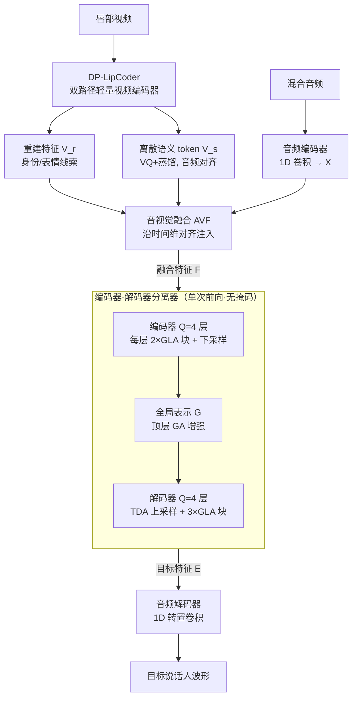

# Efficient Audio-Visual Speech Separation with Discrete Lip Semantics and Multi-Scale Global-Local Attention

**会议**: ICLR 2026  
**arXiv**: [2509.23610](https://arxiv.org/abs/2509.23610)  
**代码**: 有（[https://cslikai.cn/Dolphin](https://cslikai.cn/Dolphin)）  
**领域**: 音频语音  
**关键词**: 音视频语音分离, 离散唇语语义, 向量量化, 全局-局部注意力, 轻量化

## 一句话总结

提出 Dolphin 模型，通过双路径轻量视频编码器 DP-LipCoder 将唇部运动映射为离散语义 token，并设计全局-局部注意力（GLA）分离器，在三个基准上超越 SOTA 同时参数减少 50%+、MACs 降低 2.4×、GPU 推理加速 6×。

## 研究背景与动机

音视频语音分离（AVSS）利用视觉线索（唇部运动）从嘈杂混合音频中提取目标说话人语音。现有方法面临两个核心矛盾：

**视觉编码器的路径依赖困境**：大规模预训练视频骨干（如 3D ResNet-18）语义对齐强但计算成本极高；直接压缩导致语义表示能力严重下降；从零设计轻量编码器只能提取浅层像素级特征

**分离器的效率-质量权衡**：高性能方法（如 AV-Mossformer2）参数量巨大不适合部署；轻量方案（RTFSNet、AVLiT）依赖多次迭代，推理延迟依然很高

## 方法详解

### 整体框架

Dolphin 想解决的是：在不牺牲分离质量的前提下，把音视频语音分离里最吃算力的两块——视觉编码器和分离器——同时做轻。整条链路是这样转的：唇部视频先进 DP-LipCoder 这个轻量视频编码器，它一口气吐出两种特征，一种是保留说话人身份/表情的重建特征 $\mathbf{V}_r$，一种是与音频对齐的离散语义特征 $\mathbf{V}_s$；混合音频另走一层 1D 卷积音频编码器，编成 $\mathbf{X} \in \mathbb{R}^{N_a \times T_a}$。视觉两路与音频在音视觉融合（AVF）模块里对齐、注入成融合特征 $\mathbf{F}$，再送进基于 TDANet 的编码器-解码器分离器，每一层都嵌入 GLA 块同时做全局长程和局部细节建模，输出目标说话人特征 $\mathbf{E}$。最后由 1D 转置卷积音频解码器把 $\mathbf{E}$ 直接还原成目标说话人的时域波形。

### 关键设计

**1. DP-LipCoder：把唇部视频压成离散语义 token，又不丢说话人线索**

它针对的是视觉编码器的路径依赖困境——预训练骨干（3D ResNet-18）语义强但太贵，直接压缩会把语义压没，从零设计的轻编码器又只剩浅层像素特征。Dolphin 的解法是借用视频生成网络 MagVIT 的架构搭一个双路径自编码器，让两条路各管一件事。重建路径由级联 3D 残差块、空间注意力块和交替空间下采样组成，负责提取压缩视觉特征 $\mathbf{V}_r$，把说话人身份、表情这些辅助线索留住；语义路径是一条结构相同但参数不共享的编码器，末端接上**向量量化（VQ）模块**，再用 AV-HuBERT 做知识蒸馏，把连续的唇部视频映射成与音频对齐的离散语义 token $\mathbf{V}_s$；解码器把两路输出求和后重建视频，从而在训练里把两条路都约束住。三个损失联合优化：

$$\mathcal{L} = \mathcal{L}_{\text{commit}} + \mathcal{L}_{\text{distill}} + \mathcal{L}_{\text{recon}}$$

| 损失 | 作用 |
|------|------|
| $\mathcal{L}_{\text{recon}}$ | 重建损失，驱动重建路径捕捉说话人视觉线索 |
| $\mathcal{L}_{\text{distill}}$ | AV-HuBERT 教师蒸馏，引导语义路径提取音频对齐特征 |
| $\mathcal{L}_{\text{commit}}$ | VQ 承诺损失，约束编码器输出与码本的一致性 |

关键的省算力技巧在于：AVSS 推理时只跑编码器和 VQ 模块，解码器只在训练时用、推理时整个丢掉。这样下来相比 3D ResNet-18，参数减少 93%（0.78M vs 11.19M），MACs 降低 70%，而 SI-SNRi 只掉了 0.2 dB——离散语义的判别力几乎把压缩的代价补回来了。

**2. 音视觉融合模块：把视觉特征沿时间维对齐到音频**

DP-LipCoder 吐出的视觉特征要先和音频对齐才能用，这一步交给 AVF 模块。它借用 RTFSNet 的两种机制并扩展到时域：一路是视频引导的门控融合 $\mathcal{F}_1$，一路是注意力跨特征空间融合 $\mathcal{F}_2$，两路把 $\mathbf{V}_r$、$\mathbf{V}_s$ 与音频特征 $\mathbf{X}$ 融成 $\mathbf{F} \in \mathbb{R}^{N_a \times T_a}$。因为分离器工作在时域，融合时只需沿时间维度把视觉特征上采样到与音频对齐即可，不必像频域方案那样额外处理频率轴。

**3. 编码器-解码器分离器：单次前向、直接输出目标特征，不靠掩码**

为了摆脱轻量方案靠多次迭代换质量带来的延迟，Dolphin 把分离器做成一遍过的编码器-解码器（以 TDANet 为骨干，但去掉它原有的多次迭代）。编码器有 $Q=4$ 层，每层 2 个 GLA 块加一次下采样，逐层提取多尺度特征；所有尺度的特征再统一下采样到最低分辨率求和，得到全局表示 $\mathcal{G}$，并经顶层 GA 块进一步增强。解码器同样 $Q=4$ 层，每层一个 TDA 块上采样加 3 个 GLA 块。它**直接输出目标说话人的特征** $\mathbf{E}$，而不是传统那样预测一个掩码去乘混合音频，从根上避开了掩码乘法引入的失真。

**4. GLA 块：全局注意力管长程、局部注意力管细节，各自做轻**

分离器每一层都靠 GLA 块同时抓两种尺度的信息，关键是两条支路都被改造得很省。全局这条 GA 块用的是粗粒度自注意力（CSA）：先把序列下采样到 $T_a/2^Q$ 长度再执行 MHSA，算完上采样回原始长度，计算复杂度因此降到原来的 $1/2^{2Q}$，后面再接一个带 DWConv1D（kernel=3）的 FFN。局部这条 LA 块更有意思，它的**热扩散注意力（HDA）**借了热扩散方程这条物理先验来设计可学习的多尺度滤波：先用 DCT 把特征变到频域，施加一个指数衰减滤波

$$\tilde{\mathbf{A}}(p) = \mathbf{A}(p) \cdot \exp(-\mathbf{k}_c (p\pi/T_a)^2)$$

其中 $\mathbf{k}_c \in \mathbb{R}^{N_a}$ 是逐通道自适应的可学习扩散系数；再 IDCT 回时域并过一道门控 $\breve{\mathbf{F}}_0 = \mathcal{P}(\hat{\mathbf{x}} \odot \text{SiLU}(\mathbf{z}))$。这样建局部特征不再受限于卷积核那点有限感受野，参数比大核 Conv1D 还少，滤波却更精细。

### 损失函数 / 训练策略

- 分离器优化目标：SI-SNR
- Adam 优化器，lr=1e-3，验证损失平台 15 epoch 减半，停滞 30 epoch 早停
- L2 梯度裁剪阈值 5，batch=48，8× RTX 5090 GPU
- DP-LipCoder 参数冻结，仅训练分离网络

## 实验关键数据

### 主实验

**表1：预训练视频编码器对比（LRS2）**

| 方法 | SI-SNRi(dB)↑ | SDRi(dB)↑ | PESQ↑ | Params(MB)↓ | MACs(G/s)↓ |
|------|-------------|-----------|-------|-------------|------------|
| 3D ResNet-18 | 17.0 | 17.1 | 3.30 | 11.19 | 7.95 |
| AE | 15.2 | 15.4 | 3.15 | 0.05 | 0.17 |
| LipCoder | 16.3 | 16.4 | 3.24 | 0.65 | 5.33 |
| **DP-LipCoder** | **16.8** | **16.9** | **3.29** | **0.78** | **2.38** |

**表2：AVSS 方法 SOTA 对比（三个数据集）**

| 方法 | LRS2 SI-SNRi | LRS3 SI-SNRi | VoxCeleb2 SI-SNRi |
|------|-------------|-------------|-------------------|
| IIANet | 16.0 | 18.3 | 13.6 |
| AV-Mossformer2 | 15.1 | 17.7 | 14.0 |
| **Dolphin** | **16.8** | **18.8** | **14.6** |

**表3：效率对比（含视频编码器）**

| 方法 | Params(M)↓ | MACs(G)↓ | GPU延迟(ms)↓ |
|------|-----------|---------|-------------|
| IIANet | 15.01 | 26.51 | 142.30 |
| AV-Mossformer2 | 68.52 | 124.46 | 62.30 |
| **Dolphin** | **7.00** | **10.89** | **33.24** |

### 消融实验

**GLA 组件消融（LRS2）**：

| GA | LA | SI-SNRi↑ | Params(MB)↓ |
|----|---|---------|------------|
| ✗ | ✗ | 10.4 | 2.04 |
| ✓ | ✗ | 15.9 | 5.23 |
| ✗ | ✓ | 15.6 | 3.81 |
| ✓ | ✓ | **16.8** | 7.00 |

HDA 层 vs Conv1D：HDA 达到 16.9 dB SI-SNRi，优于 Conv1D 的 16.5 dB，参数更少（7.00M vs 7.57M）。

### 关键发现

1. VQ 离散编码比连续自编码器至少提升 1.0 dB SI-SNRi，VQ 模块贡献约 0.5 dB
2. DP-LipCoder 可泛化到其他 AVSS 模型：替换视频编码器后参数减少 10M+ 而性能仅轻微下降
3. 单次迭代 + GLA 优于多次迭代方案
4. 相比 SOTA IIANet：参数 -53%、MACs -59%、GPU 推理 4.3× faster

## 亮点与洞察

- **离散表示优越性**：将视频流映射为"视觉词汇表"比连续表示更紧凑判别——对多模态系统设计有广泛启发
- **热扩散物理先验**：将热方程引入局部注意力，仅学习缩放/门控参数即可精细建模局部特征，降低过拟合风险
- **双路径互补哲学**：重建路径保留身份/表情辅助信息，语义路径提取音频对齐信息

## 局限与展望

1. 依赖干净同步的唇部视频，对大角度头部姿态/遮挡/极端光照鲁棒性不足
2. 极端资源受限设备部署仍有挑战，可探索量化/剪枝
3. 离散 token 可能丢失细粒度发音线索，可探索层次码本或离散-连续混合表示
4. 仅在英语数据集上验证，跨语言泛化待探索

## 相关工作与启发

- **TDANet** 提供基础分离架构，本文加入 GLA 块并去除迭代
- **AV-HuBERT** 作为教师模型指导语义蒸馏
- **MagVIT** 的视频生成架构被创造性改造为视频编码器
- 启发：物理先验（热扩散）可作为归纳偏置注入注意力机制

## 评分

- 新颖性: ⭐⭐⭐⭐ — 双路径离散编码 + 热扩散局部注意力
- 技术深度: ⭐⭐⭐⭐ — 多模块精心设计有完善消融
- 实验充分度: ⭐⭐⭐⭐⭐ — 三数据集+多维度效率对比+消融
- 实用价值: ⭐⭐⭐⭐⭐ — 效率提升显著，有明确部署场景

<!-- RELATED:START -->

## 相关论文

- [\[ICLR 2026\] Knowing When to Quit: Probabilistic Early Exits for Speech Separation](knowing_when_to_quit_probabilistic_early_exits_for_speech_separation.md)
- [\[ICML 2026\] A Semantically Consistent Dataset for Data-Efficient Query-Based Universal Sound Separation](../../ICML2026/audio_speech/a_semantically_consistent_dataset_for_data-efficient_query-based_universal_sound.md)
- [\[ICLR 2026\] MAPSS: Manifold-Based Assessment of Perceptual Source Separation](mapss_manifold-based_assessment_of_perceptual_source_separation.md)
- [\[ICLR 2026\] Pay Attention to CTC: Fast and Robust Pseudo-Labelling for Unified Speech Recognition](pay_attention_to_ctc_fast_and_robust_pseudo-labelling_for_unified_speech_recogni.md)
- [\[ACL 2025\] MMS-LLaMA: Efficient LLM-based Audio-Visual Speech Recognition with Minimal Multimodal Speech Tokens](../../ACL2025/audio_speech/mms-llama_efficient_llm-based_audio-visual_speech_recognition_with_minimal_multi.md)

<!-- RELATED:END -->
