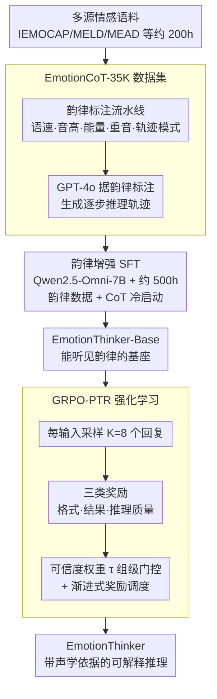

# EmotionThinker: Prosody-Aware Reinforcement Learning for Explainable Speech Emotion Reasoning

**会议**: ICLR 2026 Oral  
**arXiv**: [2601.15668](https://arxiv.org/abs/2601.15668)  
**代码**: [有](https://github.com/dingdongwang/EmotionThinker)  
**领域**: 音频语音  
**关键词**: 语音情感识别, 可解释推理, 强化学习, 韵律感知, Chain-of-Thought

## 一句话总结
首次将语音情感识别（SER）重构为深度推理问题，通过韵律增强基座模型 + GRPO-PTR（渐进式可信推理奖励）强化学习，生成带有声学依据的可解释情感推理。

## 研究背景与动机
- 当前 SpeechLLM 仍将情感识别视为简单分类问题，给出标签但不解释"为什么"
- 现有基于 SFT 的描述型方法只停留在声学特征描述层面，缺乏从声学观察到情感判断的**因果推理链**
- 三大挑战：
  1. 缺乏高质量推理数据集，现有情感语料无细粒度声学标注
  2. SpeechLLM 韵律感知能力弱（音高/能量/语速/重音感知力不足）
  3. 标准 RL 仅用规则奖励（结果准确性），无法监督开放式推理质量

## 方法详解

### 整体框架
EmotionThinker 把语音情感识别从"给标签"改造成"给推理链"，分三步走：先用一条自动标注流水线造出韵律感知的 CoT 数据集 EmotionCoT-35K，再在 Qwen2.5-Omni-7B 上做韵律增强 SFT 得到一个能听懂声学细节的基座 EmotionThinker-Base，最后用 GRPO-PTR 强化学习渐进式引入可信推理奖励，把推理质量打磨到既准又有据。三个阶段层层递进——数据负责提供"声学观察→情感判断"的因果范例，SFT 负责让模型真的"听得见"韵律，RL 负责把开放式推理的质量纳入可优化的监督信号。

### 关键设计

**1. EmotionCoT-35K 数据集：把声学线索翻译成推理轨迹**

模型要学会"因为音高陡升、语速加快，所以判断为愤怒"这种因果链，前提是有数据告诉它声学观察长什么样。作者从 IEMOCAP、MELD、Expresso、MEAD、EARS 汇总约 200 小时语音，整理成 35K 对音频-推理对，覆盖 9 类情感（Neutral/Happy/Sad/Angry/Contempt/Confused/Whisper/Surprise/Fear）。关键是一条自动标注流水线把每段语音的韵律拆解出来：标准语音工具抽取语速、音高、能量等底层特征，WhiStress 从转录里定位重音词，帧级音高-能量轨迹经 Savitzky-Golay 平滑后被归类为粗粒度风格（表现型/平坦型）和细粒度模式（升/降/升降/降升），wav2vec2.0 分类器再补上说话者的性别与年龄组。所有这些韵律标注作为上下文 prompt 喂给 GPT-4o，由它生成逐步推理轨迹。这样得到的是首个韵律感知 CoT 数据集，覆盖维度远超以往只做粗略描述的语音数据集，也为后续推理提供了真实声学依据。

**2. 韵律增强 SFT：先让基座模型真的"听得见"韵律**

SpeechLLM 的通病是对音高、能量、语速、重音这些副语言信息不敏感，没有这个能力，再多推理也是空中楼阁。作者用约 500 小时韵律增强数据做 SFT，混合四类任务：词级重音感知（Stress-17K 数据集）、韵律属性分类（判断音高/能量/语速/语调的级别）、比较性韵律增强（把同一句话改不同韵律参数后拼接，逼模型识别正确排序）、以及 5K 条 EmotionCoT 样本做冷启动推理。训练时联合优化音频编码器、音频适配器和 LLM 骨干。其中比较性增强任务最巧妙，用相对排序而非绝对标签来逼模型分辨细微韵律差异，最终让基座在韵律感知测试上从 25%~30% 的水平跳到 60%~75%。

**3. GRPO-PTR：让强化学习同时管住推理写得对不对、好不好**

标准 RL 只拿结果对错做奖励，管不了开放式推理的质量，于是会出现"答案蒙对、推理胡说"。GRPO-PTR（Progressive Trustworthy Reasoning）围绕这点设计了一套渐进可信的奖励机制。每个输入先采样 $K=8$ 个回复，每条回复打三类分：格式奖励 $R_f$（0/1，是否遵循 think/answer 的 XML 格式）、结果准确度奖励 $R_o$（0/1，预测标签是否匹配真值）、推理质量奖励 $R_t$（由专门训练的奖励模型给出——Qwen2.5-Omni-3B 在 101.4K 样本上微调，从事实对齐、解释质量、描述完整性、流畅与结构清晰度四个维度各打 1–5 分）。这套四维评分把"推理好不好"量化成可优化的标量，是把声学描述质量纳入 RL 监督的核心。

但只要奖励模型给高分，模型就有动机写一段花哨却与答案矛盾的推理来骗分。为此作者引入**可信度权重 $\tau$** 做组级门控：把同一输入的 8 条回复按结果正确/错误分成两组、分别算推理奖励均值，当正确组的推理奖励不低于错误组时令 $\tau=1$、正常信任推理信号，一旦错误组反而推理分更高就令 $\tau=\exp(\Delta)$ 随两组差值指数衰减，把这个自相矛盾的信号压下去——只有推理质量与结果正确性在组级别一致时才采信推理奖励。消融里去掉 $\tau$（V4）准确率几乎不变，但推理质量从 3.98 掉到 3.74，印证它主要在维护逻辑自洽。

最后还有一个**渐进式调度**解决多信号互相打架的问题：三类奖励同时上会让训练早期极不稳定，于是早期只用 $R_o+R_f$，等情感准确率稳定到约 50% 再引入 $R_t$，避免尚不可靠的推理奖励在收敛前期干扰主任务。这一步并非可有可无——取消它（V5）准确率会大幅掉到 62.80%，凸显多信号 RL 的稳定性挑战。

### 损失函数 / 训练策略
最终奖励按 $R_i = 0.3\,R_f + 1.0\,R_o + 0.5\,\tau\,R_t$ 加权，可信度权重 τ 只作用在推理项上。RL 在 Qwen2.5-Omni-7B 上训练 3000 步，KL 散度系数 0.04，学习率 1e-6，每个输入采样 $K=8$ 个候选；消融显示 K 从 4 到 16 影响有限，选 8 是效率与性能的折中。

## 实验关键数据

### 主实验

| 模型 | IEMOCAP | MELD | RAVDESS | SAVEE | Avg Acc | 推理质量 Avg |
|------|---------|------|---------|-------|---------|------------|
| Kimi-Audio | 57.72 | 59.13 | 61.07 | 55.21 | 58.83 | 2.72 |
| BLSP-Emo | 76.00 | 57.30 | 72.00 | 63.73 | 65.41 | 2.73 |
| Qwen2.5-Omni-7B | 45.70 | 54.64 | 64.77 | 52.49 | 50.83 | 2.87 |
| MiniCPM-O | 35.54 | 52.78 | 40.93 | 35.47 | 43.60 | 3.01 |
| **EmotionThinker** | **77.68** | **59.71** | **71.56** | **73.96** | **68.89** | **3.98** |

EmotionThinker 在 16 个开源模型中情感准确率最高（68.89%），推理质量大幅领先（3.98 vs 次优 3.04）。

| 韵律感知测试 | 音高 | 语速 | 能量 | 语调 | 重音 |
|------------|------|------|------|------|------|
| Qwen2.5-Omni-7B | 25.71 | 29.94 | 27.67 | 25.83 | 30.24 |
| EmotionThinker-Base | **75.11** | **68.70** | **69.42** | **60.25** | **71.50** |

### 消融实验

| 变体 | SER Acc | 推理质量 |
|------|---------|---------|
| Qwen2.5-Omni-7B (Baseline 1) | 50.83 | 2.87 |
| EmotionThinker-Base (Baseline 2) | 52.63 | 3.41 |
| SFT (V1) | 53.91 | 3.78 |
| GRPO (V2) | 62.91 | 3.45 |
| GRPO-PTR w/o 训练 RM (V3) | 66.67 | 3.36 |
| GRPO-PTR w/o 可信度权重 (V4) | 67.71 | 3.74 |
| GRPO-PTR w/o 渐进调度 (V5) | 62.80 | 3.76 |
| **GRPO-PTR 完整 (V6)** | **68.89** | **3.98** |

### 关键发现
1. SFT 提升推理质量但准确率有限；GRPO 大幅提升准确率但推理质量一般；GRPO-PTR 两者兼顾
2. 未训练的奖励模型引入噪声（V3 vs V6），训练奖励模型至关重要
3. 去除可信度权重（V4）对准确率影响小但推理质量下降，说明 τ 主要防止逻辑错误的推理
4. 取消渐进调度（V5）导致准确率大幅下降至 62.80%，凸显多信号 RL 的稳定性挑战
5. K 值从 4 到 16 对结果影响有限，选 K=8 做效率-性能折中

## 亮点与洞察
- **首创**将 SER 从分类问题重构为 RL 驱动的深度推理问题
- 韵律增强 SFT 是关键前置步骤：没有韵律感知能力，推理无法基于真实声学线索
- GRPO-PTR 中的可信度权重 τ 设计精巧，组级对齐机制有效防止 reward hacking
- 四维推理质量评估体系可迁移到其他模态的推理质量评估
- 人工评估与 GPT 自动评估排序一致，验证了评估方案的可靠性

## 局限与展望
- 奖励模型仅用 3B 模型微调，可能存在评估偏差
- 九类情感标签可能不够细粒度（如 sarcasm、混合情感）
- 仅在英文数据集上验证，跨语言泛化能力未知
- 推理生成增加推理延迟，实时应用受限

## 相关工作与启发
- 与 DeepSeek-R1 思路一致（RL 激励推理），但扩展到语音模态并针对情感任务定制 PTR
- 比 SECap、OSUM-EChat 等描述型方法更进一步，建立了声学特征到情感推断的因果链
- 韵律增强 SFT 策略（尤其比较性增强任务）可推广到其他语音理解任务

## 评分
- 新颖性: 5/5 （首次 RL 驱动的可解释语音情感推理，PTR 策略原创性强）
- 实验充分度: 4/5 （四个 benchmark、16 个 baseline、人工评估、详尽消融）
- 写作质量: 4/5 （模块化清晰，公式表述严谨）
- 价值: 5/5 （开辟语音情感推理新范式，方法论可迁移）

<!-- RELATED:START -->

## 相关论文

- [\[ACL 2026\] Privacy-preserving Prosody Representation Learning](../../ACL2026/audio_speech/privacy-preserving_prosody_representation_learning.md)
- [\[ICLR 2026\] AVERE: Improving Audiovisual Emotion Reasoning with Preference Optimization](avere_improving_audiovisual_emotion_reasoning_with_preference_optimization.md)
- [\[CVPR 2026\] SAVE: Speech-Aware Video Representation Learning for Video-Text Retrieval](../../CVPR2026/audio_speech/save_speech-aware_video_representation_learning_for_video-text_retrieval.md)
- [\[AAAI 2026\] Do LLMs Feel? Teaching Emotion Recognition with Prompts, Retrieval, and Curriculum Learning](../../AAAI2026/audio_speech/do_llms_feel_teaching_emotion_recognition_with_prompts_retrieval_and_curriculum_.md)
- [\[ACL 2026\] Closing the Modality Reasoning Gap for Speech Large Language Models](../../ACL2026/audio_speech/closing_the_modality_reasoning_gap_for_speech_large_language_models.md)

<!-- RELATED:END -->
