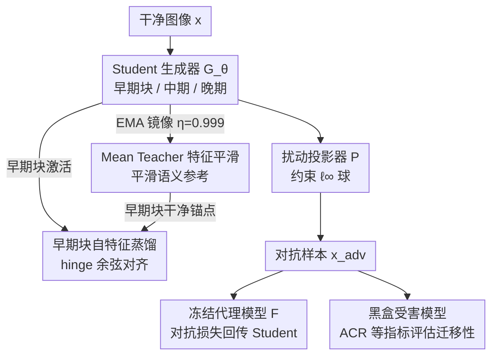

# Improving Black-Box Generative Attacks via Generator Semantic Consistency

**会议**: ICLR 2026  
**arXiv**: [2506.18248](https://arxiv.org/abs/2506.18248)  
**代码**: 待发布  
**领域**: 音频语音  
**关键词**: 生成式对抗攻击, 黑盒可迁移性, Mean Teacher, 语义一致性, 特征蒸馏

## 一句话总结

通过分析生成器中间层特征的语义退化现象，提出基于 Mean Teacher 的语义结构感知框架，在生成器早期层进行自特征蒸馏以保持语义一致性，从而增强对抗样本在跨模型、跨域、跨任务场景中的可迁移性。

## 研究背景与动机

**领域现状与痛点**：生成式对抗攻击训练一个扰动生成器，在白盒代理模型上学习后，将生成的扰动施加到未见过的黑盒受害模型上。与迭代攻击相比，生成式方法推理效率更高、可扩展性和可迁移性更好。但现有方法几乎都把生成器当成黑盒，只优化端到端的代理损失，忽略了生成器内部如何表征语义信息（物体边界、粗糙形状），白白浪费了一个可以直接干预的内部信号。

**关键观察**：作者把训练后生成器的中间激活按残差块位置划分为**早期（early）**、**中期（mid）**、**晚期（late）**三段并逐块量化，发现早期块始终保留输入图像的粗糙语义结构（物体轮廓、形状先验），而中后期块随着扰动累积，语义线索逐渐退化散失。换句话说，只要在早期块把语义完整性锁住，后续层的扰动就能更聚焦在物体显著区域，迁移性随之增强。

**核心矛盾与目标**：问题因此收敛为两个具体问句——在生成器的哪个阶段语义线索开始退化？哪些中间块对可迁移性影响最大？本文的核心 idea 就是回答它们：用一个时间平滑的参考，只在早期块上把尚未退化的语义结构钉住，让扰动学得更"懂语义"。

## 方法详解

### 整体框架

方法是一个可叠加到任意生成式攻击基线上的即插即用模块，围绕 Student–Teacher 双生成器展开。Student 生成器 $\mathcal{G}_\theta$ 照常经梯度下降训练、产出对抗扰动；Teacher 生成器 $\mathcal{G}_{\theta'}$ 不参与反传，而是用指数移动平均（EMA）镜像 Student，给出一份随时间平滑的特征参考。训练时一张干净图像送进 Student，早期块的激活被一个**自特征蒸馏**损失拉向 Teacher 对应早期块的语义参考；Student 输出的扰动经投影器 $\mathcal{P}$ 约束到 $\ell_\infty$ 球内得到对抗样本，再由一个冻结的代理模型 $\mathcal{F}$ 提供对抗监督、把梯度回传给 Student。整套机制的落脚点很明确——在最靠输入的早期块把尚未退化的粗糙语义结构钉住，让后续层的扰动去填充物体显著区域。代理上的对抗目标保持不变，蒸馏只是额外加挂的一路引导。

### 关键设计

**1. Mean Teacher 特征平滑：给"语义参考"去噪**

直接拿当前 Student 自己的中间特征当对齐目标并不可靠——对抗训练本身会让特征图夹带大量高频扰动伪影，参考目标随训练剧烈抖动。方法因此引入一个不参与反传的 Teacher 生成器，用 EMA 跟随 Student：$\theta' \leftarrow \eta\theta' + (1-\eta)\theta$，动量 $\eta=0.999$。如此高的动量意味着 Teacher 是 Student 历史轨迹的长期平均，单步扰动伪影被抹平，留下稳定且语义连贯的中间特征图，正好充当 Student 自我对齐时的"干净锚点"。

**2. 早期块自特征蒸馏：只在早期块锁住语义**

关键观察表明早期块（实验取 $L_{\text{early}}=\{1,2\}$）保留最多语义、中后期块语义随扰动累积流失，所以蒸馏只施加在早期块上，逼 Student 的早期激活逼近 Teacher 的语义丰富特征。对齐用余弦相似度加铰链（hinge）形式：

$$\mathcal{L}_{\text{distill}} = \sum_{\ell=1}^{L_{\text{early}}} \mathcal{W}_{\text{distill}} \max(0, \tau - \cos(\mathbf{g}_s^{(\ell)}, \mathbf{g}_t^{(\ell)}))$$

其中 $\mathbf{g}_s^{(\ell)}$、$\mathbf{g}_t^{(\ell)}$ 分别是 Student 与 Teacher 在第 $\ell$ 块的激活，$\tau=0.6$ 是相似度阈值，$\mathcal{W}_{\text{distill}}$ 是可学习的 softmax 权重。铰链项只在相似度低于 $\tau$ 时才惩罚——一旦语义对齐到足够程度就放手，避免过度约束削弱攻击强度；可学习权重则让模型自行决定两个早期块各拉多紧。

**3. ACR 指标：把"帮倒忙"的攻击算进账**

这是评估侧的贡献。传统协议只看攻击是否让预测出错，却忽略了攻击有时反而把原本错的预测"修正"成对的情况，这会高估攻击的真实破坏力。方法提出 Accidental Correction Rate（偶然纠正率，ACR），专门统计攻击过程中这类被意外纠正的样本占比；ACR 越低，说明攻击越"纯粹"地在破坏而非误打误撞地帮忙，从而给攻击效能一个更诚实的刻画。

### 损失函数 / 训练策略

对抗监督沿用代理特征空间的余弦相似度，让对抗样本 $x^{adv}$ 的代理特征尽量偏离干净样本 $x$：$\mathcal{L}_{\text{adv}} = \cos(\mathcal{F}_k(x), \mathcal{F}_k(x^{adv}))$。总损失把对抗项与蒸馏项加权相加，$\mathcal{L} = \mathcal{L}_{\text{adv}} + \lambda_{\text{distill}} \cdot \mathcal{L}_{\text{distill}}$，权重 $\lambda_{\text{distill}}=0.7$。代理特征取 VGG-16 第 16 层（Maxpooling.3），在 ImageNet-1K 上训练，扰动预算 $\epsilon=10$。由于蒸馏只动 Student 自身的早期特征、不需要额外标注或外部模型，整套方案可作为即插即用模块叠加到任何现有生成式攻击基线上。

## 实验关键数据

### 主实验（跨模型迁移）
本方法作为即插即用模块，可叠加到任何现有生成式攻击基线上：

| 基线方法 | 跨模型 ASR 提升 | 跨域 ASR 提升 | 跨任务改进 |
|---------|---------------|-------------|-----------|
| BIA (基线) | 显著提升 | 显著提升 | 一致改进 |
| CDA + Ours | ✓ | ✓ | ✓ |
| LTP + Ours | ✓ | ✓ | ✓ |
| GAMA + Ours | ✓ | ✓ | ✓ |
| FACL + Ours | ✓ | ✓ | ✓ |
| PDCL + Ours | ✓ | ✓ | ✓ |

### 跨域迁移（CUB-200、Stanford Cars、FGVC Aircraft）
以 BIA 为基线，使用 VGG-19 代理时：
- 准确率下降 10.05%p（越低越好）
- ASR 提升 11.20%p
- FR 提升 10.39%p
- ACR 下降 2.26%p（越低越好）

### 消融实验

| 配置 | 关键指标 | 说明 |
|------|---------|------|
| 早期块蒸馏 (1,2) | 最优 | 早期块保留最多语义信息 |
| 中期块蒸馏 | 较差 | 语义已部分退化 |
| 晚期块蒸馏 | 最差 | 语义严重退化 |
| τ=0.6 | 最优 | 平衡攻击强度 |
| Without Mean Teacher | 下降 | 缺乏时间平滑参考 |

### 关键发现
- 方法在所有四个跨设定（跨模型、跨域、跨任务SS、跨任务OD）上都有一致提升
- 在对抗净化防御（NRP）下仍保持鲁棒性
- 感知质量（PSNR/SSIM/LPIPS）未受损害，甚至略有改善
- 多次随机种子实验表明训练稳定性好（标准差小）
- 在CLIP零样本分类上的表现则因基线而异

## 亮点与洞察

1. **生成器内部语义分析**：首次系统性地分析了对抗扰动生成器中间层特征的语义退化现象，发现早期块是保持语义完整性的关键
2. **即插即用设计**：作为通用框架，可以叠加到任何现有的生成式对抗攻击方法上，带来一致的性能提升
3. **ACR 指标**：揭示了现有评估协议的不足——传统指标忽略了"偶然纠正"（攻击后预测反而变正确）的情况
4. **差异图分析**：可视化证实了本方法在残差块中生成的对抗噪声更集中在物体语义结构上

## 局限与展望

- 方法的效果依赖于生成器架构——如果早期中间块特征缺乏丰富语义线索（如U-Net等不同架构），蒸馏机制的改进有限
- 在图像分类之外的任务（检测、分割）上的可迁移性提升有限，表明分类导向的代理模型难以充分对齐其他任务的特征表示
- 本方法聚焦于生成器内部语义保持，与显式针对"良性-对抗差异"的方法原理不同，两者可互补使用

## 相关工作与启发

- **BIA** (Zhang et al., 2022)：基线方法，使用代理特征空间的相似度损失
- **GAMA** (Aich et al., 2022)：利用 CLIP 视觉-语言模型增强生成攻击
- **Mean Teacher** (Tarvainen & Valpola, 2017)：原用于半监督学习，本文创新性地引入对抗攻击领域
- 启发：中间层特征的语义分析思路可推广到其他生成任务中，如图像修复、风格迁移等

## 评分
- 新颖性: ⭐⭐⭐⭐ — 生成器语义退化分析视角新颖，但Mean Teacher本身非新技术
- 实验充分度: ⭐⭐⭐⭐⭐ — 跨模型/域/任务全面评估，消融充分，含净化防御/零样本测试
- 写作质量: ⭐⭐⭐⭐ — 动机清晰，可视化丰富
- 价值: ⭐⭐⭐⭐ — 即插即用、一致提升，对对抗鲁棒性研究有参考价值

<!-- RELATED:START -->

## 相关论文

- [\[NeurIPS 2025\] From Black Box to Biomarker: Sparse Autoencoders for Interpreting Speech Models of Parkinson's Disease](../../NeurIPS2025/audio_speech/from_black_box_to_biomarker_sparse_autoencoders_for_interpreting_speech_models_o.md)
- [\[ICLR 2026\] AVERE: Improving Audiovisual Emotion Reasoning with Preference Optimization](avere_improving_audiovisual_emotion_reasoning_with_preference_optimization.md)
- [\[ICLR 2026\] Discovering and Steering Interpretable Concepts in Large Generative Music Models](discovering_and_steering_interpretable_concepts_in_large_generative_music_models.md)
- [\[AAAI 2026\] Aligning Generative Music AI with Human Preferences: Methods and Challenges](../../AAAI2026/audio_speech/aligning_generative_music_ai_with_human_preferences_methods_and_challenges.md)
- [\[ACL 2026\] Retrieving to Recover: Towards Incomplete Audio-Visual Question Answering via Semantic-consistent Purification](../../ACL2026/audio_speech/retrieving_to_recover_towards_incomplete_audio-visual_question_answering_via_sem.md)

<!-- RELATED:END -->
