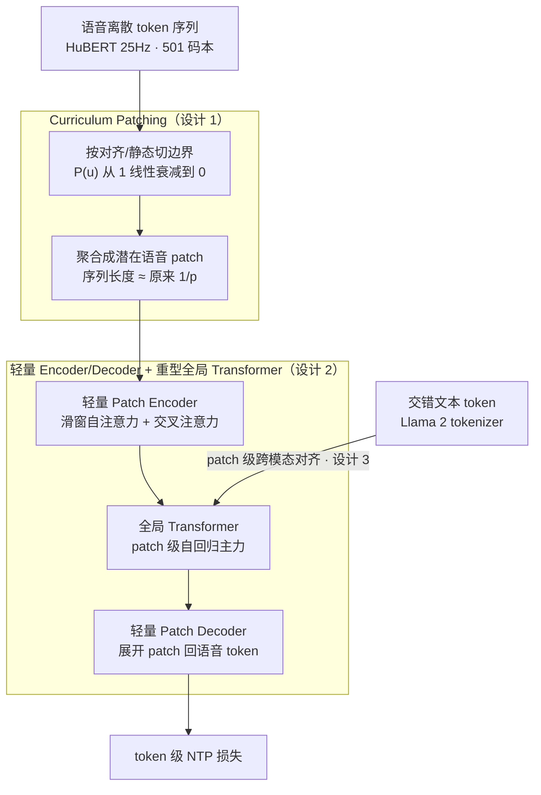

# Latent Speech-Text Transformer

**会议**: ICLR 2026 Oral  
**arXiv**: [2510.06195](https://arxiv.org/abs/2510.06195)  
**代码**: [GitHub](https://github.com/facebookresearch/lst)  
**领域**: 音频语音  
**关键词**: speech-text modeling, latent patches, autoregressive, ASR, TTS, cross-modal alignment, BLT

## 一句话总结
提出 Latent Speech-Text Transformer (LST)，将离散语音 token 聚合为更高层级的"潜在语音 patch"作为自回归单元（类似 BLT 对 bytes 的处理），对齐语音和文本的序列建模粒度（从 20× 缩小到 ~1:1），在 speech HellaSwag 上获得 +6.5% 绝对提升且增益从 420M→7B 持续增长，同时降低 ASR/TTS 推理计算成本。

## 研究背景与动机
**领域现状**：语音离散 token（如 HuBERT 25Hz，501 码本）使得自回归语音 LM 成为可能。但语音 token 序列远长于对应文本（10-20×），导致训练和推理效率远低于文本 LLM——据估计需要比文本多三个数量级的数据才能达到同等能力。

**现有痛点**：
   - **信息密度不匹配**：语音 token 序列与文本 token 在序列长度上严重不对称，阻碍跨模态知识迁移
   - **计算分配不均**：预训练和推理时大部分计算花在长语音序列上，而非有意义的语义建模
   - **现有对齐尝试不足**：warm initialization（从文本 LLM 初始化）、交错训练虽有帮助，但 speech→speech 和 text→text 性能仍有显著差距
   - BPE 在语音 token 上失效（Cuervo & Marxer 2024 报告）——简单的子词切分不适用于语音

**核心矛盾**：语音建模需要细粒度 token（25Hz），但自回归建模在长序列上效率低且跨模态对齐差

**核心 idea**：借鉴 Byte Latent Transformer (BLT) 的思想——将语音 token 聚合为"潜在 patch"（高层自回归单元），全局 Transformer 在 patch 级别建模，轻量解码器展开 patch 为语音 token。Patch 粒度与文本 token 对齐

## 方法详解

### 整体框架
LST 把语音离散 token 序列 $\{s_0,\ldots,s_T\}$ 先用一个轻量 Patch Encoder 聚合成数量少得多的"潜在语音 patch" $\{z_0,\ldots,z_{T'}\}$（$T'\ll T$），让主力的全局 Transformer 在 patch 与文本 token 这两种粒度相当的单元上做统一自回归，再用一个轻量 Patch Decoder 把每个 patch 还原回语音 token 并算标准 NTP 损失。整套结构沿用 Byte Latent Transformer 的"细粒度 token → 高层 patch → 全局建模 → 解码展开"思路，只是把对象从 byte 换成了语音 token，从而把语音相对文本 20× 的长度差压回到接近 1:1。

### 关键设计

**1. 三种 Patching 策略与 Curriculum 过渡：在"语义对齐"和"推理无依赖"之间拿全**

如何切 patch 直接决定语音能不能和文本对上粒度。最朴素的 Static Patching 用固定大小 $p$ 做非重叠切分（如 $p=3$，每 3 个语音 token 合成一个 patch），简单高效、推理时不需要任何外部模型，但切点和语义边界无关。Alignment Patching 则先用 Wav2Vec2+CTC 强制对齐拿到语音-文本时间戳，让每个文本单元（词 / BPE）对应一个 patch、静默段单独成 patch，对齐质量最好，但代价是推理时仍要挂一个对齐模型，不实用。LST 的最终方案是 Curriculum Patching：训练早期用 alignment 享受语义对应，随后让"采用对齐切分"的概率 $P(u)$ 在训练步区间 $[\tau_1,\tau_2]$ 上从 $1$ 线性衰减到 $0$，平滑切换到 static。这样对齐信号在前期被"蒸馏"进 patch 表示里，后期即使换成静态切分模型也保留了学到的语义对应，推理时彻底摆脱对齐模型——既要了对齐的质量，又去掉了对齐的依赖。值得注意的是，直接把 BPE 子词切分搬到语音 token 上是失效的（Cuervo & Marxer 2024），这也是为什么 LST 走 patch 路线而非词表压缩。

**2. 轻量 Encoder / Decoder + 重型全局 Transformer：把算力花在 patch 级语义而非冗余 token 上**

Patch Encoder 由滑动窗口自注意力加交叉注意力组成，把窗口内的 token 嵌入聚合成一个 patch 嵌入；Patch Decoder 是一个轻量 Transformer，每层插入交叉注意力以接收对应 patch 的信息，自注意力窗口限制在 512 token 内逐步还原语音 token。关键在于算力分配：主要 FLOPs 集中在 patch 级的全局 Transformer 上，而 Encoder / Decoder 都做得很轻。由于全局建模在长度只有原来 $1/p$ 量级的 patch 序列上进行，自回归的主开销随之大幅下降，长距离依赖也更容易学，这正是 LST 能同时降低 ASR/TTS 推理成本又不掉重建质量的原因。

**3. patch 级的跨模态对齐：让语音和文本在同一序列里以相近粒度共存**

把语音压成 patch 后，它与文本 token 在序列长度上趋于一致，于是二者可以放进同一条自回归序列里被同等对待。训练采用交错数据——同一语料的语音段和文本段交替出现，部分语音段被替换为对应文本——迫使模型在两种模态间来回预测。结果是 patch 会自动学到与音节 / 单词的对应关系，打通 speech↔text 的知识迁移通道；这也是为什么跨模态训练不仅没拖累文本能力，反而能反向小幅提升 text→text 表现。

### 损失函数 / 训练策略
全模型端到端训练（Patch Encoder + 全局 Transformer + Patch Decoder 一起优化），目标是作用在 Patch Decoder 输出上的标准 token 级 NTP 损失。语音侧用 HuBERT 25Hz、501 码本的 tokenizer 离散化，文本侧用 Llama 2 tokenizer。

## 实验关键数据

### 主实验（Speech HellaSwag，story completion）

| 设置 | 条件 | LST 提升 |
|------|------|---------|
| Compute-controlled（同训练步数） | 420M | +6.5% absolute |
| Data-controlled（同数据量） | 420M | +5.3% absolute |
| Compute-optimal scaling | 420M → 1.8B | **增益随规模增长** |
| Fixed-token budget | 7B, 70B tokens | 增益持续 |

关键：增益不仅不饱和，而且**随模型增大持续增长**——说明 LST 改善了 compute-optimal scaling。

### 下游任务

| 任务 | 效果 | 说明 |
|------|------|------|
| ASR 适应 | 更稳定 | patch 级建模减少了长距离依赖问题 |
| TTS 推理 | 序列更短，计算更低 | 压缩序列长度的直接好处 |
| 重建质量 | 不降低 | 证明 patch 压缩无损 |
| Text→Text | 也有提升 | 跨模态训练反向提升文本能力 |

### 消融实验

| 配置 | 效果 | 说明 |
|------|------|------|
| 无 patching（baseline） | 基线 | 标准交错训练 |
| BPE on speech tokens | 无改善/退化 | 确认 BPE 对语音 token 不适用 |
| Static patching (p=3) | 显著提升 | 即使简单切分也有效 |
| Alignment patching | 最好但需辅助模型 | 语义对齐的价值 |
| **Curriculum patching** | **最佳平衡** | 保留对齐好处 + 无需推理辅助模型 |

### 关键发现
- **信息密度对齐是核心**：将语音和文本拉到相近的序列长度后，跨模态知识迁移显著改善——支持了"粒度不匹配是主要瓶颈"的假设
- 即使最简单的 static patching 也有效——说明问题不在于精确的语义对齐，而在于减少语音序列的冗余
- **Patch 自动学习到语义对应**：curriculum patching 从对齐开始但最终切换到静态，模型保持了学到的对应——说明对齐信号可以被"蒸馏"到 patch 表示中
- 增益随模型规模增长——这对 scaling law 有重要含义：LST 可能改变了语音 LM 的 compute-optimal 点
- 文本性能也提升——语音 patching 不仅不损害文本，反而通过更好的跨模态训练间接提升

## 亮点与洞察
- **BLT 范式从文本到语音的成功迁移**：Byte Latent Transformer 的核心思想（将细粒度 token 聚合为 patch 做全局建模）在语音域同样有效，且可能更有用（语音的冗余比 bytes 更大）
- **效率与质量双赢**：降低序列长度同时提升质量——不是 trade-off 而是 win-win。原因：更短的序列使全局 Transformer 更容易学到长距离依赖
- **Curriculum 的巧妙设计**：alignment patching 需要推理辅助模型（不实用），static patching 丢失语义对齐（不最优），curriculum 从前者平滑过渡到后者——训练用对齐，推理用静态

## 局限与展望
- Patch 大小的选择对不同语言（音节结构差异大）和说话速率的鲁棒性未充分验证
- 仅使用 HuBERT semantic tokens，未测试 codec-based acoustic tokens（如 SoundStorm）
- 未与 Moshi、Spirit-LM 等端到端语音 LLM 做直接对比
- Curriculum 调度的超参数 $\tau_1, \tau_2$ 需要调优
- 7B 实验在次优 token budget（70B vs 最优 ~140B）下进行，完整 compute-optimal 实验成本高

## 相关工作与启发
- **vs BLT (Pagnoni 2024)**：LST 将 BLT 的 byte→patch 思想迁移到 speech token→speech patch，直接启发
- **vs Nguyen 2025（交错训练）**：交错训练是基线方法，LST 在此基础上增加 patching——正交改进
- **vs Moshi（端到端语音 LLM）**：Moshi 用多流建模，LST 用 patch 压缩——不同的解决信息密度不匹配的路径

## 评分
- 新颖性: ⭐⭐⭐⭐ 潜在 patch 概念简洁有效，BLT→语音的迁移既自然又有非显然的设计考虑
- 实验充分度: ⭐⭐⭐⭐⭐ 多尺度（420M→7B）× 两种控制设置 × 下游任务 × 充分消融
- 写作质量: ⭐⭐⭐⭐ 清晰易懂，从动机到设计到实验逻辑流畅
- 价值: ⭐⭐⭐⭐⭐ ICLR Oral 实至名归，对语音-文本联合建模有重要指导意义，改善了 scaling behavior

<!-- RELATED:START -->

## 相关论文

- [\[ACL 2026\] ImmersiveTTS: Environment-Aware Text-to-Speech with Multimodal Diffusion Transformer and Domain-Specific Representation Alignment](../../ACL2026/audio_speech/immersivetts_environment-aware_text-to-speech_with_multimodal_diffusion_transfor.md)
- [\[ICLR 2026\] Scalable Multilingual Multimodal Machine Translation with Speech-Text Fusion](scalable_multilingual_multimodal_machine_translation_with_speech-text_fusion.md)
- [\[AAAI 2026\] SpikCommander: A High-Performance Spiking Transformer with Multi-View Learning for Efficient Speech Command Recognition](../../AAAI2026/audio_speech/spikcommander_a_high-performance_spiking_transformer_with_multi-view_learning_fo.md)
- [\[ICLR 2026\] VowelPrompt: Hearing Speech Emotions from Text via Vowel-level Prosodic Augmentation](vowelprompt_hearing_speech_emotions_from_text_via_vowel-level_prosodic_augmentat.md)
- [\[ICLR 2026\] TASTE: Text-Aligned Speech Tokenization and Embedding for Spoken Language Modeling](taste_text-aligned_speech_tokenization_and_embedding_for_spoken_language_modelin.md)

<!-- RELATED:END -->
