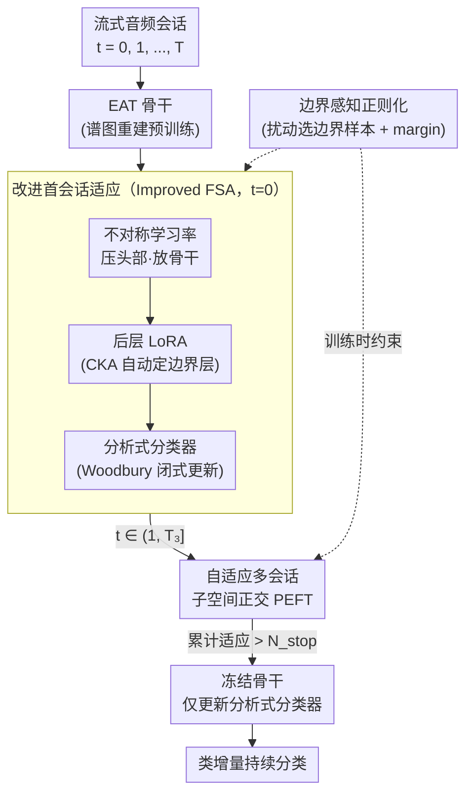

# PACE: Pretrained Audio Continual Learning

**会议**: ICLR 2026  
**arXiv**: [2602.03355](https://arxiv.org/abs/2602.03355)  
**代码**: 有（将随论文发布）  
**领域**: 音频语音  
**关键词**: 音频持续学习, 预训练模型, 参数高效微调, 分析式分类器, 灾难性遗忘

## 一句话总结

首次系统性构建音频持续学习基准，揭示预训练音频模型因底层频谱特征主导导致的上游-下游不匹配问题，提出 PACE 方法（改进首会话适应 + 自适应子空间正交 PEFT + 边界感知扰动），在 6 个音频 CL 基准上大幅超越 SOTA。

## 研究背景与动机

预训练音频模型在静态任务上表现优异，但面临数据分布持续演化的场景时容易灾难性遗忘。将视觉域的持续学习（CL）方法直接迁移到音频域面临根本性障碍：

**上游-下游不匹配严重**：音频骨干（如 EAT）通过谱图重建预训练，强调低层时频模式而非结构化语义，但下游 CL 需要高层判别性表示

**表示漂移更剧烈**：音频域相邻会话间的表示变化远超视觉域（t-SNE/CKA 量化证实），导致更严重遗忘

**PEFT 方法失效**：L2P、DualPrompt 等在音频上退化幅度约为视觉上的 3 倍

三个关键发现驱动方法设计：

| 发现 | 内容 | 影响 |
|------|------|------|
| Finding 1 | 统计方法（FSA + 分析式分类器）优于 PEFT 方法 | 确立技术路线 |
| Finding 2 | 粗粒度存在表示饱和：首会话已捕获大部分信息 | 需改进 FSA |
| Finding 3 | 细粒度差距更大：首会话不足以弥合语义鸿沟 | 需多会话适应 |

## 方法详解

### 整体框架

PACE 要解决的是：预训练音频骨干（如 EAT）的谱图重建目标和下游持续学习的判别需求隔得太远，导致直接迁视觉 CL 方法会剧烈遗忘。它的思路是顺着会话的推进逐步"喂"骨干、又不让新会话踩坏旧会话学到的表示。整条流水线随会话索引 $t$ 分三段走：第一个会话（$t=0$）做**改进首会话适应**——不再只学个分类头，而是用不对称学习率把梯度逼进深层骨干、配后层 LoRA 真正调骨干，再换上免训练的分析式分类器；中间会话（$t \in (1, T_3]$）做**自适应多会话子空间正交 PEFT**，每个会话挂独立 LoRA 继续学，但把梯度投影到不干扰旧任务的子空间里；当累计适应量超过阈值 $N_{stop}$ 就转入第三段，冻结骨干、只让分析式分类器闭式吸收新类。整个训练过程还并行挂着**边界感知正则化**，把新旧类纠缠的决策边界重新撑开。

### 关键设计

**1. 改进首会话适应（Improved FSA）：让音频骨干在第一个会话就充分适应，而不是只学个分类头**

朴素 FSA 把分类头和骨干一起联合训练，结果头部很快过拟合、骨干却没怎么动，这在音频域尤其致命——前面的发现已表明音频骨干的预训练目标（谱图重建）和下游判别任务隔得太远，必须真正调骨干。PACE 因此做了三件事。其一是**受限头部学习**：用不对称学习率 $\eta_{head} \ll \eta_{bb}$ 压住头部、放开骨干，并分两段走——先冻结骨干训练头部 $E_{head}$ 轮，再冻结头部微调骨干 $E_0$ 轮。这恰好和视觉 CL 里 LAE/SLCA "抑制骨干漂移"的思路相反，因为音频骨干需要被鼓励适应而非被锁死。其二是**后层 LoRA**：CKA 分析显示浅层编码的是域通用的时频模式、深层才编码任务特定语义，所以只对深层动刀——冻结前 $L_{tune}-1$ 层，仅在 $l \geq L_{tune}$ 的层上加 LoRA：

$$W_1^l = W_0^l + A_1^l B_1^l, \quad L_{tune} \leq l \leq L$$

边界层 $L_{tune}$ 不手调，而是按 CKA 偏差阈值 $\rho_{layer}$ 自动定位"语义开始分化"的那一层。其三是用**分析式分类器**替掉可训练头部：先用随机投影 $W_{proj}$ 把特征打散增强判别性，再用 Woodbury 恒等式递归更新自相关矩阵

$$R_t = R_{t-1} - R_{t-1}\hat{Z}_t^\top(I + \hat{Z}_t R_{t-1} \hat{Z}_t^\top)^{-1}\hat{Z}_t R_{t-1}$$

从而闭式解出分类器权重。这样既不需要存旧样本，新会话的更新也是非破坏性的，天然回避了头部累积偏差。

**2. 自适应多会话子空间正交 PEFT：单靠首会话填不平细粒度任务的语义鸿沟，就让后续会话继续学但互不干扰**

发现 3 表明细粒度任务上首会话远远不够，于是 PACE 在会话 $t \in (1, T_3]$ 引入多会话适应（MSA）：每个会话挂一组独立的 LoRA，已学会话的参数全部冻结，骨干权重写成历史增量之和

$$W_t = W_0 + \sum_{\tau=0}^{t-1} B_\tau A_\tau + B_t A_t$$

光叠加还不够，关键是新会话的更新不能踩坏旧任务的表示，所以对梯度做子空间投影约束：

$$g_{update} = P_{\mathcal{U}_t} \nabla_\theta \mathcal{L}_{ce}(g_t(f_t(\mathcal{X}_t)), \mathcal{Y}_t)$$

难点在于怎么算出这个该被保护的子空间又不存历史特征——这正是本文最巧的一手"LoRA 减法"。它把已学的 LoRA 反向减回去构建一个"遗忘模型" $W_t^{unlearn} = W_0 - \sum_{\tau=0}^{t-1} A_\tau B_\tau$，用它算出当前会话特征的非中心协方差矩阵 $X_t^{ucov}$，再做 SVD 取能量比 $> \rho_{svd}$ 的主成分张成投影子空间。整个过程只靠参数算术近似旧任务表示，完全不必缓存历史特征。最后配一个**自适应冻结**开关：当累计适应量 $\sum_{i=0}^{T_3} N_t > N_{stop}$，说明骨干已经学够了，就转入 Stage 3 把骨干冻住、只留分析式分类器继续吸收新类。

**3. 边界感知正则化：把新旧类别在特征空间里纠缠的决策边界重新撑开**

持续学习里新类容易和旧类挤在边界附近，导致互相误判。PACE 先把这些"危险样本"挑出来：对每个输入做 $N_p$ 次时频掩码扰动 $\tilde{x}_{i,t}^k = \mathcal{Q}(x_{i,t}, r_T, r_F)$，用一个临时模型 $\theta_{temp}$ 去测——如果扰动后的误分类率超过阈值 $\rho_p$，说明这个样本靠近边界、判别不稳，就收进边界集 $\mathcal{B}_t$。然后对边界样本施加一个 margin 形式的正则项：

$$\mathcal{L}_{reg}(i) = \max(0, \delta + \frac{1}{|\mathcal{S}_i|}\sum_{u \in \mathcal{S}_i}\|f_t(u) - \mu(x_c)\|_2^2 - \min_{b \in \mathcal{B}_t}\|f_t(x_{i,t}) - b\|_2^2)$$

一边把样本拉向自己的类中心 $\mu(x_c)$，一边把它推离最近的边界点，等效于强行加大类间间距，让纠缠的决策边界重新分开。

### 损失函数 / 训练策略

- FSA 阶段：交叉熵 $\mathcal{L}_{ce}$ + 边界正则化 $\mathcal{L}_{reg}$
- MSA 阶段：交叉熵 + 正则化 + 子空间正交梯度投影
- Stage 3：仅更新分析式分类器（闭式解，无梯度训练）
- 预训练骨干：EAT（12 层 ViT，AudioSet-2M 自监督预训练，~5000 小时）
- 数据增强：SpecAugment 风格的时频遮掩

## 实验关键数据

### 主实验

**表1：6 个音频 CL 基准的平均 Top-1 准确率（%）**

| 方法 | ESC-50 | US8K | SC2 | TIMIT-2 | TIMIT-3 | VocalSet |
|------|--------|------|-----|---------|---------|----------|
| Joint Training (上界) | 96.50 | 98.07 | 95.91 | 95.22 | 95.22 | 76.65 |
| L2P | 39.50 | 38.75 | 14.70 | 1.50 | 2.53 | 20.39 |
| RanPAC (w/ FSA) | 92.25 | 97.08 | 90.53 | 85.63 | 89.92 | 62.82 |
| HiDe-Prompt | 83.75 | 79.89 | 40.10 | 47.78 | 49.60 | 48.36 |
| **PACE** | **95.75** | **97.49** | **91.87** | **90.95** | **94.05** | **69.08** |

**与联合训练上界的差距**：ESC-50 仅 0.75%，US8K 仅 0.58%，TIMIT-3 仅 1.17%。

**表2：消融——改进 FSA 组件（粗粒度）**

| 策略 | ESC-50 | US8K | SC2 |
|------|--------|------|-----|
| w/o FSA | 92.50 | 96.49 | 81.22 |
| Naive FSA | 92.25 | 97.08 | 90.53 |
| + Low LR | 93.75 | 97.35 | 90.95 |
| + Later Layer LoRA | **95.75** | **97.49** | **91.87** |

### 消融实验

PACE 在 SSLAM 骨干上同样保持优势，验证骨干无关性。

细粒度基准上 MSA 的贡献：
- FSA only → +MSA: +3.2% (TIMIT-2)
- +子空间正交: +1.5%
- +边界感知正则化: +0.6%

### 关键发现

1. **音频 vs 视觉 CL 的本质差异**：音频骨干强调低层频谱导致表示漂移 3× 于视觉
2. **FSA 反直觉发现**：音频 CL 需鼓励骨干适应（与视觉 CL 相反），冻结浅层+调深层是关键
3. **分析式分类器稳定性**：避免累积偏差和表示漂移传播
4. **LoRA 减法创新用法**：不需存储历史特征即可近似旧任务表示子空间

## 亮点与洞察

- **首个系统性音频 CL 基准**：6 个基准覆盖粗/细粒度、语音/音乐/环境声
- **"需要适应而非冻结"**：与视觉域"冻结骨干足矣"形成鲜明对比，揭示音频预训练模型独特性质
- **三阶段渐进式框架**：FSA→MSA→冻结自然平衡可塑性与稳定性
- **LoRA 减法构建"遗忘模型"**：利用参数算术近似历史表示子空间，优雅高效

## 局限与展望

1. LoRA 减法假设近似性：减去 LoRA ≠ 精确遗忘，高 rank/强适应场景可能偏差较大
2. 边界检测依赖临时模型 $\theta_{temp}$ 质量
3. 自适应冻结阈值 $N_{stop}$ 需手动设定，不同场景最优值可能不同
4. 仅验证类增量设置，任务感知/域增量等其他 CL 设置未涉及
5. VocalSet 差距仍达 7.57%，细粒度音乐任务的不匹配最严重

## 相关工作与启发

- **RanPAC** 的分析式分类器是技术路线基石
- **LoRA Subtraction** 的参数减法被创新性地用于构建零空间投影
- **EAT** 的谱图重建预训练目标与下游分类的不匹配是核心问题来源
- 启发：预训练目标与下游任务的对齐程度决定 CL 难度

## 评分

- 新颖性: ⭐⭐⭐⭐ — 首个音频 CL 基准 + 三阶段框架
- 技术深度: ⭐⭐⭐⭐⭐ — 子空间正交 PEFT + 边界感知正则化理论完整
- 实验充分度: ⭐⭐⭐⭐⭐ — 6 个基准、多骨干验证、全面消融
- 实用价值: ⭐⭐⭐⭐ — 音频 CL 的切实需求，但部署场景待明确

<!-- RELATED:START -->

## 相关论文

- [\[CVPR 2025\] Learning to Highlight Audio by Watching Movies](../../CVPR2025/audio_speech/learning_to_highlight_audio_by_watching_movies.md)
- [\[CVPR 2026\] Semantic Noise Reduction via Teacher-Guided Dual-Path Audio-Visual Representation Learning](../../CVPR2026/audio_speech/semantic_noise_reduction_via_teacher-guided_dual-path_audio-visual_representatio.md)
- [\[ICLR 2026\] EmotionThinker: Prosody-Aware Reinforcement Learning for Explainable Speech Emotion Reasoning](emotionthinker_prosody-aware_reinforcement_learning_for_explainable_speech_emoti.md)
- [\[ACL 2026\] Privacy-preserving Prosody Representation Learning](../../ACL2026/audio_speech/privacy-preserving_prosody_representation_learning.md)
- [\[CVPR 2026\] SAVE: Speech-Aware Video Representation Learning for Video-Text Retrieval](../../CVPR2026/audio_speech/save_speech-aware_video_representation_learning_for_video-text_retrieval.md)

<!-- RELATED:END -->
