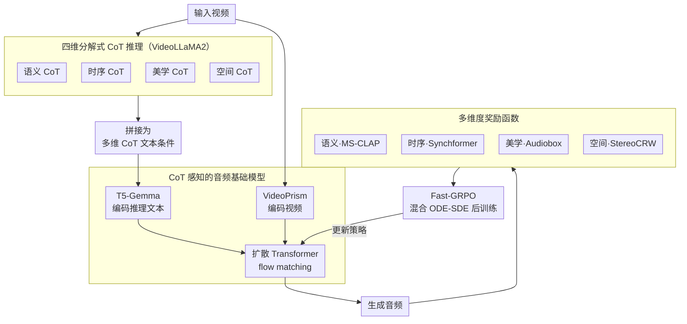

# PrismAudio: Decomposed Chain-of-Thoughts and Multi-dimensional Rewards for Video-to-Audio Generation

**会议**: ICLR 2026  
**arXiv**: [2511.18833](https://arxiv.org/abs/2511.18833)  
**代码**: [https://PrismAudio.github.io](https://PrismAudio.github.io)  
**领域**: LLM推理  
**关键词**: Video-to-Audio, Chain-of-Thought, 强化学习, 多维度奖励, 扩散模型

## 一句话总结

首次将分解式 Chain-of-Thought 推理与多维度强化学习（RL）结合应用于视频到音频（V2A）生成，通过四个专门化的 CoT 模块（语义/时序/美学/空间）配合对应奖励函数，解决了目标纠缠问题，并提出 Fast-GRPO 算法大幅降低 RL 训练开销。

## 研究背景与动机

**V2A 生成的多目标挑战**：视频到音频生成需要同时满足四个人类感知维度——语义一致性、时序同步、美学质量和空间精度，这些目标之间存在内在竞争与权衡关系

**目标纠缠问题**：现有方法使用单一损失函数，将多个竞争目标混合优化，导致模型无法在各维度间取得良好平衡。例如专注语义一致性可能导致美学质量下降

**单体推理的局限**：ThinkSound 等先驱工作虽然引入了 CoT 推理，但采用单一推理路径处理所有音频分析任务，导致不同分析框架被混淆、多模态幻觉频发

**缺乏人类偏好对齐**：现有 V2A 方法缺少从人类感知偏好中学习的机制，生成技术上"正确"但感知上不满意的音频

**RL 训练效率瓶颈**：现有 GRPO 实现（如 Flow-GRPO）需要在每个去噪步骤使用 SDE 采样，计算开销巨大

## 方法详解

### 整体框架

PrismAudio 要解决的核心矛盾是：视频到音频生成需要同时照顾语义、时序、美学、空间四个相互竞争的感知维度，而过去把它们塞进单一推理链、单一损失里一起优化，必然彼此稀释、顾此失彼。它的破题思路是「先按维度拆开推理，再按维度拆开奖励」：对同一段视频，先用四个专门的 CoT 模块各自产出一段结构化推理文本，拼接后作为条件喂给一个 CoT 感知的扩散音频骨干生成音频；训练后期再为每条推理路径配一个对应维度的奖励，用强化学习把各维度的生成质量分别校准。整个系统按预训练 → CoT 微调 → RL 后训练三阶段递进，而真正高效落地 RL 这一步靠的是 Fast-GRPO。

### 关键设计

**1. 四维分解式 CoT 推理：把纠缠的单体推理拆成四条专门路径**

ThinkSound 这类先驱用单一推理路径处理所有音频分析，结果是不同分析框架互相干扰、复杂场景里多模态幻觉频发——因为语义聚焦内容识别、时序关心事件先后、空间需要方向定位逻辑、美学又是主观质量评估，本质上是几套不同的思维方式，硬塞进一条链只会彼此稀释。PrismAudio 改为语义（Semantic）、时序（Temporal）、美学（Aesthetic）、空间（Spatial）四个专门 CoT 模块，各自只负责一个维度：语义识别音频事件及其属性、时序判定事件的先后顺序、美学评估自然度与保真度、空间分析声源的方位与远近。训练数据先由 Gemini 2.5 Pro 生成，再用它微调开源视频语言模型 VideoLLaMA2，让模型对同一视频产出四段专门化推理文本，按固定顺序拼接成「多维 CoT」作为增强的文本条件。每个维度有了独立的推理空间，分析更充分，也为下一步「每路推理配一个奖励」打开了接口。

**2. CoT 感知的音频基础模型：让骨干能"读懂"结构化推理**

骨干是一个扩散 Transformer + flow matching 的音频生成模型，先在大规模视频-音频对上做标准预训练。但作者发现 ThinkSound 沿用的编码器撑不起多维 CoT 条件：CLIP 把视频逐帧当静态图处理，缺乏对整段画面跨帧的语义把握；标准 T5 又难以消化四路 CoT 拼出来的、带逻辑结构和因果关系的长推理文本。为此视频侧用 VideoPrism 替换 CLIP，用专为视频理解设计的统一 ViT 捕获物体、动作、环境的跨帧语义；文本侧用 T5-Gemma 替换 T5，它把 decoder-only LLM 的推理能力适配进 encoder-decoder 架构，更能读懂结构化推理。这两处替换把骨干从"接受简单标签"升级为"接受多维推理条件"，是上一步分解式 CoT 能真正喂进生成模型的前提。

**3. 多维度奖励函数：给每条推理路径配一把专门的尺子**

既然推理已经按维度拆开，奖励也必须按维度对齐，否则单一重建损失又会把竞争目标混回去、逼出次优权衡。作者为四个维度各设计一个专门奖励：语义奖励用 MS-CLAP 评估音频-文本对齐，时序奖励用 Synchformer 评估音视频同步，美学奖励用免参考的 Audiobox Aesthetics 预测人类 MOS 分数，空间奖励用 StereoCRW 验证立体声方向精度。这种 CoT 与奖励一一对应的结构是全篇最核心的创新，它让 RL 信号能精准回流到对应的那条推理路径，从而在所有感知维度上做到均衡而非偏科的优化。

**4. Fast-GRPO：用混合 ODE-SDE 采样把 RL 开销压下来**

把 GRPO 搬到 flow matching 上有个效率死结：flow matching 的生成本是确定性 ODE，要做 RL 须先等价改写成随机 SDE 过程；而 Flow-GRPO、DanceGRPO 等纯 SDE 方法把整条去噪轨迹都当成 SDE，逼着 GRPO 在每个去噪步都评估策略，策略侧的函数评估次数随轨迹长度 $T$ 线性增长，训练极慢。Fast-GRPO 的观察是探索其实不必铺满全程——它在绝大部分轨迹上走确定性 ODE 步，只在随机选取的一个小窗口（宽度 $w \ll T$）内切换成 SDE 步注入随机性做探索。探索集中在少数步、其余步保持确定性，在保留 GRPO 探索能力的同时把策略评估次数从 $T$ 量级压到 $w$ 量级，使多维 CoT-RL 训练变得可行。

### 损失函数 / 训练策略

强化学习阶段采用 Windowed GRPO 目标，只在 SDE 窗口内的步骤上计算 clipped surrogate objective，与 Fast-GRPO 的稀疏探索一致。四路奖励按权重聚合为总奖励 $R_{total}^i = \sum_{k=1}^K \lambda_k R_k(\mathbf{x}_T^i, c)$，再对组内样本做均值和标准差归一化得到优势分数，驱动各维度推理的更新。整体训练按预训练 → CoT 微调 → RL 后训练三阶段推进，前两阶段建立能读懂多维条件的生成能力，最后用多维奖励完成人类偏好对齐。

## 实验关键数据

### 主实验

| 方法 | 参数量 | CLAP↑ | DeSync↓ | PQ↑ | CE↑ | CRW↓ | FD↓ | MOS-Q↑ | MOS-C↑ |
|------|--------|-------|---------|-----|------|------|------|--------|--------|
| ThinkSound | 1.3B | 0.43 | 0.55 | 6.15 | 3.95 | 13.47 | 1.17 | 4.05 | 4.18 |
| MMAudio | 1.03B | 0.40 | 0.46 | 5.94 | 3.88 | - | 2.17 | 3.95 | 4.03 |
| **PrismAudio** | **518M** | **0.47** | **0.41** | **6.38** | **4.29** | **7.72** | **1.08** | **4.21** | **4.22** |

VGGSound 测试集上，PrismAudio 在所有感知维度均达到 SOTA，且参数量仅为 ThinkSound 的 40%。

### 消融实验

| 奖励策略 | CLAP↑ | DeSync↓ | CE↑ | CRW↓ | FD↓ |
|----------|-------|---------|------|------|------|
| Baseline (No RL) | 0.47 | 0.42 | 3.81 | 15.30 | 1.90 |
| Semantic Only | 0.54 | 0.58 | 3.93 | 11.89 | 1.84 |
| Temporal Only | 0.46 | 0.35 | 3.63 | 13.08 | 1.88 |
| Aesthetic Only | 0.46 | 0.42 | 3.92 | 13.51 | 4.50 |
| **Multi-dimensional** | **0.52** | **0.36** | **4.26** | **12.87** | **1.53** |

### 关键发现

1. **单维奖励导致严重目标纠缠**：Semantic Only 使 CLAP 达到最高 0.54 但 DeSync 恶化到 0.58；Aesthetic Only 使 PQ 高达 7.06 但 FD 翻倍至 4.50
2. **多维奖励是唯一能实现全面均衡提升的方案**，同时改善语义、时序、美学和空间所有维度
3. **Fast-GRPO 比 Flow-GRPO 收敛快约 3 倍**，仅需 200 步即超越后者 600 步的最终性能，且最终奖励分数更高（0.51 vs 0.47）
4. **分解式 CoT 显著优于单体式**：MultiCoT 在语义（CLAP 0.52 vs 0.46）和美学（CE 4.26 vs 3.79）上大幅领先 Monolithic CoT

## 亮点与洞察

- **CoT-奖励对应设计**是本文最核心贡献：每个 CoT 模块与专门奖励函数配对，使 RL 优化能精准引导各维度推理改进
- **首次将 RL 引入 V2A 生成**，开辟了人类偏好对齐在音频生成领域的新范式
- AudioCanvas 基准（3177 视频、300 单事件类别、501 多事件样本）填补了 V2A 评估的空白
- 在域外 AudioCanvas 上，PrismAudio 的语义和同步指标甚至超越了真实音频（GT），说明 RL 框架能生成比自然音频更符合评估指标的结果

## 局限与展望

1. 域外超越 GT 的现象反映了代理指标与人类感知之间的差距，需要更好的评估指标
2. 四维 CoT 的类别划分是否最优仍有探索空间，可能存在更细粒度或不同维度的分解方式
3. AudioCanvas 中 CoT 标注依赖 Gemini 2.5 Pro，可能引入模型偏差
4. 当前仅支持 9 秒音频生成，对更长视频的扩展性有待验证

## 相关工作与启发

- **ThinkSound**：首次引入 CoT 推理的 V2A 方法，但采用单体推理且无 RL 对齐——本文直接解决其三大局限
- **Flow-GRPO / DanceGRPO**：将 GRPO 引入 flow matching 模型，但仅支持单目标优化且效率低——Fast-GRPO 的混合 ODE-SDE 是高效替代
- **RLHF in LLM**：文本领域的 RL 偏好对齐已非常成熟，本文将其推广到扩散模型的多维度音频生成，思路可迁移至图像/视频生成

## 评分

- **新颖性**: ⭐⭐⭐⭐⭐ 首次将分解式 CoT + 多维 RL 引入 V2A，CoT-奖励对应设计极具创新性
- **实验充分度**: ⭐⭐⭐⭐⭐ 域内域外评估、客观主观指标、详尽消融覆盖每个设计决策
- **写作质量**: ⭐⭐⭐⭐ 结构清晰，动机论述充分，但符号较多需要仔细阅读
- **价值**: ⭐⭐⭐⭐⭐ 构建了 V2A 领域新范式，Fast-GRPO 和 AudioCanvas 对社区有广泛价值

<!-- RELATED:START -->

## 相关论文

- [\[ICLR 2026\] SyncTrack: Rhythmic Stability and Synchronization in Multi-Track Music Generation](synctrack_rhythmic_stability_and_synchronization_in_multi-track_music_generation.md)
- [\[CVPR 2026\] OmniSonic: Towards Universal and Holistic Audio Generation from Video and Text](../../CVPR2026/audio_speech/omnisonic_towards_universal_and_holistic_audio_generation_from_video_and_text.md)
- [\[NeurIPS 2025\] ThinkSound: Chain-of-Thought Reasoning in Multimodal Large Language Models for Audio Generation and Editing](../../NeurIPS2025/audio_speech/thinksound_chain-of-thought_reasoning_in_multimodal_large_language_models_for_au.md)
- [\[ICML 2026\] Two-Dimensional Quantization for Geometry-Aware Audio Coding](../../ICML2026/audio_speech/two-dimensional_quantization_for_geometry-aware_audio_coding.md)
- [\[CVPR 2026\] Omni2Sound: Towards Unified Video-Text-to-Audio Generation](../../CVPR2026/audio_speech/omni2sound_towards_unified_video-text-to-audio_generation.md)

<!-- RELATED:END -->
