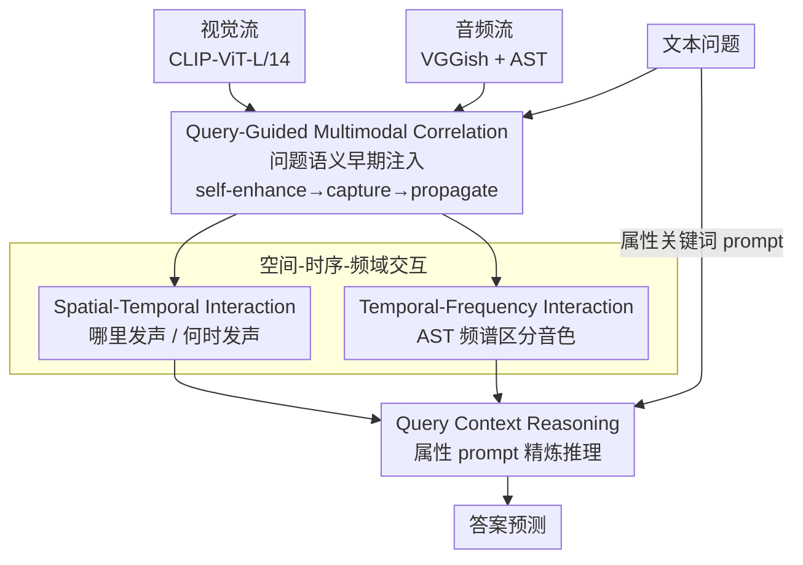

# Query-Guided Spatial-Temporal-Frequency Interaction for Music Audio-Visual Question Answering

**会议**: ICLR 2026  
**arXiv**: [2601.19821](https://arxiv.org/abs/2601.19821)  
**代码**: 发表后公开  
**领域**: 音频语音  
**关键词**: Audio-Visual QA, 频域交互, Query引导, 空间-时序感知, 多模态推理

## 一句话总结

提出 QSTar 框架，通过在整个处理流程中嵌入问题引导（Query Guidance），并引入空间-时序-频域三维度交互模块（特别是利用频谱特征区分音色），显著提升了音乐场景下的音频-视觉问答（Music AVQA）性能。

## 研究背景与动机

**AVQA 任务的挑战**：音频-视觉问答需要联合理解听觉、视觉和文本信息，比纯视觉 QA 更具挑战性，因为声音线索在很多场景下比视觉线索更关键

**音频模态被低估**：现有 AVQA 方法（PSTP、APL 等）主要聚焦视觉信息处理，音频仅作为视频分析的"补充"，其独特频域特征未被充分利用

**问题信息参与不足**：文本问题通常仅在推理的最后阶段通过简单乘法融入，导致音频-视觉表示缺乏语义针对性

**频域分析的必要性**：管弦乐器（如长笛、单簧管）的视觉线索可能非常微妙（演奏动作极小），但其频谱特征（泛音分布、谐波结构）截然不同，频域分析对区分音色至关重要

**复调场景的挑战**：多乐器同时演奏时，仅靠时域或空间特征无法有效区分不同乐器的贡献

## 方法详解

### 整体框架

QSTar 的核心想法是让问题语义从头到尾参与音频-视觉特征的塑造，而不是像以往那样只在推理末端做一次简单融合。它把这条主线拆成三个串联模块：先用 QGMC 在早期就把问题语义打进音频和视觉特征里，再用空间-时序-频域三维交互（STI + TFI）从「哪里发声、何时发声、是什么音色」三个角度互相对齐，最后用 QCR 注入任务属性 prompt 完成精确推理。

### 关键设计

**1. Query-Guided Multimodal Correlation：让问题在源头就介入，而非末端补刀**

以往方法把文本问题留到最后一步用简单乘法融进来，结果音频-视觉表示缺乏语义针对性——可一个问题往往只关心一两件乐器，早早把这层意图传进去才能让模型聚焦、避免冗余表示。QGMC 因此分三步走：先 Self-enhancing，让每个模态各自做自注意力增强内部关系；再 Capturing，把词级文本特征当作 Query，通过交叉注意力从视觉、音频中各捕获一份共享语义 $F_{qv}, F_{qa}$；最后 Propagating，把聚合后的 query-guided 语义上下文 $F_{qg}$ 通过交叉注意力反向传播回视觉流和音频流。这样一来，进入后续交互的特征已经带着问题的「关注点」，而不是面面俱到的原始表示。

**2. Spatial-Temporal Interaction：分别回答「哪里发声」和「何时发声」**

视频天然有空间和时序两个维度，需要分开建模再融合。空间交互让 patch 级视觉特征通过交叉注意力与 query-guided 音频特征对齐，从而定位画面中真正发声的区域；时序交互则把视觉和音频的 query-guided 特征做点积后过 softmax 计算时序注意力，捕获跨帧的全局时序依赖。前者解决「声音来自画面哪一块」，后者解决「这段声音落在哪几帧」，两条线索叠加才能把声源在时空中钉准。

**3. Temporal-Frequency Interaction：用频谱区分视觉上几乎一样的乐器**

长笛和单簧管演奏时动作极小、视觉外观相近，但它们的泛音分布和谐波结构在频域上截然不同——这是视觉和时域特征都给不出的辨别线索。TFI 因此引入 Audio Spectrogram Transformer (AST) 提取时频表示 $F_{ast} \in \mathbb{R}^{T \times F \times D}$，先在时间维度聚合得到频率表示，再结合问题嵌入算出频率注意力权重 $a_f$ 来突出与问题相关的频带，最后把加权后的 AST 特征与 query-guided 音频特征做卷积融合。频率注意力相当于「拿问题去过滤频谱」，让模型只盯住能区分目标音色的那几段频率，复调场景下也能拆出不同乐器的贡献。

**4. Query Context Reasoning：用属性 prompt 给最终推理上约束**

不同问题类型关注的方面不同——比较类问题看响度和数量，时序类问题看先后顺序，需要更聚焦的任务约束。QCR 把乐器相关属性关键词（类型、表演时长、位置、时序、响度）编码成 prompt 嵌入 $F_{prompt}$，与句子级问题嵌入拼接后过自注意力，产生融合了任务语境的 query context $F_{qc}$，再用交叉注意力引导视觉和音频特征做最终精炼。相比单纯依赖原始问题，这层 prompt 把「这类问题该关注什么属性」显式喂给模型，让推理落点更准。

### 损失函数 / 训练策略

训练用标准交叉熵分类损失，AdamW 优化器，初始学习率 1e-4，每 10 个 epoch 衰减 0.1 倍，batch size 64，共训练 30 个 epoch。特征端视觉用 CLIP-ViT-L/14，音频用 VGGish + AST，所有模态特征统一投射到 512 维。

## 实验关键数据

### 主实验

MUSIC-AVQA 测试集准确率（%）：

| 方法 | Audio QA | Visual QA | Audio-Visual QA | 平均 |
|------|----------|-----------|----------------|------|
| PSTP | 70.91 | 77.26 | 72.57 | 73.52 |
| APL | 78.09 | 79.69 | 70.96 | 74.53 |
| TSPM | 76.91 | 83.61 | 73.51 | 76.79 |
| QA-TIGER | 78.58 | 85.14 | 73.74 | 77.62 |
| **QSTar** | **80.63** | 84.17 | **75.98** | **78.98** |

QSTar 在总体准确率上超越前 SOTA QA-TIGER 1.36%，在 Audio QA 上超 2.05%，Audio-Visual QA 超 2.24%。

### 消融实验

| 消融设置 | Audio QA | Visual QA | A-V QA | 平均 |
|----------|----------|-----------|--------|------|
| w/o all | 73.87 | 79.15 | 70.33 | 73.29 |
| w/o QGMC | 79.08 | 83.44 | 72.92 | 76.80 |
| w/o QCR | 79.33 | 83.24 | 75.43 | 78.19 |
| w/o STI | - | -1.55% | - | -1.18% |
| w/o TFI | -2.42% | - | -1.59% | 显著下降 |
| **完整 QSTar** | **80.63** | **84.17** | **75.98** | **78.98** |

### 关键发现

1. **频域交互（TFI）对音频类问题至关重要**：去除 TFI 后 Audio QA 下降 2.42%，Audio-Visual QA 下降 1.59%，证明频谱特征对区分乐器音色不可替代
2. **Query 引导贯穿全流程的重要性**：去除早期引导（$M_b^-$）导致 1.05% 下降，去除最终 prompt（$M_f^-$）导致 0.73% 下降
3. **比较和时序问题类型提升最显著**：超过 5% 的提升，体现了空间-时序-频域三维交互的优势
4. **无需目标检测器**：QSTar 未使用预训练目标检测器，在 Visual QA 上仅落后 QA-TIGER 0.97%，说明模型本身的视觉理解足够强大

## 亮点与洞察

- **频域分析填补了 AVQA 的空白**：之前的方法几乎完全忽视了音频信号的频域特性，本文首次系统性地利用频谱特征（通过 AST）解决音乐场景问答
- **Query 引导的端到端设计**比后期融合显著更优：语义信息在早期就引导特征提取，减少了冗余表示
- **频率注意力机制**巧妙地利用问题文本过滤频谱，使模型能聚焦于与问题相关的频带
- 长笛演奏的案例分析非常直观：视觉上几乎看不到动作变化，但频谱中高频段的减弱清晰标志着停止演奏

## 局限与展望

1. **依赖预训练特征提取器**：CLIP、VGGish、AST 均为冻结预训练模型，端到端微调可能进一步提升
2. **仅在音乐场景验证**：MUSIC-AVQA 限于音乐场景，对更一般的 AVQA 场景（对话、自然声音）的泛化有待验证
3. **Visual QA 表现略弱**：未使用目标检测器导致空间定位精度不如 QA-TIGER，可考虑引入轻量级定位模块
4. **频率注意力的可解释性**：虽然提供了频谱可视化，但频率注意力权重的语义含义需要更深入分析
5. **问答模板限制**：MUSIC-AVQA 使用预定义模板生成问答对，对开放式问题的处理能力未知

## 相关工作与启发

- **TSPM**：引入时序和空间感知模块但仍以视觉为主——QSTar 将音频提升为同等重要的模态
- **QA-TIGER**：当前 SOTA 但依赖复杂的视觉处理——QSTar 通过频域分析以更简洁的视觉处理达到更好总体效果
- **Audio Spectrogram Transformer (AST)**：作为频率特征提取器被有效利用——启发在其他多模态任务中也利用音频的频域表示
- 对视频理解的启发：query-guided 特征精炼思路可推广到视频问答、视频 grounding 等需要问题引导的任务

## 评分

- **新颖性**: ⭐⭐⭐⭐ 频域交互在 AVQA 中是新颖贡献，但整体框架结构（cross-attention 堆叠）相对常规
- **实验充分度**: ⭐⭐⭐⭐ 消融研究覆盖各模块和 query guidance 各阶段，但仅在 MUSIC-AVQA 上全面评估
- **写作质量**: ⭐⭐⭐⭐ 动机阐述清晰（长笛案例很好），方法描述系统但公式较多
- **价值**: ⭐⭐⭐⭐ 在音乐 AVQA 上达到新 SOTA，频域分析的引入对多模态理解有启发价值

<!-- RELATED:START -->

## 相关论文

- [\[ACL 2026\] Music Audio-Visual Question Answering Requires Specialized Multimodal Designs](../../ACL2026/audio_speech/music_audio-visual_question_answering_requires_specialized_multimodal_designs.md)
- [\[ACL 2026\] Retrieving to Recover: Towards Incomplete Audio-Visual Question Answering via Semantic-consistent Purification](../../ACL2026/audio_speech/retrieving_to_recover_towards_incomplete_audio-visual_question_answering_via_sem.md)
- [\[ACL 2026\] Jamendo-MT-QA: A Benchmark for Multi-Track Comparative Music Question Answering](../../ACL2026/audio_speech/jamendo-mt-qa_a_benchmark_for_multi-track_comparative_music_question_answering.md)
- [\[ICLR 2026\] AC-Foley: Reference-Audio-Guided Video-to-Audio Synthesis with Acoustic Transfer](ac-foley_reference-audio-guided_video-to-audio_synthesis_with_acoustic_transfer.md)
- [\[ACL 2025\] Sparsify: Learning Sparsity for Effective and Efficient Music Performance Question Answering](../../ACL2025/audio_speech/sparsify_music_avqa.md)

<!-- RELATED:END -->
