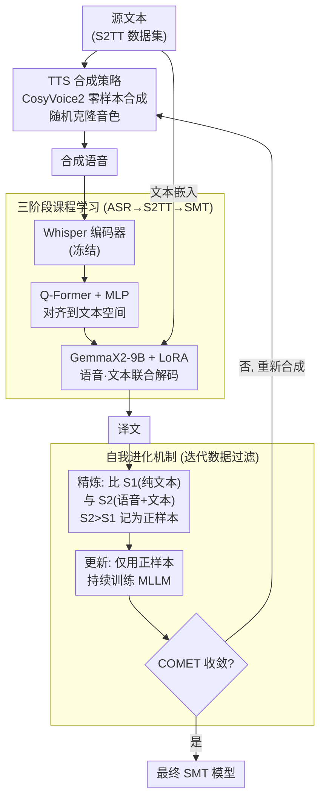

# Scalable Multilingual Multimodal Machine Translation with Speech-Text Fusion

**会议**: ICLR 2026  
**arXiv**: [2602.21646](https://arxiv.org/abs/2602.21646)  
**代码**: [https://github.com/yxduir/LLM-SRT](https://github.com/yxduir/LLM-SRT)  
**领域**: 多模态翻译 / 语音  
**关键词**: 语音引导翻译, 多模态LLM, 自我进化, TTS, 多语言翻译

## 一句话总结
提出 Speech-guided Machine Translation（SMT）框架，用 TTS 将源文本合成语音后与文本联合输入 MLLM 做翻译，通过自我进化机制自动筛选有益的合成语音样本进行持续训练。在 Multi30K 超越所有 MMT 方法取得 SOTA，在 FLORES-200 的 108 个翻译方向上以仅 9B 参数达到平均 SOTA。

## 研究背景与动机

多模态翻译传统上依赖图像辅助消歧（如"bank"在不同场景图片中有不同译法）。但图像 MMT 存在根本局限：①多语言图文对数据极度稀缺，现有数据集多仅覆盖英-德-法等少数语言；②在通用翻译上图像非但无帮助，还引入噪声（实验表明图像引导在通用翻译 benchmark 上反而降低 COMET 分数）。

语音模态具有天然优势：与文本信息对齐（同一语言的文本和语音内容一致）、跨语言语音数据覆盖 100+ 种语言（FLEURS、CoVoST-2 等数据集）。更关键的是，语音携带的韵律信息（重音、语调、节奏）为翻译提供了文本本身不具备的消歧线索——例如疑问句的升调可以帮助模型选择正确的翻译语气。

关键问题是：真实语音数据稀缺且获取成本高，能否用 TTS 合成语音替代？以及如何自动识别哪些合成语音对翻译有帮助（而非引入噪声）？这催生了自我进化机制（Self-Evolution）的设计。

## 方法详解

### 整体框架

SMT（Speech-guided Machine Translation）要解决的是"如何给纯文本翻译额外配一路携带韵律信息的伴随模态、又不依赖稀缺的真实平行语音"。它的做法是：先用 TTS 把源文本合成成语音，再让语音和文本一起喂进多语言 LLM 联合解码出译文。整条推理链路由三个模块串起来——冻结的 Whisper encoder（约 635M）把语音编成声学表征，可训练的 Q-Former+MLP adapter（约 80.5M）把声学表征对齐到文本嵌入空间，再交给加了 LoRA 的 GemmaX2-28-9B（约 9.2B）把语音、文本两路一起处理并生成译文。这条链路靠**三阶段课程学习**逐步训出（先学听懂、再学翻译），而合成语音的质量参差不齐，于是再套一层**自我进化**的迭代回环：用译文质量自动筛掉帮倒忙的语音、只留有益样本持续训练，直到 COMET 收敛。

### 关键设计

**1. TTS 合成策略：用零样本多语言 TTS 把语音模态的可扩展性补齐**

真实平行语音数据稀缺、获取昂贵，是语音模态难以替代图像的最大障碍。SMT 改用 CosyVoice2 做零样本多语言合成，把任意源文本直接变成语音，从而彻底摆脱对真实录音的依赖。为了让合成语音携带丰富而真实的韵律，合成时随机克隆训练集中不同说话人的音色来增加韵律多样性（比用单一固定声音更有效），并让 prompt 文本和预测时长严格对齐真实的"语音-文本对"，保证合成语音在语义和时长节奏上都与源文本一致。消融显示这样得到的合成语音在下游翻译上的增益与真实语音几乎等效（合成甚至因无背景噪声而 S2TT 表现略好），却能覆盖 100+ 种语言——这正是语音能替代图像做多模态翻译的可扩展性来源。

**2. 三阶段课程学习：让模型先学会"听懂"，再学会"用语音翻译"**

直接把语音和文本一起塞给翻译 LLM，会让模型同时面对跨模态对齐和跨语言翻译两个难题，训练很难收敛。SMT 把过程拆成递进的三个阶段：Stage I 做 ASR（语音→同语言文本），让 adapter 先学会把声学表征映射进文本空间；Stage II 做 S2TT（语音→另一语言文本），在已建立的模态对齐之上叠加跨语言能力；Stage III 才进入 SMT，语音和文本联合输入做最终翻译。各阶段逐步解冻更多模块——Whisper encoder 始终冻结，Q-Former+MLP adapter 全程可训练，GemmaX2 直到 Stage III 才用 LoRA 接入微调。这样模型从浅层的模态对齐一步步过渡到深层的语音-文本融合，避免一上来就在多个目标上互相拉扯。

**3. 自我进化机制：自动筛掉那些反而帮倒忙的合成语音**

并不是每段合成语音都对翻译有益——实验里约三分之一的合成语音实际上引入了噪声。SMT 把"何时语音有帮助"这个模糊问题转成可自动判别的二分类，按自我进化的四个阶段迭代：①采集——用 TTS 合成语音（即设计 1）；②精炼——对每条源文本分别测纯文本翻译得分 $S_1$ 与"语音+文本"翻译得分 $S_2$（均为 COMET），只有 $S_2 > S_1$（加上语音后译文质量确实提升）才记为正样本，否则记为负样本；③更新——仅用正样本对 MLLM 做持续训练；④评估——在固定参考声音合成的评测集上测 COMET，未收敛就回到①重新合成、重新筛选。这样模型只从真正有信号的样本里学习、避开有害语音的干扰；实测首轮增益最大，约到第 3 轮达到峰值后趋于稳定，在 khm/lao/mya 等低资源方向上分别再涨 +1.9/+2.0/+1.7 COMET。

### 损失函数 / 训练策略

训练目标为标准的交叉熵翻译损失。Stage III 用 LoRA（r=16, alpha=32）微调 GemmaX2-28-9B，其余可训练部分为 adapter。硬件为 4×A100，优化器 AdamW、学习率 1e-4，线性 warmup 1K 步后线性衰减，整个训练可在一周内完成。自我进化阶段的 COMET 评估统一用固定参考声音合成评估语音，避免说话人差异干扰正负样本的判定。

## 实验关键数据

### 主实验

| 数据集 | 指标 | SMT-9B | 之前SOTA (图像) | 提升 |
|--------|------|--------|----------------|------|
| Multi30K eng→deu | BLEU | 47.0 | 45.3 | +1.7 |
| Multi30K eng→fra | BLEU | 67.0 | 67.5 | -0.5 |
| FLORES-200 eng→27 均 | spBLEU | 40.5 | 39.3 | +1.2 |
| FLORES-200 108方向 | COMET | SOTA | - | 超全部基线 |

### 消融实验

| 配置 | 效果 | 说明 |
|------|------|------|
| Text only | COMET 87.0 | 基线 |
| + 真实语音 | COMET 87.8 | 语音有帮助 |
| + 合成语音 | COMET 87.7 | 与真实近乎等效 |
| + 合成 + 自我进化 | COMET 88.2 | 筛选后进一步提升 |
| 图像引导 | COMET 86.5 | 反而引入噪声——验证了语音优于图像 |

### 关键发现
- 合成与真实语音效果差异可忽略（CoVoST-2 验证），验证了 TTS 替代真实语音的可行性
- 自我进化 1-2 轮收敛，正样本比例约 60-70%——约三分之一的合成语音实际上对翻译有害
- 低资源语言受益更大——语音韵律在数据稀缺时提供了珍贵的辅助信号
- SMT-9B 在 FLORES-200 的 108 个翻译方向上实现平均 SOTA，且参数量仅为 DeepSeek-V3 的 1/67
- 三阶段课程学习的递进设计有效：ASR→S2TT→SMT，每阶段逐步解冻更多模块
- 语音韵律在多义词消歧上贡献最大——例如"lead"在不同发音下可翻译为"铅"或"引导"

## 亮点与洞察
- 语音替代图像做 MMT 是务实的范式转换：语音数据可扩展性远超图文对（102 种语言 vs 仅英-德-法）
- 自我进化优雅解决了"何时语音有帮助"的判别问题——不是所有语音都有价值，约 30-40% 的合成语音会引入噪声
- 韵律线索在多义词消歧中最有价值——这正是传统文本翻译最困难的场景
- Modality-Agnostic Hypothesis 的理论框架具有指导意义：任何能提供语义相关信息且可对齐到文本空间的辅助模态都可能增强翻译
- 三阶段课程学习（ASR→S2TT→SMT）的设计让模型从浅层对齐逐步学到深层融合
- CosyVoice2 的零样本多语言合成+随机声音克隆提供了韵律多样性，这比使用单一合成声音更有效

## 局限与展望
- 推理时需额外 TTS 步骤（CosyVoice2 合成），增加约 0.5-1s 延迟
- 仅 9B 规模验证，更大模型是否仍受益于语音辅助待探索
- COMET 评估指标的偏差可能影响自我进化中正样本的筛选质量——若 COMET 对某些语言不准确，可能引入噪声
- 韵律对不同语言类型（声调语言 vs 非声调语言）的贡献分析不充分
- TTS 合成质量设定了语音辅助的上限——低资源语言的 TTS 质量可能不够
- 仅在翻译任务上验证，语音辅助对其他跨语言任务（如跨语言摘要、跨语言QA）的效果未知

## 相关工作与启发
- **vs 图像引导 MMT（Soul-Mix、Bridge 等）**：语音数据的语言覆盖范围远超图文对，SMT 在 FLORES-200 的 108 个方向上超越所有基线
- **vs 纯文本 MT（DeepSeek-V3、NLLB-54B）**：SMT-9B 参数量仅为 DeepSeek-V3-671B 的 1/67，但在 FLORES-200 上性能更优
- **vs 语音翻译（S2TT）**：S2TT 直接将语音翻译为文本，SMT 将语音作为辅助模态增强文本翻译
- **启发**：语音模态可能在其他 NLP 任务中也有未被利用的价值——如情感分析、讽刺检测等需要韵律线索的任务

## 评分
- 新颖性: ⭐⭐⭐⭐ 语音替代图像做 MMT 是务实的范式转换，自我进化机制设计优雅
- 实验充分度: ⭐⭐⭐⭐⭐ Multi30K + FLORES-200（108 方向）+ CoVoST-2 + WMT24++ 多基准
- 写作质量: ⭐⭐⭐⭐ 结构清晰，自我进化流程图直观，Modality-Agnostic Hypothesis 有理论高度
- 价值: ⭐⭐⭐⭐ 首个系统性利用语音做多语言翻译的框架

<!-- RELATED:START -->

## 相关论文

- [\[ACL 2026\] From Flat Language Labels to Typological Priors: Structured Language Conditioning for Multilingual Speech-to-Speech Translation](../../ACL2026/audio_speech/from_flat_language_labels_to_typological_priors_structured_language_conditioning.md)
- [\[ICML 2026\] Multimodal Fusion via Self-Consistent Task-Gradient Fields](../../ICML2026/audio_speech/multimodal_fusion_via_self-consistent_task-gradient_fields.md)
- [\[ICLR 2026\] TripleSumm: Adaptive Triple-Modality Fusion for Video Summarization](triplesumm_adaptive_triple-modality_fusion_for_video_summarization.md)
- [\[ICLR 2026\] Latent Speech-Text Transformer](latent_speech_text_transformer.md)
- [\[AAAI 2026\] PSA-MF: Personality-Sentiment Aligned Multi-Level Fusion for Multimodal Sentiment Analysis](../../AAAI2026/audio_speech/psa-mf_personality-sentiment_aligned_multi-level_fusion_for_multimodal_sentiment.md)

<!-- RELATED:END -->
