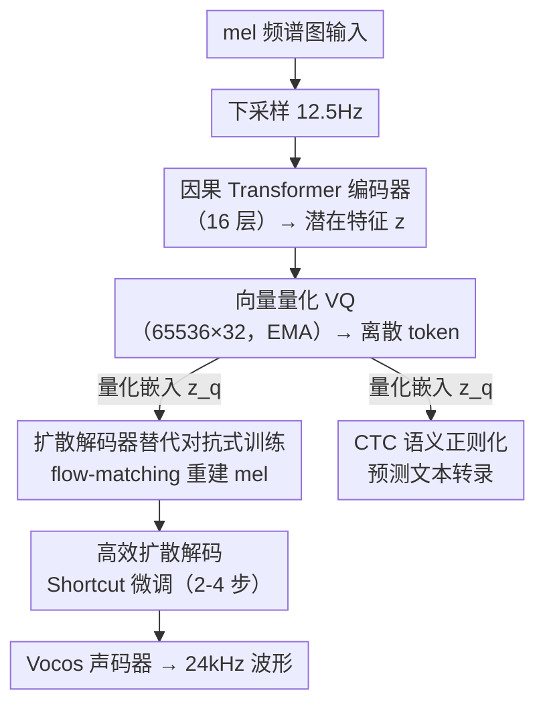

# Scaling Speech Tokenizers with Diffusion Autoencoders

**会议**: ICLR 2026  
**arXiv**: [2602.06602](https://arxiv.org/abs/2602.06602)  
**代码**: 无（Demo: [https://sitok-demo.github.io/](https://sitok-demo.github.io/)）  
**领域**: 语音 / Token化  
**关键词**: Speech Tokenizer, Diffusion Autoencoder, Semantic Regularization, Low Bitrate, CTC Loss

## 一句话总结

提出 SiTok（Speech Diffusion Tokenizer），采用扩散自编码器联合训练编码器-量化器-解码器（非两阶段），加入 CTC 语义正则化确保离散 token 保留语言信息，规模化到 1.6B 参数和 2200 万小时语音数据，在极端低 token 率（12.5Hz / 200bps）下同时实现 3.34% WER（重建）和 4.95 WER（LLM ASR）的强性能。

## 研究背景与动机

**领域现状**：语音 tokenizer 是语音语言模型的基础接口，决定了语音如何被离散化表示。一个理想的语音 tokenizer 需要同时满足三个目标：（1）极端压缩以支持高效语言建模；（2）高保真重建以生成自然语音；（3）语义丰富表示以支持下游理解任务。

**现有痛点**：现有方法通过启发式妥协而非原则性方案来处理上述三目标的张力：（1）低比特率下重建质量差——很多方法用 RVQ（残差向量量化）增加码本层数或提高帧率来维持质量，但这直接膨胀了 token 数量（如 Mimi 75 TPS, DualCodec 75 TPS），违背压缩目标；（2）仅优化声学保真度忽略语义——导致 token 不适合理解任务（如 ASR WER 很高）；（3）两阶段训练方案——先用 SSL 模型量化语音表征，再独立训练扩散/声码器解码，量化器无法为重建优化，解码器被迫适配次优离散码。

**核心矛盾**：在传统声学重建目标下，简单增大模型或数据在低 token 率时收益递减——这是向量量化的结构性瓶颈。确定性重建损失迫使离散潜空间"坍缩不确定性"，优先保留低级信号细节而非语义结构，导致压缩越激进语义损失越大。

**切入角度**：低 token 率量化引入的不确定性需要**生成式框架**来建模——扩散模型恰好学习逆转随机退化过程，天然适合处理量化引起的信息损失。同时，直接用 CTC 损失监督量化后的潜空间，比 SSL 蒸馏更直接地注入语义信息。

**核心 idea**：用扩散自编码器（而非对抗式训练）联合优化量化和重建，加上 CTC 语义正则化，实现极低 token 率下语义和声学的双重保留。

## 方法详解

### 整体框架

SiTok 以 mel 频谱图为输入和重建目标（非原始波形），避免直接处理超长波形序列和不稳定的对抗训练。整条链路是一个端到端联合训练的自编码器：mel 谱图先下采样到 12.5Hz，经 Llama-style 因果 Transformer 编码器（16 层）得到潜在特征 $\mathbf{z}$，再向量量化（65,536 码本、32 维、EMA 更新）成离散 token $\mathbf{q}$。量化后的嵌入 $\mathbf{z}_q$ 分两路使用：主路送进非因果 Llama Transformer 扩散解码器（16 层），用 flow-matching 目标把噪声还原成 mel 谱图，再交给外部 Vocos 声码器转成 24kHz 波形；辅路接一个轻量 CTC 解码器（4 层）直接预测文本转录，把语义信息逼回到离散 token 上。部署时再对扩散解码器做 shortcut 微调，把多步采样压到 2-4 步。

### 关键设计

**1. 扩散自编码器替代对抗式训练：用生成式建模处理量化丢失的信息**

确定性重建在激进压缩下会坍缩——把语音的全部信息硬塞进 200bps 本就不可能，确定性损失只会迫使潜空间优先保留低级信号细节、牺牲语义结构。SiTok 转而承认"不是所有细节都能从 token 恢复"，让解码器去学条件分布 $p(\mathbf{x}|\mathbf{z}_q)$。具体做法是 flow-matching 目标：构造噪声样本 $\mathbf{x}_t = t\mathbf{x} + (1-t)\epsilon$，把速度场 $v_\phi(\mathbf{x}_t, t, \mathbf{z}_q)$ 训练成逼近真实速度 $(\mathbf{x} - \epsilon)$，解码器以量化嵌入 $\mathbf{z}_q$ 为条件从噪声还原 mel 谱图。

相比对抗式训练，这一路线有三重好处：不需要判别器和繁琐的损失设计，训练更稳定；扩散模型学的是数据分布，能从有限的量化表征里"脑补"出丢失的细节；可扩展性也更好——波形级模型要做大量上下采样，而 mel 谱图更紧凑，更适合堆到 1.6B 参数。

**2. CTC 语义正则化：直接强制离散 token 能解码出文本**

只优化声学保真度会让 token 不适合理解任务，过去的做法是用 MSE/cosine 把 token 对齐到 HuBERT/WavLM 等 SSL 特征，但这是间接的二手监督。SiTok 改用最直接的信号：在量化后的嵌入 $\mathbf{z}_q$ 上接一个轻量 CTC 解码器 $\mathcal{D}_{\phi_{\text{ctc}}}$（4 层 Transformer），直接预测文本转录 $\mathbf{y}$，总损失为

$$\mathcal{L}_{\text{total}} = \mathcal{L}_{\text{rec}} + \lambda_{\text{ctc}} \cdot \text{CTC}(\mathcal{D}_{\phi_{\text{ctc}}}(\mathbf{z}_q), \mathbf{y}) + \mathcal{L}_{\text{vq}}$$

关键在于监督信号放在量化**之后**，直接塑造离散 token 的语义性质，整条链路端到端、不依赖任何外部 SSL 模型。$\lambda_{\text{ctc}}$ 是敏感超参：实验中 $0.1$ 最优，太大（如 $1.0$）会过度约束潜空间反而损害重建（WER 从 4.06 升至 10.1）。

**3. 高效扩散解码（Shortcut Fine-tuning）：让解码器自学跳步加速**

扩散解码的多步采样是部署瓶颈。SiTok 冻结编码器和 VQ 模块，只对解码器用 shortcut model 目标微调：网络额外接收步长 $d$ 作为条件，同时优化两项——flow-matching 损失（$d=0$ 对应真实速度）和自一致性损失（一大步 $2d$ 的结果要约等于连续走两小步 $d$）。这样模型就学会了"跳过中间步"，比传统蒸馏更灵活。效果上推理步数从标准的多步压到 2-4 步，实测 RTF 从 16 步的 0.041 降到 4 步的 0.013，加速 3.2 倍。

### 损失函数 / 训练策略

总损失：$\mathcal{L}_{\text{total}} = \mathcal{L}_{\text{rec}} + 0.1 \cdot \mathcal{L}_{\text{ctc}} + \mathcal{L}_{\text{vq}}$。训练用 AdamW，lr=8e-5，warmup 32K 步，单 epoch（~450K 步），2200 万小时内部语音数据。可选精炼：（1）Decoder finetuning（冻结编码器+VQ）；（2）Token CFG（10% 概率 drop token 训练无条件路径，推理时条件/无条件预测组合）。

## 实验关键数据

### 主实验（重建质量对比）

| 模型 | FPS/TPS | 码本数 | 比特率 | WER↓ | SIM↑ | UTMOS↑ |
|------|---------|-------|-------|------|------|--------|
| Ground Truth | - | - | - | 2.14 | 0.730 | 3.53 |
| DualCodec | 12.5/75 | 6 | 0.925 | 2.63 | 0.624 | 3.78 |
| X-codec 2 | 50/50 | 1 | 0.80 | 2.63 | 0.620 | 3.68 |
| Mimi | 12.5/75 | 6 | 0.825 | 4.51 | 0.527 | 3.09 |
| FireRedTTS | 25/25 | 1 | 0.35 | 3.35 | 0.597 | 3.40 |
| CosyVoice | 25/25 | 1 | 0.30 | 5.63 | 0.465 | 3.65 |
| **SiTok (CN=1)** | **12.5/12.5** | **1** | **0.20** | **4.06** | **0.641** | **3.44** |
| + Decoder FT | 12.5/12.5 | 1 | 0.20 | 3.79 | **0.682** | 3.48 |
| + Token CFG | 12.5/12.5 | 1 | 0.20 | **3.34** | 0.635 | **3.60** |

SiTok 在仅 200bps（所有基线最低比特率）下，WER 3.34%、SIM 0.682 均达到强竞争力。

### 消融实验（语义正则化效果）

| CTC 正则化 | TPS | 重建 WER↓ | SIM↑ | UTMOS↑ | LLM ASR↓ | ER↑ | SV↓ | KS↑ |
|-----------|-----|----------|------|--------|----------|-----|-----|-----|
| ✓ (λ=0.1) | 12.5 | 4.06 | 0.641 | 3.44 | 4.95 | 63.5 | 13.8 | 96.9 |
| ✗ | 12.5 | **33.0** | 0.495 | 2.68 | 29.4 | 57.9 | 18.9 | 86.1 |
| ✓ (λ=0.1) | 50 | 2.80 | 0.660 | 3.46 | 4.49 | 64.4 | 8.59 | 97.7 |
| ✗ | 50 | 5.17 | 0.611 | 2.84 | 7.27 | 60.4 | 13.5 | 92.8 |

没有 CTC 正则化的 12.5 TPS 模型 WER 飙升到 33.0%，证明语义正则化不是"锦上添花"而是"不可或缺"。

### 关键发现

- **模型缩放的非单调效应**：从 0.63B (S) 到 1.61B (XL)，重建质量持续改善（WER 4.18→3.84），但理解任务在 1.12B (L) 达峰，更大模型在 SV 上反而退化（13.8→14.7），暗示过大容量可能过度编码声学细节而非抽象语义
- **Token CFG 和 Decoder FT 互补**：CFG 主要降低 WER（3.34），FT 主要提升说话人相似度（0.682），可按需组合
- **CTC 权重 $\lambda_{\text{ctc}}$ 是敏感超参**：0.1 最优，0.02 重建好但理解差，0.5-1.0 重建也恶化（过度约束潜空间）
- **仅用回归损失（R）训练的 tokenizer 表现差**：WER 4.66 且所有理解指标下降，扩散损失（D）是核心

## 亮点与洞察

- **"不确定性需要生成式建模"的洞察深刻**：低 token 率量化不可避免丢失信息，用确定性重建试图"完美恢复"注定失败，扩散模型承认不确定性并学习条件分布，这是正确的建模哲学。这一洞察可迁移到任何高压缩比离散化场景
- **CTC 监督的极简有效性**：不需要外部 SSL 模型、不需要特征对齐的复杂设计，一个 4 层 CTC 头直接预测文本就够了。关键是监督信号放在量化后（而非量化前），直接塑造离散 token 的语义性质
- **Mel 谱图作为中间表示的务实选择**：避免了波形级建模的长序列和不稳定训练，虽然需要外部 vocoder，但解耦设计使 tokenizer 和 vocoder 可独立优化升级

## 局限与展望

- **依赖外部 Vocoder**：mel 到波形的转换依赖 Vocos，整体质量受 vocoder 瓶颈限制
- **训练数据为内部数据**：2200 万小时语音数据不公开，可复现性受限
- **以英语为主**：虽声称覆盖多语言，但英语占绝大多数，多语言泛化性未充分验证
- **扩散解码延迟**：即使 shortcut 后仍需 2-4 步迭代，实时交互场景下延迟可能不够低
- **L 和 XL 模型的理解性能倒退**：更大模型在理解任务上并非更好，提示需要更好的训练策略或结构设计来平衡声学和语义

## 相关工作与启发

- **vs Mimi (Défossez et al., 2024)**：Mimi 用 8 层 RVQ 达到 1.1kbps 和 23.1 LLM ASR WER，SiTok 用单码本 200bps 达到 4.95 LLM ASR WER，压缩比高 5.5 倍且理解性能大幅领先
- **vs CosyVoice / FireRedTTS**：两阶段方法先量化 SSL 特征再训练 diffusion decoder，SiTok 的端到端联合优化避免了量化器与解码器的目标不一致
- **vs StableCodec / GLM4-Voice**：同为低 token 率设计（0.2-0.4 kbps），SiTok 的理解性能（特别是 LLM ASR）显著优于这些基线

## 评分

- 新颖性: ⭐⭐⭐⭐ 扩散自编码器 + CTC 的组合有创新性，但各组件并非全新，核心贡献在于规模化验证和系统性设计
- 实验充分度: ⭐⭐⭐⭐⭐ 覆盖重建/理解/生成三大场景，丰富的消融（损失、码本、模型规模、解码步数），对比全面
- 写作质量: ⭐⭐⭐⭐ 结构清晰，motivation 论证充分，数学描述准确
- 价值: ⭐⭐⭐⭐⭐ 在极低比特率下统一理解和生成的语音 tokenizer 对语音语言模型发展有重要推动作用

<!-- RELATED:START -->

## 相关论文

- [\[ICML 2026\] Sparse Autoencoders for Interpretable Emotion Control in Text-to-Speech](../../ICML2026/audio_speech/sparse_autoencoders_for_interpretable_emotion_control_in_text-to-speech.md)
- [\[CVPR 2026\] Hierarchical Codec Diffusion for Video-to-Speech Generation](../../CVPR2026/audio_speech/hierarchical_codec_diffusion_for_video-to-speech_generation.md)
- [\[ICLR 2026\] The Devil behind the Mask: An Emergent Safety Vulnerability of Diffusion LLMs](the_devil_behind_the_mask_an_emergent_safety_vulnerability_of_diffusion_llms.md)
- [\[ACL 2026\] XLSR-MamBo: Scaling the Hybrid Mamba-Attention Backbone for Audio Deepfake Detection](../../ACL2026/audio_speech/xlsr-mambo_scaling_the_hybrid_mamba-attention_backbone_for_audio_deepfake_detect.md)
- [\[NeurIPS 2025\] From Black Box to Biomarker: Sparse Autoencoders for Interpreting Speech Models of Parkinson's Disease](../../NeurIPS2025/audio_speech/from_black_box_to_biomarker_sparse_autoencoders_for_interpreting_speech_models_o.md)

<!-- RELATED:END -->
