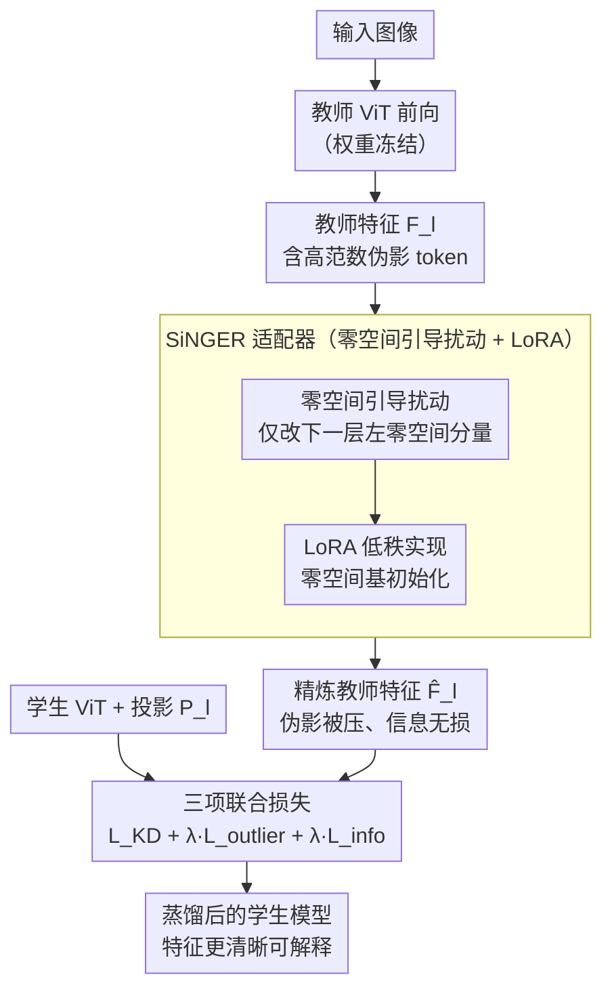

# SiNGER: A Clearer Voice Distills Vision Transformers Further

**会议**: ICLR 2026  
**arXiv**: [2509.20986](https://arxiv.org/abs/2509.20986)  
**代码**: [github.com/AIRLABkhu/SiNGER](https://github.com/AIRLABkhu/SiNGER)  
**领域**: 音频语音  
**关键词**: Vision Transformer, 知识蒸馏, 高范数伪影, 零空间引导, LoRA适配器  

## 一句话总结
提出 SiNGER（Singular Nullspace-Guided Energy Reallocation）框架，通过在教师特征的零空间方向施加扰动来抑制 ViT 中的高范数伪影，同时保留信息信号，结合轻量 LoRA 适配器实现高效蒸馏，在多个下游任务上取得 SOTA 性能并生成更清晰可解释的表征。

## 研究背景与动机

**领域现状**：Vision Transformer（ViT）已成为视觉基础模型（VFM）的骨干架构，凭借自注意力机制和强大的可扩展性在各种视觉任务中取得出色表现。然而，ViT 的二次复杂度严重限制了大模型的实际部署，因此模型压缩成为刚需。在各种压缩方法（剪枝、量化、蒸馏）中，知识蒸馏（KD）因其结构稳定性和数值稳定性成为最可靠的方案。

**现有痛点**：ViT 的 token 表征中存在"高范数伪影"（high-norm artifacts）——部分 patch 特征的范数异常高，尤其集中在背景区域。当使用标准 MSE 损失进行 KD 时，梯度会被这些高范数 token 主导，导致学生模型过度拟合伪影而忽略真正有意义的信息信号，大幅削弱蒸馏收益。

**核心矛盾**：伪影抑制与信息保留之间存在根本性的权衡。先前方法如 ViTKD 通过随机遮掩教师特征来减少伪影影响，但这种无差别遮掩不可避免地同时丢弃了有价值的信息信号。问题的根源在于：伪影是由残差块中类似幂迭代的累积效应引起的"奇异缺陷"——token 沿预训练权重的主左奇异向量对齐。

**本文目标**：如何在不丢失教师信息的前提下，有效抑制 ViT 蒸馏中的高范数伪影？具体分为两个子问题：(a) 找到一种数学上有保证的方式来分离伪影和信息信号；(b) 设计一种高效的实现方案使其易于集成到现有 KD 流程中。

**切入角度**：作者观察到，如果只修改教师特征中落在下一个 Transformer 块左零空间（left-nullspace）内的分量，那么这个修改不会影响下游输出（因为零空间分量被下一层权重映射为零），但可以重新分配能量来抑制高范数伪影。这是一个优雅的数学性质——零空间方向是"免费"的修改空间。

**核心 idea**：利用下一层权重矩阵的左零空间引导教师特征的扰动，在数学上保证信息无损的同时实现伪影抑制。

## 方法详解

### 整体框架

SiNGER 要解决的是 ViT 蒸馏里一个具体的痛点：教师特征本身带着高范数伪影（高范数离群 token），直接拿来当蒸馏目标会把学生带偏——MSE 损失下梯度被这些大范数 token 主导，学生忙着拟合少数伪影、反而学不进真正有用的信息信号。SiNGER 的做法不是改学生，而是先"净化"教师：在教师选定的若干层（中间层集合 $l_{\text{inter}}$ 加最终层 $l_{\text{final}}$）各挂一个轻量 LoRA 适配器，对该层教师特征 $F^T_l$ 施加一个**零空间方向的扰动**，把伪影 token 的能量压下去，同时保证下一层看到的信息一字不差。

整条流程是这样转的：教师前向（权重全程冻结）产生原始特征 $F^T_l$，每个 SiNGER 适配器把它精炼成 $\hat F^T_l = F^T_l + \Delta F^T_l$，精炼后的特征再作为蒸馏目标传给（带投影头 $P_l$ 的）学生；训练同时优化学生、投影头和适配器，由三项损失共同约束——既让学生逼近精炼教师、又显式压制伪影、还用 Gram 矩阵守住特征方向结构。最终学生既继承了教师知识，特征图又比直接蒸馏更干净、更可解释。

### 关键设计

**1. 高范数伪影分析与梯度偏置建模：把"伪影为什么坑蒸馏"讲成可操作的数学问题**

要抑制伪影，先得说清它怎么坏事。作者把伪影归因于残差块的连续累积效应——token 特征每经过一个残差块，就沿权重矩阵的主左奇异向量方向多攒一点能量，逐层叠加形成所谓的"奇异缺陷"，表现为背景区域那些范数异常高的离群 patch。把 patch 拆成离群集 $O_l$ 和正常集 $I_l$ 后，KD 损失也随之分成离群项和正常项；由于离群 token 的范数远大于正常 token，损失和梯度都被离群项压倒。具体看梯度 $\nabla_{P_l(F^S_{l,i})}\mathcal{L} = \tfrac{2}{n}\big(P_l(F^S_{l,i}) - F^T_{l,i}\big)$，范数越大的 token 带来越大的更新，于是优化被少数伪影牵着走，承载主要信息的正常结构学不进去。把这层"梯度偏置"机理刻画清楚，后面"为什么要先精炼教师、往哪个方向改"才有理论落点。

**2. 零空间引导扰动（Nullspace-Guided Perturbation）：找一个改了也不影响下游的方向**

伪影抑制和信息保留之所以看起来矛盾，是因为常规做法（如随机遮掩、直接缩小范数）一动就连有用信号一起动。SiNGER 的破局点在于找到了一个"免费"的修改空间。把精炼写成 $\hat F^T_l = F^T_l + \Delta F^T_l$，目标有两个：压掉离群 token 的范数、且喂进下一层后信息不变。下一层变换记为 $W_{l+1}$，信息不变的充要条件是

$$(F^T_l + \Delta F^T_l)\,W_{l+1} = \hat F^T_l\,W_{l+1} \iff \Delta F^T_l\, W_{l+1} = 0$$

也就是要求扰动 $\Delta F^T_l$ 的行空间落在下一层的左零空间 $\mathcal{N}\big((W_{l+1})^\top\big)$ 里。只要扰动待在这个零空间内，下一层的输出**完全不变**——在这个方向上想怎么改都行，下游一点都感觉不到。于是就能把高范数伪影的能量沿零空间方向"搬走"、重新分配（这正是名字里 Energy Reallocation 的由来），伪影被压制、信息却数学上零损失。这一步把"伪影抑制 vs 信息保留"从不可兼得变成可同时保证。

**3. LoRA 适配器与零空间初始化：用低秩结构高效逼近零空间扰动**

零空间引导是理论方向，落地要解决两个麻烦：一是逐层求精确零空间代价大，二是下一层其实是**非线性**块、根本没有严格意义上的零空间。SiNGER 用 LoRA 一并解决：在教师选定层后附一个低秩模块，扰动写成 $\Delta F^T_l = (F^T_l\,\Phi_{\text{down},l})\,\Phi_{\text{up},l}$，其中 $\Phi_{\text{down},l}\in\mathbb{R}^{d_T\times r}$、$\Phi_{\text{up},l}\in\mathbb{R}^{r\times d_T}$，秩 $r\ll d_T$，相对冻结的教师骨干只多了可忽略的参数量。关键在初始化——先把非线性下一层线性化为 $\tilde W_{l+1}$、取其 $r$ 个最小奇异值对应的左奇异向量 $\tilde{\mathcal{N}}_{l+1}$，再令 $\Phi_{\text{down},l}:=\tilde{\mathcal{N}}_{l+1}$、$\Phi_{\text{up},l}:=\tilde{\mathcal{N}}_{l+1}^\top$。这保证训练一开始扰动就严格贴着零空间方向（设计 2 的零损失性质近似成立，$\|\tilde{\mathcal{N}}_{l+1}^\top \tilde W_{l+1}\| = \sigma_{d-r+1}$ 很小），之后适配器再在零空间附近学更灵活的扰动。零空间初始化就是把"零空间引导"理论和"LoRA 参数化"实现接起来的桥梁。

### 损失函数 / 训练策略

适配器在选定蒸馏层 $D = l_{\text{inter}}\cup\{l_{\text{final}}\}$ 上工作，训练**联合优化**学生参数 $\theta_S$、投影头 $\{P_l\}$ 和适配器参数 $\{\Phi_{\text{down},l},\Phi_{\text{up},l}\}$（教师骨干始终冻结），由三项损失加权求和：

$$\mathcal{L}_{\text{total}} = \mathcal{L}_{\text{KD}} + \lambda_{\text{outlier}}\,\mathcal{L}_{\text{outlier}} + \lambda_{\text{info}}\,\mathcal{L}_{\text{info}}$$

- **蒸馏损失 $\mathcal{L}_{\text{KD}}$**：学生（经投影头对齐维度后）逼近**精炼后**的教师特征，$\mathcal{L}_{\text{KD}} = \sum_{l\in D}\text{MSE}\big(\hat F^T_l,\, P_l(F^S_l)\big)$
- **离群抑制损失 $\mathcal{L}_{\text{outlier}}$**：显式惩罚精炼后仍超过 $\gamma$-分位数阈值 $q_{\gamma,l}$ 的高范数 patch，把伪影范数往下压
- **信息保留损失 $\mathcal{L}_{\text{info}}$**：用 Gram 矩阵匹配保住特征的方向结构——中间层对齐下一层输出 $G(\hat F^T_{l+1})$ 与 $G(F^T_{l+1})$，最终层对齐 $G(\hat F^T_l)$ 与 $G(F^T_l)$
- 由于适配器参数极少，训练开销相对于标准 KD 几乎没有增加

## 实验关键数据

### 主实验：多下游任务对比

论文在多个下游任务上验证了 SiNGER 的有效性，教师为 ViT-Large，学生为 ViT-Tiny：

| 蒸馏方法 | 分类 (Top-1↑) | 检测 (mAP↑) | 分割 (mIoU↑) | 特征质量 |
|---------|--------------|-------------|-------------|---------|
| 无蒸馏 (Baseline) | 低 | 低 | 低 | 有伪影 |
| FitNet | 中等 | 中等 | 中等 | 伪影严重 |
| ViTKD (随机遮掩) | 较高 | 较高 | 较高 | 伪影减少但信息丢失 |
| **SiNGER (本文)** | **最高** | **最高** | **最高** | **清晰可解释** |

SiNGER 在分类、目标检测、语义分割等多任务上一致性超越所有基线方法，且在雷达图（Figure 1b）中展示了全面的性能提升。

### 消融实验：各组件贡献

| 配置 | 性能变化 | 说明 |
|------|---------|------|
| Full SiNGER | 最优 | 完整模型，零空间初始化 + LoRA 适配器 |
| w/o 零空间初始化 | 下降明显 | 随机初始化的 LoRA 无法有效引导扰动方向 |
| w/o LoRA 适配器 | 下降显著 | 退化为标准 KD，高范数伪影主导优化 |
| 仅随机遮掩 (ViTKD) | 中等水平 | 能减少伪影但同时丢失信息信号 |
| 不同 LoRA rank $r$ | 随 $r$ 先升后降 | rank 过低表达力不足，过高引入噪声 |

### 关键发现
- **零空间初始化是核心**：去掉零空间引导的初始化后性能显著下降，验证了"在零空间方向扰动"是方法成功的关键，而非单纯的 LoRA 参数化
- **特征图可解释性显著提升**：定性分析（Figure 2）显示 SiNGER 蒸馏后的学生特征图与教师语义一致性最高，patch-wise 余弦相似度模式最连贯
- **跨任务一致性**：不像某些方法在特定任务上强但在其他任务上弱，SiNGER 展现出跨分类、检测、分割任务的一致性提升，说明其精炼的是通用的表征质量而非针对特定任务的偏好
- **对教师规模的鲁棒性**：当教师模型变大（从 ViT-Base 到 ViT-Large），伪影问题加剧而标准 KD 收益递减，SiNGER 反而能更好地利用更大教师的知识

## 亮点与洞察

- **零空间作为免费操作空间**：这是本文最巧妙的设计。意识到下一层权重的零空间是一个"免费"的修改空间——在其中的任何修改都不会影响下游计算结果。这个洞察将伪影抑制与信息保留从"不可能同时满足"变为"可以同时保证"，数学上优雅且实用
- **LoRA 零空间初始化**：将 LoRA 的下投影矩阵初始化为零空间基向量，巧妙地在参数高效微调和理论保证之间建立了桥梁。这个 trick 可以推广到其他需要在特定子空间中施加约束的场景
- **重新审视 KD 中的"教师总是对的"假设**：传统 KD 把教师输出视为金标准让学生去逼近，但本文指出教师本身的特征有缺陷（伪影），先"净化"教师再蒸馏效果更好。这个"先改善教师再教学生"的思路可以推广到其他 KD 场景
- **可迁移到 LLM 压缩**：LLM 中同样存在 attention sink 和高范数 token 的问题，SiNGER 的零空间引导思路或许可以迁移到 LLM 蒸馏中

## 局限与展望

- **计算开销**：需要对线性化后的下一层计算 SVD 以获取零空间基用于初始化，对于非常大的模型这可能带来一次性的计算开销
- **零空间是近似的**：下一层是非线性块，没有严格零空间，方法靠线性化 $\tilde W_{l+1}$ 取最小奇异向量来近似，信息无损只是近似成立（论文附录给了谱分析证明近似关系仍能保持）
- **仅限 ViT 架构**：方法理论针对 ViT 的残差块累积伪影机制设计，对其他架构（如 CNN 或混合架构）的适用性待验证
- **zero-shot 或 few-shot 场景未探索**：论文聚焦于经典的有监督蒸馏设置，对于 zero-shot 迁移场景下伪影的影响及 SiNGER 的效果未有讨论
- **LoRA rank 的选择**：rank $r$ 的最优值需要实验搜索，缺乏自适应的 rank 选择策略

## 相关工作与启发

- **vs ViTKD**：ViTKD 用随机遮掩来减少高范数 token 的影响，简单有效但"伤敌一千自损八百"——同时丢失信息信号。SiNGER 利用零空间引导实现了有选择性的伪影抑制，理论上保证信息无损，是对 ViTKD 的根本性改进
- **vs FitNet**：FitNet 是经典的特征蒸馏方法，直接对齐中间层特征。它没有考虑 ViT 特有的伪影问题，因此在 ViT 蒸馏中表现不如 ViTKD 和 SiNGER
- **vs Register Tokens**：Register tokens 通过在输入中添加额外 token 来吸收伪影能量，是一种架构级的解决方案。SiNGER 则是后处理/蒸馏级的解决方案，不需要修改教师的架构或重新训练
- **vs SiNDer**：SiNDer 分析了 ViT 伪影的奇异值分解机制，SiNGER 在此理论基础上进一步提出了可操作的蒸馏框架

## 评分

- 新颖性: ⭐⭐⭐⭐ 零空间引导扰动的思路新颖，将线性代数理论优雅地应用于 KD 中伪影抑制问题
- 实验充分度: ⭐⭐⭐⭐ 多任务验证+消融+可视化分析全面，但缓存截断导致无法验证具体数值
- 写作质量: ⭐⭐⭐⭐⭐ 论文结构清晰，从问题分析到理论推导到实践实现层层递进，理论与直觉并重
- 价值: ⭐⭐⭐⭐ 对 ViT KD 提出了一个有理论支撑的改进方案，零空间引导的思路有推广价值

<!-- RELATED:START -->

## 相关论文

- [\[ECCV 2024\] Siamese Vision Transformers are Scalable Audio-Visual Learners](../../ECCV2024/audio_speech/siamese_vision_transformers_are_scalable_audio-visual_learners.md)
- [\[ICML 2026\] Alethia: A Foundational Encoder for Voice Deepfakes](../../ICML2026/audio_speech/alethia_a_foundational_encoder_for_voice_deepfakes.md)
- [\[CVPR 2026\] Vision-Speech Models: Teaching Speech Models to Converse about Images](../../CVPR2026/audio_speech/vision-speech_models_teaching_speech_models_to_converse_about_images.md)
- [\[CVPR 2026\] BabyVLM-V2: Toward Developmentally Grounded Pretraining and Benchmarking of Vision Foundation Models](../../CVPR2026/audio_speech/babyvlm-v2_toward_developmentally_grounded_pretraining_and_benchmarking_of_visio.md)
- [\[ACL 2025\] Finding A Voice: Exploring the Potential of African American Dialect and Voice Generation for Chatbots](../../ACL2025/audio_speech/aae_voice_chatbot.md)

<!-- RELATED:END -->
