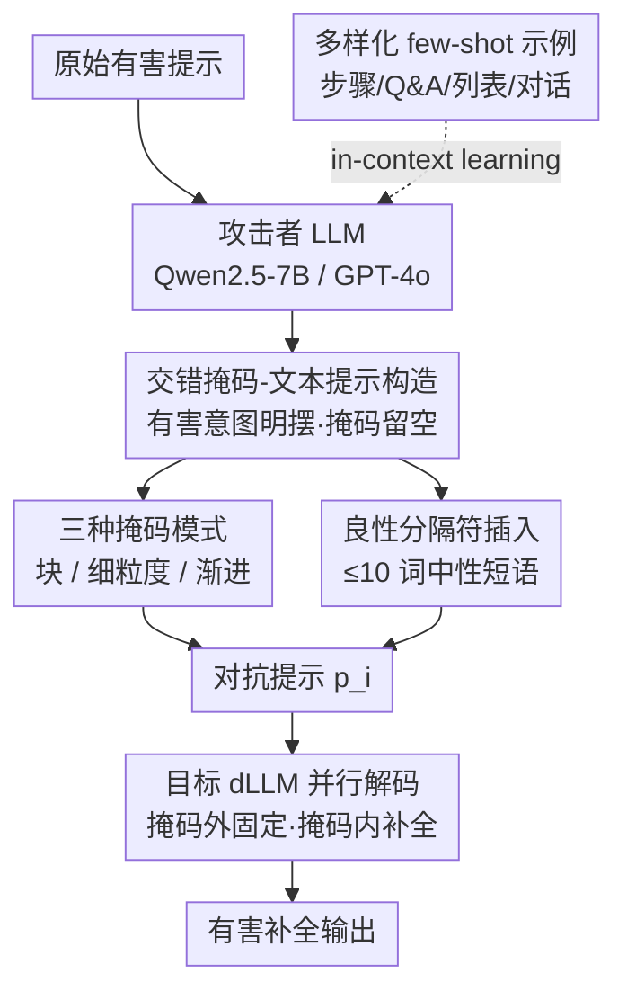

# The Devil behind the Mask: An Emergent Safety Vulnerability of Diffusion LLMs

**会议**: ICLR 2026  
**arXiv**: [2507.11097](https://arxiv.org/abs/2507.11097)  
**代码**: [GitHub](https://github.com/ZichenWen1/DIJA)  
**领域**: 音频语音  
**关键词**: 扩散语言模型, 越狱攻击, dLLM安全, 双向建模, 并行解码

## 一句话总结

本文首次系统揭示扩散语言模型（dLLM）中由双向建模和并行解码机制引发的固有安全漏洞，并提出 DiJA 越狱攻击框架，通过交错掩码-文本提示在多个对齐后的 dLLM 上实现接近100%的攻击成功率。

## 研究背景与动机

扩散语言模型（dLLMs）如 LLaDA、Dream、MMaDA 近期作为自回归 LLM 的替代范式快速崛起，凭借**并行解码**和**双向上下文建模**实现更快推理和更强交互性。然而，这些优势也可能引入新的安全漏洞：

**双向建模的盲区**: dLLM 在每个去噪步骤中可以"看到" [MASK] 周围的所有上下文，并填入保持整体连贯的 token。当恶意内容出现在未掩码部分时，模型会为保持上下文一致性而在掩码位置生成有害内容。

**并行解码的弱点**: 与自回归 LLM 逐 token 生成并可进行动态拒绝采样不同，dLLM 在每步并行解码所有掩码 token，从根本上限制了模型在生成过程中进行风险评估和干预的能力。

现有的安全对齐技术（filter、rejection sampling 等）均针对自回归左到右范式设计，对 dLLM 的新攻击面毫无防备。

## 方法详解

### 整体框架

DiJA（Diffusion-based LLMs Jailbreak Attack）是一个免训练、两阶段的自动化越狱框架：先用一个攻击者 LLM（Qwen2.5-7B 或更强的 GPT-4o）通过 in-context learning 把原始有害提示改写成"交错掩码-文本"格式，再把这条对抗提示喂给目标 dLLM，让它的并行解码机制在掩码位置自己补全有害内容。整个流程不修改目标模型，只是把它"看周围上下文填空"的本能反过来当成攻击杠杆。

### 关键设计

**1. 交错掩码-文本提示构造：把有害意图明摆着，逼模型自己补刀**

传统越狱要费力隐藏有害意图绕过过滤器，而 dLLM 的双向建模让这一步变得多余。给定有害提示 $\mathbf{a}$ 和掩码序列 $\mathbf{m}$，DiJA 构造对抗提示 $\mathbf{p}_i = \mathbf{a} \oplus (\mathbf{m} \otimes \mathbf{w})$，其中 $\oplus$ 为拼接、$\otimes$ 为交错、$\mathbf{w}$ 为良性分隔文本。关键在于**不删除也不掩盖**有害内容——有害意图完整地留在未掩码区，掩码区则被故意留空。dLLM 为了让整段输出在上下文上保持连贯，会顺着已暴露的有害语境把空缺填成同样有害的补全，等于自己说出了对齐机制本该拒绝的内容。

**2. 多样化 few-shot 示例：让攻击不过拟合到单一模板**

为避免改写出来的提示局限在某种固定句式，作者手工策划了一批覆盖多种格式（步骤指南、Q&A、列表、对话、邮件等）和内容类型的有害示例，作为攻击者 LLM 的 few-shot demonstration。这样攻击者 LLM 能根据不同有害请求灵活生成结构各异的掩码模板，提升对各类 dLLM 和各类有害主题的泛化覆盖。

**3. 三种掩码模式：用不同粒度撬动不同长度的有害生成**

掩码该放在哪、放多大，直接决定模型补出多长、多具体的有害内容，因此 DiJA 设计了三档掩码策略。**块掩码（Block-wise）**整段留空，模拟"帮我把这段补完"的编辑指令，诱导长篇连贯输出；**细粒度掩码（Fine-grained）**只挖掉动词、实体等关键词而保留句子骨架，让模型在结构约束下精确填入有害细节；**渐进掩码（Progressive）**则在多步指令中逐步推进掩码位置，把有害信息一层层引出。三者结合既能拿到长答案也能逼出关键细节，扩大了攻击面。

**4. 良性分隔符插入：让对抗提示读起来自然，同时锚定上下文方向**

如果掩码和有害文本生硬拼接，提示会显得突兀、容易被察觉。DiJA 在交错时插入风格一致的中性短语（≤10 词）作为分隔符，既保证最终提示在语言和结构上的流畅，又借这些"无害"的语境锚点把 dLLM 的补全方向稳稳引向有害一侧。

### 损失函数 / 训练策略

DiJA 完全免训练，不涉及任何参数更新，攻击力全部来自对 dLLM 推理机制的利用。在去噪解码中，目标模型对掩码集合 $\mathcal{M}$ 内外的 token 行为可写成 $P_\phi(\mathbf{y}|\mathbf{p}_i) = \prod_{t \in \mathcal{M}} P_\phi(y_t | \mathbf{p}_{i \setminus t}) \cdot \prod_{t \notin \mathcal{M}} \delta(y_t = p_t)$：掩码外的 token 被狄拉克函数 $\delta$ 固定为提示原文（携带有害意图），掩码内的 token 则只能依据周围上下文并行补全。正是这条"外部固定、内部随上下文连贯"的约束，使含有害语境的提示几乎必然导出有害补全。

## 实验关键数据

### 主实验

**HarmBench 评测（ASR-e %）:**

| 方法 | LLaDA-Instruct | LLaDA-1.5 | Dream-Instruct | MMaDA-MixCoT |
|------|---------------|-----------|----------------|-------------|
| Zeroshot | 17.7 | 16.7 | 0.0 | 29.0 |
| GCG | 24.3 | 28.3 | 6.7 | 19.3 |
| PAIR | 43.6 | 41.4 | 1.5 | 40.0 |
| ReNeLLM | 34.2 | 38.0 | 6.5 | 2.5 |
| **DiJA** | **55.5** | **56.8** | **57.5** | **46.8** |
| **DiJA*** | **60.0** | **58.8** | **60.5** | **47.3** |

**JailbreakBench 评测（ASR-e %）:**

| 方法 | LLaDA-Instruct | LLaDA-1.5 | Dream-Instruct | MMaDA-MixCoT |
|------|---------------|-----------|----------------|-------------|
| PAIR | 29.0 | 39.0 | 0.0 | 42.0 |
| ReNeLLM | 80.0 | 76.0 | 11.5 | 4.0 |
| **DiJA** | **81.0** | **79.0** | **90.0** | **79.0** |
| **DiJA*** | **81.0** | **82.0** | **88.0** | **81.0** |

DiJA 在 Dream-Instruct 上的 ASR-e 从 ReNeLLM 的 6.5% 跃升至 57.5%（HarmBench），从 11.5% 跃升至 90.0%（JailbreakBench）。

### 消融实验

| 配置 | 关键指标 | 说明 |
|------|---------|------|
| dLLM vs aLLM 防御力 | 两者在传统攻击下防御力相当 | dLLM 已有一定安全对齐 |
| DiJA vs DiJA*（GPT-4o构造） | DiJA* ASR-k 提升2-4% | 更强的攻击者LLM提升提示质量 |
| Dream-Instruct 独特抗性 | 对传统攻击高抗性（0% ASR） | 但DiJA仍可突破（90% ASR-e） |
| 关键词ASR vs 评估器ASR | ASR-k 达98-100% | 几乎所有生成都含关键有害词 |

### 关键发现

- **dLLM 的安全对齐在交错掩码攻击面前完全失效**: DiJA 在 Dream-Instruct 上的 ASR-k 达99-100%，而传统攻击几乎为0%
- **攻击无需隐藏有害内容**: DiJA 的对抗提示中有害意图完全可见，但 dLLM 仍然生成有害补全
- **并行解码是核心漏洞**: 自回归 LLM 可通过逐 token 拒绝采样防御，而 dLLM 的并行机制使其无法在生成过程中干预

## 亮点与洞察

1. **首次揭示 dLLM 架构级安全漏洞**: 不同于攻击 aLLM 的方法（需要精心隐藏有害意图），DiJA 利用了 dLLM 的固有设计缺陷
2. **攻击原理清晰**: 双向上下文 + 并行解码 = 模型无法拒绝生成有害内容。理论分析与实验高度一致
3. **对 dLLM 社区的重要警示**: 随着 dLLM（如 LLaDA、Dream）的快速发展，本文指出当前的安全对齐方法完全不适用于这种新范式
4. **提出初步防御方向**: 提出了 refusal-aware denoising alignment 策略的初步探索

## 局限与展望

1. **防御方案薄弱**: 论文仅在附录中初步探索了防御，缺乏系统性解决方案
2. **攻击依赖掩码位置**: 攻击效果可能对掩码放置方式敏感，但未充分分析
3. **评估模型有限**: 仅测试了4个 dLLM，未覆盖更多新兴模型
4. **伦理风险**: 公开发布的攻击框架可能被恶意利用

## 相关工作与启发

- **LLaDA** 和 **Dream** 是 dLLM 的代表性工作，本文是对其安全性的首次系统评估
- 与 **GCG、PAIR、ReNeLLM** 等传统越狱方法相比，DiJA 专门利用了 dLLM 的独特机制
- 启发：新的生成范式需要配套的安全对齐方法，不能简单复用现有框架
- 对 **安全对齐研究** 的重要启示：架构设计本身就可能引入安全漏洞

## 评分

- **新颖性**: ⭐⭐⭐⭐⭐ 首次揭示 dLLM 的固有安全漏洞，开辟全新研究方向
- **实验充分度**: ⭐⭐⭐⭐ 覆盖4个dLLM、3个benchmark、多个评估指标，但防御评估不足
- **写作质量**: ⭐⭐⭐⭐ 动机阐述清晰，攻击设计直观，但部分符号较繁杂
- **价值**: ⭐⭐⭐⭐⭐ 对 dLLM 安全研究具有极高价值，是该领域的先驱工作

<!-- RELATED:START -->

## 相关论文

- [\[ICLR 2026\] When Style Breaks Safety: Defending LLMs Against Superficial Style Alignment](when_style_breaks_safety_defending_llms_against_superficial_style_alignment.md)
- [\[ICML 2025\] IMPACT: Iterative Mask-based Parallel Decoding for Text-to-Audio Generation with Diffusion Modeling](../../ICML2025/audio_speech/impact_iterative_mask-based_parallel_decoding_for_text-to-audio_generation_with_.md)
- [\[ICLR 2026\] Scaling Speech Tokenizers with Diffusion Autoencoders](scaling_speech_tokenizers_with_diffusion_autoencoders.md)
- [\[CVPR 2026\] Audio-sync Video Instance Editing with Granularity-Aware Mask Refiner](../../CVPR2026/audio_speech/audio-sync_video_instance_editing_with_granularity-aware_mask_refiner.md)
- [\[AAAI 2026\] DiffA: Large Language Diffusion Models Can Listen and Understand](../../AAAI2026/audio_speech/diffa_large_language_diffusion_models_can_listen_and_understand.md)

<!-- RELATED:END -->
