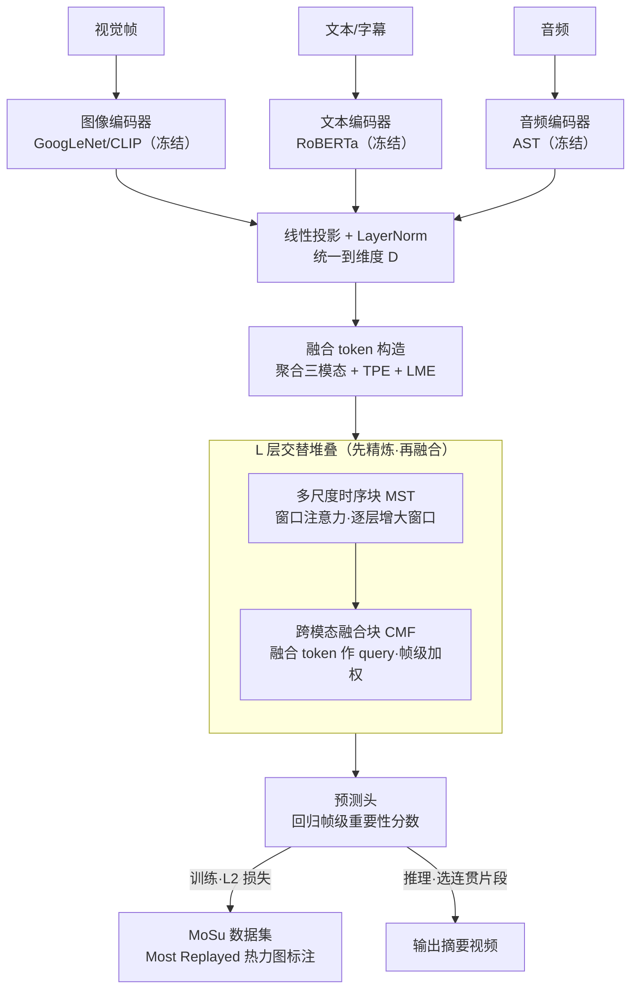

# TripleSumm: Adaptive Triple-Modality Fusion for Video Summarization

**会议**: ICLR 2026  
**arXiv**: [2603.01169](https://arxiv.org/abs/2603.01169)  
**代码**: [https://github.com/smkim37/TripleSumm](https://github.com/smkim37/TripleSumm)  
**领域**: 音频语音  
**关键词**: 视频摘要, 三模态融合, 自适应权重, 多尺度时序, 大规模数据集

## 一句话总结
提出 TripleSumm，通过多尺度时序块（层级滑动窗口注意力）和跨模态融合块（融合 token 自适应加权视觉/文本/音频），实现帧级模态重要性动态调整，并发布首个大规模三模态视频摘要数据集 MoSu（52678 视频），在 4 个 benchmark 上达到 SOTA。

## 研究背景与动机

**领域现状**：视频摘要提取关键片段代表原视频内容。现有方法主要使用视觉特征+注意力机制。

**现有痛点**：模态重要性帧到帧动态变化（评委说话时文本重要，机器人表演时视觉+音频重要），但现有方法用静态/模态无关的融合策略。且无大规模三模态数据集。

**核心 idea**：自适应帧级模态融合 + 大规模三模态 benchmark。

## 方法详解

### 整体框架
TripleSumm 要解决的核心问题是：一段视频里"哪个模态最该被信任"是逐帧变化的（评委说话时文本重要、机器人表演时视觉+音频重要），可现有方法都用一套静态或模态无关的全局融合策略，遇到非视觉线索主导的片段就力不从心。它的整体思路是把视觉、文本、音频三条流分别送入冻结的预训练编码器（GoogLeNet/CLIP、RoBERTa、AST），投影到统一维度 $D$ 后逐帧聚合出一个"融合 token"，再交替堆叠 $L$ 层多尺度时序块（MST）和跨模态融合块（CMF）做"先时序精炼、再跨模态融合"的循环，让融合 token 在每一帧自适应地决定该信任哪个模态，最后由预测头回归出帧级重要性分数并据此挑选连贯片段。整套设计的核心赌注是：模态重要性既然是逐帧变化的，融合就必须发生在帧的粒度上，而不是用一套全局权重。

### 关键设计

**1. 融合 token 的构造：造一个不偏不倚的中立锚点来承载跨模态融合**

如果像传统多模态方法那样直接拿视觉当 query 去吸收其它模态，就等于先验地假设视觉最重要，天然带来模态偏向。TripleSumm 的做法是先把三模态的逐帧嵌入聚合成一个额外的融合 token，$\mathbf{e}^f_i=\text{Agg}(\mathbf{e}^v_i,\mathbf{e}^t_i,\mathbf{e}^a_i)$，聚合函数 $\text{Agg}$ 可取简单平均或一层 MLP——它不属于任何单一模态，正好充当公平对待三方的中立锚点。为了让模型分得清"这是第几帧"和"信息来自哪个模态"，每个 token（含融合 token 和三个模态 token）还叠加时序位置编码（TPE）$\mathbf{tpe}_i$ 和可学习的模态嵌入（LME）$\mathbf{lme}^{\{f,v,t,a\}}$，即 $\mathbf{h}^{\{f,v,t,a\}}_i=\mathbf{e}^{\{f,v,t,a\}}_i+\mathbf{tpe}_i+\mathbf{lme}^{\{f,v,t,a\}}$。这个融合 token 会贯穿后续每一层，吸收当前帧最相关模态的信息，但只吸收、不反过来改写各模态 token，从而保留各模态的原始表示供后续层继续读取。

**2. 多尺度时序块（MST）：用层级窗口注意力高效建模长视频的时序依赖**

视频可能长达数分钟、上千帧，直接做全注意力的 $O(N^2)$ 开销难以承受，但局部的场景切换和全局的节奏变化又都需要捕捉。MST 用窗口自注意力（WSA）替代全注意力，每个 query 只在以自己为中心、宽度为 $w$ 的局部窗口内取 key/value，把复杂度压到 $O(w\cdot N)$；并让窗口大小 $w$ 随层数逐渐增大——浅层用小窗口盯住相邻帧的局部依赖，深层用大窗口建立跨片段的长程联系，从局部到全局层层展开。一个关键取舍是 WSA 在四种 token（融合、视觉、文本、音频）之间共享同一套参数：因为场景切换、节奏变化这类时序模式本质上是模态无关的，共享参数既省开销又能学到通用的时序结构。

**3. 跨模态融合块（CMF）：在每一帧独立决定该信任哪个模态**

MST 只在各模态内部沿时间轴精炼，模态之间还没对话，而"该信任谁"恰恰要逐帧定夺。CMF 紧接 MST，把同一时间步 $i$ 的融合 token $\mathbf{h}^f_i$ 作 query、三个模态 token $\mathbf{h}^{\{v,t,a\}}_i$ 作 key/value 做交叉注意力，让融合 token 在这三者里加权聚合出当前帧最该关注的模态——评委发言的帧里文本权重自然变高，音乐表演的帧里音频权重升上来。MST 与 CMF 交替堆叠 $L$ 层，构成"先时序精炼、再跨模态融合"的循环，使帧级的模态偏好随网络加深越来越准。

**4. MoSu 数据集：用"Most Replayed"热力图作免费的帧级标注**

三模态视频摘要长期缺大规模 benchmark，TripleSumm 筛出 52678 个真实世界视频（要求英语字幕和音轨可用、有足够观看量以生成可靠的重看统计、时长够长），三模态特征齐备。标注直接取自 YouTube 的"Most Replayed"重看热力图——每个视频背后至少有 50000 名观众的集体重看行为，相当于把大众的注意力当作帧重要性的代理标签，无需人工逐帧打分。

> ⚠️ 以原文为准：MoSu 的具体筛选阈值（观看量、时长）以论文 Sec. 4 为准。

### 损失函数 / 训练策略
训练用 L2 回归损失 $\mathcal{L}=\|S-\hat{S}\|_2^2$ 直接监督帧级重要性分数 $\hat{S}$，推理时再选择使预测分数最大化的时序连贯片段拼成最终摘要。

## 实验关键数据

### 主实验

| 基准 | 指标 | TripleSumm | 之前SOTA | 提升 |
|------|------|-----------|---------|------|
| MoSu | Kendall τ | 0.145 | 0.107 (CFSum) | +35.5% |
| Mr.HiSum | Kendall τ | 0.105 | 0.089 | +18.0% |
| SumMe | F1 | 52.3 | 50.1 | +2.2 |
| TVSum | F1 | 63.7 | 61.5 | +2.2 |

### 消融实验

| 配置 | MoSu τ | 说明 |
|------|--------|------|
| Full TripleSumm | 0.145 | 完整 |
| 仅视觉 | 0.091 | 大幅退化 |
| 视觉+文本 | 0.128 | 音频贡献明显 |
| w/o MST | 0.121 | 多尺度重要 |
| w/o CMF | 0.118 | 自适应融合关键 |

### 关键发现
- 缺失模态时 TripleSumm 鲁棒退化——动态依赖可用模态，不会因单模态缺失而崩溃
- 定性分析显示融合 token 在不同帧自适应地关注不同模态（如评委发言帧→文本权重高，音乐表演帧→音频权重高）
- 仅视觉特征的模型在 MoSu 上 τ=0.091，加入文本后提升至 0.128，再加音频到 0.145——每个模态都有独立贡献
- MST 的多尺度设计对长视频特别重要——单一窗口大小的模型在 MoSu 上 τ 下降约 16%
- 参数效率高：TripleSumm 的参数量与仅视觉的 PGL-SUM 相当，但利用了三倍的信息源

## 亮点与洞察
- 融合 token 作为跨模态交互的"中立锚点"是关键创新——避免了传统方法中以视觉为 query 的模态偏向问题
- MST 的层级窗口设计让模型从局部到全局逐步建立时序理解——这对长视频（>2分钟）尤其重要
- 三模态的加入不仅提升了性能，更提升了鲁棒性——缺失任何单一模态时性能退化可控
- MoSu 的 "Most Replayed" 标注方案是务实的选择——利用集体观看行为作为帧重要性的免费代理标注

## 局限与展望
- MoSu 基于 YouTube "Most Replayed"，可能偏向娱乐性内容，教育/专业视频的覆盖不足
- 融合 token 的初始化使用简单平均聚合，更复杂的初始化（如门控）可能进一步提升
- 仅使用预训练编码器的冻结特征，端到端微调编码器可能释放更多潜力
- WSA 窗口大小按固定 schedule 增大，自适应调整窗口大小可能更优
- 未探索 LLM-based 摘要方法（如 VideoLLM）的对比

## 相关工作与启发
- **vs CFSum**：CFSum 也用三模态但采用静态融合，TripleSumm 的帧级自适应加权是关键差异
- **vs A2Summ**：A2Summ 侧重音频-视觉双模态，TripleSumm 完整覆盖三模态
- **vs PGL-SUM/CSTA**：这些仅用视觉特征的 Transformer 方法在 MoSu 上大幅落后，验证了多模态的必要性
- **MoSu 数据集**：首个大规模三模态视频摘要 benchmark，基于 52678 个YouTube视频的 "Most Replayed" 统计，每个视频至少 50000 观看者投票
- **启发**：融合 token 作为跨模态交互的"锚点"的设计思想可迁移到其他多模态任务（如多模态检索、视频问答）

## 评分
- 新颖性: ⭐⭐⭐⭐ 自适应三模态融合 + 大规模数据集，方法和资源双贡献
- 实验充分度: ⭐⭐⭐⭐⭐ 4 benchmark + 消融 + 定性分析 + 缺失模态鲁棒性测试
- 写作质量: ⭐⭐⭐⭐ 结构清晰，图示直观
- 价值: ⭐⭐⭐⭐⭐ MoSu 数据集和三模态融合方法都具有持久价值

<!-- RELATED:START -->

## 相关论文

- [\[ICLR 2026\] Scalable Multilingual Multimodal Machine Translation with Speech-Text Fusion](scalable_multilingual_multimodal_machine_translation_with_speech-text_fusion.md)
- [\[AAAI 2026\] Improving Multimodal Sentiment Analysis via Modality Optimization and Dynamic Primary Modality Selection](../../AAAI2026/audio_speech/improving_multimodal_sentiment_analysis_via_modality_optimization_and_dynamic_pr.md)
- [\[ICML 2026\] Multimodal Fusion via Self-Consistent Task-Gradient Fields](../../ICML2026/audio_speech/multimodal_fusion_via_self-consistent_task-gradient_fields.md)
- [\[CVPR 2026\] OmniRet: Efficient and High-Fidelity Omni Modality Retrieval](../../CVPR2026/audio_speech/omniret_efficient_and_high-fidelity_omni_modality_retrieval.md)
- [\[CVPR 2026\] SAVE: Speech-Aware Video Representation Learning for Video-Text Retrieval](../../CVPR2026/audio_speech/save_speech-aware_video_representation_learning_for_video-text_retrieval.md)

<!-- RELATED:END -->
