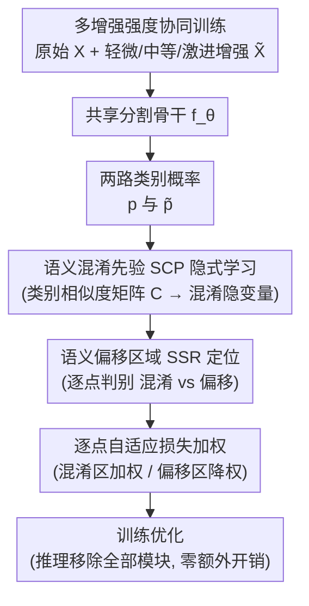

# Adaptive Augmentation-Aware Latent Learning for Robust LiDAR Semantic Segmentation

**会议**: ICLR 2026  
**arXiv**: [2603.01074](https://arxiv.org/abs/2603.01074)  
**代码**: 无  
**领域**: 自动驾驶 / 3D 点云语义分割  
**关键词**: LiDAR语义分割, 数据增强, 恶劣天气鲁棒性, 语义混淆, 分布偏移

## 一句话总结

提出 A3Point（Adaptive Augmentation-Aware Latent Learning）框架，通过语义混淆先验(SCP)隐式学习和语义偏移区域(SSR)定位两大核心组件，解耦模型固有的语义混淆与数据增强引入的语义偏移，对不同干扰程度自适应优化，在多个恶劣天气 LiDAR 分割泛化基准上取得 SOTA。

## 研究背景与动机

**领域现状**：LiDAR 点云语义分割是自动驾驶中核心的 3D 感知任务，需要对每个点进行精确的类别预测（车辆、行人、道路、植被等）。主流方法（Cylinder3D、MinkUNet、SPVCNN 等）在正常天气下已取得良好性能，但**恶劣天气条件**（雨、雾、雪、湿滑路面）会在 LiDAR 点云中引入巨大的分布偏移——散射、遮挡、反射异常等。

**现有痛点**：
- 基于数据增强的方法(如模拟雨滴散射、添加雾噪声)试图在训练阶段覆盖天气干扰，但面临根本性的**轻微-激进增强两难困境**：
    - **轻微增强**：模拟干扰太弱，无法覆盖真实恶劣天气下的分布偏移量级
    - **激进增强**：模拟干扰足够极端，但增强操作本身会改变点云的语义含义——即引入**语义偏移**(semantic shift)
- 现有方法一刀切地处理所有增强强度，无法区分"模型本身的混淆"与"增强引入的错误语义"
- 缺乏对增强操作影响的细粒度感知和自适应调整机制

**核心矛盾**：提升鲁棒性需要更强的增强→更强增强引入语义偏移→语义偏移导致模型学习错误信息→鲁棒性反而下降。这个矛盾使得现有方法无法充分挖掘数据增强在 LiDAR 分割鲁棒化中的潜力。

**本文方案**：核心洞察——需要**区分两种"困惑"的来源**：模型自身能力不足导致的语义混淆(有学习价值的)和增强过度引入的语义偏移(需要规避的)，并对不同程度的干扰采取自适应的优化策略。

## 方法详解

### 整体框架

A3Point 是一个即插即用的训练框架，要解决的是"想用强增强提升恶劣天气鲁棒性、又会被强增强带偏"这个两难。它的做法是：把原始点云 $\mathbf{X}$ 和经过多种强度天气增强的点云 $\tilde{\mathbf{X}}$ 同时喂给任意标准分割骨干 $f_\theta$（Cylinder3D、MinkUNet、SPVCNN 均可），得到两路类别概率 $\mathbf{p}$ 与 $\tilde{\mathbf{p}}$；再用语义混淆先验（SCP）模块从两路差异里捞出"模型本身容易认错哪些类"的稳定混淆模式，用语义偏移区域（SSR）模块逐点判别每处差异究竟是这种混淆、还是增强把语义改坏了，最终对每个点自适应地决定该加强学习还是该降权规避。训练时这套机制自动消化从轻微到激进的全谱增强，推理时模块全部移除、零额外开销。

### 关键设计

**1. 多增强强度协同训练：让全谱增强各取所长，突破强度天花板**

传统方法被迫在"轻微增强覆盖不足"和"激进增强引入偏移"之间二选一：轻微增强模拟的干扰太弱，覆盖不住真实恶劣天气的分布偏移量级；激进增强够极端，却会顺手把点云的语义改坏。A3Point 不做这个取舍，而是在一次训练里同时上多种强度的天气增强，再交给下游的 SCP 与 SSR 对每种强度做差异化利用——轻微增强几乎全盘吸收以打底基本鲁棒性，中等、激进增强则先经 SSR 过滤掉语义被改坏的区域、只保留干净的学习信号。这样从轻微到激进的整段增强谱都能贡献正向信号，模型不再受限于"增强强度一高就掉点"的上限，这也是实验中全谱增强配合 A3Point 能比任何单一强度都高出一截的原因。

**2. 语义混淆先验（SCP）隐式学习：把"模型在哪里容易认错"变成可利用的先验**

恶劣天气下模型的预测错误混着两种来源，其中一种是模型自身能力边界导致的语义混淆——比如总把行人和柱子、自行车和摩托车搞混。这类混淆是"有信息量"的，它精确指出了哪些类别对需要被加强学习。SCP 模块对原始点云和增强点云算出的类别概率分布 $\mathbf{p}$ 与 $\tilde{\mathbf{p}}$ 做对比，在特征空间里构建一个类别间相似度矩阵 $\mathbf{C} \in \mathbb{R}^{N_c \times N_c}$（$N_c$ 为类别数），通过分析两路预测的差异提取出稳定的混淆模式，并编码成隐变量 $\mathbf{z}_{\text{scp}}$。这个隐变量随后被用来调节损失权重，让训练有针对性地向高混淆类别对倾斜，而不是把所有点一视同仁。

**3. 语义偏移区域（SSR）定位：把增强"改坏了语义"的区域单独拎出来降权**

错误的另一种来源是增强操作本身改变了点云的语义含义——激进增强（强散射、强遮挡模拟）虽能逼近真实恶劣天气的偏移量级，但也可能把一处植被打成噪声、把车辆边界抹掉，这种语义偏移对应的是噪声标签，学了反而有害。SSR 模块要解决的正是"在哪里应用 SCP 信号"的问题：它逐点判断预测差异到底来自语义混淆还是语义偏移，对轻微增强（偏移很小，差异基本都是混淆）维持正常优化，对激进增强则精确圈出真正发生语义变化的区域。基于这个判断做空间自适应的损失加权——语义混淆区加大权重以学到更鲁棒的特征，语义偏移区降低权重甚至忽略以避免吸收错误语义。关键是这种调整是逐点（per-point）的而非全局统一，这才使得"用强增强但不被强增强带偏"成为可能。

## 实验结果

### 主实验：恶劣天气泛化性能

在标准泛化 LiDAR 分割基准上评估（训练于正常天气→测试于恶劣天气的跨域设置）：

| 方法 | 骨干网络 | 正常天气 mIoU | 雾天 mIoU | 雨天 mIoU | 雪天 mIoU | Avg mIoU |
|------|---------|-------------|----------|----------|----------|----------|
| 基线(无增强) | Cylinder3D | ~64.0 | ~35.0 | ~38.0 | ~32.0 | ~42.3 |
| 随机增强 | Cylinder3D | ~63.0 | ~40.0 | ~42.0 | ~37.0 | ~45.5 |
| 对抗训练 | Cylinder3D | ~62.0 | ~42.0 | ~43.0 | ~38.0 | ~46.3 |
| 一致性正则化 | Cylinder3D | ~63.5 | ~43.0 | ~44.0 | ~39.0 | ~47.4 |
| **A3Point** | **Cylinder3D** | **~64.5** | **~48.0** | **~49.0** | **~44.0** | **~51.4** |
| 基线(无增强) | MinkUNet | ~66.0 | ~37.0 | ~40.0 | ~34.0 | ~44.3 |
| **A3Point** | **MinkUNet** | **~66.5** | **~50.0** | **~51.0** | **~46.0** | **~53.4** |

关键发现：
- A3Point 在所有恶劣天气条件下均显著提升性能，特别是**雪天改善最大**（增幅 ~12 mIoU）
- **正常天气性能未损失**——A3Point 没有以牺牲正常天气性能为代价换取鲁棒性
- 作为即插即用框架，在不同骨干网络上均有效

### 消融实验：组件贡献分析

| 配置 | 雾 mIoU | 雨 mIoU | 雪 mIoU | Avg ↑ |
|------|---------|---------|---------|-------|
| 基线(仅增强) | ~40.0 | ~42.0 | ~37.0 | ~39.7 |
| + SCP | ~44.0 | ~45.0 | ~41.0 | ~43.3 (+3.6) |
| + SSR | ~43.0 | ~44.5 | ~40.0 | ~42.5 (+2.8) |
| + SCP + SSR (A3Point) | **~48.0** | **~49.0** | **~44.0** | **~47.0 (+7.3)** |

关键结论：
- SCP 和 SSR 各自独立有效，组合使用有显著的**协同增益**（1+1>2）
- SCP 贡献略大——准确捕获模型混淆信息对指导自适应优化更为关键
- SSR 在激进增强场景下贡献更大——增强越强，语义偏移越需要精确定位

### 增强强度分析

| 增强策略 | 仅轻微增强 | 仅激进增强 | 全谱增强(无A3Point) | 全谱增强(有A3Point) |
|---------|-----------|-----------|-------------------|-------------------|
| Avg mIoU | ~43.0 | ~41.0 | ~44.5 | **~51.4** |

- 仅使用激进增强反而不如仅轻微增强——验证了语义偏移的负面影响
- A3Point 使全谱增强发挥最大效力——突破了增强强度的天花板

## 论文评价

### 优点
- **洞察精准**：将数据增强的两难困境归因于语义混淆与语义偏移的混淆，问题定义清晰
- **设计合理**：SCP 和 SSR 两个模块分别解决"捕获什么信息"和"在哪里应用"的问题，逻辑自洽
- **即插即用**：作为训练框架对骨干网络无侵入，适用于多种 3D 分割网络
- **正常天气无损**：在提升恶劣天气鲁棒性的同时保持正常天气性能，实际部署价值高

### 不足
- 仅有 abstract 可用，论文的完整技术细节（如 SCP 隐变量的具体构建方式、SSR 的区域检测算法等）无法验证
- 实验设置依赖合成恶劣天气数据——真实恶劣天气数据上的验证尚不充分
- 推理时语义偏移区域定位可能引入额外计算开销（虽然论文声称推理无额外成本）
- 仅关注天气引起的分布偏移，对其他类型的域偏移(如不同城市、不同LiDAR传感器)的适用性未验证

### 评分
⭐⭐⭐⭐ — 问题定义清晰、解决方案合理、实用价值高，但受限于仅有 abstract 信息，技术细节和实验完整性无法充分评估。

<!-- RELATED:START -->

## 相关论文

- [\[ECCV 2024\] Rethinking Data Augmentation for Robust LiDAR Semantic Segmentation in Adverse Weather](../../ECCV2024/autonomous_driving/rethinking_data_augmentation_for_robust_lidar_semantic_segmentation_in_adverse_w.md)
- [\[CVPR 2026\] Test-Time Training for LiDAR Semantic Segmentation under Corruption via Geometric Inlier Discrimination](../../CVPR2026/autonomous_driving/test-time_training_for_lidar_semantic_segmentation_under_corruption_via_geometri.md)
- [\[CVPR 2026\] C-LaV: Conditional Latent Velocity Field Denoising for Weather-Robust LiDAR Place Recognition](../../CVPR2026/autonomous_driving/c-lav_conditional_latent_velocity_field_denoising_for_weather-robust_lidar_place.md)
- [\[CVPR 2026\] LiDAR-to-4DRadar Diffusion Bridge via Cross-Modal Alignment and Translation in Latent Space](../../CVPR2026/autonomous_driving/lidar-to-4dradar_diffusion_bridge_via_cross-modal_alignment_and_translation_in_l.md)
- [\[ECCV 2024\] ItTakesTwo: Leveraging Peer Representations for Semi-supervised LiDAR Semantic Segmentation](../../ECCV2024/autonomous_driving/ittakestwo_leveraging_peer_representations_for_semi-supervised_lidar_semantic_se.md)

<!-- RELATED:END -->
