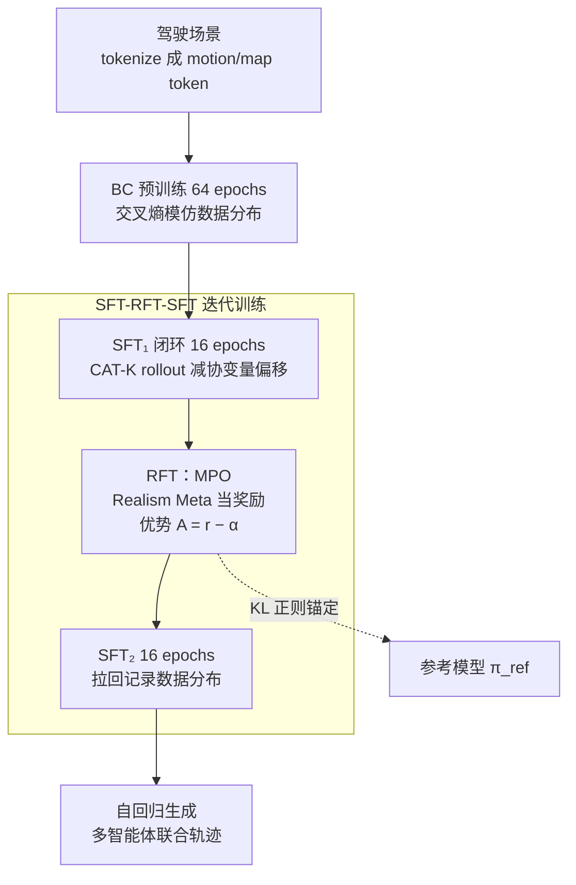

# SMART-R1: Advancing Multi-agent Traffic Simulation via R1-Style Reinforcement Fine-Tuning

**会议**: ICLR 2026  
**arXiv**: [2509.23993](https://arxiv.org/abs/2509.23993)  
**代码**: 无  
**领域**: 自动驾驶 / 强化学习  
**关键词**: 多智能体交通仿真, R1风格, 强化微调, 下一token预测, 策略优化  

## 一句话总结
SMART-R1 首次将 R1 风格的强化微调（RFT）引入多智能体交通仿真，提出 Metric-oriented Policy Optimization (MPO) 算法和"SFT-RFT-SFT"迭代训练策略，在 WOSAC 2025 排行榜上以 0.7858 的 Realism Meta 分数取得第一名。

## 研究背景与动机

**领域现状**：多智能体交通仿真的主流方法是基于 Next-Token Prediction (NTP) 的自回归模型（如 SMART），通过离散化轨迹 token 生成多智能体联合行为。训练分为行为克隆（BC）预训练和闭环 SFT（CAT-K rollout）两阶段。

**现有痛点**：(a) BC 和 SFT 的训练目标（交叉熵损失）与最终评估指标（碰撞率、偏离道路率等 Realism Meta 分数）不直接对齐——这些指标是标量、稀疏、不可微的；(b) 自回归生成中的协变量偏移（covariate shift）导致闭环仿真中误差累积；(c) 直接应用 GRPO/PPO 等 RL 方法效果不佳，因为它们依赖采样比较或 actor-critic 结构。

**核心矛盾**：NTP 模型的训练目标（模仿数据分布）与评估目标（安全性和真实性指标）之间存在 gap，而这些评估指标无法直接作为梯度优化的损失函数。

**本文目标** 如何将不可微的评估指标纳入 NTP 型交通仿真模型的训练中？

**切入角度**：借鉴 DeepSeek-R1 的多阶段训练策略，设计"SFT→RFT→SFT"的迭代训练管线，用简化的策略优化算法直接对齐评估指标。

**核心 idea**：利用已知的奖励期望值简化优势估计，配合 SFT-RFT-SFT 迭代防止灾难性遗忘。

## 方法详解

### 整体框架
SMART-R1 沿用 NTP 型交通仿真的主干：把一段驾驶场景 tokenize 成 motion token（智能体轨迹）和 map token（地图），送进带自注意力和交叉注意力的 Transformer，逐步预测下一个 motion token 的 logits，自回归地生成所有智能体的联合行为。它真正改变的是**训练管线**——把原来"BC 预训练 + 闭环 SFT"两段式，扩展成借鉴 DeepSeek-R1 的四阶段流程：先 BC 预训练 64 epochs 学会模仿数据分布，再闭环 SFT 16 epochs（CAT-K rollout）减少协变量偏移，接着插入一段 RFT 用评估指标直接优化策略，最后再 SFT 16 epochs 把分布拉回记录数据。关键在于让训练目标从"模仿 token 分布"转向"对齐不可微的 Realism Meta 指标"，而又不丢掉前期学到的先验。

### 关键设计

**1. Metric-oriented Policy Optimization（MPO）：把不可微的评估指标直接当奖励，但用任务先验绕开采样估计**

NTP 模型的痛点是训练用的交叉熵损失和最终评估用的 Realism Meta（碰撞率、偏离道路率等标量、稀疏、不可微指标）不对齐。MPO 的做法是对每个场景完整自回归 rollout 出所有智能体的轨迹，再用官方评估协议算出 Realism Meta 分数当作奖励 $r$。它的巧妙之处在优势估计：通常的 RL 要靠采样或价值网络估计基线，而交通仿真的奖励期望相对集中（基线模型平均约 0.77），所以 MPO 直接把优势简化为 $\mathcal{A} = r - \alpha$，$\alpha = 0.77$ 是接近基线平均奖励的经验阈值——超过阈值的 rollout 被正向强化，低于的被惩罚。完整损失为

$$\mathcal{L}_{\text{MPO}} = -\left(\frac{\pi_\theta}{\bar{\pi}_\theta}\mathcal{A} - \beta D_{\text{KL}}[\pi_\theta \,\|\, \pi_{\text{ref}}]\right).$$

和 GRPO 的区别正在这里：GRPO 要靠组内多次采样、用组内平均奖励做归一化，会引入采样偏差；PPO 的 value model 难训；DPO 又依赖偏好对。MPO 用一个固定阈值 $\alpha$ 替掉这些机制，既不用多次采样也不用价值网络，更简单也更稳定。

**2. R1 风格的"SFT-RFT-SFT"迭代训练：在指标优化前后各夹一段 SFT，防止灾难性遗忘**

单纯把 RFT 接在 SFT 后面，模型容易在优化指标的过程中遗忘 SFT 学到的数据分布。SMART-R1 借鉴 R1 的多阶段思路，把训练排成三段互补的流程：第一轮 SFT（16 epochs）先减少协变量偏移、贴合记录数据；中间的 RFT 用 MPO 对齐评估指标；第二轮 SFT（16 epochs）再把策略拉回记录数据分布，修复 RFT 可能带来的偏移。消融显示，连续两轮 SFT（不插 RFT）反而不如"SFT→RFT→SFT"，说明真正起作用的是 RFT 这一段而非多训了几个 epoch，也印证了 DeepSeek-R1 那套 SFT-RFT 交替范式在非 LLM 领域同样成立。

**3. KL 正则化：用一项 per-token KL 惩罚把策略锚在参考模型附近**

RFT 只盯着指标优化，容易让策略偏离 BC/SFT 学到的先验太远。MPO 损失里那项 $\beta D_{\text{KL}}$ 就是为此而设，采用无偏 KL 估计器

$$D_{\text{KL}} = \frac{\pi_{\text{ref}}}{\pi_\theta} - \log\frac{\pi_\theta}{\pi_{\text{ref}}} - 1,$$

系数取 $\beta = 0.04$。这个值是在两端之间折中：$\beta$ 太小，策略会偏离参考模型太远、丢掉 BC/SFT 先验；$\beta$ 太大，KL 惩罚又会盖过奖励信号、让指标优化失效。

### 损失函数 / 训练策略
- BC/SFT 阶段：标准交叉熵损失，对齐 token 分布。
- RFT 阶段：MPO 损失 = 优势加权的策略梯度 + KL 正则化。
- 总 epochs 与基线持平（64 + 32），区别只是把原来的 32 epochs SFT 拆成 16 + RFT + 16。

## 实验关键数据

### 主实验
WOSAC 2025 排行榜（测试集）：

| 方法 | Realism Meta↑ | 运动学↑ | 交互↑ | 地图↑ | minADE↓ | 参数量 |
|------|-------------|--------|------|------|---------|--------|
| SMART-base | 0.7725 | 0.472 | 0.804 | 0.912 | 1.393 | 7M |
| SMART-SFT (CAT-K) | 0.7846 | 0.493 | 0.811 | 0.918 | 1.307 | 7M |
| TrajTok | 0.7852 | 0.489 | 0.812 | 0.921 | 1.318 | 10M |
| **SMART-R1** | **0.7858** | **0.494** | 0.811 | 0.920 | **1.289** | 7M |

### 消融实验

| 训练策略 | Realism Meta↑ | 说明 |
|---------|-------------|------|
| 仅 BC | 0.7725 | 基线 |
| SFT | 0.7812 | 闭环 SFT 提升 |
| SFT → RFT | 0.7848 | 加 RFT 进一步提升 |
| SFT → SFT (无 RFT) | 0.7809 | 连续 SFT 反而不如插入 RFT |
| **SFT → RFT → SFT** | **0.7859** | R1 风格最佳 |

策略优化方法对比（基于 SFT 后）：

| 方法 | Realism Meta↑ |
|------|-------------|
| SFT baseline | 0.7812 |
| + PPO | 下降 | 训练不稳定 |
| + DPO | 下降 | 采样偏差 |
| + GRPO | 下降 | 组内比较不稳定 |
| **+ MPO** | **0.7848** | 利用先验知识指导 |

### 关键发现
- RFT 在安全关键指标（碰撞率、偏离道路率、交通灯违规率）上改善最明显——这些正是 BC/SFT 无法直接优化的指标
- PPO/DPO/GRPO 在交通仿真任务上均失败，只有 MPO 有效——说明任务特性（可预测奖励期望）使得通用 RL 算法不适用
- $\alpha = 0.77$ 是最优阈值，高了正向奖励太少、低了标准太宽松
- $\beta = 0.04$ 平衡 KL 正则化效果最佳

## 亮点与洞察
- **"任务先验知识简化 RL"**的思路很实用：当奖励分布相对集中（不像 LLM 那样高方差）时，固定阈值比 GRPO 的组内比较更稳定。这个洞察可以迁移到其他奖励可预测的 RL 场景。
- **SFT-RFT-SFT 的交替策略**验证了"先对齐数据分布 → 再优化指标 → 再恢复分布"的范式在非 LLM 领域同样有效，为自动驾驶中的 RLHF 提供了模板。
- 方法极其轻量——在 SMART-tiny（7M 参数）上就能取得 WOSAC 第一名，且不需要模型集成或后处理。

## 局限与展望
- MPO 的阈值 $\alpha$ 需要手动调节，且依赖于基线模型的平均性能——不够通用
- 仅在 SMART-tiny (7M) 上验证，在更大模型上的效果未知
- Realism Meta 指标本身是否真正反映驾驶真实性仍有争议（参见 SPACeR 论文的讨论）
- 可扩展到大模型和多轮 RFT 迭代

## 相关工作与启发
- **vs SMART/CAT-K baseline**: R1 风格的 RFT 在不增加参数的情况下将 Realism Meta 从 0.7846 提升到 0.7858
- **vs RLFTSim (Ahmadi et al., 2025)**: 同样用 RL 微调但不同策略，SMART-R1 效果更好（0.7858 vs 0.7844），可能因为 MPO 更适合此任务
- **vs DeepSeek-R1**: SMART-R1 借鉴了 R1 的训练范式但简化了优势估计，证明了 LLM 的训练思想可以跨领域迁移到自动驾驶仿真

## 评分
- 新颖性: ⭐⭐⭐⭐ 首次在交通仿真中应用 R1 风格训练，MPO 是针对任务特性的简洁设计
- 实验充分度: ⭐⭐⭐⭐⭐ WOSAC 排行榜第一，详细消融包括优化方法对比、超参数敏感性
- 写作质量: ⭐⭐⭐⭐ 框架清晰，与 LLM 训练范式的类比恰当，实验分析充分
- 价值: ⭐⭐⭐⭐ 为交通仿真模型的 RL 后训练提供了实用的模板

<!-- RELATED:START -->

## 相关论文

- [\[CVPR 2026\] RLFTSim: Realistic and Controllable Multi-Agent Traffic Simulation via Reinforcement Learning Fine-Tuning](../../CVPR2026/autonomous_driving/rlftsim_realistic_and_controllable_multi-agent_traffic_simulation_via_reinforcem.md)
- [\[AAAI 2026\] WorldRFT: Latent World Model Planning with Reinforcement Fine-Tuning for Autonomous Driving](../../AAAI2026/autonomous_driving/worldrft_latent_world_model_planning_with_reinforcement_fine-tuning_for_autonomo.md)
- [\[CVPR 2026\] PlannerRFT: Reinforcing Diffusion Planners through Closed-Loop and Sample-Efficient Fine-Tuning](../../CVPR2026/autonomous_driving/plannerrft_reinforcing_diffusion_planners_through_closed-loop_and_sample-efficie.md)
- [\[ICLR 2026\] Multi-Head Low-Rank Attention (MLRA)](multi-head_low-rank_attention.md)
- [\[ECCV 2024\] Improving Agent Behaviors with RL Fine-tuning for Autonomous Driving](../../ECCV2024/autonomous_driving/improving_agent_behaviors_with_rl_fine-tuning_for_autonomous_driving.md)

<!-- RELATED:END -->
