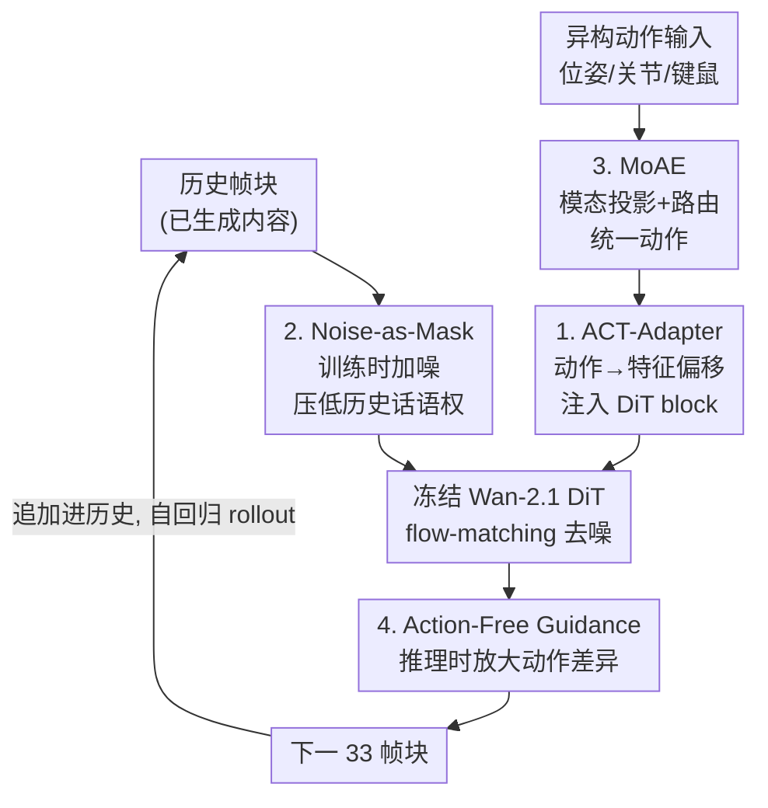

# Astra: General Interactive World Model with Autoregressive Denoising

**会议**: ICLR 2026  
**arXiv**: [2512.08931](https://arxiv.org/abs/2512.08931)  
**代码**: [https://github.com/EternalEvan/Astra](https://github.com/EternalEvan/Astra)  
**领域**: 自动驾驶 / 视频生成  
**关键词**: world model, autoregressive denoising, action control, interactive video, mixture of experts

## 一句话总结
提出 Astra，一个通用交互式世界模型，通过自回归去噪框架在预训练视频扩散模型上实现动作条件化的长程视频预测，引入 ACT-Adapter（动作注入）、噪声增强历史记忆（缓解视觉惯性）和 Mixture of Action Experts（统一多异构动作模态），在自动驾驶、机器人操控和场景探索等多场景上实现 SOTA 的保真度和动作跟随能力。

## 研究背景与动机
**领域现状**：视频扩散模型（如 Wan-2.1）能生成高质量短视频，但缺乏交互性——不能根据动作输入动态调整生成。真正的世界模型需要能够响应任意时刻的任意动作。

**现有痛点**：(1) 标准 T2V/I2V 模型只生成固定片段，无长程 rollout；(2) 自回归扩散混合方法面临误差累积和时序漂移；(3) 增长历史条件长度可提升时序一致性但会削弱动作响应——"视觉惯性"问题；(4) 真实环境涉及异构动作模态（相机位姿、机器人关节、键盘命令），单一模型难以统一。

**核心矛盾**：长程时序一致性 vs 动作响应性——模型倾向于从过去帧平滑外推而忽略新的动作控制信号。

**本文目标** 构建能在多种真实场景中根据多种动作类型生成交互式长程视频的通用世界模型。

**切入角度**：在预训练视频扩散模型上附加轻量 adapter 注入动作信号 + 噪声增强历史帧缓解视觉惯性 + MoE 路由异构动作。

**核心 idea**：用噪声降低历史帧的主导地位、用 adapter 注入动作信号、用 MoE 统一多模态动作——让视频扩散模型变成交互式世界模型。

## 方法详解

### 整体框架
Astra 想把一个只会生成固定短片的视频扩散模型，改造成能边走边响应动作的交互式世界模型。它直接复用预训练的 Wan-2.1，把生成过程拆成 chunk-wise 自回归：每一步只预测下一个 33 帧的视频块，生成完追加到历史里、再以这段历史为条件预测下一块，靠时序因果注意力把过去的内容聚合进来。这样长程 rollout 就变成"一块接一块"的滚动生成，而真正的难点不在于怎么续写，而在于续写时不能只顺着过去帧外推、要听新进来的动作指令——下面四个设计都是围绕这个矛盾展开的：历史那一路用 **Noise-as-Mask** 把过去帧的话语权压下去，动作那一路先用 **MoAE** 把异构动作统一、再用 **ACT-Adapter** 注入到冻结的 DiT，最后推理时用 **AFG** 把动作的影响放大。

### 关键设计

**1. ACT-Adapter（动作感知适配器）：把动作变成隐空间里的一次特征偏移**

要让冻结的视频扩散模型听懂动作，最省事的方式是把动作的影响理解成隐空间里的一次平移——类似光流，动作就是让画面内容朝某个方向位移。基于这个直觉，ACT-Adapter 先用动作编码器把动作投影到与视频隐变量对齐的特征空间，然后在每个 DiT block 里和视频特征逐元素相加，而不是绕一圈做 cross-attention。训练时绝大部分预训练参数都冻住，只微调自注意力层，外加一层用恒等矩阵初始化的线性适配器——恒等初始化保证一开始不破坏预训练能力，再逐步学会注入动作。消融里这个设计一旦换成 cross-attn，动作跟随就明显掉下来。

**2. Noise-as-Mask（噪声增强历史记忆）：用噪声压低历史帧的话语权，逼模型去看动作**

历史条件越长、时序越一致，但代价是模型越倾向于平滑外推过去帧、忽略新的动作信号，也就是论文命名的"视觉惯性"。Noise-as-Mask 的做法是训练时往历史条件帧上注入一层随机噪声，这层噪声独立于扩散本身的噪声，纯粹用来降级历史帧的信息质量——历史帧变模糊了，模型就没法只靠复制过去帧蒙混，必须同时依赖动作信号才能把下一块生成对。推理时则换回干净历史帧，不损失保真度。和 YUME 随机 mask 掉视觉 token 的做法相比，这里只是把历史"调暗"而非整块抹掉，既不用改架构也不加参数。消融显示去掉它之后视觉惯性明显加重、动作被忽略。

**3. Mixture of Action Experts（MoAE）：用专家路由统一结构差异巨大的多种动作**

真实场景里的动作模态五花八门——自动驾驶是 7 维相机位姿、机器人是 7 维关节角、场景探索是键盘/鼠标命令，它们的结构和数值尺度差太多，硬塞进一个编码器很难统一。MoAE 先给每种模态配一个模态特定投影器，把它们映射到同一个共享空间，再交给路由网络算门控分数、选出 top-K 个专家（每个专家是独立 MLP），最后按门控权重聚合专家输出。这样一个模型就能同时吃下相机位姿和关节角度，让自动驾驶和机器人操控共用一套权重；消融里去掉 MoAE 就无法处理多模态动作、性能下降。

**4. Action-Free Guidance（AFG）：把 CFG 的套路搬到动作条件上放大动作效果**

为了在推理时进一步强化动作的影响力，Astra 把 classifier-free guidance 的思路照搬过来：训练时以一定概率随机丢弃动作条件，让模型同时学会"有动作"和"无动作"两种预测；推理时再用

$$v_{guided} = v_\emptyset + s \cdot (v_a - v_\emptyset)$$

把两者的差按引导强度 $s$ 放大，$v_a$ 是带动作条件的预测、$v_\emptyset$ 是无动作预测。消融里去掉 AFG，动作响应就会减弱。

### 损失函数 / 训练策略
Flow matching 损失。基于 Wan-2.1 预训练，8 GPU 训练 30 epoch（~24h）。训练数据：~397K 视频（360 小时），覆盖 nuScenes、Sekai、SpatialVID、RT-1、Multi-Cam Video。

## 实验关键数据

### 主实验（Astra-Bench，480×832，96帧）

| 方法 | Instruction Following↑ | Subject Consistency↑ | Motion Smoothness↑ |
|------|----------------------|--------------------|--------------------|
| Wan-2.1 | 0.061 | 0.854 | 0.958 |
| MatrixGame | 0.268 | 0.916 | 0.981 |
| YUME | 0.652 | 0.936 | 0.985 |
| **Astra** | **0.669** | **0.939** | **0.989** |

### 消融实验

| 配置 | 效果 |
|------|------|
| 无 ACT-Adapter (用 cross-attn) | 动作跟随显著下降 |
| 无 AFG | 动作响应减弱 |
| 无 noise-as-mask | 视觉惯性加重，动作被忽略 |
| 无 MoAE | 不能处理多模态动作，性能下降 |

### 关键发现
- Astra 在所有 6 个指标上均超越 SOTA，尤其在 Instruction Following 上大幅领先（0.669 vs Wan-2.1 的 0.061）
- 长程 rollout（96帧+）中 Astra 保持稳定而竞争方法出现漂移和退化
- 噪声增强策略比 token masking 更简洁（无需架构修改）且效果更好
- MoAE 使单一模型能同时处理自动驾驶（相机位姿）和机器人操控（关节角度）
- AFG 类比 CFG，有效放大了动作条件的影响力

## 亮点与洞察
- **"视觉惯性"是世界模型的核心挑战**：首次命名并系统性解决了这个长期一致性与动作响应性之间的矛盾
- **噪声增强历史帧的简洁性**：不修改架构、不增加参数，仅在训练时加噪——通过降低信息质量来平衡信息来源的权重
- **多场景统一的野心**：同一个模型做自动驾驶、机器人操控和第一人称探索——通过 MoAE 实现

## 局限与展望
- 训练数据主要是驾驶和探索场景，复杂物理交互（如流体、碰撞）可能不够
- 误差累积在极长 rollout（>数百帧）中仍可能出现
- MoAE 的路由机制是否真的做了有意义的模态区分需要更多分析
- 评估中 Instruction Following 依赖人工评估，可扩展性有限

## 相关工作与启发
- **vs YUME**: YUME 用 masked video diffusion transformer，Astra 用 noise-as-mask——更简洁
- **vs MatrixGame**: MatrixGame 用因果 action guidance，Astra 的 ACT-Adapter 更直接地注入动作
- **vs Genie2/UniSim (大规模世界模型)**: Astra 用更小的数据量（~400K vs 百万级）达到竞争性能

## 评分
- 新颖性: ⭐⭐⭐⭐ 噪声增强历史、ACT-Adapter、MoAE 三个设计各有创意
- 实验充分度: ⭐⭐⭐⭐⭐ 5 个数据集、多场景、完整消融、人工评估
- 写作质量: ⭐⭐⭐⭐ 架构图清晰，"视觉惯性"概念形象
- 价值: ⭐⭐⭐⭐⭐ 通用交互世界模型的实用框架，代码开源

<!-- RELATED:START -->

## 相关论文

- [\[ICCV 2025\] Epona: Autoregressive Diffusion World Model for Autonomous Driving](../../ICCV2025/autonomous_driving/epona_autoregressive_diffusion_world_model_for_autonomous_driving.md)
- [\[ICLR 2026\] ResWorld: Temporal Residual World Model for End-to-End Autonomous Driving](resworld_temporal_residual_world_model_for_end-to-end_autonomous_driving.md)
- [\[AAAI 2026\] Difficulty-Aware Label-Guided Denoising for Monocular 3D Object Detection](../../AAAI2026/autonomous_driving/difficulty-aware_label-guided_denoising_for_monocular_3d_object_detection.md)
- [\[CVPR 2026\] GEM: Generating LiDAR World Model via Deformable Mamba](../../CVPR2026/autonomous_driving/gem_generating_lidar_world_model_via_deformable_mamba.md)
- [\[CVPR 2026\] SparseWorld-TC: Trajectory-Conditioned Sparse Occupancy World Model](../../CVPR2026/autonomous_driving/sparseworld_tc_trajectory_conditioned_sparse_occupancy_world_model.md)

<!-- RELATED:END -->
