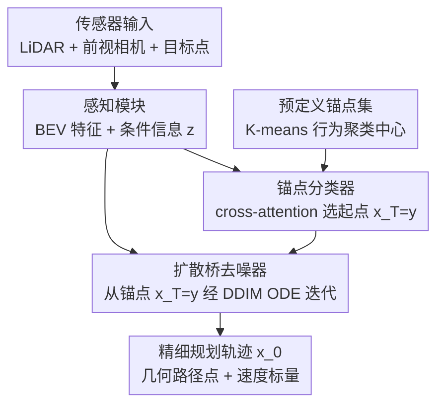

# BridgeDrive: Diffusion Bridge Policy for Closed-Loop Trajectory Planning in Autonomous Driving

**会议**: ICLR 2026  
**arXiv**: [2509.23589](https://arxiv.org/abs/2509.23589)  
**代码**: [https://github.com/shuliu-ethz/BridgeDrive](https://github.com/shuliu-ethz/BridgeDrive)  
**领域**: 自动驾驶  
**关键词**: 扩散桥模型, 锚点轨迹引导, 闭环规划, 几何路径点, Bench2Drive  

## 一句话总结
BridgeDrive 提出用扩散桥（diffusion bridge）替代截断扩散来实现锚点引导的自动驾驶轨迹规划，保证前向/反向过程的理论对称性，在 Bench2Drive 闭环评估中成功率达到 74.99%（PDM-Lite）和 89.25%（LEAD），分别超越前 SOTA 7.72% 和 2.45%。

## 研究背景与动机

**领域现状**：扩散模型因能建模多模态行为分布而成为自动驾驶规划的强力范式。DiffusionDrive 引入锚点轨迹（代表典型人类驾驶行为的 K-means 聚类中心）来引导扩散过程，取得了 SOTA 性能。

**现有痛点**：DiffusionDrive 使用截断扩散调度（truncated diffusion schedule），从锚点的带噪版本开始去噪，而非从纯高斯噪声开始。这导致前向过程（给锚点加噪）和去噪过程（恢复真实轨迹）之间存在理论不对称——去噪器被训练为从带噪锚点回归到真实轨迹，而非反转前向扩散过程。

**核心矛盾**：这种不对称性偏离了扩散模型的核心原理，可能导致不可预测的行为和性能下降。如何在保持锚点引导优势的同时确保扩散模型的理论一致性？

**本文目标** (a) 设计一个理论一致的锚点引导扩散框架；(b) 选择更适合扩散模型的轨迹表示方式；(c) 实现实时闭环部署。

**切入角度**：将规划任务定义为扩散桥（diffusion bridge）——学习一个显式连接锚点轨迹到精细规划轨迹的扩散过程，保证前向和反向过程完美对称。

**核心 idea**：用扩散桥取代截断扩散，使锚点引导成为扩散模型的内在一部分而非外部 hack。

## 方法详解

### 整体框架
输入是传感器数据（LiDAR + 前视相机 + 目标点），经过感知模块提取 BEV 特征和条件信息 $z$。规划分两步：(1) 锚点分类器 $h_\phi$ 从预定义锚点集 $\mathcal{Y}$ 中选择最佳锚点作为起点 $x_T = y$；(2) 扩散桥去噪器 $x_\theta$ 通过 DDIM 一阶 ODE 把锚点 $x_T = y$ 逐步转化为精细规划轨迹 $x_0$，轨迹本身用「几何路径点 + 速度标量」表示。三个关键设计分别落在这条管线的不同位置：去噪过程整体被改造成理论对称的**扩散桥**，输出轨迹换成解耦的**几何路径点表示**，起点则由学出来的**锚点分类器**给定。

### 关键设计

**1. 扩散桥公式化：让锚点引导成为扩散过程的内在端点，而非外挂 hack**

DiffusionDrive 的截断扩散问题出在哪？它的带噪锚点 $y_t = \alpha_t y + \sigma_t \epsilon$ 对所有 $t$ 都只围绕锚点 $y$ 加噪，从未真正经过真实轨迹 $x$，所以去噪器学到的其实是「从带噪锚点回归到真值」，而不是「反转一条加噪过程」——这违反了扩散模型可逆性的根基。BridgeDrive 改用 Doob h-transform 构造一条显式连接两端点的条件扩散过程：把规划定义为从锚点 $x_T = y$ 走向真实轨迹 $x_0 = x$ 的扩散桥，转移核取高斯形式 $q(x_t|x_0, x_T) = \mathcal{N}(x_t \mid a_t x_T + b_t x_0,\, c_t^2 I)$，系数 $a_t, b_t, c_t$ 由噪声调度给定。

$$x_t = a_t\, y + b_t\, x + c_t\, \epsilon$$

这条路径的两端被精确钉死：$t=0$ 时 $a_0=c_0=0,\ b_0=1$，必然回到真实轨迹；$t=T$ 时精确落在锚点上。训练目标仍是标准的加权 MSE $\min_\theta \mathbb{E}[w(t)\|x_\theta(x_t, t, x_T, z) - x_0\|^2]$，且 simulation-free（无需展开采样链）。和 DiffusionDrive 最本质的差别就藏在训练样本里：BridgeDrive 的 $x_t = a_t y + b_t x + c_t \epsilon$ 同时依赖真实轨迹和锚点（Algorithm 1, Line 7），而 DiffusionDrive 的 $y_t = \alpha_t y + \sigma_t \epsilon$ 只依赖锚点（Algorithm 2, Line 7）。一项是否含 $x$，决定了反向过程是真的可逆还是只是回归。

**2. 几何路径点表示：把路径形状和速度解耦，让锚点泛化得动**

轨迹该用什么坐标喂给扩散模型，看似细节，实则影响巨大。常规做法是等时间间距的速度路径点 $x^{\text{temp}} \in \mathbb{R}^{N \times 2}$——同样的几何路线，车速不同，点的疏密就完全不同，模型得为每种速度重新学习一套被拉伸/压缩的点分布，泛化很吃力，而且更容易违反路线拓扑约束。BridgeDrive 改用等几何间距的路径坐标加一个标量速度 $(x^{\text{geo}}, v) \in \mathbb{R}^{N \times 2} \times \mathbb{R}$：路径形状和速度被拆开，不同速度的超车只是「相似的几何模式 + 不同的速度标量」，几何部分可以复用。这个看似简单的表示替换在所有扩散方法上都带来大幅提升，在 BridgeDrive 上贡献了 +15.09% SR。

**3. 锚点分类器：推理时没有真值，得学一个预测器来选对的起点**

扩散桥的起点 $x_T = y$ 是锚点，训练时可以直接用「距真实轨迹最近的锚点」当监督，但推理时根本没有真实轨迹，最近邻锚点无从算起，必须学一个预测器补上。BridgeDrive 用分类器 $h_\phi(z, \mathcal{Y})$ 通过 cross-attention 让条件信息与全部预定义锚点和 BEV 特征交互，输出每个锚点的概率，只在整个去噪迭代开始前跑一次，不额外增加迭代开销。这一步精度很关键：扩散桥是从选中的锚点出发去精修的，一旦锚点选错，去噪器会被引向一条根本不对的轨迹，造成灾难性失败（Fig. 1 中的红色轨迹）。

### 损失函数 / 训练策略
- 去噪器损失：加权 MSE $\mathbb{E}[w(t)\|x_\theta(x_t, t, x_T, z) - x_0\|^2]$
- 分类器损失：交叉熵损失，标签为距真实轨迹最近的锚点
- 推理使用 DDIM 一阶 ODE 求解器，少量函数评估即可生成轨迹

## 实验关键数据

### 主实验
Bench2Drive 闭环评估（CARLA Leaderboard 2.0, 220 条路线）：

| 方法 | 数据集 | VLA | 扩散 | DS | SR(%) |
|------|--------|-----|------|-----|-------|
| DriveTransformer | Think2Drive | ✘ | ✘ | 63.46 | 35.01 |
| ORION | Think2Drive | ✓ | ✘ | 77.74 | 54.62 |
| DiffusionDrive-geo | PDM-Lite | ✘ | ✓ | 80.79 | 58.18 |
| SimLingo | PDM-Lite | ✓ | ✘ | 85.07 | 67.27 |
| TransFuser++ | PDM-Lite | ✘ | ✘ | 84.21 | 67.27 |
| **BridgeDrive** | PDM-Lite | ✘ | ✓ | **87.99** | **74.99** |
| **BridgeDrive** | LEAD | ✘ | ✓ | **96.34** | **89.25** |

### 消融实验

| 配置 | DS | SR(%) | 说明 |
|------|-----|-------|------|
| DiffusionDrive-temp | 77.68 | 52.72 | 截断扩散 + 时间路径点 |
| DiffusionDrive-geo | 80.79 | 58.18 | 截断扩散 + 几何路径点 (+5.46%) |
| Full Diffusion-geo | 83.85 | 67.27 | 完整扩散 + 几何路径点 |
| **BridgeDrive-geo** | **87.99** | **74.99** | 扩散桥 + 几何路径点 (+15.09% vs temp) |

### 关键发现
- 几何路径点在所有扩散方法上均优于时间路径点，BridgeDrive 中提升最大（+15.09% SR）
- 完整扩散优于截断扩散（证明理论一致性的重要性），扩散桥进一步优于完整扩散（证明锚点引导的价值）
- BridgeDrive 在 Merging 场景提升最显著（+11.17），因为锚点引导在模糊情境下提供强先验
- 推理速度满足实时部署需求，DDIM 一阶求解器足够

## 亮点与洞察
- **理论驱动的方法改进**：不是简单堆叠模块，而是从扩散模型的数学原理出发发现 DiffusionDrive 的理论缺陷，并用扩散桥公式化给出"正确"的解法。这种从理论到实践的思路值得学习。
- **解耦路径形状和速度的表示选择**非常关键：一个看似简单的表示变化（几何 vs 时间路径点）带来了 15% 的 SR 提升，说明 inductive bias 的选择在扩散规划中至关重要。
- **锚点作为扩散桥的边界条件**而非外部引导信号，是一种更优雅的集成方式，可以迁移到其他条件生成任务。

## 局限与展望
- Comfortness 和 Give Way 指标表现不佳，模型倾向于频繁刹车，安全优先但牺牲了舒适性
- 未结合 VLA（Vision-Language-Action），作者明确指出这是未来方向
- 锚点分类器的精度是性能瓶颈——错误的锚点选择导致灾难性失败（Fig. 1）
- 开环评估（NAVSIM）上改进不如闭环显著，说明方法主要优势在于处理反馈回路和交互

## 相关工作与启发
- **vs DiffusionDrive (Liao et al., 2025)**: 核心区别在于理论一致性——DiffusionDrive 的截断扩散在前后向过程间引入不对称，BridgeDrive 通过扩散桥消除此缺陷，SR 从 58.18% 提升到 74.99%
- **vs SimLingo (Renz et al., 2025)**: SimLingo 依赖 VLA 大语言模型，BridgeDrive 纯扩散方法无需 VLA 即超越，暗示扩散模型在规划任务中的潜力被低估
- **vs ORION (Fu et al., 2025)**: ORION 用 VLA + VQA 增强，其扩散版本（46.54% SR）反而更差，说明扩散模型的正确使用方式很重要

## 评分
- 新颖性: ⭐⭐⭐⭐ 扩散桥在自动驾驶规划中的应用是新颖的，但核心技术（扩散桥）本身已有前人工作
- 实验充分度: ⭐⭐⭐⭐⭐ 闭环+开环评估，详细消融，多数据集验证，三种子重复实验
- 写作质量: ⭐⭐⭐⭐⭐ 对 DiffusionDrive 的缺陷分析非常清晰，算法伪代码对比一目了然
- 价值: ⭐⭐⭐⭐⭐ 在最具挑战性的闭环基准上取得显著提升，且方法简洁、推理高效

<!-- RELATED:START -->

## 相关论文

- [\[NeurIPS 2025\] Model-Based Policy Adaptation for Closed-Loop End-to-End Autonomous Driving](../../NeurIPS2025/autonomous_driving/model-based_policy_adaptation_for_closed-loop_end-to-end_autonomous_driving.md)
- [\[AAAI 2026\] DiffRefiner: Coarse to Fine Trajectory Planning via Diffusion Refinement with Semantic Interaction for End to End Autonomous Driving](../../AAAI2026/autonomous_driving/diffrefiner_coarse_to_fine_trajectory_planning_via_diffusion_refinement_with_sem.md)
- [\[CVPR 2026\] PlannerRFT: Reinforcing Diffusion Planners through Closed-Loop and Sample-Efficient Fine-Tuning](../../CVPR2026/autonomous_driving/plannerrft_reinforcing_diffusion_planners_through_closed-loop_and_sample-efficie.md)
- [\[ECCV 2024\] NeuroNCAP: Photorealistic Closed-Loop Safety Testing for Autonomous Driving](../../ECCV2024/autonomous_driving/neuroncap_photorealistic_closed-loop_safety_testing_for_autonomous_driving.md)
- [\[CVPR 2026\] Diffusion Forcing Planner: History-Annealed Planning with Time-Dependent Guidance for Autonomous Driving](../../CVPR2026/autonomous_driving/diffusion_forcing_planner_history-annealed_planning_with_time-dependent_guidance.md)

<!-- RELATED:END -->
