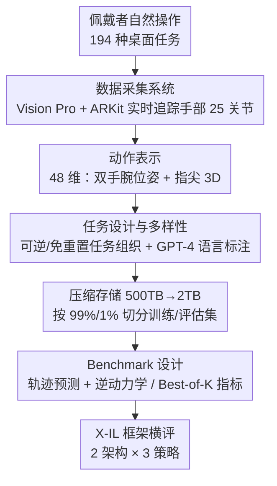

# EgoDex: Learning Dexterous Manipulation from Large-Scale Egocentric Video

**会议**: ICLR 2026  
**arXiv**: [2505.11709](https://arxiv.org/abs/2505.11709)  
**代码**: [https://github.com/apple/ml-egodex](https://github.com/apple/ml-egodex)  
**领域**: 自动驾驶/机器人  
**关键词**: 第一人称视频, dexterous manipulation, 模仿学习, hand pose, 数据集

## 一句话总结
Apple 使用 Vision Pro 采集了 829 小时的第一人称视频 + 3D 手部关节追踪数据（EgoDex），覆盖 194 种桌面操作任务，并在此数据集上系统评估了模仿学习策略（BC/DDPM/FM + Transformer），为灵巧操作的扩展训练提供了迄今最大规模的数据基础。

## 研究背景与动机

**领域现状**：机器人模仿学习面临严重的数据稀缺问题。不同于 NLP 和 2D 视觉有互联网规模的语料，灵巧操作（dexterous manipulation）缺乏大规模数据集。当前主流的数据采集方式是遥操作（teleoperation），如 Open X-Embodiment、DROID 等。

**现有痛点**：遥操作被物理硬件瓶颈限制，难以再扩展规模；数据与具体机器人硬件绑定，泛化性差。另一个选择是互联网野外视频（如 Ego4D），但缺少精确的 3D 手部姿态标注，无法用于训练灵巧操作策略。

**核心矛盾**：可扩展性 vs 标注精度——遥操作有精确动作标注但不可扩展，野外视频可扩展但缺少关键的灵巧标注。

**本文目标**：构建一个既可被动扩展（passively scalable）、又具有精确 3D 手部关节标注的大规模数据集，同时建立标准化 benchmark 评估灵巧操作能力。

**切入角度**：利用 Apple Vision Pro 的多目摄像头 + 设备端 SLAM + ARKit 实时追踪手部 25 个关节的位置和朝向，在用户自然操作时即完成数据采集和标注。

**核心 idea**：用可穿戴 XR 设备被动采集的大规模第一人称视频+精确手部姿态数据，替代不可扩展的遥操作范式。

## 方法详解

### 整体框架

EgoDex 这篇论文要解决的是灵巧操作的数据荒：它既要造一个足够大、又带精确手部标注的数据集，还要给出一套能在上面公平横评模仿学习策略的 benchmark。整体分两块——前半是数据集，用 Apple Vision Pro 被动采集 829 小时、90M 帧的第一人称视频，同步配上 30Hz 的 3D 手部骨骼，覆盖 194 种桌面操作任务、共 338K 条轨迹；后半是 benchmark，定义了轨迹预测（trajectory prediction）和逆动力学（inverse dynamics）两个评测任务，在 X-IL 框架下训练 Transformer 做系统对比。

数据本身的链路很直接：Vision Pro 录下 1080p@30Hz 的视频，ARKit 同步吐出 30Hz 的骨骼关节和相机内外参，原始 500TB 经现代视频编码压到 2TB 存储，最后按 99%/1% 切成训练集与评估集。

### 关键设计

**1. 数据采集系统：让佩戴者"正常干活"就把数据采了**

模仿学习缺数据的根源，是遥操作要靠机器人加人一起主动控制、扩不动规模。EgoDex 换了条路：采集者戴上 Vision Pro（visionOS 2 + ARKit），不需要任何额外设备，正常操作物体即可。ARKit 借助设备端多目定标摄像头和 SLAM，实时追踪头部、手臂、手腕，以及每只手 25 个关节的 3D 位置和朝向。录制以 10-15 分钟的 session 为单位组织，内部用 pause/resume 标记每条 episode 的边界。这种采集是"被动可扩展"的——一旦 XR 眼镜将来普及，海量操作数据能自然积累，而不像遥操作那样被硬件吞吐卡死。相比 HaMeR 这类事后从视频里回归手部姿态的做法，设备端实时追踪用上了已知的相机内外参和多视角，标注精度更高。

**2. 动作表示：48 维向量同时刻画双手腕和指尖**

要学灵巧操作，光记手腕位置不够，手指的精细动作才是关键。EgoDex 把每帧动作 $\mathbf{a}_t$ 编码成 48 维：两只手，每只 = 3D 手腕位置 + 6D 手腕朝向 + 5 个指尖各 3D 位置，即 $2 \times (3 + 6 + 5 \times 3) = 48$ 维。动作表达在当前相机坐标系下，采用相对轨迹（relative trajectory）。相比 EgoMimic 之类只取手腕位置的表示，多记下每个指尖的 3D 坐标，才真正捕获了灵巧操作所需的精细信息。

**3. 任务设计与多样性：用可逆任务消掉环境重置开销**

大规模采集最耗时的往往是任务之间的环境重置。EgoDex 把 194 种任务分成三类来规避这点：可逆任务（reversible，互逆的操作对，如插拔充电器，一个任务的终态正好是另一个的初态）、免重置任务（reset-free，终态本就落在初态分布里）、以及需要重置的常规任务（reset）。前两类直接省掉了重置步骤，采集效率显著提升。标注上，用 GPT-4 把采集者填的元数据（任务名、描述、环境、物体）整合成结构化的自然语言。多样性也比同类更好——和 DROID 相比，DROID 大量动作动词出现 <10 次，而 EgoDex 多数动词出现 >1000 次，动词分布宽得多。

**4. Benchmark 设计：两个评测任务 + 抗多模态的 Best-of-K 指标**

为了能在数据集上公平横评策略，EgoDex 定义了两个评测任务。轨迹预测给定图像序列、骨骼序列和语言描述，预测未来 H 步动作：

$$f_\theta(\mathbf{o}_{0..t}, \mathbf{s}_{0..t}, l) = \hat{\mathbf{a}}_{t:t+H}$$

逆动力学则在此基础上额外给出终点目标图像 $\mathbf{o}_{t+H}$ 再预测中间轨迹，目标图像相当于给轨迹末端钉了个锚，减少了预测的多模态性。评价指标用 "Best of K"：对同一输入采样 K 次，取最接近 GT 的那条预测，计算 12 个关键点（双手腕 + 10 指尖）的平均 3D 欧氏距离。这样设计是因为人类运动天然多模态——同一初始状态下有多条都合理的轨迹，用单一 GT 去卡会冤枉那些正确但走法不同的预测。

### 损失函数 / 训练策略

- 使用 X-IL 框架，训练 2 种架构 × 3 种策略 = 6 种模型：
    - 架构：Encoder-Decoder Transformer 和 Decoder-only Transformer
    - 策略：Behavior Cloning (BC, 确定性)、Denoising Diffusion (DDPM, 随机)、Flow Matching (FM, 随机)
- 训练 50K 步，batch size 2048，8×A100 GPU
- 共训练评估 14 个模型变体（含不同 horizon、目标条件、数据规模、模型大小）

## 实验关键数据

### 主实验

2 秒预测 horizon (H=60) 下的轨迹预测结果：

| 模型 | Avg Dist (K=1) | Avg Dist (K=10) | Final Dist (K=1) | Final Dist (K=10) |
|------|---------------|-----------------|-------------------|-------------------|
| Dec + BC | 0.045 | 0.045 | 0.062 | 0.062 |
| Dec + DDPM | 0.053 | 0.041 | 0.071 | 0.044 |
| Dec + FM | 0.052 | 0.040 | 0.071 | 0.043 |
| EncDec + BC | **0.044** | 0.044 | **0.060** | 0.060 |
| EncDec + DDPM | 0.052 | 0.039 | 0.071 | 0.043 |
| EncDec + FM | 0.051 | **0.038** | 0.070 | **0.041** |

### 消融实验

| 配置 | Avg Dist (m) | Final Dist (m) | 说明 |
|------|-------------|----------------|------|
| H=30 (1s) | 0.031 | 0.049 | 短 horizon，最准 |
| H=60 (2s) | 0.045 | 0.062 | 默认 horizon |
| H=90 (3s) | 0.053 | 0.069 | 长 horizon，误差增大 |
| w/o goal image | 0.045 | 0.062 | 无目标条件 |
| w/ goal image | 0.035 | 0.029 | Final dist 降 53% |
| 200M params | 0.045 | 0.062 | 默认模型 |
| 500M params | 0.045 | 0.062 | 增大模型无收益 |

### 关键发现
- **EncDec > Dec-only**：编码器-解码器架构在所有策略下一致优于纯解码器，但差距不大。
- **BC vs 随机策略**：BC 在 K=1 时最佳（确定性预测平均更好），但 FM/DDPM 在 K=5/10 时更优（能采样到更好的模式），FM 在 K=10 时比 BC 好 34%。
- **目标图像大幅降低终点误差**：视觉目标条件将 final distance 从 0.062 降至 0.029（↓53%），因为目标提供了轨迹终点的"锚"，缓解了多模态性。
- **性能随数据量扩展**：性能随数据量增加而持续改善（对数线性关系），验证了 scaling hypothesis。
- **500M 模型无差异**：说明当前 200M 模型已足够，瓶颈不在模型容量而在数据。

## 亮点与洞察
- **被动可扩展的数据范式**：利用消费级 XR 设备采集操作数据，提出了机器人数据集的"ImageNet 时刻"路径——在 XR 眼镜普及后可自然积累数据。这种思路可迁移到任何需要大规模人类行为数据的领域（如手势识别、手语翻译）。
- **可逆任务设计消除重置开销**：通过设计互逆任务对（如插拔充电器），让一个任务的终态成为另一个的初态，大幅提高采集效率。这个 trick 可用于任何数据采集场景。
- **Best-of-K 评价指标**：巧妙地解决了人类运动的固有多模态性问题——同一初始状态下存在多种合理轨迹，单一 GT 评价会惩罚正确但不同的预测。

## 局限与展望
- **场景多样性有限**：全部数据在桌面环境采集，缺少厨房、户外等多样场景。作者建议用图像生成模型做 visual augmentation。
- **遮挡下标注不精确**：折叠毛巾等重度遮挡场景下，ARKit 的手部追踪精度下降（本质上也是模型预测）。
- **具身迁移 gap 未验证**：论文未展示 human data → robot policy 的迁移实验，仅讨论了可能的方法（co-training、预训练+微调等）。这是最关键的缺环。
- **对象交互建模缺失**：只追踪手部姿态，缺少物体姿态和接触点标注，限制了学习手-物交互动力学的能力。

## 相关工作与启发
- **vs DROID（遥操作）**：DROID 有 76K 轨迹/86 任务/19M 帧，EgoDex 有 338K 轨迹/194 任务/90M 帧，规模上全面超越。但 DROID 的数据可直接用于机器人训练，EgoDex 需要跨具身迁移。
- **vs EgoMimic**：最相似的工作，也用第一人称视频+手部追踪。但 EgoMimic 仅 4 小时数据且只追踪手腕位置，EgoDex 是 829 小时+全手指关节追踪，规模和精度均大幅提升。
- **vs Ego4D**：Ego4D 有 3000 小时视频但无 3D 手部姿态标注且不聚焦操作任务，无法直接用于灵巧操作训练。

## 评分
- 新颖性: ⭐⭐⭐⭐ 用 Vision Pro 做大规模灵巧操作数据采集在规模和质量上是首次，但"用可穿戴设备采集人类数据"的范式并非全新。
- 实验充分度: ⭐⭐⭐⭐ 系统评估了 14 个模型变体、多个 ablation，但缺少关键的 robot transfer 实验。
- 写作质量: ⭐⭐⭐⭐⭐ 结构清晰，图表丰富，数据集对比表一目了然。
- 价值: ⭐⭐⭐⭐⭐ 作为数据集论文，潜在影响力巨大——829 小时开源数据可推动整个灵巧操作领域发展。

<!-- RELATED:START -->

## 相关论文

- [\[CVPR 2026\] Learning to Drive is a Free Gift: Large-Scale Label-Free Autonomy Pretraining from Unposed In-The-Wild Videos](../../CVPR2026/autonomous_driving/learning_to_drive_is_a_free_gift_large-scale_label-free_autonomy_pretraining_fro.md)
- [\[CVPR 2026\] Ghost-FWL: A Large-Scale Full-Waveform LiDAR Dataset for Ghost Detection and Removal](../../CVPR2026/autonomous_driving/ghost-fwl_a_large-scale_full-waveform_lidar_dataset_for_ghost_detection_and_remo.md)
- [\[CVPR 2026\] SearchAD: Large-Scale Rare Image Retrieval Dataset for Autonomous Driving](../../CVPR2026/autonomous_driving/searchad_large-scale_rare_image_retrieval_dataset_for_autonomous_driving.md)
- [\[ECCV 2024\] H-V2X: A Large Scale Highway Dataset for BEV Perception](../../ECCV2024/autonomous_driving/h-v2x_a_large_scale_highway_dataset_for_bev_perception.md)
- [\[CVPR 2026\] V2U4Real: A Real-world Large-scale Dataset for Vehicle-to-UAV Cooperative Perception](../../CVPR2026/autonomous_driving/v2u4real_a_real-world_large-scale_dataset_for_vehicle-to-uav_cooperative_percept.md)

<!-- RELATED:END -->
