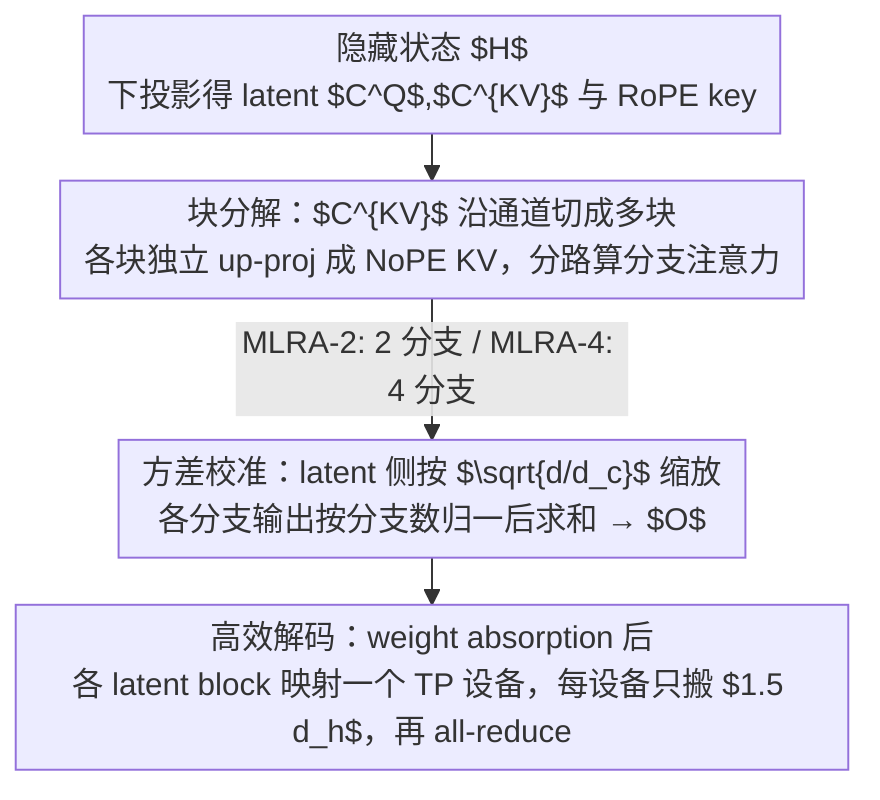

# Multi-Head Low-Rank Attention (MLRA)

**会议**: ICLR 2026  
**arXiv**: [2603.02188](https://arxiv.org/abs/2603.02188)  
**代码**: [GitHub](https://github.com/SongtaoLiu0823/MLRA) / [HuggingFace](https://huggingface.co/Soughing/MLRA)  
**领域**: 自动驾驶  
**关键词**: KV Cache, 张量并行, 低秩注意力, 解码效率, Multi-Head Latent Attention  

## 一句话总结

提出 Multi-Head Low-Rank Attention (MLRA)，通过将 MLA 的单一 latent head 分解为多个可独立分片的 latent head，并对各分支注意力输出求和，实现原生 4-way 张量并行支持，在保持 SOTA 性能的同时获得 2.8× 的解码加速。

## 研究背景与动机

**长上下文推理瓶颈**：LLM 推理时，解码阶段需要在每一步从 HBM（高带宽内存）向 SRAM 反复传输 KV cache，数据搬运（而非计算）成为长上下文推理的主要延迟来源。

**MLA 的成功与局限**：DeepSeek 提出的 Multi-Head Latent Attention (MLA) 通过将 KV cache 压缩为单一 latent head（每 token 仅需 $4.5 d_h$），显著减少了 KV cache 总量。但其单一 latent head **不可分片**——在张量并行（TP）解码时，每个设备被迫冗余加载完整 KV cache。

**TP 下 MLA 的性能停滞**：无论 TP 程度如何，MLA 的每设备 KV cache 加载量始终固定在 $4.5 d_h$，TP 带来的权重分片优势被完全抵消。

**GLA-2 的部分解决**：GLA-2 将 latent head 二等分为两个较小的 latent head，在 2-way TP 下降低为 $2.5 d_h$，但 TP > 2 时同样无法进一步降低。

**算术强度的重要性**：解码效率的关键指标是算术强度（FLOPs/byte），需要在减少内存加载的同时保持高计算密度，从而将工作负载从内存受限推向计算受限。

**方差不匹配问题**：MLA 中 RoPE key 与 NoPE key 存在显著的方差不匹配（$\text{Var}(K^{\text{RoPE}}) / \text{Var}(K^{\text{NoPE}}) \approx d/d_c$），当 latent 维度远小于隐藏维度时问题尤为突出。

## 方法详解

### 整体框架

这篇论文要解决的痛点是：MLA 把 KV cache 压成单一 latent head，总量虽小，却**无法分片**——做张量并行（TP）解码时，每个设备都被迫冗余加载完整的 $4.5 d_h$ KV cache，TP 本该带来的权重分片红利被抵消，加载量随设备数停滞不前。MLRA 的破局思路是把这个不可分的 latent head **显式拆成多个独立的 latent block**，让每块各自 up-project 成 NoPE KV、各跑一路分支注意力，最后把各分支输出求和；分支之间互不耦合，于是天然能一一映射到多个 TP 设备。

前向一条线走下来是：隐藏状态 $H$ 先下投影得到 latent $C^Q$、$C^{KV}$ 和共享的 RoPE key → 把 $C^{KV}$ 沿通道切成多块、各块独立 up-project 后分路算注意力 → 各分支输出按分支数归一后求和得到 $O$。其中 latent 侧的缩放与输出侧的归一一起构成方差校准，保证拆分后 softmax logits 不失衡。论文给两个变体：**MLRA-2** 用 2 个 latent block、每块服务半数注意力头，产生 2 分支求和（适合 2-way TP）；**MLRA-4** 用 4 个 latent block、每块服务全部注意力头，产生 4 分支求和，原生支持 4-way TP。

### 关键设计

**1. 块分解：把不可分片的求和拆成可独立计算的分支**

MLA 无法分片，根因是它把整段 KV 信息压在一个 latent head 里，解码时只能整块搬运。MLRA 的破局点在于一个被忽视的代数恒等式：MLA 里每个头的 NoPE key/value 其实等价于若干子块乘积之和（原文 Eq. 2）。既然结果是一个求和，就能把这个求和从「KV 计算阶段」搬到「注意力输出阶段」。具体做法是把 KV latent 矩阵 $C^{KV} \in \mathbb{R}^{n \times d_c}$ 沿通道切成块 $C_{:,(b)}^{KV}$，对应地把 up-projection 矩阵 $W^{UK}, W^{UV}$ 按行切成子块。这样每个头的输出就变成各分支注意力之和（以 MLRA-4 的 4 块为例）：

$$O_{:,i,:} = \sum_{b=0}^{3} \text{Softmax}\left(\tau Q_{:,i,:}^{\text{NoPE}} (C_{:,(b)}^{KV} W_{(b),(i)}^{UK})^\top + \tau Q_{:,i,:}^{\text{RoPE}} (K^{\text{RoPE}})^\top \right) (C_{:,(b)}^{KV} W_{(b),(i)}^{UV})$$

关键在于：每个分支 $b$ 只依赖自己那块 $C_{:,(b)}^{KV}$（大小 $d_h$），分支之间互不耦合，于是各分支可以原封不动地分配给不同 TP 设备各算各的，最后求和——这正是 MLA 做不到的事。同一套拆分思路按分支数衍生出两个变体：**MLRA-4** 用 4 块、每块经 up-projection 服务全部 $h$ 个头，产生 4 分支求和；**MLRA-2** 沿用 GLA-2 的分组思路把 latent head 二等分，由分组映射函数 $\gamma(i)$ 决定哪些头用第一组 latent、哪些用第二组，每块只服务 $h/2$ 个头，产生 2 分支求和，在更轻的拆分开销下适配 2-way TP。

**2. 方差校准：拆分会放大 RoPE/NoPE 的方差错位，得显式补偿**

分支拆开不是免费的——它会加剧 MLA 本就存在的方差不匹配。理论上 NoPE key 的方差是 $d_c \sigma_w^2$、RoPE key 的方差是 $d \sigma_w^2$，两者之比约为 $d/d_c$，当 latent 维度远小于隐藏维度时已差一个量级；而把 latent 再切成多块、再把多分支输出加起来，又一次改变了输出的方差尺度，若放任不管 softmax 的 logits 分布就会失衡。MLRA 的对策是两处显式缩放：在 latent state 侧用 $\alpha_q = \sqrt{d/d_c'}$、$\alpha_{kv} = \sqrt{d/d_c}$ 把 query/NoPE key 的方差拉回与 RoPE key 可比的尺度；在输出侧再按分支数归一，MLRA-2 的输出乘 $1/\sqrt{2}$、MLRA-4 乘 $1/2$，抵消多分支求和带来的方差膨胀。这套缩放是从方差推导直接得来、而非凭经验调参；不过它依赖权重 i.i.d. 的 Assumption 1，训练中该假设并不严格成立，因此最终以消融验证为准。

**3. 高效解码：各块天然落到不同设备，每设备只搬 $1.5 d_h$**

前两步的设计最终要兑现成解码时的真实加速。因为各 latent block 彼此独立，它们可以自然地一一映射到 TP 设备上——以 MLRA-4 的 4-way TP 为例，每个设备只加载一个 latent block（$d_h$）外加各设备共享的 RoPE key（$0.5 d_h$），于是每设备 KV 加载量从 MLA 的 $4.5 d_h$ 降到 $1.5 d_h$（GLA-2 在 2-way TP 下也只能降到 $2.5 d_h$，且 TP>2 后停滞）。落地时沿用 MLA 的 weight absorption 技巧，把 up-projection 吸收进 query 侧，每个设备就退化成一个标准的 MQA-style 解码，算完各分支后再 all-reduce 求和即可。这样 TP 带来的好处第一次真正传导到了 KV cache 搬运上，把解码从内存受限推向计算受限。

### 损失函数 / 训练策略

- **初始化**：输出投影参数使用零初始化（优于标准 $\mathcal{N}(0, 0.02)$），其余参数标准初始化
- **优化器**：AdamW，$(\beta_1, \beta_2)=(0.9, 0.95)$，weight decay 0.1，梯度裁剪 1.0
- **学习率**：peak $1.6 \times 10^{-4}$，前 2000 步线性 warmup，之后余弦退火至 10%
- **训练规模**：2.9B 参数，FineWeb-Edu-100B 数据集，98.3B token，上下文长度 2048，8 × H100 GPU
- **可选门控机制**：在注意力输出投影前添加 gating，可进一步降低困惑度

## 实验关键数据

### 主实验

**验证集困惑度（7 个数据集平均，越低越好）**：

| 方法 | Wikipedia | C4 | Pile | RefinedWeb | Cosmopedia | FineWeb | FineWeb-Edu | **平均** |
|------|-----------|------|------|------------|------------|---------|-------------|----------|
| MHA | 14.624 | 16.575 | 12.929 | 18.698 | 9.102 | 15.656 | 9.434 | 13.860 |
| GQA | 15.057 | 16.628 | 13.758 | 18.885 | 9.504 | 15.713 | 9.427 | 14.139 |
| MLA | 14.567 | 16.345 | 12.965 | 18.523 | 8.966 | 15.440 | 9.284 | 13.727 |
| GLA-2 | 14.605 | 16.323 | 13.225 | 18.509 | 9.118 | 15.424 | 9.249 | 13.779 |
| **MLRA-4** | **14.407** | **16.286** | **13.124** | **18.398** | **8.937** | **15.361** | **9.193** | **13.672** |

**零样本常识推理准确率（%）**：

| 方法 | ARC-E | ARC-C | OBQA | BoolQ | HellaSwag | Winogrande | PIQA | **平均** |
|------|-------|-------|------|-------|-----------|------------|------|----------|
| MHA | 69.11 | 39.16 | 40.80 | 62.26 | 60.82 | 57.62 | 74.86 | 57.81 |
| GQA | 67.13 | 39.42 | 42.00 | 63.39 | 61.29 | 56.91 | 75.08 | 57.89 |
| MLA | 68.22 | 39.16 | 42.60 | 64.10 | 61.39 | 60.06 | 75.68 | 58.75 |
| **MLRA-4** | 67.63 | 41.38 | **43.00** | 61.74 | **62.16** | **61.48** | 74.48 | **58.84** |

### 消融实验

**门控机制对困惑度的影响（7 个数据集平均）**：

| 方法 | 无门控 | 有门控 | 提升 |
|------|--------|--------|------|
| GQA | 14.139 | 13.806 | -0.333 |
| MLA | 13.727 | 13.642 | -0.085 |
| GLA-2 | 13.779 | 13.701 | -0.078 |
| MLRA-2 | 13.804 | 13.651 | -0.153 |
| **MLRA-4** | **13.672** | **13.621** | -0.051 |

其他消融发现：
- **零初始化 vs $\mathcal{N}(0, 0.02)$**：零初始化在所有模型上均优于随机初始化
- **方差缩放**：MLA 和 GLA-2 收益显著，MLRA-2 收益边际（因分支已天然减缓方差不匹配）
- **加倍注意力头数**：在参数总量不变的条件下加倍 GQA/MLA/GLA-2 的头数，均未带来改善反而损害性能

### 关键发现

1. **MLRA-4 全面最优**：在困惑度（13.672）和零样本推理准确率（58.84%）上均超越所有基线，包括 MLA
2. **2.8× 解码加速**：相比 MLA，MLRA-4 在 128K-2M token 长上下文解码中实现稳定 2.8× 加速
3. **1.05-1.26× 相比 GQA**：在长上下文解码中超越 GQA，且差距随上下文长度增加而扩大
4. **TP=4 即可达到 1.5 $d_h$**：GQA 和 GTA 需要 8-way TP 才能达到类似的每设备 KV 加载量，MLRA 仅需 4-way
5. **门控进一步提升**：加入门控后 MLRA-4 困惑度降至 13.621，仍保持最优

## 亮点与洞察

- **优雅的数学动机**：从 MLA 的块分解出发，将 KV 层面的求和移至注意力输出层面求和，数学上简洁且直觉清晰
- **方差分析扎实**：从理论上推导了各组件的方差，给出了明确的校准策略，避免了凭经验调参
- **实用性极强**：MLRA 与 MLA 共享相同的 KV cache 总量（每 token $4.5 d_h$），区别仅在于分布式解码时是否可分片，对现有 MLA 系统的迁移成本低
- **算术强度分析**：MLRA-4 的算术强度约为 $2h$（MLA 也是 $2h$），说明在减少内存加载的同时不牺牲计算效率
- **完整的工程实现**：基于 FlashAttention-3 实现 MLRA-4 kernel，并在真实 H100 集群上验证

## 局限与展望

1. **仅在 2.9B 规模验证**：未在 7B+ 或更大规模上实验，大模型上 MLRA 的优势是否保持有待验证
2. **预训练数据单一**：仅使用 FineWeb-Edu-100B，未在多语言或代码混合数据上验证
3. **Assumption 1 的局限**：方差分析假设权重 i.i.d. 分布且与输入独立，训练过程中此假设不严格成立
4. **固定 4-way 分解**：MLRA-4 绑定了 4-way TP，对于 2-way 或 8-way TP 场景需要分别使用 MLRA-2 或进一步扩展
5. **多分支求和的近似性**：将求和从 softmax 内部移至外部本质上改变了注意力分布，虽然实验效果好但理论上并非等价变换
6. **未评估指令微调和对齐后的效果**：仅关注预训练，未覆盖 SFT/RLHF 阶段

## 相关工作与启发

- **MLA (DeepSeek-V2/V3)**：MLRA 的直接前驱，通过 latent compression 压缩 KV cache，但不支持 TP 分片
- **GQA**：Grouped Query Attention，通过减少 KV head 数实现效率提升，但 KV cache 仍随头数线性增长
- **GLA-2 (Zadouri et al., 2025)**：首个尝试拆分 MLA latent head 的工作，但仅支持 2-way TP
- **TPA (Zhang et al., 2025)**：Tensor Product Attention，用共享 head 的线性组合构造 KV，TP 支持有限
- **FlashMLA / FlashAttention-3**：高效注意力 kernel，MLRA 的 kernel 基于 FlashAttention-3 实现
- **LongCat (2025)**：首次观察到 RoPE key 的方差不匹配问题，MLRA 沿用并扩展了其缩放策略
- **启发**：这种"将内部求和外提为多分支独立计算"的思路可能适用于其他需要 latent compression + TP 的场景（如 KV cache 量化、稀疏注意力等）

## 评分

- **新颖性**: ⭐⭐⭐⭐ — 洞察精准，将 MLA 的"不可分片"问题通过分支分解优雅解决
- **实验充分度**: ⭐⭐⭐⭐ — 多组消融+多数据集评估+解码速度/吞吐量测试，但仅 2.9B 规模
- **写作质量**: ⭐⭐⭐⭐⭐ — 数学推导严谨，符号清晰，从背景到方法的逻辑链条完整
- **价值**: ⭐⭐⭐⭐ — 直接解决 MLA 部署的实际痛点，对 DeepSeek 系列和大规模推理部署有重要实用价值

<!-- RELATED:START -->

## 相关论文

- [\[AAAI 2026\] CompTrack: Information Bottleneck-Guided Low-Rank Dynamic Token Compression for Point Cloud Tracking](../../AAAI2026/autonomous_driving/comptrack_information_bottleneckguided_lowrank_dynamic_token_compres.md)
- [\[AAAI 2026\] Drive As You Like: Strategy-Level Motion Planning Based on A Multi-Head Diffusion Model](../../AAAI2026/autonomous_driving/drive_as_you_like_strategy-level_motion_planning_based_on_a_multi-head_diffusion.md)
- [\[ICCV 2025\] SRefiner: Soft-Braid Attention for Multi-Agent Trajectory Refinement](../../ICCV2025/autonomous_driving/srefiner_soft-braid_attention_for_multi-agent_trajectory_refinement.md)
- [\[CVPR 2026\] DriverGaze360: OmniDirectional Driver Attention with Object-Level Guidance](../../CVPR2026/autonomous_driving/drivergaze360_omnidirectional_driver_attention_with_object-level_guidance.md)
- [\[CVPR 2026\] Spe-BEVHead: Rethinking the Detection Head Design for Bird's-Eye-View Object Detection](../../CVPR2026/autonomous_driving/spe-bevhead_rethinking_the_detection_head_design_for_birds-eye-view_object_detec.md)

<!-- RELATED:END -->
