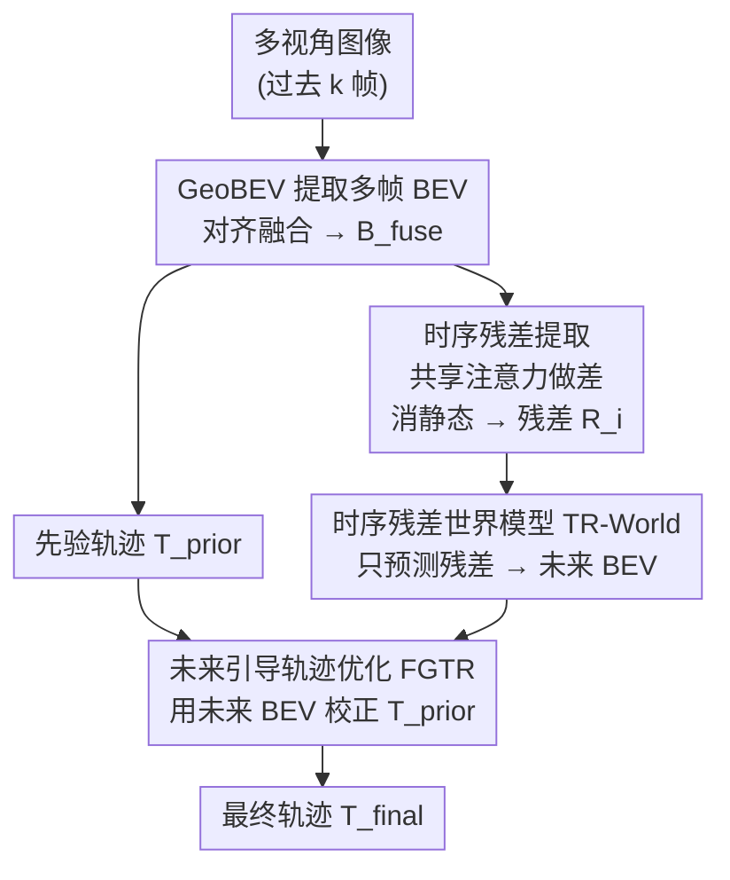

# ResWorld: Temporal Residual World Model for End-to-End Autonomous Driving

**会议**: ICLR 2026  
**arXiv**: [2602.10884](https://arxiv.org/abs/2602.10884)  
**代码**: [https://github.com/mengtan00/ResWorld](https://github.com/mengtan00/ResWorld)  
**领域**: 自动驾驶 / 世界模型  
**关键词**: 时序残差, 世界模型, 端到端自动驾驶, BEV特征, 轨迹优化  

## 一句话总结
ResWorld 提出时序残差世界模型（TR-World），通过计算 BEV 场景表征的时序残差来提取动态物体信息（无需检测/跟踪），避免对静态区域的冗余建模，结合未来引导轨迹优化（FGTR）模块利用预测的未来 BEV 特征修正规划轨迹，在 nuScenes 和 NAVSIM 上达到 SOTA 规划性能。

## 研究背景与动机

**领域现状**：端到端自动驾驶框架中，世界模型被用作代理任务来增强场景理解能力，替代传统的检测/跟踪/预测等辅助任务模块。常见做法是预测未来场景表征（BEV 特征），以间接提升规划精度。

**现有痛点**：(a) 场景表征中绝大多数信息属于静态物体（地面、建筑），世界模型对它们进行了冗余建模——静态物体在未来帧中位置不变，无需预测；(b) 动态物体（车辆、行人）是规划的关键，但在不依赖感知任务的前提下难以从场景中识别；(c) 预测的未来场景表征与轨迹之间缺乏深度交互，未被充分利用。

**核心矛盾**：世界模型对静态物体浪费计算资源，对动态物体建模不足，且预测的未来信息无法有效反馈到轨迹规划。

**本文目标** (a) 让世界模型专注于动态物体建模；(b) 无需辅助感知任务即可区分动静态物体；(c) 利用预测的未来 BEV 直接修正轨迹。

**切入角度**：将不同时间戳的 BEV 特征对齐到同一坐标系后做差（时序残差），差值自然代表了动态物体的变化。

**核心 idea**："做减法"——用时序残差自然分离动静态物体，让世界模型只预测动态部分的未来分布。

## 方法详解

### 整体框架
ResWorld 想解决的核心问题是：世界模型把大量算力花在了未来帧里位置不变的静态背景上，真正影响规划的动态物体反而建模不足。它的整体思路是"做减法"——既然静态物体在对齐后的相邻 BEV 帧里几乎不变，那把帧间做差留下的就只剩动态物体的变化。具体流程上，多视角图像先经 GeoBEV 提取多帧 BEV 特征并融合，融合特征一边预测出一条先验轨迹，一边送进残差计算分支得到时序残差；TR-World 只在这些残差上预测动态物体的未来空间分布，再把它叠回当前融合 BEV 得到完整的未来 BEV；最后 FGTR 模块拿这份未来 BEV 去校正先验轨迹，输出最终规划。

### 关键设计

**1. 时序残差提取：用帧间做差代替检测器，零标注分离动静态物体**

世界模型最浪费的地方在于：场景表征里绝大多数信息是地面、建筑这类静态物体，它们在未来帧位置不变、本不需要预测，但模型仍要花容量去重建它们；而车辆、行人这些对规划真正关键的动态物体，在不依赖感知任务时又难以单独识别出来。残差提取正是冲着这个矛盾来的——它把过去 $k$ 帧的 BEV 特征 $\{B_t, B_{t-1}, \dots, B_{t-k}\}$ 统一对齐到当前帧坐标系，用融合 BEV 特征 $B_{\text{fuse}}$ 生成一张共享的空间注意力图（聚焦动态区域），以它加权提取各帧的稀疏场景查询 $S_i$，再计算相邻帧之间的差值 $R_i = S_i - S_{i-1}$。在同一坐标系下，静态物体各帧的 BEV 特征相同，做差后自动被消掉，剩下的残差天然代表了动态物体的变化，全程无需任何检测/跟踪标注。这里共享同一张空间注意力图是关键：它保证各帧都从相同位置取特征，差分才有物理意义，否则两帧从不同位置采样相减得到的就是噪声。

**2. 时序残差世界模型 TR-World：只预测残差，让世界模型专注于"会变的部分"**

有了只含动态信息的残差，世界模型就不必再重建整个场景。TR-World 把每个残差 $R_i$ 先经自注意力提取信息，再跨时间戳累加得到聚合残差 $\hat{R}$，然后用 TokenFuser 把 $\hat{R}$ 映射回融合 BEV 上：

$$B_{\text{future}} = \text{MLP}(B_{\text{fuse}}) \otimes \hat{R} + B_{\text{fuse}}$$

由于 $B_{\text{fuse}}$ 本身已经携带了静态物体信息，只要在它上面叠加预测出的动态变化，就能得到一份完整的未来 BEV。这样世界模型的容量全部投在真正需要预测的动态变化上，而不是反复重建那些不动的区域，因此既更高效、效果也更好。

**3. 未来引导轨迹优化 FGTR：让预测的未来直接改写轨迹，并反过来给世界模型上监督**

以往世界模型预测出的未来场景往往只是个"代理任务"，与轨迹之间缺乏深度交互，预测得到的信息没能真正用上。FGTR 把这层交互补上：它用可变形注意力（Deformable Attention）让轨迹查询 $W$ 以先验轨迹 $T_{\text{prior}}$ 为参考点，从 $B_{\text{future}}$ 中采集信息，检查这条先验轨迹是否会撞上动态物体或偏离可行驶区域，进而解码出修正后的最终轨迹 $T_{\text{final}}$。这个设计一举两得：一方面用未来信息直接优化轨迹，而不是绕一圈通过代理任务间接影响；另一方面，轨迹查询反向为未来 BEV 提供了稀疏的时空监督——参考点提供空间信号、多时间戳查询提供时间信号——防止世界模型预测坍缩。值得一提的是，FGTR 刻意**不**对未来 BEV 施加直接的真值监督：因为监督某个特定时间戳会逼模型只记住那一帧的状态，丢掉其他时间戳的动态分布信息；交给下游轨迹优化的梯度去间接驱动，反而能让未来 BEV 保留跨时间戳里最有用的信息。

### 损失函数 / 训练策略
仅用 L1 损失同时监督先验轨迹和最终轨迹：$\mathcal{L} = L1(T_{\text{prior}}, T_{\text{GT}}) + L1(T_{\text{final}}, T_{\text{GT}})$，全程不对未来 BEV 特征施加任何直接监督——这是一个反直觉但实验证明有效的设计。

## 实验关键数据

### 主实验
nuScenes 规划评估（无辅助任务，零注解依赖）：

| 方法 | 辅助任务 | L2 Avg (m)↓ | 碰撞率 Avg (%)↓ |
|------|---------|-------------|----------------|
| UniAD | Det&Track&Map&Motion&Occ | 1.03 | 0.31 |
| SSR | None | 0.74 | 0.31 |
| GenAD | Det&Map&Motion | 0.91 | 0.43 |
| **ResWorld** | **None** | **0.65** | **0.23** |
| **ResWorld (w/ ego status)** | **None** | **0.59** | **0.17** |

NAVSIM 评估：

| 方法 | PDMS↑ |
|------|-------|
| LAW | 84.6 |
| World4Drive | 85.1 |
| DiffusionDrive | 88.1 |
| **ResWorld** | **87.3** (无辅助任务) |

### 消融实验

| 配置 | L2 Avg↓ | 碰撞率↓ | 说明 |
|------|---------|--------|------|
| 基线 (SSR) | 0.74 | 0.31 | 无世界模型 |
| + TR-World | 0.69 | 0.27 | 时序残差世界模型 |
| + TR-World + FGTR | **0.65** | **0.23** | 加未来引导轨迹优化 |
| 对 B_future 加直接监督 | 0.68 | 0.26 | 性能反而下降 |

### 关键发现
- TR-World 将 L2 从 0.74 降到 0.69，FGTR 进一步降到 0.65——两个模块贡献互补
- 对未来 BEV 加直接真值监督反而不如不监督（0.68 vs 0.65），验证了"让模型自主优化未来表征"的设计
- ResWorld 不依赖任何辅助感知任务（无检测/跟踪/地图标注），但性能超越所有使用多任务监督的方法
- 相比完整场景的世界模型，仅建模时序残差的 TR-World 更高效且效果更好

## 亮点与洞察
- **"做减法"提取动态物体**的思路极其简洁优雅：不需要检测器、不需要跟踪器、不需要分割，只需将对齐的 BEV 特征做差。这个 trick 可以迁移到任何需要区分动静态的场景表征任务中。
- **不监督反而更好**的发现很有启发：对世界模型的未来预测施加特定时间戳的真值监督会限制其学到的信息（只能记住该时间戳的状态），而通过下游轨迹优化任务的梯度间接驱动，反而让未来 BEV 学到跨时间的最有用信息。
- **FGTR 双重作用设计**很巧妙：既利用未来信息优化轨迹，又反向为世界模型提供梯度信号防止坍缩，一举两得。

## 局限与展望
- 仅在开环评估上验证（nuScenes、NAVSIM），缺少闭环评估（如 Bench2Drive）——开环性能不一定迁移到闭环
- 时序残差假设 BEV 特征已完美对齐，实际中传感器姿态估计误差会影响残差质量
- 累加残差的方式（Eq. 6）相对简单，可考虑更复杂的时序建模（如 Transformer）
- 世界模型仅预测单步未来 BEV，多步递归预测是否可行？

## 相关工作与启发
- **vs SSR (Li & Cui, 2025)**: ResWorld 在 SSR 基础上增加 TR-World 和 FGTR，L2 从 0.74 降到 0.65，碰撞率从 0.31 降到 0.23
- **vs UniAD (Hu et al., 2023)**: UniAD 需要 5 个辅助任务（检测+跟踪+地图+运动+占据），ResWorld 不需要任何辅助任务但性能更好
- **vs World4Drive (Zheng et al., 2025)**: 同为世界模型端到端方法，ResWorld 在 NAVSIM 上更优（87.3 vs 85.1 PDMS）

## 评分
- 新颖性: ⭐⭐⭐⭐ 时序残差提取动态物体的想法简单但有效，FGTR 的双重作用设计巧妙
- 实验充分度: ⭐⭐⭐⭐ 在两个基准上全面评估，消融详细，但缺少闭环评估
- 写作质量: ⭐⭐⭐⭐ 框架图清晰，方法描述流畅，动机解释充分
- 价值: ⭐⭐⭐⭐ 提供了一个高效的世界模型设计范式——只建模变化的部分

<!-- RELATED:START -->

## 相关论文

- [\[CVPR 2026\] ResAD: Normalized Residual Trajectory Modeling for End-to-End Autonomous Driving](../../CVPR2026/autonomous_driving/resad_normalized_residual_trajectory_modeling_for_end-to-end_autonomous_driving.md)
- [\[CVPR 2026\] DriveMoE: Mixture-of-Experts for Vision-Language-Action Model in End-to-End Autonomous Driving](../../CVPR2026/autonomous_driving/drivemoe_mixture-of-experts_for_vision-language-action_model_in_end-to-end_auton.md)
- [\[ICML 2026\] DeepSight: Long-Horizon World Modeling via Latent States Prediction for End-to-End Autonomous Driving](../../ICML2026/autonomous_driving/deepsight_long-horizon_world_modeling_via_latent_states_prediction_for_end-to-en.md)
- [\[CVPR 2025\] DiffusionDrive: Truncated Diffusion Model for End-to-End Autonomous Driving](../../CVPR2025/autonomous_driving/diffusiondrive_truncated_diffusion_model_for_end-to-end_autonomous_driving.md)
- [\[ICCV 2025\] World4Drive: End-to-End Autonomous Driving via Intention-aware Physical Latent World Model](../../ICCV2025/autonomous_driving/world4drive_end-to-end_autonomous_driving_via_intention-aware_physical_latent_wo.md)

<!-- RELATED:END -->
