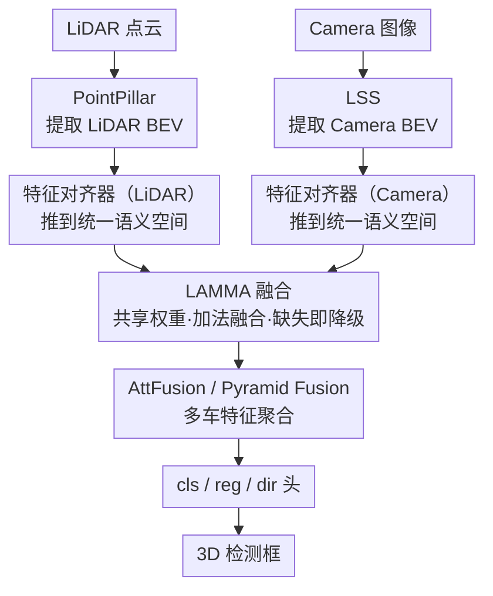

# SiMO: Single-Modality-Operable Multimodal Collaborative Perception

**会议**: ICLR 2026  
**arXiv**: [2603.08240](https://arxiv.org/abs/2603.08240)  
**代码**: [dempsey-wen/SiMO](https://github.com/dempsey-wen/SiMO)  
**领域**: 协同感知 / 多模态融合 / 自动驾驶  
**关键词**: collaborative perception, multimodal fusion, modality failure, BEV, 3D detection  

## 一句话总结

提出 SiMO 框架，通过 LAMMA 融合模块和 PAFR 训练策略，首次在多智能体协同感知中实现任意模态缺失（特别是 LiDAR 失效仅有相机可用时）下仍可正常工作的多模态感知系统，类似并联电路——只要有一条通路就能工作。

## 研究背景与动机

**多智能体协同感知（MACP）**通过多车共享特征可扩展感知范围、克服遮挡，但现有多模态方法像串联电路，任一传感器（尤其是 LiDAR）缺失就全系统失效。

**模态缺失的根本原因**：现有融合方法（concat / CNN / Transformer）使融合前后特征空间不一致——当某模态缺失时，未融合的单模态特征无法匹配为融合特征设计的下游任务头，导致系统崩溃。

**协同场景更复杂**：不同于单智能体只需本地对齐，MACP 要求不同智能体（如 ego 用 LiDAR + 邻车仅有 camera）的传输特征严格处于统一语义空间，以实现跨智能体有效交互。现有单智能体鲁棒方法无法保证这种跨智能体语义一致性。

**模态竞争（modality competition）被忽视**：多模态联合训练时，信息密度高的模态（如 LiDAR 对 3D 任务更直接）更快收敛，主导优化过程，抑制弱模态分支（camera）的充分训练，导致弱模态分支无法独立工作。

**现有方法局限**：BM2CP、BEVFusion、CoBEVFusion 等仅考虑多模态融合提升精度，忽略 LiDAR 失效时 camera 分支的独立可用性；MetaBEV/UniBEV 等仅在单智能体探索过模态鲁棒，无法推广到多智能体。

**本文是首个在协同感知中系统性处理动态、异构模态缺失的工作。**

## 方法详解

### 整体框架

SiMO 要解决的是多智能体协同感知里「一旦 LiDAR 缺失整套系统就崩」的问题，核心思路是「先对齐、再融合」：让单模态特征与多模态融合特征都落进同一个语义空间，这样无论手上有几路模态，下游任务头都能照常吃进特征、不会因为分布错位而失效。

具体数据流上，LiDAR 点云经 PointPillar、Camera 图像经 LSS（Lift-Splat-Shot）各自抽出 BEV 特征；两路特征先分别过一个独立的对齐器，被推到统一语义空间；对齐后的特征交给 LAMMA 做长度自适应融合，得到与单模态空间一致的融合表示；最后由 AttFusion 或 Pyramid Fusion 聚合多车特征，再经 cls/reg/dir 头输出 3D 检测框。这条前向链路由 PAFR 四阶段隔离训练来调教，以避开多模态联合训练时的模态竞争。

### 关键设计

**1. 特征对齐器：把异构模态推到同一语义空间**

LiDAR 直接测量 3D 几何、Camera 只能从 2D 像素推断深度，两者原始 BEV 特征分布差异巨大，这正是以往方法一旦缺 LiDAR 就失效的根源——未融合的单模态特征落不进为融合特征设计的任务头。SiMO 在融合前插入两个独立的 3 层 ConvNeXt 对齐器 $g_L$、$g_C$，把 LiDAR 与 Camera 特征各自映射到统一语义空间。论文用 Procrustes 距离验证了这一步的效果：对齐 + LAMMA 之后，cam 与 lidar 特征的差异从 0.86 降到 0.05，多模态各路特征几乎落在同一子空间，这是后续单模态可独立工作的前提。

**2. LAMMA 融合模块：用共享权重和加法融合实现优雅降级**

难点在于融合模块要既能吃两个模态、又能在只剩一个模态时无缝退化，且退化前后语义不漂移。LAMMA 让 Q/K/V 的线性投影 $W_Q, W_K, W_V$ 在所有模态间共享，保证语义处理一致；前向时把两模态 Query 拼成 $Q=[Z_A; Z_B]$，Key/Value 保持分离，对每个模态各做一次多头注意力（同时覆盖自注意力与交叉注意力），再 Split+Sum 得到各模态增强表示 $Z_{fused\_m}$，最后两模态做加法融合得到 $Z_{mm}$——加法而非拼接/CNN，避免了融合前后特征空间偏移。优雅降级正源于这个结构：当某模态缺失（如 $Z_A=0$）时 Query 对应部分自动置零，LAMMA 退化为纯自注意力，无需任何缺失检测逻辑就能继续输出语义一致的特征。LAMMA 是即插即用的，可直接挂到 AttFusion 或 Pyramid Fusion 等不同协同框架上。

**3. PAFR 四阶段训练：用隔离训练绕开模态竞争**

即便融合结构对了，端到端联合训练时信息密度高的 LiDAR 分支会更快收敛并主导优化，把 Camera 分支「饿死」，导致弱模态无法独立工作。PAFR 用四阶段隔离训练彻底规避这种竞争而非试图平衡：Step 1（Pretrain）加载各模态预训练好的特征提取器并全程冻结；Step 2（Align）先把 LiDAR 对齐器训到收敛后冻结、再单独训 Camera 对齐器并冻结，避免两分支互相干扰；Step 3（Fuse）用多模态输入只训 LAMMA，冻结提取器、对齐器与任务头；Step 4（RD）以 50% 概率随机丢弃一个模态特征微调 LAMMA，逼它适应模态缺失。消融显示三者缺一不可——没有 PAFR 时 RD 反而把 L+C 的 AP@70 从 0.94 砸到 0.11，而齐备时单 Camera 才能从 0 提到 0.45。

### 损失函数

$$L(\hat{Y}, Y) = L_{Focal}(\hat{Y}_{cls}, Y_{cls}) + L_{SmoothL1}(\hat{Y}_{reg}, Y_{reg})$$

分类用 Focal Loss、回归用 Smooth L1，是 BEV 3D 检测的标准配置。

## 实验关键数据

### 主实验：OPV2V-H 3D 检测（AP%）

| 方法 | 模态 | AP@30 | AP@50 | AP@70 |
|------|------|-------|-------|-------|
| BM2CP | L+C | 91.69 | 91.45 | 86.87 |
| BM2CP | L only | 91.55 | 91.31 | 86.80 |
| BM2CP | **C only** | **0** | **0** | **0** |
| BEVFusion+RD | L+C | 95.18 | 94.21 | 81.09 |
| BEVFusion+RD | **C only** | **0** | **0** | **0** |
| UniBEV+RD | L+C | 93.33 | 91.71 | 70.75 |
| UniBEV+RD | **C only** | **1.93** | **0** | **0** |
| HEAL (Pyramid) | L | 98.22 | 98.00 | 96.16 |
| HEAL (Pyramid) | C | 68.45 | 60.48 | 39.07 |
| **SiMO-PF+RD** | **L+C** | **98.30** | **97.94** | **94.64** |
| **SiMO-PF+RD** | **L only** | **97.32** | **97.07** | **94.06** |
| **SiMO-PF+RD** | **C only** | **80.81** | **69.63** | **44.82** |

**核心发现**：BM2CP/BEVFusion/UniBEV 在 LiDAR 缺失时完全失效（Camera-only AP≈0）；SiMO-PF 在仅 Camera 时 AP@30=80.81%，比 HEAL 的 Camera-only 高 12.36 个点。

### 异构模态失效实验

| 模式 | HEAL AP@50 | SiMO-PF AP@50 |
|------|-----------|---------------|
| L only | 0.98 | 0.97 |
| C only | 0.60 | 0.70 |
| C-ego (异构) | 0.82 | 0.85 |
| L-ego (异构) | 0.96 | 0.97 |

SiMO 无需额外微调即可适应异构模态失效场景。

### 消融实验

| 学习策略 | RD | LAMMA | AP@70 (L+C / L / C) | 可适应模态缺失? |
|---------|-----|-------|---------------------|----------------|
| ✗ | ✗ | ✗ | 0.94 / 0.01 / 0 | ✗ |
| ✗ | ✔ | ✗ | 0.11 / 0 / 0 | ✗ |
| ✔ | ✗ | ✔ | 0.95 / 0.26 / 0 | ✗ |
| ✗ | ✔ | ✔ | 0.81 / 0.72 / 0 | ✗ |
| **✔** | **✔** | **✔** | **0.95 / 0.94 / 0.45** | **✔** |

三者缺一不可：无 PAFR 策略，RD 反而有害；无 RD，无法适应模态缺失；无 LAMMA，BEVFusion+RD 仍然 Camera 失效。

### Procrustes 分析验证特征对齐

| 对比 | BEVFusion | LAMMA 前 | LAMMA 后 |
|------|-----------|---------|---------|
| cam vs lidar | 0.8645 | 0.6747 | **0.0472** |
| cam vs fused | 0.7297 | 0.3886 | **0.0215** |
| lidar vs fused | 0.5747 | 0.2773 | **0.0064** |

LAMMA 后多模态特征差异性从 0.67 降到 0.05，验证了特征空间高度统一。

## 亮点与洞察

1. **并联电路类比精准**：将多模态系统设计为并联而非串联，只要一条通路有效就可工作，概念简洁且实用。
2. **对模态竞争的新理解**：将模态竞争归因于"任务相关信息密度"差异，并用隔离训练彻底规避而非试图平衡，比现有梯度调控方法更具确定性。
3. **LAMMA 的优雅降级**：模态缺失时自然退化为自注意力，无需额外检测逻辑，结构优美。
4. **即插即用**：LAMMA 可适配不同协同感知框架（AttFusion / Pyramid Fusion），不需修改原方法。
5. **Camera 分支显著增强**：SiMO-PF Camera-only 比 HEAL Camera-only 高 12.36/9.15/5.75（AP@30/50/70），说明原框架未充分利用 Camera 特征。

## 局限性

1. **单模态性能受限于特征提取器能力**：在单视角 Camera 场景（如 DAIR-V2X）中，缺乏多视角视差导致深度估计受限，SiMO 无法突破物理信息瓶颈。
2. **多阶段训练流程**：PAFR 四阶段训练不可避免地延长了总训练时间。
3. **加法融合缺乏平滑**：相比 CNN 融合的隐式平滑，加法融合对高强度传感器噪声更敏感。
4. **实验数据集有限**：主实验基于仿真数据 OPV2V-H，真实世界数据集（DAIR-V2X/V2XReal）只在附录中简要验证。

## 相关工作

- **多模态协同感知**：HM-ViT（异构模态协作先驱）、HEAL（模态+模型异构）、BM2CP（双模态融合）、CoBEVFusion
- **单智能体模态鲁棒**：CMT（首次单模态可运行）、MetaBEV（CNN+Concat 导致的位置依赖问题）、UniBEV（统一架构对齐）
- **多模态平衡学习**：Gradient Blending、OGM（梯度调控）、PMR、UMT
- **基础组件**：PointPillar（LiDAR BEV）、LSS（Camera BEV）、BEVFusion、ConvNeXt、Pyramid Fusion

## 评分

⭐⭐⭐⭐ (4/5)

**理由**：问题定义明确且有实际价值（模态失效在真实驾驶中不可避免），LAMMA 设计优雅（共享权重+加法融合+自然降级），PAFR 策略对模态竞争的理解有深度。消融实验充分证明了三个组件缺一不可。扣分点在于主实验仍基于仿真数据集，且多阶段训练增加了工程复杂度。

<!-- RELATED:START -->

## 相关论文

- [\[NeurIPS 2025\] Layer-wise Modality Decomposition for Interpretable Multimodal Sensor Fusion](../../NeurIPS2025/autonomous_driving/layer-wise_modality_decomposition_for_interpretable_multimodal_sensor_fusion.md)
- [\[CVPR 2026\] CATNet: Collaborative Alignment and Transformation Network for Cooperative Perception](../../CVPR2026/autonomous_driving/catnet_collaborative_alignment_and_transformation_network_for_cooperative_percep.md)
- [\[CVPR 2026\] CoLC: Communication-Efficient Collaborative Perception with LiDAR Completion](../../CVPR2026/autonomous_driving/colc_communication-efficient_collaborative_perception_with_lidar_completion.md)
- [\[ICCV 2025\] INSTINCT: Instance-Level Interaction Architecture for Query-Based Collaborative Perception](../../ICCV2025/autonomous_driving/instinct_instance-level_interaction_architecture_for_query-based_collaborative_p.md)
- [\[ICLR 2026\] x²-Fusion: Cross-Modality and Cross-Dimension Flow Estimation in Event Edge Space](x2-fusion_cross-modality_and_cross-dimension_flow_estimation_in_event_edge_space.md)

<!-- RELATED:END -->
