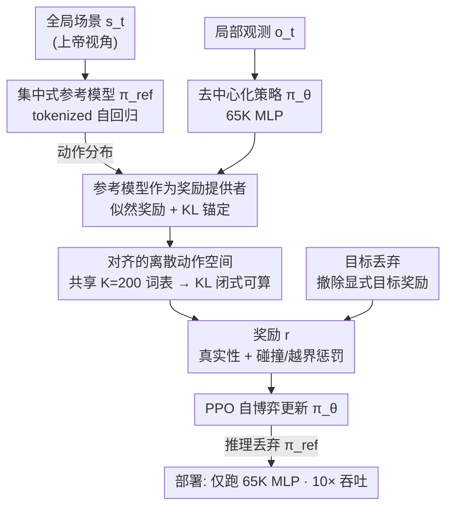

# SPACeR: Self-Play Anchoring with Centralized Reference Models

**会议**: ICLR 2026  
**arXiv**: [2510.18060](https://arxiv.org/abs/2510.18060)  
**代码**: 无  
**领域**: 自动驾驶 / 强化学习  
**关键词**: 自博弈强化学习, 交通仿真, tokenized模型, KL散度对齐, 人类驾驶分布  

## 一句话总结
SPACeR 提出"类人自博弈"框架，用预训练的 tokenized 自回归运动模型作为集中式参考策略，通过对数似然奖励和 KL 散度约束引导去中心化自博弈 RL 策略向人类驾驶分布对齐，在 WOSAC 上超越纯自博弈方法，同时推理速度比模仿学习快 10 倍、参数量小 50 倍。

## 研究背景与动机

**领域现状**：自动驾驶仿真需要逼真且具反应性的交通智能体策略。两大范式各有优劣——模仿学习（如 SMART、CAT-K）能学到逼真的人类行为但推理昂贵且闭环反应性差；自博弈 RL 天然适合多智能体交互且推理高效，但容易偏离人类驾驶规范。

**现有痛点**：(a) 模仿学习模型（Transformer）推理慢、参数大，不适合大规模闭环仿真；(b) 自博弈 RL 依赖手工奖励塑形，策略可能学到不自然的行为（如急加速冲向目标点）；(c) 现有将 RL 与模仿学习结合的方法多是"先预训练再微调"，而非让 RL 主导。

**核心矛盾**：如何在保持自博弈 RL 的速度和可扩展性的同时，确保策略的人类真实性？

**本文目标** 构建一个轻量、快速、可扩展的多智能体仿真策略，同时保持接近人类驾驶分布的行为真实性。

**切入角度**：RL-first 思路——自博弈是基础，模仿学习模型仅作为奖励提供者（reference policy），而非被微调的目标。

**核心 idea**：用预训练 tokenized 模型提供人类真实性信号来锚定自博弈 RL，但实际执行用 65K 参数的 MLP。

## 方法详解

### 整体框架
SPACeR 想解决的是仿真交通智能体"快"与"像人"难以兼得的问题：自博弈 RL 推理快但容易学出不自然的开法，模仿学习像人但模型大、闭环反应差。它的做法是把两者拆成两个角色——真正上路决策的是一个轻量的去中心化策略 $\pi_\theta$（65K 参数 MLP），只看局部观测；预训练好的 tokenized 自回归运动模型 $\pi_{\text{ref}}$ 则退居幕后，看全局场景、只负责给出"人类会怎么开"的动作分布信号。训练时用 PPO 跑自博弈，但在奖励里掺入参考模型的对数似然、在目标里加上对参考模型的 KL 约束，让策略一边自博弈一边被往人类分布上拽；推理时彻底丢掉大模型，只跑那个小 MLP。

### 关键设计

**1. 集中式参考模型作为奖励提供者：用概率分布而非轨迹真值来锚定自博弈**

自博弈产生的状态大多是记录轨迹里没有的，传统模仿监督在这些新状态上无从下手。SPACeR 的解法是不去对齐某条具体轨迹，而是让预训练 tokenized 模型（如 SMART/CAT-K）在每个智能体、每个时间步都吐出一个动作分布，把这个分布当作"人类真实性"的密集信号。它从两处注入策略训练：一是奖励里加一项似然奖励 $\alpha \cdot \log \pi_{\text{ref}}(a_t|s_t)$，二是训练目标里减去一项分布对齐 $\beta \cdot D_{\text{KL}}(\pi_\theta \| \pi_{\text{ref}})$。关键在于参考模型是集中式的（能看全局场景）、而执行策略是去中心化的（只看局部），这构成了一个 teacher-student 式的 privileged information 架构——老师用上帝视角的分布去教只有局部视野的学生。因为信号是逐智能体、逐动作给的，它顺带解决了多智能体里的信用分配难题：每个智能体的每个动作都有自己独立的真实性反馈，而不是共享一个稀疏的全局奖励。

**2. 对齐的离散动作空间：让 KL 散度能闭式算出来**

要把上面的似然奖励和 KL 约束真正落地，前提是策略和参考模型说的是同一套"动作语言"。SPACeR 让 RL 策略直接采用 tokenized 参考模型的离散动作词表（K=200 的 K-disk 聚类），两者共享同一套离散动作。这样 KL 散度就能在每一步直接闭式求和，$D_{\text{KL}} = \sum_{a} \pi_\theta(a|o) \log \frac{\pi_\theta(a|o)}{\pi_{\text{ref}}(a|s)}$，全程不需要在线做 tokenization。反过来说，如果两边动作空间不对齐，似然和 KL 都没法直接计算，整个锚定机制就失效了——所以这个看似工程性的对齐，其实是框架能成立的前提。

**3. 目标丢弃（Goal Dropout）：把显式目标奖励整个拿掉，反而更像人**

以往自博弈方法只在智能体到达目标点时才给奖励，结果策略学会了急加速冲向目标这种不自然的开法。有了参考模型的人类分布锚定之后，SPACeR 在训练时随机移除目标条件、甚至把显式目标奖励完全删掉，真实性不降反升。背后的直觉是：人类开车并非时刻盯着一个明确目标点冲，真实行为更多是顺着车流平滑流动，撤掉硬性目标奖励反而让策略回到这种自然节奏。

### 损失函数 / 训练策略
$$\mathcal{L}(\theta) = \mathcal{L}_{\text{PPO}}(\theta; A[r]) - \beta D_{\text{KL}}(\pi_\theta(\cdot|o_t) \| \pi_{\text{ref}}(\cdot|s_t))$$
其中奖励：$r = w_{\text{goal}} \cdot \mathbb{I}[\text{Goal}] - w_{\text{collision}} \cdot \mathbb{I}[\text{Collision}] - w_{\text{offroad}} \cdot \mathbb{I}[\text{Offroad}] + w_{\text{humanlike}} \cdot \log \pi_{\text{ref}}(a|s)$

## 实验关键数据

### 主实验
WOSAC 验证集（车辆）：

| 方法 | 复合真实性↑ | 运动学↑ | 交互↑ | 碰撞↓ | 吞吐量 (场景/秒)↑ |
|------|-----------|--------|------|------|------------------|
| PPO (纯自博弈) | 0.710 | 0.327 | 0.751 | 0.038 | **211.8** |
| HR-PPO | 0.716 | 0.341 | 0.756 | 0.044 | **211.8** |
| **SPACeR** | **0.741** | **0.411** | **0.779** | **0.036** | **211.8** |
| SMART (模仿学习) | 0.720 | 0.450 | 0.725 | 0.170 | 22.5 |
| CAT-K (模仿学习) | 0.766 | 0.490 | 0.792 | 0.060 | 22.5 |

### 消融实验

| 配置 | 复合真实性 | 说明 |
|------|-----------|------|
| PPO only | 0.710 | 无人类信号 |
| + 似然奖励 only | ~0.72 | 改善小，多模态分布下信号不稳定 |
| + KL 对齐 only | ~0.74 | 改善更大，保持熵的同时对齐分布 |
| + 似然 + KL (SPACeR) | 0.741 | 最佳 |
| - 目标奖励 + 锚定 | ~0.74 | 移除目标奖励后真实性反而更好 |

### 关键发现
- KL 对齐比似然奖励贡献更大——似然奖励会降低策略多样性（熵下降），而 KL 对齐在提升真实性的同时保持熵
- 参考模型质量影响有限：即使用 0.3M 参数的弱参考模型（真实性分数 0.636），SPACeR 仍能达到 0.732，说明参考模型是"软先验"而非"硬目标"
- 闭环规划器评估中，SPACeR 智能体比 CAT-K 更灵敏——与 GT log 的 PDM 分数相关性更低，说明它们更好地惩罚了不安全规划器
- ~65K 参数的 MLP 达到接近 3.2M 参数 tokenized 模型的真实性，同时 10× 吞吐量

## 亮点与洞察
- **RL-first vs finetune 范式**的选择很有见地：大多数工作是"先大模型再 RL 微调"，SPACeR 反过来以 RL 为主、大模型只提供奖励信号。结果是 50× 更小的推理模型，适合大规模仿真。
- **对齐动作空间使 KL 可计算**是整个框架成立的关键技术点：如果用连续动作空间，KL 散度的计算和优化都会困难得多。这个设计直接决定了方法的可行性。
- **WOSAC 指标的局限性分析**很有价值：指出 WOSAC 奖励重现记录轨迹而非安全行为（走停车场 vs 直行都合理，但 WOSAC 只奖励记录中的选择），对领域评测的改进有启发。

## 局限与展望
- 复合真实性仍低于最强模仿学习方法 CAT-K（0.741 vs 0.766），特别是运动学指标有差距
- 训练需 24-48 小时（单 GPU），不支持多 GPU 分布式训练
- VRU（行人/骑行者）仿真指标不如车辆，需要设计 VRU 专用奖励和评估指标
- 策略不使用时间历史信息，可能限制了在需要长期记忆的场景中的表现

## 相关工作与启发
- **vs HR-PPO (Cornelisse & Vinitsky, 2024)**: HR-PPO 仅用 KL 对齐一个去中心化 BC 模型，效果有限。SPACeR 用集中式 tokenized 模型提供更强信号，真实性从 0.716 提升到 0.741
- **vs SMART/CAT-K**: SPACeR 在碰撞率和偏离道路率上更低（0.036 vs 0.17/0.06），说明自博弈天然适合避碰。复合真实性略低但推理 10× 快
- **vs GIGAFlow (Cusumano-Towner et al., 2025)**: GIGAFlow 展示了大规模自博弈的可行性，SPACeR 在此基础上加入人类真实性锚定

## 评分
- 新颖性: ⭐⭐⭐⭐ RL-first + 大模型作为奖励提供者的范式新颖，但核心技术（KL 对齐、PPO）是成熟方法的组合
- 实验充分度: ⭐⭐⭐⭐⭐ WOSAC 标准基准+闭环规划器评估+参考模型质量消融+VRU评估+效率对比
- 写作质量: ⭐⭐⭐⭐ 框架清晰，实验分析深入，对 WOSAC 指标的批判性讨论有见地
- 价值: ⭐⭐⭐⭐⭐ 提供了实用的大规模交通仿真方案——10× 速度+接近人类真实性，填补了速度与真实性之间的空白

<!-- RELATED:START -->

## 相关论文

- [\[ICML 2026\] Plug-and-Play Label Map Diffusion for Universal Goal-Oriented Navigation](../../ICML2026/autonomous_driving/plug-and-play_label_map_diffusion_for_universal_goal-oriented_navigation.md)
- [\[AAAI 2026\] FastDriveVLA: Efficient End-to-End Driving via Plug-and-Play Reconstruction-based Token Pruning](../../AAAI2026/autonomous_driving/fastdrivevla_efficient_end-to-end_driving_via_plug-and-play_.md)
- [\[ICCV 2025\] ETA: Efficiency through Thinking Ahead, A Dual Approach to Self-Driving with Large Models](../../ICCV2025/autonomous_driving/eta_efficiency_through_thinking_ahead_a_dual_approach_to_self-driving_with_large.md)
- [\[CVPR 2026\] Efficient Equivariant Transformer for Self-Driving Agent Modeling](../../CVPR2026/autonomous_driving/efficient_equivariant_transformer_for_self-driving_agent_modeling.md)
- [\[CVPR 2026\] TerraSeg: Self-Supervised Ground Segmentation for Any LiDAR](../../CVPR2026/autonomous_driving/terraseg_self-supervised_ground_segmentation_for_any_lidar.md)

<!-- RELATED:END -->
