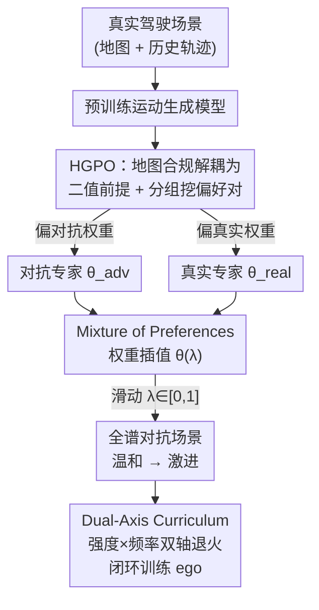

# Steerable Adversarial Scenario Generation through Test-Time Preference Alignment (SAGE)

**会议**: ICLR 2026  
**arXiv**: [2509.20102](https://arxiv.org/abs/2509.20102)  
**代码**: [https://tongnie.github.io/SAGE/](https://tongnie.github.io/SAGE/)  
**领域**: 自动驾驶 / AI安全  
**关键词**: 对抗场景生成, 偏好对齐, 多目标优化, 线性模式连通性, 闭环训练  

## 一句话总结
SAGE 将自动驾驶对抗场景生成重构为多目标偏好对齐问题，通过训练两个偏好专家模型并在推理时通过权重插值实现对抗性与真实性之间的连续可控权衡，无需重新训练即可生成从温和到激进的全谱场景，显著提升闭环训练效果。

## 研究背景与动机

**领域现状**：自动驾驶安全验证需要大量 safety-critical 场景来测试和训练驾驶策略。对抗场景生成（adversarial scenario generation）通过扰动真实驾驶轨迹来高效生成长尾角落场景，是当前的主流方法。

**现有痛点**：现有方法（RL、扩散、直接优化）都面临一个核心矛盾——对抗性（adversariality）和真实性（realism）的权衡。方法要么只优化对抗性导致生成物理上不可能的轨迹（如车辆原地旋转来拦截 ego），要么通过线性加权来平衡多目标但高度依赖超参数调节。

**核心矛盾**：每次训练只能锁定一个固定的权衡点（Pareto 前沿上的一个点），无法在推理时灵活调整。要针对不同需求（极端压力测试 vs 数据增强）生成不同强度的场景，就需要重新训练，极其低效。

**本文目标** (a) 如何高效地学习对抗性与真实性之间的权衡？ (b) 如何在推理时无需重训即可连续控制生成场景的攻击强度？ (c) 如何保证地图合规性（hard constraint）不被 soft preference 稀释？

**切入角度**：受 LLM 多目标对齐（如 3H 原则）和模型权重插值（linear mode connectivity）启发，作者将对抗场景优化视为偏好对齐问题，训练偏向不同极端的专家模型，推理时通过权重线性插值遍历整个 Pareto 前沿。

**核心 idea**：将对抗场景生成从"手动设计加权目标"转变为"学习可控的偏好景观"，通过专家权重插值实现测试时的连续可调。

## 方法详解

### 整体框架
SAGE 要解决的是对抗场景生成里"训完一次就锁死一个对抗性—真实性权衡点"的痛点：它把场景生成重写成偏好对齐问题，让攻击强度在推理时连续可调。整体分三步走。先在预训练运动生成模型之上，把"扰动某辆对手车的轨迹去攻击 ego"形式化为一个多目标优化问题，输入是真实驾驶场景（道路地图 + 历史轨迹），输出是对手车的对抗扰动轨迹。然后用 HGPO（层次分组偏好优化）从同一预训练模型分别微调出两个偏好相反的专家——一个偏对抗、一个偏真实。最后在推理时不再重训，而是把两个专家的权重线性插值，滑动一个标量旋钮就能在整条 Pareto 前沿上连续取点，生成从温和到激进的全谱场景；这些场景再接进 ego 策略的闭环训练。

### 关键设计

**1. 层次分组偏好优化 HGPO：把地图合规从奖励里解耦成二值前提，再分组挖偏好对**

现有方法把"地图合规"和"对抗 vs 真实"一起塞进线性加权的奖励，结果硬约束被软偏好稀释——穿墙这种行为不是"不太好"，而是"完全无效"，但加权惩罚让模型误以为只要对抗收益够大就值得走地图外的捷径。HGPO 的做法是把地图合规拎出来当成二值可行性前提条件 $F(\tau, \mathcal{M}) \in \{0,1\}$，而不是连续惩罚项。对每个场景采样 $N$ 条轨迹后，先按可行性分组，再构建两层偏好对：一层是任意可行轨迹始终优于任意不可行轨迹；另一层是在可行轨迹内部按软偏好得分 $R_{\text{pref}} = w_{\text{adv}} R_{\text{adv}} - w_{\text{real}} P_{\text{real}}$ 排序。这样硬约束永远凌驾于软偏好之上，模型再也学不到"穿墙换对抗收益"的捷径。分组的另一个好处是数据效率：标准 DPO 一个场景只挑一对最优/最差，而 HGPO 从一组样本里成对提取出多组偏好对，同样的采样喂出更丰富的训练信号。

**2. 测试时可控生成 Mixture of Preferences：用权重插值把一个旋钮装到 Pareto 前沿上**

要在推理时无需重训就调节攻击强度，关键在于让两个极端之间存在一条平滑可走的路径。SAGE 用相反的偏好权重 $w^*$ 从同一个预训练模型微调出两个专家 $\pi_{\theta_{\text{adv}}}$（偏对抗）和 $\pi_{\theta_{\text{real}}}$（偏真实），推理时直接在权重空间构造混合模型

$$\theta(\lambda) = (1-\lambda)\,\theta_{\text{real}} + \lambda\,\theta_{\text{adv}}$$

用户拨动 $\lambda \in [0,1]$ 就能在 Pareto 前沿上连续滑动，甚至外推到 $\lambda > 1$ 去生成超出训练凸包的更极端场景。它之所以成立，是因为两个专家同源（从同一预训练模型微调相关任务），线性模式连通性（LMC）假设保证它们落在同一个低损失盆地里，权重直接线性插值不会穿越高损失的"塌陷"区域。这一点还有理论背书：Theorem 1 证明插值模型的次优性与两专家权重距离的平方成正比（专家越近、插值损失越小），Proposition 1 进一步证明当奖励景观具有凹性时，在权重空间做混合优于在输出空间做集成——这也解释了为什么权重插值的 Pareto 前沿能严格压过 logit/轨迹空间混合。

**3. 闭环对抗训练的双轴课程 Dual-Axis Curriculum：让 ego 越练越强又不忘正常驾驶**

把 SAGE 接进 ego 策略的闭环 RL 训练时，一上来就喂极端场景会让 ego 灾难性遗忘正常驾驶。双轴课程沿两个维度同时渐进加码：一是场景强度，通过逐步增大 $\lambda$ 把对手从温和推到激进；二是对抗场景出现的频率，让 ego 在大量正常场景中夹着逐渐变难的对抗场景训练。两条轴一起退火，ego 既被逼着学会应对极端攻击，又因为始终保留足量正常场景而不丢掉常规驾驶能力。

### 损失函数 / 训练策略
HGPO 损失函数本质是扩展的 DPO 损失，对所有分组偏好对取期望：
$$\mathcal{L}_{\text{HGPO}}(\theta) = \mathbb{E}\left[-\log\sigma\left(\beta\left(\log\frac{\pi_\theta(\tau^w|c)}{\pi_{\text{ref}}(\tau^w|c)} - \log\frac{\pi_\theta(\tau^l|c)}{\pi_{\text{ref}}(\tau^l|c)}\right)\right)\right]$$
其中 $\beta$ 控制对齐强度，$(\tau^w, \tau^l)$ 来自分层分组采样。

## 实验关键数据

### 主实验
在 MetaDrive 模拟器 + Waymo Open Motion Dataset 上评估，与 6 个 SOTA 基线对比。

| 方法 | 攻击成功率↑ | 对抗奖励↑ | 行为真实惩罚↓ | 运动学惩罚↓ | 越线惩罚↓ |
|------|-----------|----------|-------------|-----------|----------|
| Rule | 100.00% | 5.048 | 2.798 | 5.614 | 7.724 |
| CAT | 94.85% | 3.961 | 8.941 | 3.143 | 9.078 |
| GOOSE | 36.07% | 2.378 | 4.718 | 21.32 | 14.48 |
| SAGE (w=1.0) | 76.15% | 4.121 | **1.429** | **2.479** | **1.084** |

闭环训练评估（ego 策略质量）：

| 训练方法 | 奖励↑ | 完成率↑ | 碰撞率↓ |
|---------|------|-------|--------|
| SAGE | **45.14** | **0.69** | **0.31** |
| CAT | 37.70 | 0.58 | 0.37 |
| Replay | 41.32 | 0.62 | 0.44 |
| Rule-based | 32.99 | 0.50 | 0.33 |

### 消融实验

| 配置 | 关键效果 | 说明 |
|------|---------|------|
| HGPO (完整) | 快速收敛 + 高奖励 | 分组偏好对提供丰富信号 |
| 替换为标准 DPO | 收敛慢，样本效率低 | 每场景仅用一对偏好 |
| 去除地图硬约束 | 地图可行率崩溃 | 模型学习利用捷径 |
| 地图作加权惩罚 | 可行率提升但仍次优 | 硬/软约束混淆 |

### 关键发现
- SAGE 将地图违规惩罚降低 85%+ 同时保持高攻击成功率，证明解耦硬约束的有效性
- 权重插值生成的 Pareto 前沿严格优于 logit/轨迹空间混合，经验验证了 LMC 理论和 Proposition 1
- 闭环训练中 SAGE 训练的 ego 策略在交叉评估中展现最佳泛化性（不同攻击分布下仍保持高完成率）
- 权重外推（$\lambda > 1$）可生成超越训练凸包的更极端场景

## 亮点与洞察
- **硬约束解耦设计非常巧妙**：将地图合规从连续惩罚提升为二值前提条件，从根本上避免了模型学习"走捷径"的问题。这个思路可以迁移到任何有硬/软约束混合的多目标优化场景中。
- **LMC 理论在运动生成模型中的验证**：首次在运动生成模型上验证了线性模式连通性，并用它解释和证明了权重插值的合理性。这为其他需要多目标控制的生成模型（如图像、文本）提供了理论依据。
- **双轴课程防止灾难性遗忘**：同时渐进调节场景强度和频率的设计使得 ego 策略既学会应对极端场景，又不忘记正常驾驶，这个 trick 可以直接用于其他对抗训练 pipeline。

## 局限与展望
- 当前框架仅考虑两个目标（对抗性 vs 真实性），扩展到更多目标（如场景新颖性、复杂度）时的权重空间维度增长尚未探索
- 线性插值依赖 LMC 假设，当专家模型差异过大时可能失效
- MetaDrive 模拟器的物理真实性有限，在更高保真度模拟器或真实世界中的效果需进一步验证
- 可改进方向：基于 ego 策略学习进度的自适应课程（替代手动退火），以及更先进的模型合并技术

## 相关工作与启发
- **vs CAT (Zhang et al., 2023)**: CAT 通过重采样候选实现对抗生成，但攻击成功率虽高，行为真实性惩罚极大（8.941 vs SAGE 的 1.429），且无法测试时调控
- **vs GOOSE (Ransiek et al., 2024)**: GOOSE 用 RL 方法做对抗生成，但运动学惩罚极高（21.32），生成的轨迹物理上不合理
- **vs DPO/RLHF 在 LLM 中的应用**: SAGE 将 LLM 对齐中的多目标偏好思想首次迁移到运动生成领域，证明了跨领域的可行性

## 评分
- 新颖性: ⭐⭐⭐⭐⭐ 首次将测试时多目标偏好对齐引入对抗场景生成，理论与实践结合紧密
- 实验充分度: ⭐⭐⭐⭐⭐ 开环+闭环+交叉评估+消融+理论验证，覆盖全面
- 写作质量: ⭐⭐⭐⭐⭐ 逻辑清晰，理论推导严谨，图表信息量大
- 价值: ⭐⭐⭐⭐⭐ 为自动驾驶安全测试提供了高效且理论可靠的新范式

<!-- RELATED:START -->

## 相关论文

- [\[CVPR 2025\] CompoSIA: Composing Driving Worlds through Disentangled Control for Adversarial Scenario Generation](../../CVPR2025/autonomous_driving/composing_driving_worlds_through_disentangled_control_for_adversarial_scenario_g.md)
- [\[CVPR 2026\] Drive My Way: Preference Alignment of Vision-Language-Action Model for Personalized Driving](../../CVPR2026/autonomous_driving/drive_my_way_preference_alignment_of_vision-language-action_model_for_personaliz.md)
- [\[CVPR 2026\] TT-Occ: Test-Time 3D Occupancy Prediction](../../CVPR2026/autonomous_driving/test-time_3d_occupancy_prediction.md)
- [\[CVPR 2026\] TrafficAlign: Aligning Large Language Models for Traffic Scenario Generation](../../CVPR2026/autonomous_driving/trafficalign_aligning_large_language_models_for_traffic_scenario_generation.md)
- [\[CVPR 2026\] Test-Time Training for LiDAR Semantic Segmentation under Corruption via Geometric Inlier Discrimination](../../CVPR2026/autonomous_driving/test-time_training_for_lidar_semantic_segmentation_under_corruption_via_geometri.md)

<!-- RELATED:END -->
