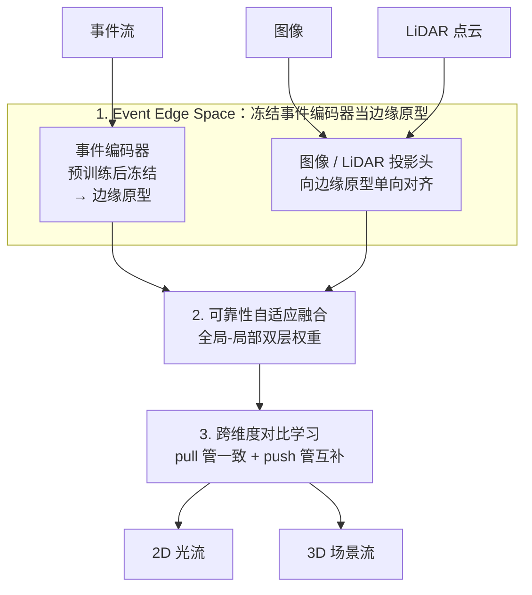

# x²-Fusion: Cross-Modality and Cross-Dimension Flow Estimation in Event Edge Space

**会议**: ICLR 2026  
**arXiv**: [2603.16671](https://arxiv.org/abs/2603.16671)  
**代码**: 无  
**领域**: 自动驾驶  
**关键词**: 光流估计, 场景流估计, 事件相机, 多模态融合, 边缘空间

## 一句话总结
x²-Fusion 提出 Event Edge Space——首个基于边缘的同构潜空间，将图像、LiDAR 和事件相机特征统一到共享的边缘中心表示中，结合可靠性自适应融合和跨维度对比学习，在标准和退化场景下均实现 SOTA 的 2D 光流和 3D 场景流联合估计。

## 研究背景与动机
1. **领域现状**：光流和场景流估计是动态场景理解的核心工具，在自动驾驶、跟踪和 3D 重建中广泛应用。近年来融合图像、LiDAR 和事件相机的方法已超越单模态基线。
2. **现有痛点**：
    - **高复杂度**：现有方法将各模态保持在各自原生特征空间中，缺乏共享通道级基础，融合需要多对对齐——RPEFlow 用阶段式融合块，CMX 用逐对修正/注意力单元，VisMoFlow 用多个手工设计的物理空间——导致模型笨重、难训练、难扩展
    - **信息侵蚀**：在异构空间中处理特征将融合推迟到后期阶段，早期模态特定失真已难以通过跨模态交互修正
    - **高脆弱性**：缺乏共同的表示基础，模态间无法为彼此提供稳定先验；在极端曝光、LiDAR 稀疏或运动模糊等退化条件下，对齐本身崩溃
3. **核心矛盾**：图像（2D 网格）、LiDAR（点云）、事件（异步流）三种模态的表示异构性，使得简单、鲁棒、高效的跨模态交互难以实现。
4. **本文要解决什么**：在一个统一的同构空间中实现图像-LiDAR-事件的有效融合，同时联合估计 2D 光流和 3D 场景流。
5. **切入角度**：利用事件相机天然提供的时空边缘信号作为锚点，构建边缘中心的同构潜空间。
6. **核心 idea**：边缘是模态无关的结构信息（物体边界和场景不连续性），事件相机本质上就是时空边缘探测器（在运动边缘处触发），且与图像共享 2D 像素坐标、与 LiDAR 的稀疏采样结构相似——这种双重对应使事件成为理想的同构空间锚点。

## 方法详解

### 整体框架
x²-Fusion 先单独预训练一个事件边缘编码器并冻结，把它的多尺度嵌入当作「边缘原型」，再把图像和 LiDAR 编码器拉到同一个以边缘为中心的同构潜空间（Event Edge Space）。三模态在这个共享空间里通过可靠性自适应融合得到统一特征，并用跨维度对比学习约束 2D 与 3D 分支，最终联合输出 2D 光流和 3D 场景流。

### 关键设计

**1. Event Edge Space：用冻结的事件编码器当边缘原型，把三模态拉进同一空间**

现有融合方法的根本麻烦在于图像、LiDAR、事件各自停留在异构的原生特征空间，融合只能靠后期多对对齐，既笨重又脆弱。本文的切入点是「边缘」——物体边界和场景不连续性是模态无关的结构信号，而事件相机本质上就是时空边缘探测器，天然适合当锚点。具体做法分两步。首先把事件流体素化后送入稀疏 3D CNN，得到多尺度特征金字塔 $\{F_s^E\}$，并显式定义事件边缘强度 $e^E(x,y) = \tilde{A}^E(x,y)(1 - \tilde{\sigma}_t(x,y)) \in [0,1]$，其中 $\tilde{A}^E$ 是归一化事件活动性、$\tilde{\sigma}_t$ 是归一化时间方差——活动越强、时间越稳定的位置越像运动边缘。通过自监督任务「从过去事件预测未来边缘强度」预训练，损失为 $\mathcal{L}_{\text{edge}}^E = \sum_s \lambda_s \|g_s(F_s^{E,\text{past}}) - e_s^{E,\text{future}}\|_1$，蒸馏出运动感知的边缘特征。

预训练后事件编码器被冻结，其特征 $Z_s^E \equiv F_s^E$ 固定为边缘原型。图像和 LiDAR 各经投影头 $Z_s^I = h_s^I(F_s^I)$、$Z_s^L = h_s^L(F_s^L)$ 映射到同维度 $C_s$，再用边缘锚定对称正则化把三者互相拉近：$D_s^{2/3D}(p) = \sum_{(m,n) \in \{I,E,L\}} \|Z_s^m(p) - Z_s^n(p)\|_1$，并以事件边缘图加权得对齐损失 $\mathcal{L}_{\text{align}}^{2/3D} = \sum_s \sum_p e_s^{E}(p) D_s^{2/3D}(p)$。关键在于对 $Z_s^E$ 停止梯度——这样边缘原型保持不动，对齐就从多对相互拉扯简化成图像、LiDAR 单向靠拢一个稳定锚点，既好训练又在退化时仍有可靠先验。

**2. 可靠性自适应融合：用全局-局部双层权重抑制崩坏模态**

同构空间打好基础后，融合不再需要堆叠模态特定模块，但仍要解决「某个模态在退化场景里不可信」的问题。本文设计全局和局部两层权重。全局层面通过时空分解估计每个模态整体可信度：时间流 $\mathcal{T}(\hat{Z}) = \sigma(\mathbb{L}(\Delta_t(\text{Conv}(\hat{Z}))))$ 捕获细粒度时间变化，空间流 $\mathcal{S}(\hat{Z}) = \|\nabla(\text{DConv}(\hat{Z}))\|_2$ 编码空间结构，两者交互后给出全局可靠性 $\omega_m = \text{softmax}_m((\mathcal{T} \otimes \mathcal{S})\hat{Z})$。局部层面再用高通滤波、平均池化与分组卷积算逐位置注意力 $\mathcal{A}_m(x) = \text{softmax}((\mathcal{H} \oplus \mathcal{P} \oplus \mathcal{G})\tilde{Z})_m$。两者相乘归一化即得融合特征 $F_{\text{fused}}(x) = \sum_m \frac{\omega_m \mathcal{A}_m(x)}{\sum_n \omega_n \mathcal{A}_n(x)} Z_m(x)$，最后接一个跨注意力 Transformer 增强交互。由于所有模态已在同一空间，整个融合靠轻量级加权和加统一跨注意力即可完成，这也是它在欠曝、LiDAR 稀疏等退化条件下能大幅领先的原因。

**3. 跨维度对比学习（CCL）：pull 管一致、push 管互补，协调 2D 与 3D 分支**

2D 光流和 3D 场景流共享同一物理运动，却又各自携带互补信息，直接联合训练容易彼此干扰。CCL 用一拉一推两个目标来协调。跨时间对比（pull）把 3D 特征投影到 2D，计算运动向量 $M^{2/3D}$ 后用余弦相似度损失鼓励 2D-3D 运动一致：$\mathcal{L}_{\text{pull}} = 1 - \frac{\langle \phi(M^{2D}), \psi(M_{\text{proj}}^{3D}) \rangle}{\|\phi(M^{2D})\|_2 \cdot \|\psi(M_{\text{proj}}^{3D})\|_2}$，保证两个分支感知到相同的帧间运动。跨任务对比（push）则把 2D/3D 特征经变分编码成潜在分布，最小化互信息以保住帧内互补性：$\mathcal{L}_{\text{push}} = \frac{1}{2}\sum_t \text{BCE}(\sigma(\mathbf{z}_t^{2D}), \sigma(\mathbf{z}_t^{3D}))$。消融显示在联合训练基础上加入 CCL 能把 EPE2D 从 0.386 进一步降到 0.325，印证一致性与互补性同时约束才让联合估计真正优于独立估计。

### 损失函数 / 训练策略
总损失为 $\mathcal{L}_{\text{total}} = \mathcal{L}_{\text{task}} + \lambda_{\text{align}} \mathcal{L}_{\text{align}} + \lambda_{\text{contra}} \mathcal{L}_{\text{contra}}$，任务损失采用 PWC 式粗到细监督；事件编码器先用 $\mathcal{L}_{\text{edge}}^E$ 预训练后冻结，再训练其余部分。实现基于 PyTorch，在 4× RTX A6000 上用 Adam 优化（lr=$10^{-4}$，weight decay=$10^{-6}$，batch size 8，MultiStepLR），并启用同步 BN 和混合精度训练。

## 实验关键数据

### 主实验

| 方法 | 模态 | EKubric EPE2D↓ | EKubric EPE3D↓ | DSEC EPE2D↓ | DSEC EPE3D↓ |
|------|------|---------------|---------------|-------------|-------------|
| RAFT | Img | 0.838 | - | 0.586 | - |
| FlowFormer | Img | 0.702 | - | 0.567 | - |
| CamLiFlow | Img+PC | 0.770 | 0.035 | 0.399 | 0.129 |
| RPEFlow | Img+PC+EV | 0.439 | 0.027 | 0.326 | 0.103 |
| **x²-Fusion** | **Img+PC+EV** | **0.430** | **0.024** | **0.322** | **0.094** |

### 退化场景对比 (vs RPEFlow)

| 退化类型 | EPE2D 改善 | EPE3D 改善 | 说明 |
|---------|-----------|-----------|------|
| 欠曝光 (EKubric) | ↓2.520 (3.663→1.143) | ↓0.010 | 最显著改善 |
| 过曝光 (EKubric) | ↓1.807 (2.801→0.994) | ↓0.007 | |
| LiDAR 稀疏 (DSEC) | ↓0.162 | ↓0.009 | |
| LiDAR 漂移 (DSEC) | ↓0.642 (1.051→0.409) | ↓0.172 | ACC.10 提升 26.41% |

### 消融实验

| 配置 | EPE2D↓ | EPE3D↓ | 说明 |
|------|--------|--------|------|
| w/o Event Edge Space | 0.491 | 0.146 | 无同构空间 |
| w/o 边缘锚定正则化 | 0.393 | 0.119 | 有空间但无正则化 |
| w/o 事件边缘编码器预训练 | 0.378 | 0.114 | 未预训练事件编码器 |
| **完整模型** | **0.322** | **0.094** | 全部组件 |
| 独立 2D+3D 任务 | 0.404 | 0.119 | 无联合训练 |
| 联合 2D&3D 任务 | 0.386 | 0.113 | 无 CCL |
| 联合 + CCL | 0.325 | 0.103 | 跨维度对比学习有效 |

### 关键发现
- Event Edge Space 是最关键的组件，移除后 EPE2D 增加 52.5%、EPE3D 增加 55.3%
- 在退化场景下优势更显著，特别是欠曝光时 EPE2D 从 3.663 降到 1.143（降 68.8%）
- 联合估计 2D+3D 优于独立估计，CCL 进一步带来显著提升
- t-SNE 可视化证实边缘锚定正则化有效拉紧了跨模态特征聚类
- 三模态融合在退化条件下相比双/单模态方案有更大优势

## 亮点与洞察
- Event Edge Space 的核心洞察非常优雅：边缘是模态无关的结构语言，事件相机是天然的时空边缘探测器，用事件锚定同构空间使融合变为表示统一问题
- 冻结事件编码器作为稳定原型的设计巧妙地将对齐问题简化为单向映射
- 可靠性自适应融合的全局-局部双层权重设计在退化场景下尤为有效
- 跨维度对比学习的 pull（一致性）+ push（互补性）设计很有理论美感
- 参数量 8.2M，比 RPEFlow 的 9.8M 更少，但性能更优

## 局限性 / 可改进方向
- 当前仅在图像-LiDAR-事件三模态上验证，虽然声称 EES 是模态无关的，但扩展到其他传感器有待验证
- 真实世界数据集（DSEC）场景的多样性有限，主要是城市驾驶
- 事件边缘编码器的预训练需要额外的训练阶段
- 退化场景的模拟基于合成噪声模型，与真实退化的差距需要进一步研究
- 可将 EES 框架推广到文本-图像-视频融合和一般性跨域特征对齐任务

## 相关工作与启发
- RPEFlow 的阶段式融合和 VisMoFlow 的多物理空间设计是本文的直接对比对象
- CamLiFlow 的双向相机-LiDAR 融合提供了插值策略基础
- 事件相机的边缘特性已在视频插帧、立体匹配等任务中被利用
- 对比学习在多模态融合中的应用日趋成熟，但本文首次将其用于 2D-3D 联合流估计
- Event Edge Space 的思想可推广到其他需要异构传感器统一表示的任务

## 评分
- 新颖性: ⭐⭐⭐⭐⭐
- 实验充分度: ⭐⭐⭐⭐⭐
- 写作质量: ⭐⭐⭐⭐
- 价值: ⭐⭐⭐⭐⭐

<!-- RELATED:START -->

## 相关论文

- [\[CVPR 2026\] x2-Fusion: Cross-Modality and Cross-Dimension Flow Estimation in Event Edge Space](../../CVPR2026/autonomous_driving/x2-fusion_cross-modality_and_cross-dimension_flow_estimation_in_event_edge_space.md)
- [\[ICLR 2026\] SEAL: Segment Any Events with Language](segment_any_events_with_language.md)
- [\[ICLR 2026\] SiMO: Single-Modality-Operable Multimodal Collaborative Perception](simo_single-modality-operable_multimodal_collaborative_perceptio.md)
- [\[AAAI 2026\] MambaSeg: Harnessing Mamba for Accurate and Efficient Image-Event Semantic Segmentation](../../AAAI2026/autonomous_driving/mambaseg_harnessing_mamba_for_accurate_and_efficient_image-e.md)
- [\[CVPR 2026\] DSERT-RoLL: Robust Multi-Modal Perception for Diverse Driving Conditions with Stereo Event-RGB-Thermal Cameras, 4D Radar, and Dual-LiDAR](../../CVPR2026/autonomous_driving/dsert-roll_robust_multi-modal_perception_for_diverse_driving_conditions_with_ste.md)

<!-- RELATED:END -->
