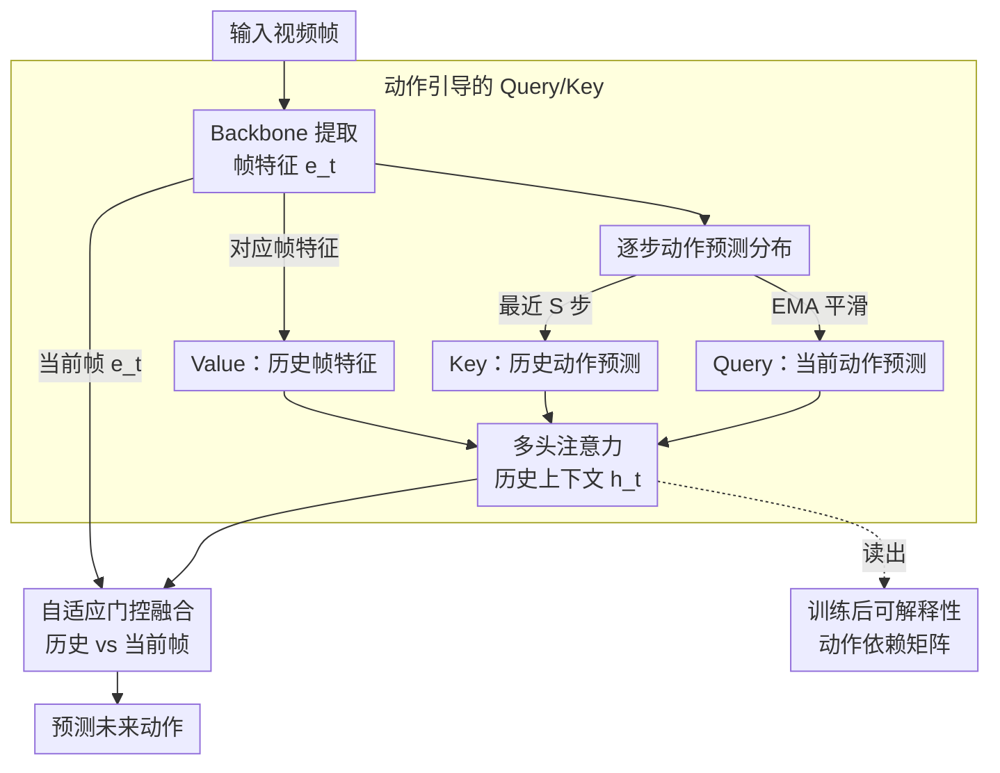

# Action-Guided Attention for Video Action Anticipation

**会议**: ICLR 2026  
**arXiv**: [2603.01743](https://arxiv.org/abs/2603.01743)  
**代码**: 无  
**领域**: 因果推理  
**关键词**: 动作预期, 注意力机制, 视频Transformer, 可解释性, EPIC-Kitchens  

## 一句话总结
提出动作引导注意力 (AGA) 机制，用模型自身的动作预测序列作为注意力的 Query 和 Key（而非像素特征），结合自适应门控融合历史上下文和当前帧特征，在 EPIC-Kitchens-100 上实现从验证集到测试集的良好泛化，同时支持训练后的可解释性分析。

## 研究背景与动机

**领域现状**：视频动作预期（从当前帧预测未来动作）是计算机视觉的重要任务。Transformer 架构已成为主流范式。

**现有痛点**：标准自注意力基于像素级特征的点积，缺乏建模未来动作所需的高层语义。这导致模型过拟合于过去帧的显式视觉线索，而非捕捉潜在意图。从验证集到测试集的性能下降显著。

**核心矛盾**：动作预期本质上是非确定性的——同样的过去观察可能导致多种未来结果。像素级注意力容易被视觉噪声误导，无法建模动作间的语义依赖关系。

**本文目标** 设计一种注意力机制，能利用高层动作语义而非底层像素特征来引导序列建模。

**切入角度**：将动作预测概率（而非特征向量）作为 Q/K，利用动作间的语义相关性来选择相关的历史时刻，然后通过门控与当前帧融合。

**核心 idea**：用模型自身的动作预测序列做注意力引导，使注意力聚焦于"语义相关的过去时刻"而非"视觉相似的过去帧"。

## 方法详解

### 整体框架
这篇论文要解决的是视频动作预期里「标准自注意力在像素特征上算相似度、容易过拟合视觉线索、从验证集到测试集掉点」的问题。整体怎么转：输入视频帧先经 backbone 提取帧特征 $e_t$，模型对每一步输出一个动作预测分布；AGA 模块不再用视觉特征做注意力，而是把动作预测当成查询信号——用当前动作预测的 EMA 作 Query、最近 $S$ 步的动作预测作 Key、对应时刻的帧特征作 Value 做多头注意力，得到「语义相关的历史上下文」$\tilde{h}_t$；再通过自适应门控让模型在历史上下文和当前帧特征 $e_t$ 之间逐维分配信任，融合后预测未来动作。因为 Q/K 本身就是动作概率，训练完成后注意力矩阵可以直接读出动作之间的依赖关系，免费换来一套可解释性。

### 关键设计

**1. 动作引导的 Query/Key：让注意力按"语义相关"而非"视觉相似"选历史**

标准自注意力在像素特征上做点积，权重反映的是"哪些过去帧和当前帧长得像"，这正是过拟合视觉线索的根源。AGA 把 Q/K 的来源从视觉特征换成动作预测概率：Key 由最近 S 步的动作预测构成 $K_t = E_K(\hat{y}_{t-S:t-1})$，Query 由当前的动作预测 EMA 构成 $Q_t = E_Q(\bar{y}_t)$，其中 EMA 按 $\bar{y}_t = \alpha \hat{y}_{t-1} + (1-\alpha)\bar{y}_{t-1}$ 递推，对历史预测做指数平滑以得到更稳定的查询信号。Value 仍保留帧级视觉特征 $V_t = E_V(e_{t-S:t-1})$。这样点积算出的注意力权重衡量的是"哪些过去动作与当前预期动作语义最相关"，再用它去加权对应时刻的视觉特征——注意力的"选择依据"被抬升到动作语义层，"被选中的内容"仍是具体帧。

**2. 自适应门控融合：让模型自己决定信历史还是信当前帧**

历史上下文和当前视觉证据谁更可靠是随时间变化的——动作刚开始时当前帧信息更关键，动作进行中历史依赖更重要。AGA 不固定二者权重，而是逐元素门控融合历史注意力输出 $\tilde{h}_t$ 和当前帧特征 $e_t$：

$$o_t = g_t \odot \tilde{h}_t + (1-g_t) \odot e_t, \quad g_t = \sigma(\text{MLP}(\tilde{h}_t \| e_t))$$

门控 $g_t$ 由两者拼接后过 MLP 加 sigmoid 得到，逐维输出 0~1 的权重，让模型在每个特征维度上自适应地在历史与当前之间分配信任。

**3. 训练后可解释性分析：Q/K 是动作概率，注意力矩阵直接读出动作依赖**

因为 Q/K 本身就是动作概率分布，注意力权重天然反映动作之间的语义关系，无需额外探针即可解读。论文从两个方向分析：前向分析检查给定过去动作时注意力权重的分布，揭示模型学到的动作依赖（如"拿起→放置"会获得高权重）；反向分析则修改过去动作、观察预测如何变化，对应反事实推理。这是像素级注意力难以提供的——后者的权重只对应"帧相似度"，无法直接映射到动作语义。

### 损失函数 / 训练策略
标准交叉熵损失预测未来动作。使用冻结 backbone + 可训练编码器的模块化设计。FIFO 队列维护时间窗口 S。

## 实验关键数据

### 主实验

**EPIC-Kitchens-100 (动作预期):**

| 方法 | Val Verb | Val Noun | Val Action | Test-Val Gap |
|------|---------|---------|-----------|-------------|
| AVT | 高 | 高 | 中 | 较大 |
| MemViT | 高 | 高 | 中 | 较大 |
| **AGA** | **竞争性** | **竞争性** | **竞争性** | **最小** |

### 消融实验

| 配置 | 性能 | 说明 |
|------|------|------|
| AGA (完整) | 最佳泛化 | 动作引导Q/K + 门控 |
| 标准自注意力 | 过拟合 | Val 好但 Test 下降大 |
| 无门控 (仅历史) | 下降 | 缺少当前帧信息 |
| 无EMA (直接用上一步预测) | 略降 | EMA 提供更稳定的长程信号 |

### 关键发现
- AGA 从验证集到测试集的性能差距一致小于基线，表明更强的泛化能力和更少的过拟合
- 在 EPIC-Kitchens-55 和 EGTEA Gaze+ 上也表现稳健
- 训练后分析揭示了有意义的动作依赖关系（如"拿起→放置"的高注意力权重），验证了动作引导的语义合理性
- EMA 系数 $\alpha=0.8$ 在多数设置下最优，对超参数不太敏感

## 亮点与洞察
- **语义层面的注意力**：将注意力从像素级提升到动作概率级是关键创新。这种抽象使模型关注"过去做了什么"而非"过去看起来像什么"，更适合动作预期任务
- **自我预测的循环利用**：用模型自身的预测作为输入（EMA 的动作分布）兼具自回归和非自回归的优点——获得序列依赖但不引入延迟
- **可解释性的副产品**：因为 Q/K 是动作概率，注意力矩阵直接给出"动作A对预测动作B有多大影响"的定量关系，是 Transformer 在视频预期中首次实现的自然可解释性

## 局限与展望
- 仅用 RGB 视频帧，未整合多模态信息（文本、音频、光流）
- 动作预测的 EMA 在序列开始时可能不够稳定（冷启动问题）
- FIFO 队列大小 S 是固定超参数，自适应窗口可能更好
- 实验仅在厨房场景 (EPIC-Kitchens) 上验证

## 相关工作与启发
- **vs AVT**: AVT 用标准因果注意力在视觉 token 上；AGA 用动作预测做 Q/K，避免了像素级过拟合
- **vs MemViT**: MemViT 通过 token 压缩存储更长历史；AGA 通过 EMA 隐式编码长程依赖，更轻量
- **vs AFFT**: AFFT 融合多模态但仍用标准注意力；AGA 在单模态下通过改变注意力设计获得泛化提升

## 评分
- 新颖性: ⭐⭐⭐⭐ 动作概率做注意力Q/K的设计新颖且直觉自然
- 实验充分度: ⭐⭐⭐⭐ 三个数据集+消融+可解释性分析
- 写作质量: ⭐⭐⭐⭐ 方法描述清晰，可解释性分析有趣
- 价值: ⭐⭐⭐⭐ 为视频动作预期的注意力设计提供了新思路

<!-- RELATED:START -->

## 相关论文

- [\[CVPR 2026\] Back to the Feature: Explaining Video Classifiers with Video Counterfactual Explanations](../../CVPR2026/causal_inference/back_to_the_feature_explaining_video_classifiers_with_video_counterfactual_expla.md)
- [\[ACL 2025\] FitCF: A Framework for Automatic Feature Importance-guided Counterfactual Example Generation](../../ACL2025/causal_inference/fitcf_a_framework_for_automatic_feature_importance-guided_counterfactual_example.md)
- [\[CVPR 2026\] CGU-Bayes: Causal Graph Uncertainty-Guided Bayesian Inference for Domain Generalization](../../CVPR2026/causal_inference/cgu-bayes_causal_graph_uncertainty-guided_bayesian_inference_for_domain_generali.md)
- [\[ICML 2026\] Density-Guided Robust Counterfactual Explanations on Tabular Data under Model Multiplicity](../../ICML2026/causal_inference/density-guided_robust_counterfactual_explanations_on_tabular_data_under_model_mu.md)
- [\[ACL 2025\] Reasoning is All You Need for Video Generalization: A Counterfactual Benchmark with Sub-question Evaluation](../../ACL2025/causal_inference/reasoning_is_all_you_need_for_video_generalization_a_counterfactual_benchmark_wi.md)

<!-- RELATED:END -->
