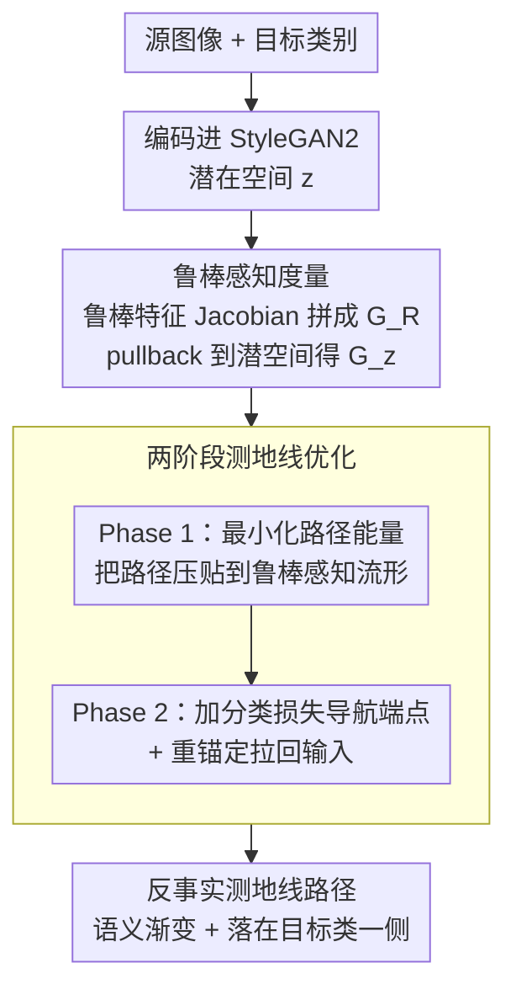

# Counterfactual Explanations on Robust Perceptual Geodesics

**会议**: ICLR 2026  
**arXiv**: [2601.18678](https://arxiv.org/abs/2601.18678)  
**代码**: 论文提供代码（匿名）  
**领域**: 人类理解 / 可解释AI / 图像生成  
**关键词**: 反事实解释, 测地线优化, 感知度量, 对抗鲁棒性, 可解释性

## 一句话总结
提出 PCG（Perceptual Counterfactual Geodesic）方法，在鲁棒感知流形上通过测地线优化生成语义忠实的反事实解释，两阶段优化确保路径既感知自然又达到目标类别，在 AFHQ 上 FID=8.3 远优于 RSGD 的 12.9。

## 研究背景与动机

**领域现状**：反事实解释（"如果图像变成这样，分类器就会改变预测"）是模型可解释性的重要工具。现有方法直接在像素空间或潜在空间做梯度下降生成反事实。

**现有痛点**：像素空间的反事实容易产生不自然的对抗性扰动，潜在空间的方法可能走到流形之外导致非真实图像。

**核心矛盾**：反事实需要"最小改变"但也需要"语义合理"——这两个目标在欧氏空间中常常矛盾（欧氏距离上的最短路径可能跨越非真实区域）。

**本文目标**：如何在感知自然的约束下找到到目标类别的最短路径？

**切入角度**：在鲁棒感知度量定义的黎曼流形上求测地线——流形上的最短路径天然沿着数据分布的"山脊"走，不会穿越"低密度谷"。

**核心 idea**：用对抗训练鲁棒模型的特征空间定义感知度量的黎曼流形，在这个流形上求测地线作为反事实路径。

## 方法详解

### 整体框架

PCG 要解决的问题是：给定一张图像和一个目标类别，找一条从原图到"会被分类器判成目标类"的反事实路径，且这条路径上每一帧都得感知自然、不能跑出数据流形。它的做法是把"感知自然"这件事编码进一个黎曼度量里——在鲁棒模型特征空间定义的流形上，语义相邻的点距离近、非真实区域距离远，于是流形上的最短路径（测地线）自然会沿着数据分布的"山脊"走，绕开会产生对抗扰动的"低密度谷"。整条流程在 StyleGAN2 的潜在空间里跑两阶段优化：先把路径压贴到流形上（保证质量），再在这个约束下把端点拉向目标类别（保证有效），最终输出的反事实路径既是一段平滑的语义渐变，又落在分类边界的正确一侧。

### 关键设计

**1. 鲁棒感知度量：让"语义相似"等价于"流形上距离近"**

反事实之所以容易退化成对抗扰动，根源是欧氏空间里"最小改变"和"语义合理"会打架——像素上挪一点点就能翻转预测，但那一点点往往是人眼看不出的对抗噪声。PCG 改用一个由对抗训练鲁棒模型诱导的黎曼度量来量距离。具体地，它取鲁棒模型若干中间层特征 $h_k$ 的 Jacobian 来拼度量张量：

$$G_R(x) = \sum_k w_k \, J(h_k(x))^\top J(h_k(x))$$

其中各层权重取 $w_k = 1/N_k$（按特征维度归一化）。这个度量再通过生成器 $g$ pullback 到 StyleGAN 的潜在空间，得到实际优化所用的度量：

$$G_z(z) = J(g(z))^\top \, G_R(g(z)) \, J(g(z))$$

关键在于"鲁棒"二字：对抗训练后模型的特征梯度指向的是真正的语义方向（而非脆弱的对抗方向），所以这个度量下"距离近"才真的对应"语义像"。这正是它和 RSGD 的分水岭——RSGD 也用了黎曼度量，但用的是标准分类器的脆弱特征，度量本身就是坏的；PCG 把度量的来源换成鲁棒特征，从根上修好了几何。

**2. 两阶段测地线优化：先建路，再导航**

直接端到端地"既求最短路又满足分类目标"会失稳——分类损失会过早把路径往目标类别方向猛拽，把它扯出流形，就像 VSGD 那样崩到 off-manifold。PCG 把这件事拆成两步。Phase 1 只最小化路径在 $G_z$ 度量下的能量，把路径整体压贴到鲁棒感知流形上：

$$E = \int \gamma'(t)^\top \, G_z \, \gamma'(t)\, dt$$

Phase 2 才在这条已经"贴着流形"的路径上加入分类损失，引导端点跨过语义分界线到达目标类别；同时配一个重锚定（re-anchoring）步骤，把端点逐步往输入图像拉回，尽量保证反事实是"最小改变"。先把路修好再导航，比一上来就同时优化两个目标稳得多——Phase 1 保证了每一帧都在流形上，Phase 2 才有干净的路面可走。

## 实验关键数据

| 数据集 | 方法 | FID | R-FID | R-LPIPS |
|--------|------|-----|-------|---------|
| AFHQ | RSGD | 12.9 | 37.8 | 0.68 |
| AFHQ | **PCG** | **8.3** | **9.1** | **0.17** |

### 关键发现
- PCG 的 R-LPIPS（鲁棒感知距离）从 0.68 降到 0.17，说明生成的反事实图像更感知自然
- 反事实路径上的中间帧也是视觉合理的（渐变过程而非突变）
- 鲁棒模型定义的度量优于标准模型（后者的特征梯度不够语义）

## 消融实验与深入分析

### 度量选择对插值质量的影响

| 度量 | 语义连贯性 | 是否 on-manifold | 对抗脆弱性 |
|------|-----------|-----------------|-----------|
| Z-线性（欧氏） | 差，中间帧模糊 | 否 | N/A |
| 像素 MSE 回撤 | 差，属性不连贯 | 部分 | 高 |
| 标准 ResNet-50 特征回撤 | 中等，有照明漂移 | 是 | 高 |
| **鲁棒 ResNet-50 特征回撤** | **好，语义渐变** | **是** | **低** |

### 反事实定量比较（StyleGAN2）

| 方法 | AFHQ $\mathcal{L}_1$↓ | AFHQ $\mathcal{L}_{\mathcal{R}}$↓ | FFHQ $\mathcal{L}_{\mathcal{R}}$↓ | PlantVillage $\mathcal{L}_{\mathcal{R}}$↓ |
|------|-------|-------|-------|-------|
| REVISE | **1.20** | 2.70 | 2.78 | 2.87 |
| VSGD | 1.31 | 2.90 | 2.86 | 2.83 |
| RSGD | 1.73 | 2.79 | 2.81 | 2.88 |
| RSGD-C | 1.55 | 2.62 | 2.69 | 2.67 |
| **PCG** | 1.42 | **2.21** | **2.48** | **2.43** |

- REVISE 在像素 $\ell_1$ 上最低但 $\mathcal{L}_{\mathcal{R}}$（鲁棒感知距离）很高——说明其生成的是像素接近但感知上是对抗样本的结果
- PCG 在鲁棒指标上全面领先，证明其到达了语义分界线的"正确一侧"

### 两阶段优化的必要性
- Phase 1 确保路径贴在鲁棒感知流形上——没有这一步，直接做 Phase 2 会像 VSGD 一样崩溃到 off-manifold
- Phase 2 的重锚定步骤（re-anchoring）将端点逐步拉向输入——确保反事实尽可能"最小改变"

## 亮点与洞察
- **黎曼几何+可解释性**的结合数学上优美且效果好——将微分几何的测地线概念应用于 XAI 是非常自然的
- **"语义分界线"(semantic divide)概念**：Browne & Swift (2020) 提出但未给出跨越方法，PCG 首次通过鲁棒度量实际跨越了这条分界线
- **两阶段优化的思路**：先建路再导航——先用能量最小化确保路径质量，再加任务目标——比直接端到端优化更稳定
- **失败模式分类**系统化了现有方法的三类失败：off-manifold 遍历、局部梯度陷阱、生成器利用脆弱度量

## 局限与展望
- 需要对抗训练的鲁棒模型来定义度量，不是所有领域都有现成的鲁棒模型（如医学图像、遥感）
- 测地线优化计算成本较高——需要 Jacobian-向量积，每步比 SGD 贵数倍
- 仅在图像分类上验证——文本、表格数据的反事实解释需要不同的流形定义
- 依赖 StyleGAN2/3 作为生成器——扩散模型时代需要适配
- 鲁棒模型特征空间的不同层级特征的权重 $w_k$ 设为 $1/N_k$（按维度归一化），未探索其他加权方案

## 相关工作与启发
- **vs REVISE (Joshi et al.)**：REVISE 在 VAE 潜在空间做欧氏 SGD，假设平坦几何——PCG 证明这个假设在图像域完全失效
- **vs RSGD (Pegios et al.)**：RSGD 引入了黎曼度量但用脆弱的标准分类器特征——PCG 用鲁棒特征修复了度量本身
- **vs DiME/扩散模型反事实**：扩散模型方法生成质量好但缺乏几何保证——PCG 的测地线约束确保路径的每一步都感知自然
- **vs Santurkar et al. (2019) 鲁棒模型可解释性**：他们研究解释鲁棒模型本身，PCG 用鲁棒模型来生成标准模型的解释——方向正交
- **启发**：鲁棒感知度量的概念可以推广到任何需要"感知自然"的生成任务——如图像编辑、风格迁移、图像修复

## 评分
- 新颖性: ⭐⭐⭐⭐⭐ 黎曼测地线用于反事实解释的理论框架非常新颖
- 实验充分度: ⭐⭐⭐⭐ 三个数据集 + 两种 StyleGAN + 多基线定量比较
- 写作质量: ⭐⭐⭐⭐ 数学推导严谨，图示清晰
- 价值: ⭐⭐⭐⭐⭐ 对 XAI 领域的度量问题提供了原则性解决方案
- 写作质量: ⭐⭐⭐⭐ 数学推导严谨
- 价值: ⭐⭐⭐⭐ 为可解释AI提供了理论严格的工具

<!-- RELATED:START -->

## 相关论文

- [\[ICML 2026\] Density-Guided Robust Counterfactual Explanations on Tabular Data under Model Multiplicity](../../ICML2026/causal_inference/density-guided_robust_counterfactual_explanations_on_tabular_data_under_model_mu.md)
- [\[ICLR 2026\] Synthesising Counterfactual Explanations via Label-Conditional Gaussian Mixture Variational Autoencoders](synthesising_counterfactual_explanations_via_label-conditional_gaussian_mixture_.md)
- [\[ICLR 2026\] Learning Robust Intervention Representations with Delta Embeddings](learning_robust_intervention_representations_with_delta_embeddings.md)
- [\[ICLR 2026\] Direct Doubly Robust Estimation of Conditional Quantile Contrasts](direct_doubly_robust_estimation_of_conditional_quantile_contrasts.md)
- [\[ACL 2025\] Counterfactual Explanations for Aspect-Based Sentiment Analysis](../../ACL2025/causal_inference/counterfactual_explanations_for_aspect-based_sentiment_analysis.md)

<!-- RELATED:END -->
