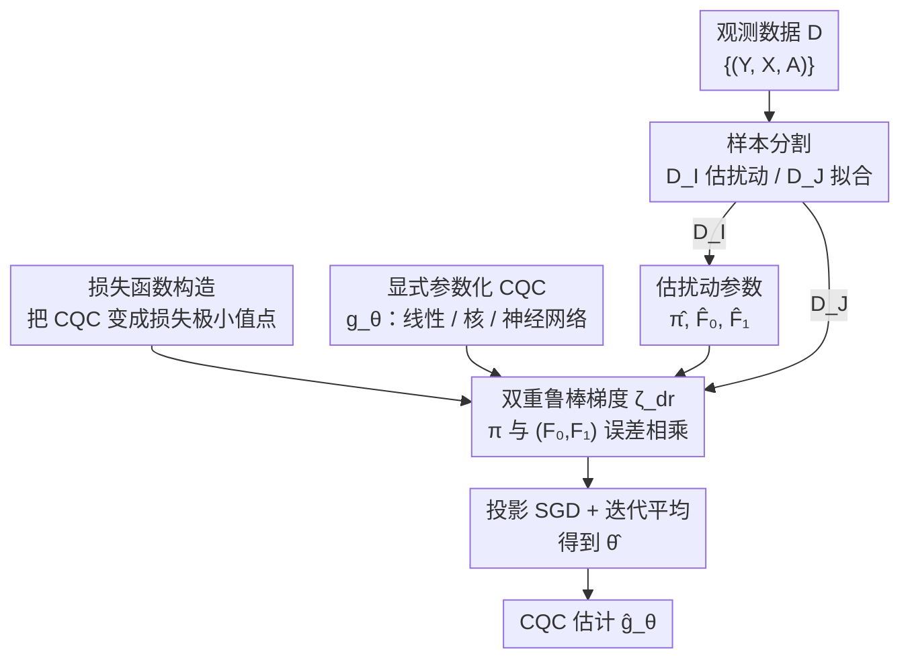

# Direct Doubly Robust Estimation of Conditional Quantile Contrasts

**会议**: ICLR 2026  
**arXiv**: [2601.19666](https://arxiv.org/abs/2601.19666)  
**代码**: 补充材料中提供复现代码  
**领域**: 因果推理  
**关键词**: heterogeneous treatment effect, conditional quantile comparator, doubly robust estimation, causal inference, quantile treatment effect

## 一句话总结

提出首个对条件分位数比较器 (CQC) 的**直接估计方法**，通过显式参数化 CQC 并结合双重鲁棒梯度下降，在理论上保持双重鲁棒性的同时，实验中在估计精度、可解释性和计算效率上全面优于现有的间接反演方法。

## 研究背景与动机

**领域现状**: 异质性处理效应 (HTE) 分析旨在学习治疗效果对不同个体的差异化影响。CATE（条件平均处理效应）和 CQTE（条件分位数处理效应）是两大经典估计量——CATE 可解释性强但只给出均值信息，CQTE 提供分位数粒度信息但解释性较弱。

**现有痛点**: 近期提出的 CQC（条件分位数比较器）试图兼具两者优点，提供从未处理响应到处理响应的传输映射。然而，现有 CQC 估计方法 (Givens et al., 2024) 需要先估计一个中间量（CCDF 对比函数 $h$），再通过**反演**获得 CQC 估计——这带来三大问题：无法直接建模/约束 CQC；估计误差依赖于中间函数复杂度而非 CQC 本身；评估计算开销大。

**核心矛盾**: CQC 自身可能非常简洁（例如治疗效果是响应的线性缩放 $g^*(y_0|\mathbf{x}) = 2y_0$），但间接反演方法的估计精度却受限于更复杂的中间函数 $h$。

**本文目标**: 提供首个直接估计 CQC 的方法，允许对 CQC 进行显式参数化，使估计误差直接依赖于 CQC 的复杂度。

**切入角度**: 将 CQC 估计转化为 M-估计问题——构造一个以 CQC 为极小值点的损失函数，推导其梯度的双重鲁棒表达式，从而实现基于梯度下降的直接估计。

**核心 idea**: 通过构造损失函数并推导其双重鲁棒梯度，绕开中间函数反演，首次实现 CQC 的直接参数化估计。

## 方法详解

### 整体框架

这篇论文要解决的是：能不能跳过中间函数，直接把条件分位数比较器 CQC 当成待估对象、用一个参数 $\theta$ 把它拟合出来。已有做法 (Givens et al., 2024) 绕了一圈——先估 CCDF 对比函数 $h$，再对 $h$ 做反演才得到 CQC，估计误差因此被 $h$ 的复杂度绑架。本文把这件事重新包装成一个 M-估计问题：构造一个恰好以真实 CQC $g^*$ 为极小值点的损失函数，再推它梯度的双重鲁棒形式，于是 CQC 就能像普通参数模型那样用随机梯度下降直接训练出来。

整条流程落到数据上是两步。给定观测 $D = \{(Y^{(i)}, X^{(i)}, A^{(i)})\}_{i=1}^{2n}$，先做**样本分割**：一半数据 $D_\mathcal{I}$ 用来估扰动参数（倾向得分 $\hat{\pi}$ 和两组条件 CDF $\hat{F}_0, \hat{F}_1$），另一半 $D_\mathcal{J}$ 用来拟合 CQC 参数 $\theta$；然后在 $D_\mathcal{J}$ 上拿双重鲁棒梯度 $\hat{\zeta}_{dr}$ 对 $\theta$ 跑随机梯度下降。样本分割是为了让"估扰动参数"和"拟合 CQC"用互不重叠的数据，避免过拟合污染收敛分析。

### 关键设计

**1. 损失函数构造：把"反演求根"换成"求极小值"**

间接方法之所以要反演，是因为 CQC 被定义成 $h=0$ 的根——找根天然得先把整条 $h$ 估出来。本文换了个角度：CCDF 对比函数 $h(y_1, y_0, \mathbf{x}) = F_1(y_1|\mathbf{x}) - F_0(y_0|\mathbf{x})$ 关于 $y_1$ 单调递增，那么任何"导数等于 $h$"的函数都会在 $h=0$（也就是 $y_1 = g^*(y_0|\mathbf{x})$）处取到最小值。顺着这个观察，Definition 2 直接把损失定义成从最优点积到当前点的积分：

$$\bar{\ell}(y_1, y_0, \mathbf{x}) = \int_{g^*(y_0|\mathbf{x})}^{y_1} h(t, y_0, \mathbf{x})\, dt$$

这样 CQC 就从"某个方程的根"变成"某个损失的极小值点"，可以直接拿优化器去逼近。更关键的是，Proposition 1 证明了这个损失值与 CQC 估计误差之间存在直接的上下界关系（分三种条件给出），于是最终的估计精度取决于 CQC 本身长得多简单，而不再受中间函数 $h$ 的复杂度拖累。

**2. 双重鲁棒梯度 $\zeta_{dr}$：让两类扰动参数的误差相乘而非相加**

有了损失就要求梯度，但梯度里含未知的扰动参数，怎么估直接决定了方法稳不稳。最朴素的 IPW（逆概率加权）只用倾向得分 $\pi$，一旦 $\pi$ 估偏，整个梯度就跟着偏。本文 Equation 5 给出的是双重鲁棒形式的 Monte-Carlo 估计器：

$$\zeta_{dr}(\theta, y_0, \mathbf{z}) = \nabla_\theta g_\theta(y_0|\mathbf{x}) \left( \frac{a}{\pi(\mathbf{x})}[\mathbb{1}\{y \le g_\theta\} - F_1(g_\theta)] - \frac{1-a}{1-\pi(\mathbf{x})}[\mathbb{1}\{y \le y_0\} - F_0(y_0)] + F_1 - F_0 \right)$$

它在 IPW 的倾向得分之外又引入了 CCDF 估计 $F_0, F_1$ 作为校正项。双重鲁棒的好处在于：只要 $\pi$ 和 $(F_0, F_1)$ 里有一组估准，梯度就保持无偏；两类扰动参数的估计误差是**相乘**进入最终误差的，而不是像 IPW 那样直接相加，因此对扰动参数的估计质量宽容得多。

**3. 显式参数化 CQC：把可解释性写进模型结构**

间接方法只能在采样点上把 CQC 评估出来，拿不到一个可检查的全局形式。本文因为是直接估计，就允许用户自由挑选参数族——线性模型、核方法、神经网络都行。以线性模型为例：

$$g_\theta(y_0|\mathbf{x}) = (\theta_{sc}^\top \mathbf{x} + \theta_{sc,0})\, y_0 + (\theta_{sh}^\top \mathbf{x} + \theta_{sh,0})$$

第一项是随 $y_0$ 缩放的**缩放分量**，第二项是与 $y_0$ 无关的**平移分量**，治疗效果的结构被明明白白拆成"放大多少 + 平移多少"两块，看参数就能读出来。显式参数化还有个附带好处：可以通过正则化、带宽选择这些常规手段把先验知识（例如治疗效果应当平滑、或缩放分量受限）直接施加到模型上。

### 损失函数 / 训练策略

训练用样本分割配合投影随机梯度下降。参数从 $\theta^{(1)} = 0$ 起步，每步梯度更新后投影回 $\|\theta\| \le B$ 的球内以保证有界。学习率按场景取：一般情况用 $\mu_t = \frac{Bc}{2\rho\sqrt{n}}$，当密度有下界（条件更好）时改用更激进的 $\mu_t = \frac{1}{\xi_2 \eta_2 n}$。最终估计不取最后一步，而是对所有迭代做平均 $\hat{\theta} = \frac{1}{n}\sum_{t=1}^n \theta^{(t)}$，这也是后面收敛界（一般 $O(1/\sqrt{n})$）成立的形式。

## 实验关键数据

### 主实验

数据生成: $X \sim N(0, I_{10})$, $Y|X,A \sim N(\sin(\pi \mathbf{v}^\top \mathbf{x}) + a\gamma \mathbf{v}^\top \mathbf{x}, 1)$, $\pi(\mathbf{x}) = \sigma(\mathbf{v}^\top \mathbf{x})$

真实 CQC: $g^*(y_0|\mathbf{x}) = y_0 + \gamma \mathbf{v}^\top \mathbf{x}$（线性），而 CCDF 对比函数包含高频正弦项

| 实验 | Est. DR-Lin | Est. DR-NN | Est. Inv. DR | Est. IPW |
|------|------------|-----------|-------------|---------|
| CQC 斜率 γ=1 (MAE) | **最低** | 接近 DR-Lin | 较高 | 最高 |
| CQC 斜率 γ=4 (MAE) | **最低** | 接近 DR-Lin | 显著劣化 | 严重劣化 |
| 样本量 n=200 (MAE) | **最低** | 略高 | 较高 | 高 |
| 样本量 n=2000 (MAE) | **最低** | 略高 | 较高 | 高 |

### 消融实验

对扰动参数估计误差的敏感度（向 logits 添加不同水平的有偏噪声）:

| 噪声水平 | Est. DR-Lin | Est. DR-NN | Est. Inv. DR | Est. IPW |
|---------|------------|-----------|-------------|---------|
| 0 (无额外噪声) | **最低** | 接近最低 | 中等 | 中等偏高 |
| 0.5 | **最低** | 略高 | 接近 | 较高 |
| 1.0 | **最低** | 略高 | 略高于 DR-Lin | 高 |
| 2.0 | 接近 | 略高 | **接近** | 显著高 |

### 关键发现

1. 直接参数化方法（DR-Lin, DR-NN）在所有样本量和 CQC 斜率设置下全面优于间接反演方法
2. 当 CQC 斜率增大时，直接方法的优势更加显著——因为 CCDF 对比函数变复杂但 CQC 保持简洁
3. 对扰动参数误差的鲁棒性：两种方法都展现双重鲁棒性，但间接方法在高噪声下略更不敏感
4. 神经网络模型（DR-NN）在不知道真实参数形式时也表现良好，仅略逊于正确指定的线性模型
5. **真实数据（就业项目）**: CQC 估计揭示了随年龄增长，治疗效果从乘性缩放转向均匀平移

## 亮点与洞察

1. **首次直接估计 CQC**: 绕开中间函数反演，使估计精度与 CQC 复杂度直接挂钩
2. **理论收敛保证**: Theorem 3 给出有限样本界，一般情况 $O(1/\sqrt{n})$，密度有下界时 $O(\log n / n)$
3. **显式参数化带来的解释性**: 可以直接检查模型参数理解治疗效果的结构（如线性模型中的缩放/平移分量），而非只能在采样点上评估
4. **CQC 在非均匀效应下的简洁性**: 当治疗效果是缩放型（如收入翻倍），CQC 是简单线性 $g^*(y) = 2y$，而 CATE 和 CQTE 都包含复杂高频项

## 局限与展望

1. 直接估计器对扰动参数误差的实际敏感度略高于间接方法（尽管理论上都是双重鲁棒的），值得进一步研究
2. 双重鲁棒性是关于损失函数而非直接关于 CQC 估计误差的——只在特定条件（Proposition 1(b)）下才能转化为 CQC 误差的界
3. 收敛结果仅适用于参数线性模型（$g_\theta = \theta^\top f$），未覆盖非线性参数化（如深度神经网络）
4. 未来方向：探索是否能给出条件期望形式的 CQC 双重鲁棒估计器（类似 CATE 的 DR-learner）

## 相关工作与启发

- **CATE 估计**: Kennedy (2023b) 的 DR-learner 给出了 CATE 的双重鲁棒直接估计——本文将类似思想推广到了分位数级别的 CQC
- **CQTE 估计**: Kallus & Oprescu (2023) 的双重鲁棒 CQTE 估计——CQC 与 CQTE 有关系 $\tau_q\{F_0(y_0|\mathbf{x})|\mathbf{x}\} = g(y_0|\mathbf{x}) - y_0$
- **随机傅里叶特征**: 线性参数化假设可通过随机傅里叶特征扩展到非参数核方法

## 评分

- 新颖性: ⭐⭐⭐⭐ 首个直接 CQC 估计器，方法切入角度巧妙（从 M-estimation 出发构造损失），但整体在 HTE 双重鲁棒框架内
- 实验充分度: ⭐⭐⭐⭐ 多维度仿真对比（斜率、样本量、噪声）+ 真实数据 + 消融，但缺少高维 X 和非线性 CQC 的实验
- 写作质量: ⭐⭐⭐⭐⭐ 问题动机清晰，数学推导严谨，从直觉→形式化一步步展开，CQC vs CATE/CQTE 的 Figure 1 可视化非常直观
- 价值: ⭐⭐⭐⭐ 对因果推理中异质性处理效应估计有实质推进，但 CQC 本身仍是较新的估计量，应用范围有待拓展

<!-- RELATED:START -->

## 相关论文

- [\[ICLR 2026\] Efficient Ensemble Conditional Independence Test Framework for Causal Discovery](efficient_ensemble_conditional_independence_test_framework_for_causal_discovery.md)
- [\[ICLR 2026\] Counterfactual Explanations on Robust Perceptual Geodesics](counterfactual_explanations_on_robust_perceptual_geodesics.md)
- [\[ICLR 2026\] Synthesising Counterfactual Explanations via Label-Conditional Gaussian Mixture Variational Autoencoders](synthesising_counterfactual_explanations_via_label-conditional_gaussian_mixture_.md)
- [\[ICML 2025\] Doubly Protected Estimation for Survival Outcomes Utilizing External Controls for Randomized Clinical Trials](../../ICML2025/causal_inference/doubly_protected_estimation_for_survival_outcomes_utilizing_external_controls_fo.md)
- [\[ICLR 2026\] Learning Robust Intervention Representations with Delta Embeddings](learning_robust_intervention_representations_with_delta_embeddings.md)

<!-- RELATED:END -->
